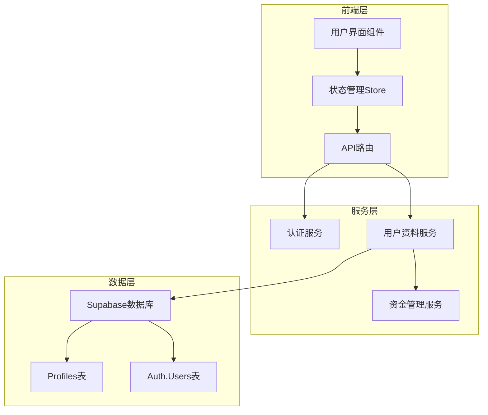
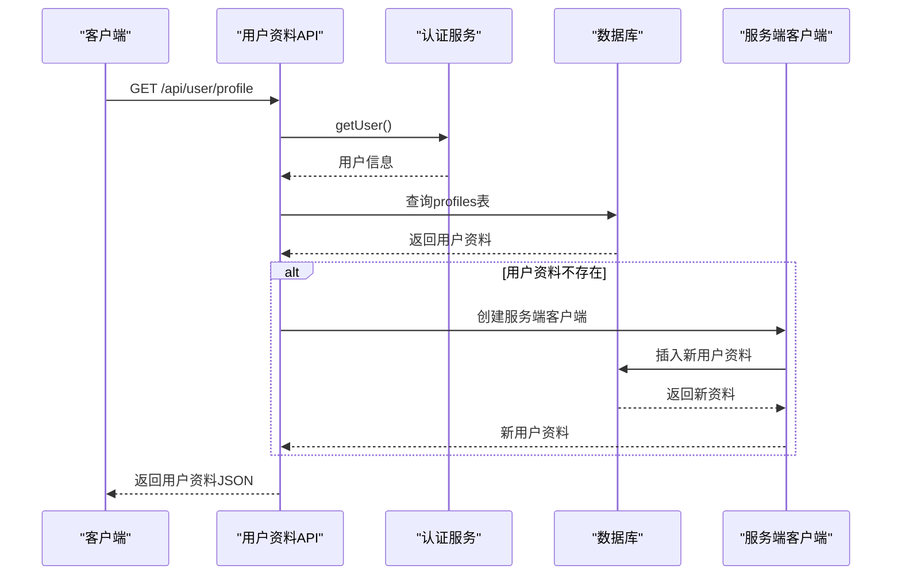
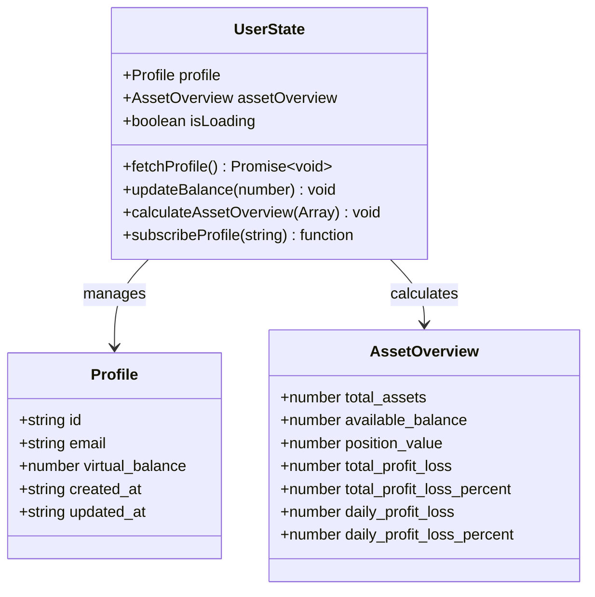
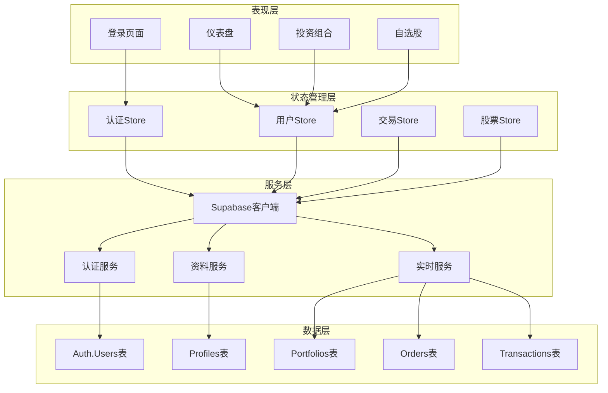
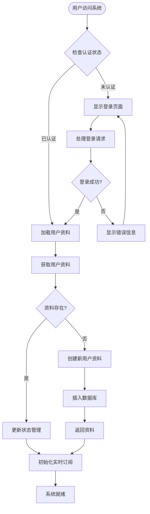
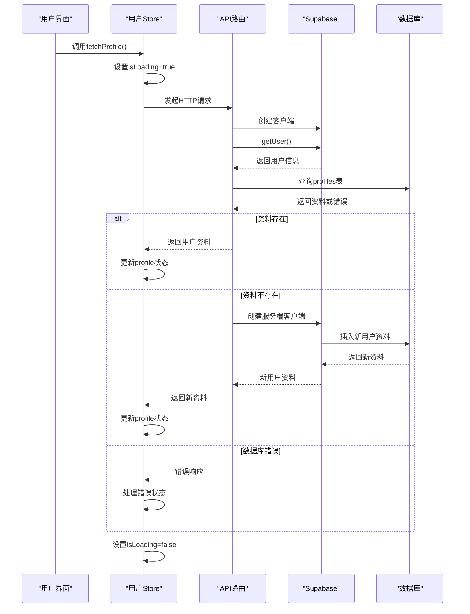
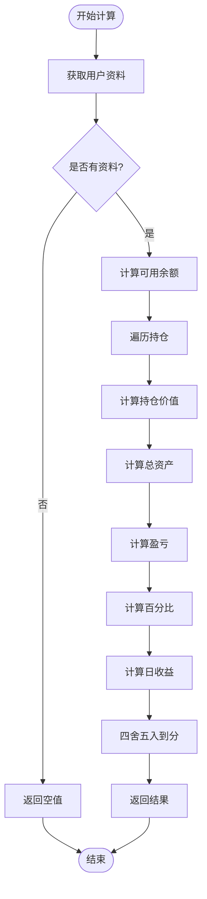
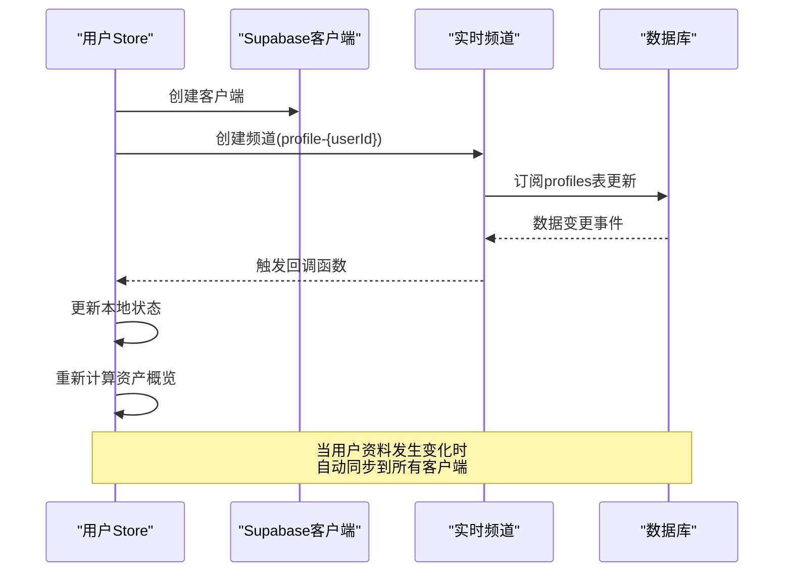
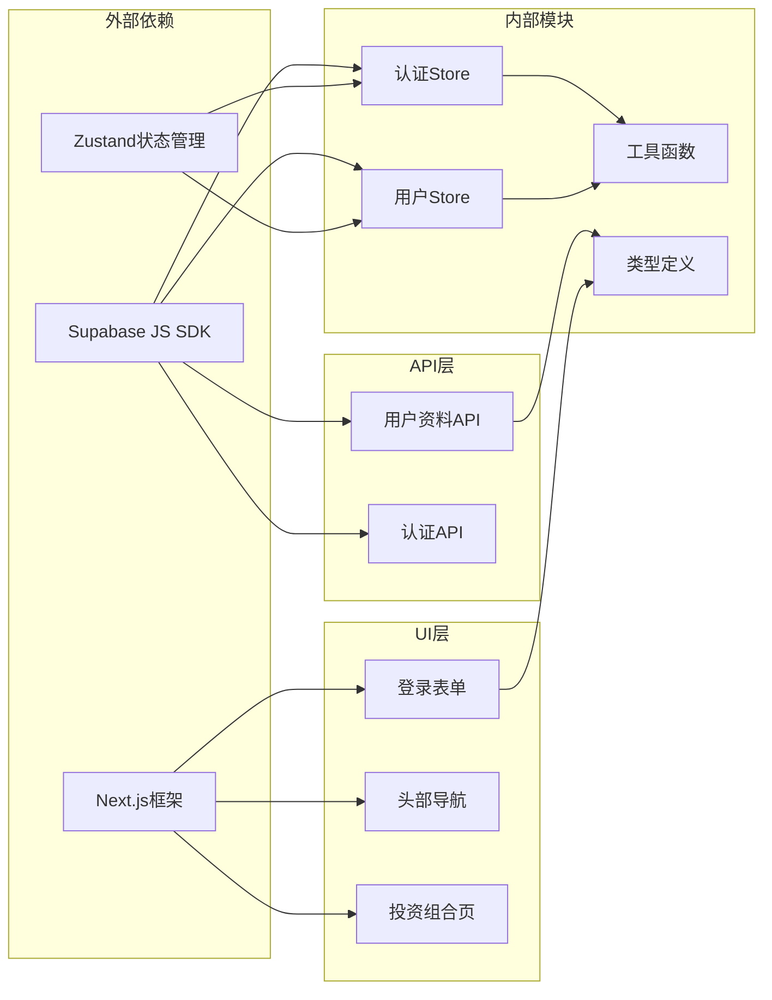

# 用户资料管理

<cite>
**本文档引用的文件**
- [app/api/user/profile/route.ts](file://app/api/user/profile/route.ts)
- [stores/useUserStore.ts](file://stores/useUserStore.ts)
- [lib/supabase/client.ts](file://lib/supabase/client.ts)
- [lib/supabase/server.ts](file://lib/supabase/server.ts)
- [lib/supabase/service.ts](file://lib/supabase/service.ts)
- [types/index.ts](file://types/index.ts)
- [components/login-form.tsx](file://components/login-form.tsx)
- [components/logout-button.tsx](file://components/logout-button.tsx)
- [stores/useAuthStore.ts](file://stores/useAuthStore.ts)
- [supabase/schema.sql](file://supabase/schema.sql)
- [app/(dashboard)/layout.tsx](file://app/(dashboard)/layout.tsx)
- [components/layout/Header.tsx](file://components/layout/Header.tsx)
- [app/(dashboard)/portfolio/page.tsx](file://app/(dashboard)/portfolio/page.tsx)
</cite>

## 目录
1. [简介](#简介)
2. [项目结构](#项目结构)
3. [核心组件](#核心组件)
4. [架构概览](#架构概览)
5. [详细组件分析](#详细组件分析)
6. [依赖关系分析](#依赖关系分析)
7. [性能考虑](#性能考虑)
8. [故障排除指南](#故障排除指南)
9. [结论](#结论)

## 简介

用户资料管理是虚拟股票交易系统的核心功能模块，负责管理用户的个人资料、虚拟资金账户以及相关的业务数据。该系统基于Next.js框架构建，采用Supabase作为后端服务，实现了完整的用户认证、资料管理和实时数据同步功能。

系统的主要特点包括：
- 基于JWT的用户认证机制
- 实时的用户资料更新和通知
- 虚拟资金账户管理
- 自动化的用户资料创建流程
- 完整的资产概览计算功能

## 项目结构

用户资料管理功能分布在多个层次中，形成了清晰的分层架构：

**图表来源**
- [app/api/user/profile/route.ts:1-69](file://app/api/user/profile/route.ts#L1-L69)
- [stores/useUserStore.ts:1-107](file://stores/useUserStore.ts#L1-L107)
- [lib/supabase/client.ts:1-9](file://lib/supabase/client.ts#L1-L9)

**章节来源**
- [app/api/user/profile/route.ts:1-69](file://app/api/user/profile/route.ts#L1-L69)
- [stores/useUserStore.ts:1-107](file://stores/useUserStore.ts#L1-L107)
- [lib/supabase/client.ts:1-9](file://lib/supabase/client.ts#L1-L9)

## 核心组件

### 用户资料API路由

用户资料API路由是整个用户资料管理的核心入口点，提供了完整的CRUD操作能力：

**图表来源**
- [app/api/user/profile/route.ts:6-68](file://app/api/user/profile/route.ts#L6-L68)

### 用户状态管理Store

用户状态管理Store使用Zustand实现，提供了响应式的状态管理能力：

**图表来源**
- [stores/useUserStore.ts:5-13](file://stores/useUserStore.ts#L5-L13)
- [types/index.ts:2-8](file://types/index.ts#L2-L8)
- [types/index.ts:92-100](file://types/index.ts#L92-L100)

**章节来源**
- [stores/useUserStore.ts:1-107](file://stores/useUserStore.ts#L1-L107)
- [types/index.ts:1-166](file://types/index.ts#L1-L166)

## 架构概览

系统采用分层架构设计，确保了良好的可维护性和扩展性：

**图表来源**
- [stores/useAuthStore.ts:1-104](file://stores/useAuthStore.ts#L1-L104)
- [stores/useUserStore.ts:1-107](file://stores/useUserStore.ts#L1-L107)
- [lib/supabase/client.ts:1-9](file://lib/supabase/client.ts#L1-L9)
- [supabase/schema.sql:6-152](file://supabase/schema.sql#L6-L152)

## 详细组件分析

### 认证与用户管理

系统使用Supabase的认证服务实现用户身份验证：

**图表来源**
- [stores/useAuthStore.ts:31-48](file://stores/useAuthStore.ts#L31-L48)
- [stores/useUserStore.ts:20-34](file://stores/useUserStore.ts#L20-L34)

### 资料获取流程

用户资料获取流程确保了系统的健壮性和用户体验：

**图表来源**
- [app/api/user/profile/route.ts:6-68](file://app/api/user/profile/route.ts#L6-L68)
- [stores/useUserStore.ts:20-34](file://stores/useUserStore.ts#L20-L34)

**章节来源**
- [components/login-form.tsx:28-47](file://components/login-form.tsx#L28-L47)
- [components/logout-button.tsx:10-14](file://components/logout-button.tsx#L10-L14)
- [stores/useAuthStore.ts:31-79](file://stores/useAuthStore.ts#L31-L79)

### 资产概览计算

系统提供实时的资产概览计算功能：

**图表来源**
- [stores/useUserStore.ts:50-83](file://stores/useUserStore.ts#L50-L83)

**章节来源**
- [stores/useUserStore.ts:50-83](file://stores/useUserStore.ts#L50-L83)

### 实时数据同步

系统使用Supabase的实时功能实现数据的即时同步：

**图表来源**
- [stores/useUserStore.ts:85-105](file://stores/useUserStore.ts#L85-L105)

**章节来源**
- [stores/useUserStore.ts:85-105](file://stores/useUserStore.ts#L85-L105)

## 依赖关系分析

系统各组件之间的依赖关系清晰明确：

**图表来源**
- [package.json:9-28](file://package.json#L9-L28)
- [stores/useAuthStore.ts:1-15](file://stores/useAuthStore.ts#L1-L15)
- [stores/useUserStore.ts:1-13](file://stores/useUserStore.ts#L1-L13)

**章节来源**
- [package.json:1-44](file://package.json#L1-L44)
- [stores/useAuthStore.ts:1-15](file://stores/useAuthStore.ts#L1-L15)
- [stores/useUserStore.ts:1-13](file://stores/useUserStore.ts#L1-L13)

## 性能考虑

系统在设计时充分考虑了性能优化：

### 缓存策略
- 使用Zustand本地状态缓存用户资料
- 避免重复的API调用
- 实现智能的状态更新机制

### 实时同步优化
- 使用Supabase的实时订阅功能
- 减少轮询频率
- 实现增量更新

### 数据库优化
- 合理的索引设计
- 优化的查询语句
- 适当的连接池管理

## 故障排除指南

### 常见问题及解决方案

**认证失败**
- 检查Supabase配置是否正确
- 验证环境变量设置
- 确认用户账户状态

**资料获取错误**
- 检查数据库连接
- 验证profiles表结构
- 确认用户权限设置

**实时同步问题**
- 检查Supabase Realtime配置
- 验证网络连接
- 确认频道订阅状态

**章节来源**
- [app/api/user/profile/route.ts:52-58](file://app/api/user/profile/route.ts#L52-L58)
- [stores/useUserStore.ts:29-33](file://stores/useUserStore.ts#L29-L33)

## 结论

用户资料管理系统通过合理的架构设计和先进的技术栈，实现了高效、可靠的用户资料管理功能。系统具有以下优势：

1. **完整的认证体系**：基于JWT的认证机制确保了用户安全
2. **实时数据同步**：利用Supabase的实时功能提供即时的数据更新
3. **响应式状态管理**：使用Zustand实现高效的前端状态管理
4. **可扩展的设计**：清晰的分层架构便于功能扩展和维护
5. **良好的用户体验**：流畅的交互和及时的反馈

该系统为虚拟股票交易提供了坚实的基础，支持后续的功能扩展和业务发展需求。