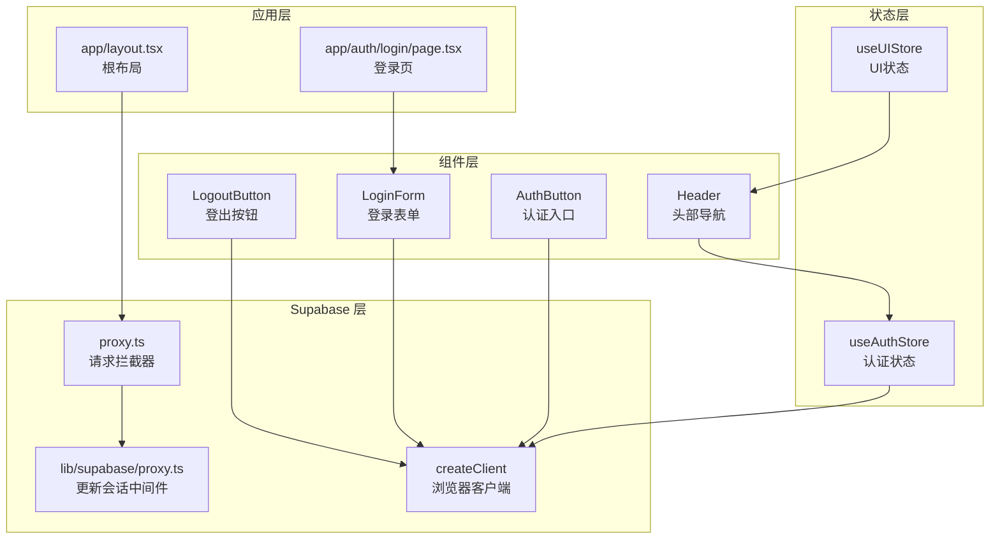
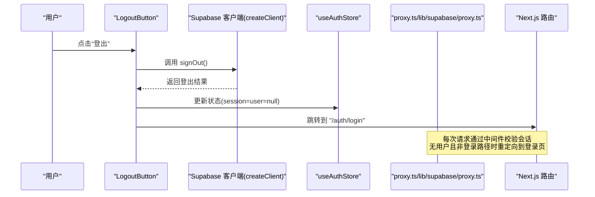
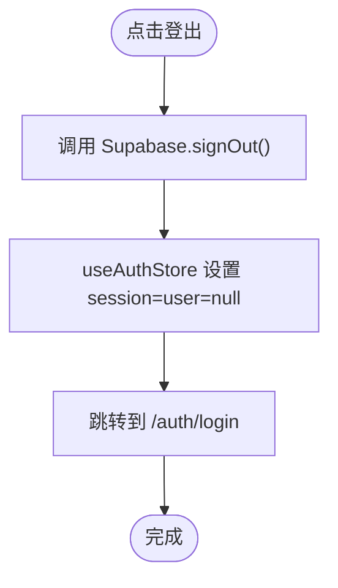
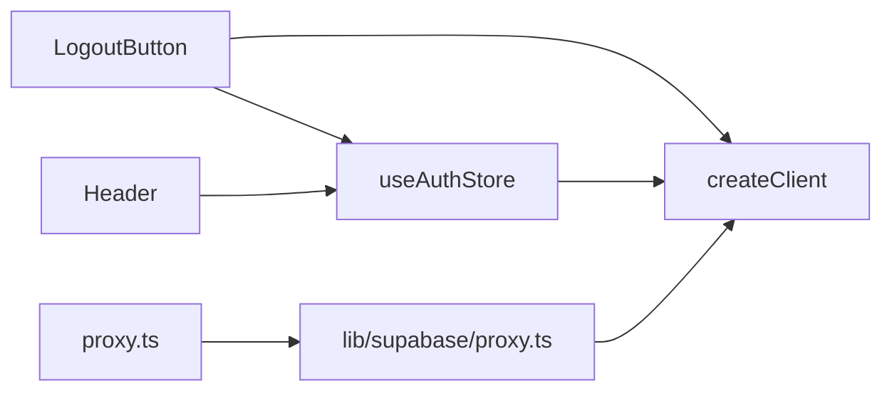

# 登出与会话管理

<cite>
**本文引用的文件**
- [components/logout-button.tsx](file://components/logout-button.tsx)
- [stores/useAuthStore.ts](file://stores/useAuthStore.ts)
- [lib/supabase/client.ts](file://lib/supabase/client.ts)
- [lib/supabase/proxy.ts](file://lib/supabase/proxy.ts)
- [proxy.ts](file://proxy.ts)
- [components/layout/Header.tsx](file://components/layout/Header.tsx)
- [components/auth-button.tsx](file://components/auth-button.tsx)
- [components/login-form.tsx](file://components/login-form.tsx)
- [components/ui/dialog.tsx](file://components/ui/dialog.tsx)
- [stores/useUIStore.ts](file://stores/useUIStore.ts)
- [app/auth/login/page.tsx](file://app/auth/login/page.tsx)
- [app/layout.tsx](file://app/layout.tsx)
</cite>

## 目录
1. [简介](#简介)
2. [项目结构](#项目结构)
3. [核心组件](#核心组件)
4. [架构总览](#架构总览)
5. [详细组件分析](#详细组件分析)
6. [依赖关系分析](#依赖关系分析)
7. [性能考量](#性能考量)
8. [故障排查指南](#故障排查指南)
9. [结论](#结论)
10. [附录](#附录)

## 简介
本文件围绕“登出与会话管理”主题，系统性梳理用户会话生命周期的管理机制，重点覆盖以下方面：
- LogoutButton 组件的实现：按钮交互、确认对话框与登出触发逻辑
- Supabase Auth 的 signOut 方法调用：会话清理、本地存储清除与服务器端注销
- 会话状态清理流程：useAuthStore 状态重置、全局状态清理与组件卸载处理
- 会话过期处理：自动登出、重新登录提示与会话恢复机制
- 多设备登录管理：会话冲突检测、强制登出与设备列表管理
- 安全考虑：会话令牌清理、CSRF 防护与 XSS 防护
- 会话监控、审计日志与异常处理策略
- 提供完整代码示例路径与安全最佳实践指南

## 项目结构
本项目采用 Next.js App Router 结构，会话管理由前端 Zustand 状态管理与 Supabase SSR 客户端共同协作完成。关键位置如下：
- 组件层：LogoutButton、Header、AuthButton、LoginForm 等
- 状态层：useAuthStore、useUIStore
- Supabase 层：浏览器客户端封装、服务端代理中间件
- 应用层：根布局、登录页

图表来源
- [components/logout-button.tsx:1-18](file://components/logout-button.tsx#L1-L18)
- [components/layout/Header.tsx:1-96](file://components/layout/Header.tsx#L1-L96)
- [components/auth-button.tsx:1-29](file://components/auth-button.tsx#L1-L29)
- [components/login-form.tsx:1-129](file://components/login-form.tsx#L1-L129)
- [stores/useAuthStore.ts:1-104](file://stores/useAuthStore.ts#L1-L104)
- [stores/useUIStore.ts:1-78](file://stores/useUIStore.ts#L1-L78)
- [lib/supabase/client.ts:1-9](file://lib/supabase/client.ts#L1-L9)
- [lib/supabase/proxy.ts:1-76](file://lib/supabase/proxy.ts#L1-L76)
- [proxy.ts:1-20](file://proxy.ts#L1-L20)
- [app/layout.tsx:1-42](file://app/layout.tsx#L1-L42)
- [app/auth/login/page.tsx:1-10](file://app/auth/login/page.tsx#L1-L10)

章节来源
- [components/logout-button.tsx:1-18](file://components/logout-button.tsx#L1-L18)
- [stores/useAuthStore.ts:1-104](file://stores/useAuthStore.ts#L1-L104)
- [lib/supabase/client.ts:1-9](file://lib/supabase/client.ts#L1-L9)
- [lib/supabase/proxy.ts:1-76](file://lib/supabase/proxy.ts#L1-L76)
- [proxy.ts:1-20](file://proxy.ts#L1-L20)
- [components/layout/Header.tsx:1-96](file://components/layout/Header.tsx#L1-L96)
- [components/auth-button.tsx:1-29](file://components/auth-button.tsx#L1-L29)
- [components/login-form.tsx:1-129](file://components/login-form.tsx#L1-L129)
- [stores/useUIStore.ts:1-78](file://stores/useUIStore.ts#L1-L78)
- [app/auth/login/page.tsx:1-10](file://app/auth/login/page.tsx#L1-L10)
- [app/layout.tsx:1-42](file://app/layout.tsx#L1-L42)

## 核心组件
- LogoutButton：负责触发登出流程，调用 Supabase 客户端的 signOut，并在完成后跳转至登录页
- useAuthStore：集中管理会话状态，提供初始化、登录、注册与登出等方法；监听认证状态变化并同步全局状态
- createClient：封装 Supabase 浏览器客户端，统一读取环境变量
- lib/supabase/proxy 与 proxy：服务端中间件，用于在每次请求时校验并更新会话，确保浏览器与服务器端会话一致
- Header/AuthButton/LoginForm：与认证状态联动的 UI 组件，体现会话有效性与入口

章节来源
- [components/logout-button.tsx:1-18](file://components/logout-button.tsx#L1-L18)
- [stores/useAuthStore.ts:1-104](file://stores/useAuthStore.ts#L1-L104)
- [lib/supabase/client.ts:1-9](file://lib/supabase/client.ts#L1-L9)
- [lib/supabase/proxy.ts:1-76](file://lib/supabase/proxy.ts#L1-L76)
- [proxy.ts:1-20](file://proxy.ts#L1-L20)
- [components/layout/Header.tsx:1-96](file://components/layout/Header.tsx#L1-L96)
- [components/auth-button.tsx:1-29](file://components/auth-button.tsx#L1-L29)
- [components/login-form.tsx:1-129](file://components/login-form.tsx#L1-L129)

## 架构总览
下图展示从用户点击登出到会话清理与页面跳转的端到端流程，以及服务端中间件如何保证会话一致性。

图表来源
- [components/logout-button.tsx:1-18](file://components/logout-button.tsx#L1-L18)
- [stores/useAuthStore.ts:71-79](file://stores/useAuthStore.ts#L71-L79)
- [lib/supabase/client.ts:1-9](file://lib/supabase/client.ts#L1-L9)
- [lib/supabase/proxy.ts:50-60](file://lib/supabase/proxy.ts#L50-L60)
- [proxy.ts:1-20](file://proxy.ts#L1-L20)

## 详细组件分析

### LogoutButton 组件
- 角色与职责
  - 在用户点击时，调用 Supabase 客户端的 signOut 方法，完成服务器端会话注销
  - 登出成功后，使用路由工具跳转到登录页，确保后续访问被中间件重定向
- 交互与确认
  - 当前实现未包含确认对话框；如需增强用户体验，可在点击时弹出确认对话框，再执行登出逻辑
- 代码路径
  - [components/logout-button.tsx:1-18](file://components/logout-button.tsx#L1-L18)

图表来源
- [components/logout-button.tsx:10-14](file://components/logout-button.tsx#L10-L14)
- [stores/useAuthStore.ts:71-79](file://stores/useAuthStore.ts#L71-L79)

章节来源
- [components/logout-button.tsx:1-18](file://components/logout-button.tsx#L1-L18)
- [stores/useAuthStore.ts:71-79](file://stores/useAuthStore.ts#L71-L79)

### Supabase Auth 的 signOut 调用与会话清理
- 客户端调用
  - 通过 createClient 创建浏览器端 Supabase 客户端，调用 signOut 完成服务器端注销
- 本地清理
  - useAuthStore 在 signOut 后将 session 与 user 置空，确保全局状态一致
- 页面跳转
  - LogoutButton 完成跳转，避免用户继续访问受保护资源
- 服务端一致性
  - 中间件在每次请求时读取会话声明，若无用户且非登录路径则重定向到登录页，防止会话不一致导致的访问异常

章节来源
- [lib/supabase/client.ts:1-9](file://lib/supabase/client.ts#L1-L9)
- [stores/useAuthStore.ts:71-79](file://stores/useAuthStore.ts#L71-L79)
- [components/logout-button.tsx:10-14](file://components/logout-button.tsx#L10-L14)
- [lib/supabase/proxy.ts:50-60](file://lib/supabase/proxy.ts#L50-L60)

### 会话状态清理流程
- useAuthStore 状态重置
  - signOut 后将 session 与 user 置空，isLoading 置为 false，确保组件不再显示加载态
- 全局状态清理
  - Header 等组件基于 useAuthStore.user 决定是否渲染，登出后 Header 将不再显示
- 组件卸载处理
  - 由于 Header 依赖 user，当 user 为空时直接返回空，避免渲染与内存泄漏
- UI 提示
  - useUIStore 提供全局通知能力，可在登出后显示提示信息，便于用户感知

章节来源
- [stores/useAuthStore.ts:71-79](file://stores/useAuthStore.ts#L71-L79)
- [components/layout/Header.tsx:31](file://components/layout/Header.tsx#L31)
- [stores/useUIStore.ts:47-65](file://stores/useUIStore.ts#L47-L65)

### 会话过期处理
- 自动登出与重定向
  - 服务端中间件在请求到达时检查会话声明，若无用户且访问非登录路径，则重定向到登录页
- 重新登录提示
  - 登录页提供演示账号与链接，引导用户重新登录
- 会话恢复机制
  - 初始化阶段 useAuthStore 会尝试获取当前会话并监听状态变化，确保在刷新或切换标签页后仍能保持会话状态

章节来源
- [lib/supabase/proxy.ts:50-60](file://lib/supabase/proxy.ts#L50-L60)
- [app/auth/login/page.tsx:1-10](file://app/auth/login/page.tsx#L1-L10)
- [stores/useAuthStore.ts:81-102](file://stores/useAuthStore.ts#L81-L102)

### 多设备登录管理
- 会话冲突检测
  - 当前实现未显式提供冲突检测逻辑；可通过 Supabase 会话事件监听与服务端会话查询进行扩展
- 强制登出
  - 可在检测到冲突时调用 signOut 并重定向到登录页
- 设备列表管理
  - 可在用户资料中维护设备列表，结合服务端会话管理实现设备维度的控制

说明：以上为可扩展建议，当前仓库未包含具体实现。

### 安全考虑
- 会话令牌清理
  - 登出后服务器端会话失效，浏览器端通过状态重置与路由跳转避免继续携带旧会话
- CSRF 防护
  - 使用 Supabase SSR 客户端与中间件确保 Cookie 一致性，减少跨站请求风险
- XSS 防护
  - 仅在受信任的环境变量中读取 Supabase 凭据，避免敏感信息泄露
- 会话监控与审计
  - 建议在服务端记录会话变更事件，结合日志系统进行审计与追踪
- 异常处理
  - 登录与登出均包含错误捕获与反馈，建议在 UI 层统一展示错误消息

章节来源
- [lib/supabase/proxy.ts:18-39](file://lib/supabase/proxy.ts#L18-L39)
- [components/login-form.tsx:25-44](file://components/login-form.tsx#L25-L44)
- [stores/useAuthStore.ts:31-48](file://stores/useAuthStore.ts#L31-L48)

## 依赖关系分析
- LogoutButton 依赖 Supabase 客户端与路由工具，间接依赖 useAuthStore 的状态更新
- useAuthStore 依赖 Supabase 客户端，负责会话初始化与状态监听
- 中间件依赖 Supabase SSR 客户端，确保每次请求的会话一致性
- Header 依赖 useAuthStore 的 user 字段决定渲染内容

图表来源
- [components/logout-button.tsx:1-18](file://components/logout-button.tsx#L1-L18)
- [stores/useAuthStore.ts:1-104](file://stores/useAuthStore.ts#L1-L104)
- [lib/supabase/client.ts:1-9](file://lib/supabase/client.ts#L1-L9)
- [lib/supabase/proxy.ts:1-76](file://lib/supabase/proxy.ts#L1-L76)
- [proxy.ts:1-20](file://proxy.ts#L1-L20)
- [components/layout/Header.tsx:1-96](file://components/layout/Header.tsx#L1-L96)

章节来源
- [components/logout-button.tsx:1-18](file://components/logout-button.tsx#L1-L18)
- [stores/useAuthStore.ts:1-104](file://stores/useAuthStore.ts#L1-L104)
- [lib/supabase/client.ts:1-9](file://lib/supabase/client.ts#L1-L9)
- [lib/supabase/proxy.ts:1-76](file://lib/supabase/proxy.ts#L1-L76)
- [proxy.ts:1-20](file://proxy.ts#L1-L20)
- [components/layout/Header.tsx:1-96](file://components/layout/Header.tsx#L1-L96)

## 性能考量
- 客户端与服务端会话一致性
  - 中间件在每次请求时读取会话声明，避免不必要的重复请求
- 状态更新最小化
  - useAuthStore 仅在必要时更新 session 与 user，减少组件重渲染
- 路由跳转优化
  - 登出后立即跳转到登录页，避免无效的页面渲染与网络请求

## 故障排查指南
- 登出后仍可访问受保护页面
  - 检查中间件是否正确配置与生效，确认请求路径匹配
  - 参考：[lib/supabase/proxy.ts:50-60](file://lib/supabase/proxy.ts#L50-L60)
- 登出后状态未更新
  - 确认 useAuthStore 的 signOut 是否被调用，以及状态更新逻辑是否执行
  - 参考：[stores/useAuthStore.ts:71-79](file://stores/useAuthStore.ts#L71-L79)
- 登录页无法显示
  - 检查环境变量是否正确配置，确保 Supabase 客户端可用
  - 参考：[lib/supabase/client.ts:1-9](file://lib/supabase/client.ts#L1-L9)
- 登录失败
  - 查看登录表单的错误处理与反馈逻辑
  - 参考：[components/login-form.tsx:25-44](file://components/login-form.tsx#L25-L44)

章节来源
- [lib/supabase/proxy.ts:50-60](file://lib/supabase/proxy.ts#L50-L60)
- [stores/useAuthStore.ts:71-79](file://stores/useAuthStore.ts#L71-L79)
- [lib/supabase/client.ts:1-9](file://lib/supabase/client.ts#L1-L9)
- [components/login-form.tsx:25-44](file://components/login-form.tsx#L25-L44)

## 结论
本项目通过 LogoutButton、useAuthStore 与 Supabase 客户端的协同，实现了简洁而可靠的登出与会话管理机制。配合服务端中间件，确保了浏览器与服务器端会话的一致性。为进一步提升安全性与用户体验，建议增加确认对话框、会话冲突检测与审计日志等能力。

## 附录
- 代码示例路径
  - 登出按钮实现：[components/logout-button.tsx:1-18](file://components/logout-button.tsx#L1-L18)
  - 认证状态管理：[stores/useAuthStore.ts:1-104](file://stores/useAuthStore.ts#L1-L104)
  - 浏览器客户端封装：[lib/supabase/client.ts:1-9](file://lib/supabase/client.ts#L1-L9)
  - 服务端会话更新中间件：[lib/supabase/proxy.ts:1-76](file://lib/supabase/proxy.ts#L1-L76)
  - 请求拦截器：[proxy.ts:1-20](file://proxy.ts#L1-L20)
  - 头部导航与认证入口：[components/layout/Header.tsx:1-96](file://components/layout/Header.tsx#L1-L96)、[components/auth-button.tsx:1-29](file://components/auth-button.tsx#L1-L29)
  - 登录表单与错误处理：[components/login-form.tsx:1-129](file://components/login-form.tsx#L1-L129)
  - UI 状态与通知：[stores/useUIStore.ts:1-78](file://stores/useUIStore.ts#L1-L78)
  - 登录页：[app/auth/login/page.tsx:1-10](file://app/auth/login/page.tsx#L1-L10)
  - 根布局：[app/layout.tsx:1-42](file://app/layout.tsx#L1-L42)