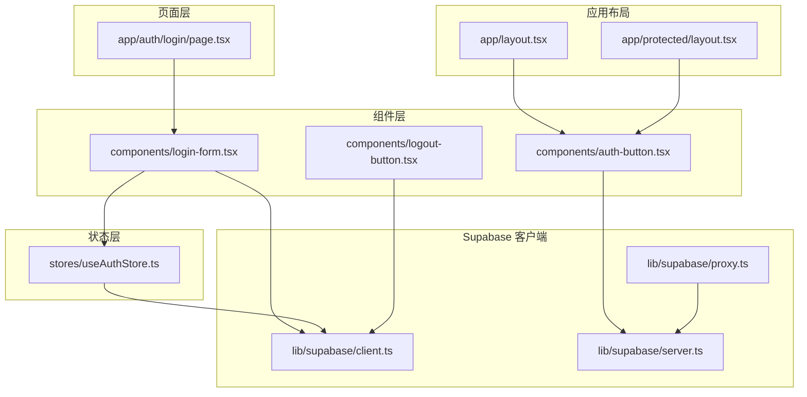
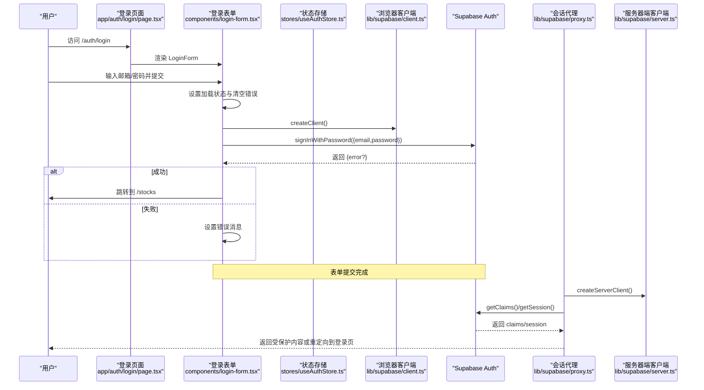
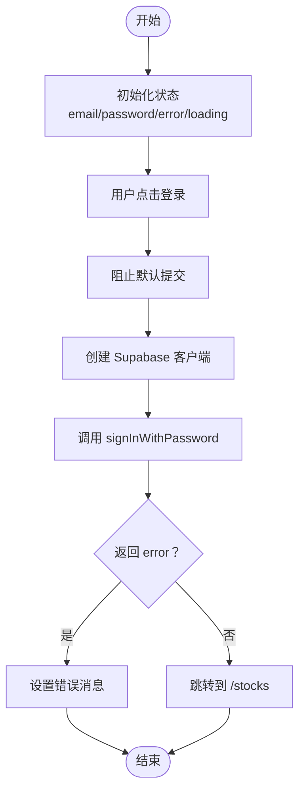
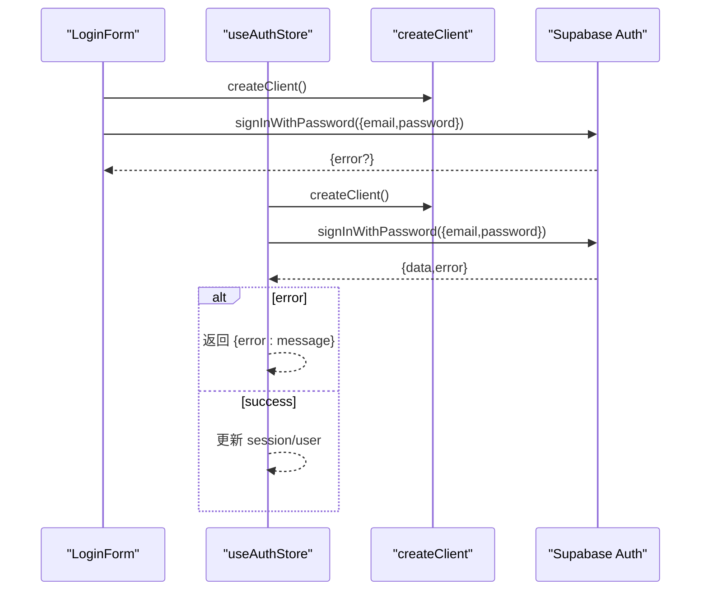
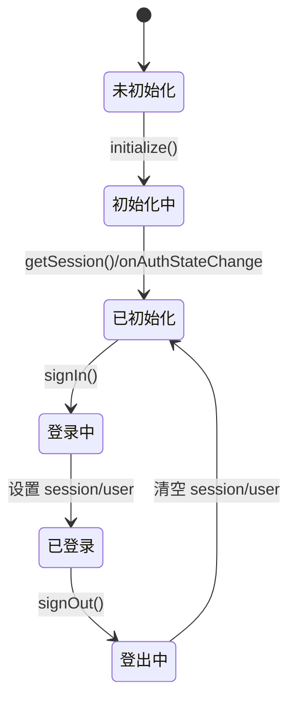
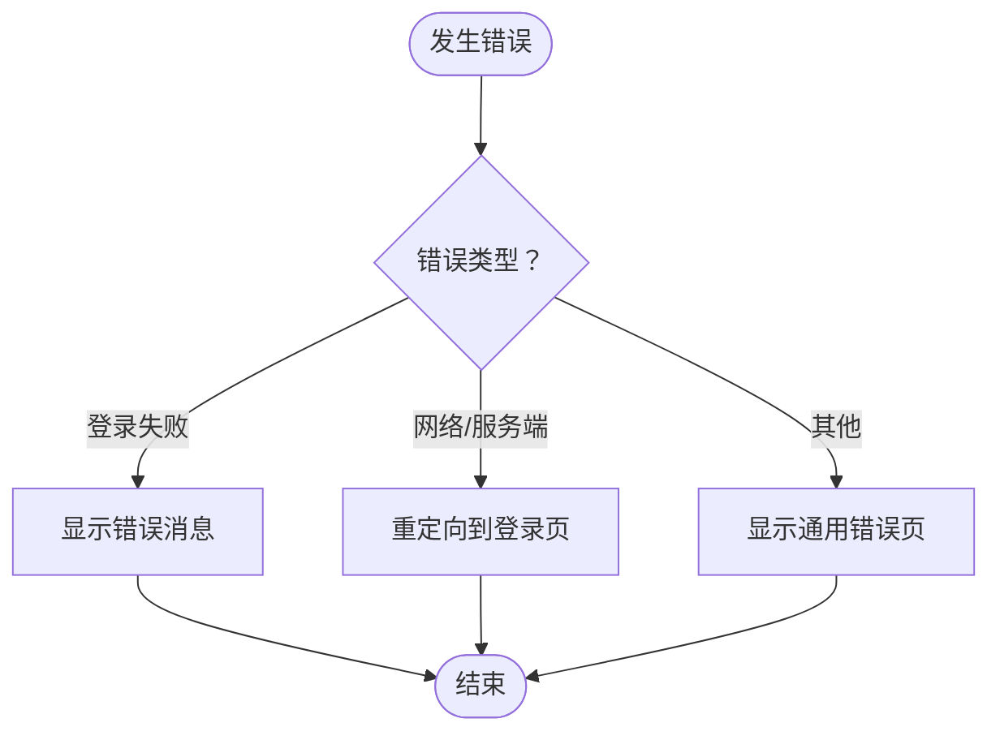
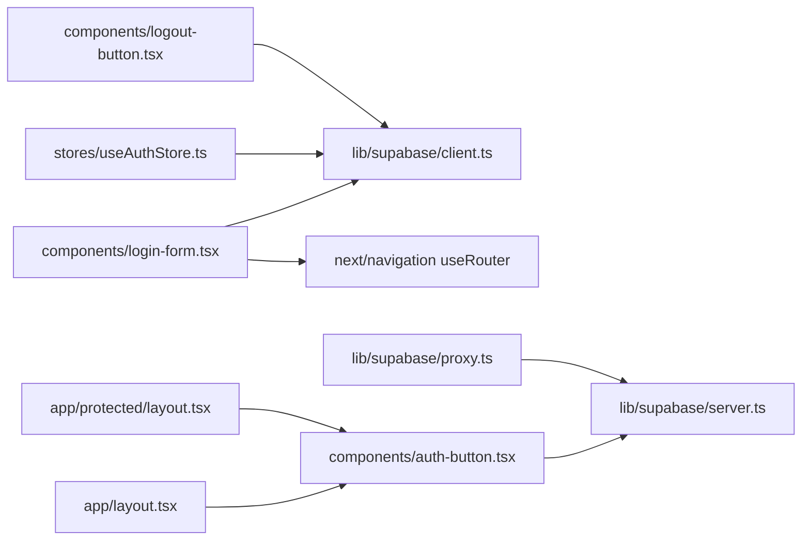

# 登录认证

<cite>
**本文引用的文件**
- [app/auth/login/page.tsx](file://app/auth/login/page.tsx)
- [components/login-form.tsx](file://components/login-form.tsx)
- [stores/useAuthStore.ts](file://stores/useAuthStore.ts)
- [lib/supabase/client.ts](file://lib/supabase/client.ts)
- [lib/supabase/server.ts](file://lib/supabase/server.ts)
- [lib/supabase/proxy.ts](file://lib/supabase/proxy.ts)
- [components/logout-button.tsx](file://components/logout-button.tsx)
- [components/auth-button.tsx](file://components/auth-button.tsx)
- [app/layout.tsx](file://app/layout.tsx)
- [app/protected/layout.tsx](file://app/protected/layout.tsx)
- [app/auth/error/page.tsx](file://app/auth/error/page.tsx)
- [lib/utils.ts](file://lib/utils.ts)
- [package.json](file://package.json)
</cite>

## 目录
1. [简介](#简介)
2. [项目结构](#项目结构)
3. [核心组件](#核心组件)
4. [架构总览](#架构总览)
5. [详细组件分析](#详细组件分析)
6. [依赖关系分析](#依赖关系分析)
7. [性能考量](#性能考量)
8. [故障排查指南](#故障排查指南)
9. [结论](#结论)
10. [附录](#附录)

## 简介
本文件系统性阐述本项目的登录认证功能，覆盖从登录页面到认证状态更新、错误处理与用户体验优化的完整流程。重点解析 LoginFrom 组件的设计与实现，说明表单字段验证、用户输入处理与提交逻辑；详解 Supabase Auth 的 signInWithPassword 调用与响应处理；描述登录状态更新流程（会话设置、用户信息获取与状态同步）；给出错误处理策略（网络错误、认证失败、账户状态异常）；并总结安全考虑与防暴力破解建议。

## 项目结构
登录认证相关的关键文件分布如下：
- 页面层：登录页面入口位于 app/auth/login/page.tsx，负责渲染 LoginForm 组件。
- 组件层：LoginForm 实现表单 UI、输入状态管理、提交逻辑与错误反馈。
- 状态层：useAuthStore 提供全局认证状态（会话、用户、初始化标志），封装 signIn、signOut、initialize 等方法。
- 客户端与服务端 Supabase 客户端：lib/supabase/client.ts 与 lib/supabase/server.ts 分别用于浏览器端与服务器端。
- 会话代理与保护：lib/supabase/proxy.ts 在请求生命周期内维护会话一致性；受保护路由通过 app/protected/layout.tsx 与组件 components/auth-button.tsx 控制导航与登录态展示。
- 错误页：app/auth/error/page.tsx 展示认证相关错误信息。
- 工具与主题：app/layout.tsx 提供主题上下文；lib/utils.ts 提供环境变量检查等工具。

图表来源
- [app/auth/login/page.tsx:1-10](file://app/auth/login/page.tsx#L1-L10)
- [components/login-form.tsx:1-129](file://components/login-form.tsx#L1-L129)
- [stores/useAuthStore.ts:1-104](file://stores/useAuthStore.ts#L1-L104)
- [lib/supabase/client.ts:1-9](file://lib/supabase/client.ts#L1-L9)
- [lib/supabase/server.ts:1-35](file://lib/supabase/server.ts#L1-L35)
- [lib/supabase/proxy.ts:1-77](file://lib/supabase/proxy.ts#L1-L77)
- [components/logout-button.tsx:1-17](file://components/logout-button.tsx#L1-L17)
- [components/auth-button.tsx:1-30](file://components/auth-button.tsx#L1-L30)
- [app/layout.tsx:1-42](file://app/layout.tsx#L1-L42)
- [app/protected/layout.tsx:1-56](file://app/protected/layout.tsx#L1-L56)

章节来源
- [app/auth/login/page.tsx:1-10](file://app/auth/login/page.tsx#L1-L10)
- [components/login-form.tsx:1-129](file://components/login-form.tsx#L1-L129)
- [stores/useAuthStore.ts:1-104](file://stores/useAuthStore.ts#L1-L104)
- [lib/supabase/client.ts:1-9](file://lib/supabase/client.ts#L1-L9)
- [lib/supabase/server.ts:1-35](file://lib/supabase/server.ts#L1-L35)
- [lib/supabase/proxy.ts:1-77](file://lib/supabase/proxy.ts#L1-L77)
- [components/logout-button.tsx:1-17](file://components/logout-button.tsx#L1-L17)
- [components/auth-button.tsx:1-30](file://components/auth-button.tsx#L1-L30)
- [app/layout.tsx:1-42](file://app/layout.tsx#L1-L42)
- [app/protected/layout.tsx:1-56](file://app/protected/layout.tsx#L1-L56)

## 核心组件
- 登录页面入口：负责居中渲染 LoginForm，提供基础背景样式与间距。
- LoginForm：客户端组件，包含邮箱/密码输入、表单提交、错误提示、加载状态与跳转逻辑。
- useAuthStore：Zustand 状态存储，集中管理会话、用户、初始化状态与认证动作（登录、注册、登出、初始化）。
- Supabase 客户端：浏览器端 createClient 与服务器端 createClient，分别用于前端交互与 SSR/代理场景。
- 会话代理与保护：updateSession 在请求生命周期内校验并同步会话；受保护布局与 AuthButton 控制导航与登录态展示。
- 错误页：统一展示认证错误信息，便于调试与用户提示。

章节来源
- [app/auth/login/page.tsx:1-10](file://app/auth/login/page.tsx#L1-L10)
- [components/login-form.tsx:1-129](file://components/login-form.tsx#L1-L129)
- [stores/useAuthStore.ts:1-104](file://stores/useAuthStore.ts#L1-L104)
- [lib/supabase/client.ts:1-9](file://lib/supabase/client.ts#L1-L9)
- [lib/supabase/server.ts:1-35](file://lib/supabase/server.ts#L1-L35)
- [lib/supabase/proxy.ts:1-77](file://lib/supabase/proxy.ts#L1-L77)
- [app/auth/error/page.tsx:1-51](file://app/auth/error/page.tsx#L1-L51)

## 架构总览
下图展示了登录认证在客户端与服务器之间的交互路径，以及状态更新与会话同步机制：

图表来源
- [app/auth/login/page.tsx:1-10](file://app/auth/login/page.tsx#L1-L10)
- [components/login-form.tsx:25-44](file://components/login-form.tsx#L25-L44)
- [stores/useAuthStore.ts:31-48](file://stores/useAuthStore.ts#L31-L48)
- [lib/supabase/client.ts:1-9](file://lib/supabase/client.ts#L1-L9)
- [lib/supabase/proxy.ts:50-60](file://lib/supabase/proxy.ts#L50-L60)
- [lib/supabase/server.ts:9-34](file://lib/supabase/server.ts#L9-L34)

## 详细组件分析

### LoginFrom 组件设计与实现
- 表单字段与验证
  - 邮箱/密码输入框使用受控组件，值通过 useState 管理。
  - 表单提交事件中阻止默认行为，调用 Supabase 密码登录。
  - 表单未内置正则校验，但输入框标记为必填，可结合业务需求扩展前端校验。
- 用户输入处理
  - 输入变更时更新对应状态，支持演示账号预填（demo@stock.com / 123456）。
- 提交逻辑
  - 提交前设置加载状态并清空错误。
  - 使用 createClient 创建浏览器端 Supabase 客户端。
  - 调用 signInWithPassword 并根据返回的 error 设置错误消息。
  - 成功后跳转至 /stocks。
- 错误处理
  - 捕获未知错误并转换为字符串消息显示。
- 用户体验
  - 加载状态下禁用按钮并显示“登录中...”文案。
  - 提供“忘记密码？”与“立即注册”的导航链接。
  - 底部提示演示账号信息。

图表来源
- [components/login-form.tsx:25-44](file://components/login-form.tsx#L25-L44)

章节来源
- [components/login-form.tsx:14-129](file://components/login-form.tsx#L14-L129)

### 密码认证机制与响应处理
- 调用方法：LoginForm 与 useAuthStore 均调用 Supabase 的 signInWithPassword，传入 email 与 password。
- 响应处理：
  - LoginForm：若 error 存在则抛出并被捕获，设置错误消息；否则跳转。
  - useAuthStore：若 error 存在则返回包含错误消息的对象；成功则更新 session 与 user。
- 会话同步：useAuthStore.initialize 中通过 getSession 与 onAuthStateChange 监听会话变化，确保状态与服务端一致。

图表来源
- [components/login-form.tsx:31-36](file://components/login-form.tsx#L31-L36)
- [stores/useAuthStore.ts:31-48](file://stores/useAuthStore.ts#L31-L48)

章节来源
- [components/login-form.tsx:31-36](file://components/login-form.tsx#L31-L36)
- [stores/useAuthStore.ts:31-48](file://stores/useAuthStore.ts#L31-L48)

### 登录状态更新流程
- 初始化：useAuthStore.initialize 获取当前会话并监听 Auth 状态变化，保证页面刷新后状态同步。
- 登录成功：useAuthStore.signIn 成功后设置 session 与 user，同时将 isLoading 置为 false。
- 登出：useAuthStore.signOut 调用 signOut 后清空 session 与 user。
- 服务器侧同步：lib/supabase/proxy.ts 在每次请求中通过 getClaims() 校验会话，必要时重定向到登录页。

图表来源
- [stores/useAuthStore.ts:81-102](file://stores/useAuthStore.ts#L81-L102)
- [lib/supabase/proxy.ts:45-60](file://lib/supabase/proxy.ts#L45-L60)

章节来源
- [stores/useAuthStore.ts:17-102](file://stores/useAuthStore.ts#L17-L102)
- [lib/supabase/proxy.ts:45-60](file://lib/supabase/proxy.ts#L45-L60)

### 错误处理机制
- 登录表单错误：捕获未知错误并显示错误消息；加载状态避免重复提交。
- 注册流程错误：useAuthStore.signUp 对 error 进行统一返回；对已注册身份进行友好提示。
- 服务器侧保护：lib/supabase/proxy.ts 在请求期间校验用户是否存在，不存在则重定向到登录页。
- 错误页展示：app/auth/error/page.tsx 支持显示错误参数，便于调试。

图表来源
- [components/login-form.tsx:39-43](file://components/login-form.tsx#L39-L43)
- [stores/useAuthStore.ts:50-69](file://stores/useAuthStore.ts#L50-L69)
- [lib/supabase/proxy.ts:50-60](file://lib/supabase/proxy.ts#L50-L60)
- [app/auth/error/page.tsx:13-21](file://app/auth/error/page.tsx#L13-L21)

章节来源
- [components/login-form.tsx:39-43](file://components/login-form.tsx#L39-L43)
- [stores/useAuthStore.ts:50-69](file://stores/useAuthStore.ts#L50-L69)
- [lib/supabase/proxy.ts:50-60](file://lib/supabase/proxy.ts#L50-L60)
- [app/auth/error/page.tsx:1-51](file://app/auth/error/page.tsx#L1-L51)

### 用户体验优化
- 加载状态：按钮禁用与文案切换，避免重复提交。
- 表单反馈：错误消息以语义化方式呈现，提升可读性。
- 自动跳转：登录成功后自动跳转至行情页，减少用户操作。
- 导航辅助：提供“忘记密码？”与“立即注册”的快捷入口。
- 主题切换：登录页支持明暗主题切换，改善视觉体验。

章节来源
- [components/login-form.tsx:102-118](file://components/login-form.tsx#L102-L118)
- [components/login-form.tsx:49-58](file://components/login-form.tsx#L49-L58)

### 安全考虑与最佳实践
- 会话同步：服务器端代理通过 getClaims() 强制校验会话，避免 SSR 场景下的随机登出问题。
- Cookie 同步：代理在创建新响应对象时复制并设置 cookies，防止浏览器与服务器会话不同步。
- 环境变量检查：lib/utils.ts 提供 hasEnvVars 检查，代理在环境变量未配置时跳过代理检查，便于开发阶段调试。
- 登出流程：LogoutButton 调用 signOut 并跳转回登录页，确保会话被清除。
- 防暴力破解建议（通用实践，非当前实现）：可引入速率限制、验证码、账户锁定阈值与日志审计等机制。

章节来源
- [lib/supabase/proxy.ts:45-76](file://lib/supabase/proxy.ts#L45-L76)
- [lib/utils.ts:8-11](file://lib/utils.ts#L8-L11)
- [components/logout-button.tsx:10-14](file://components/logout-button.tsx#L10-L14)

## 依赖关系分析
- 组件耦合
  - LoginForm 依赖 createClient 与 useRouter，内部处理表单状态与跳转。
  - useAuthStore 封装 Supabase 认证动作，提供统一的状态更新与监听。
  - AuthButton 与 LogoutButton 依赖服务器端与浏览器端 Supabase 客户端，分别用于展示与登出。
- 外部依赖
  - @supabase/ssr 与 @supabase/supabase-js 提供 SSR 与浏览器端认证能力。
  - next-themes 提供主题切换。
  - zustand 提供轻量级状态管理。

图表来源
- [components/login-form.tsx:3-12](file://components/login-form.tsx#L3-L12)
- [stores/useAuthStore.ts:1-3](file://stores/useAuthStore.ts#L1-L3)
- [components/auth-button.tsx:1-4](file://components/auth-button.tsx#L1-L4)
- [components/logout-button.tsx:1-5](file://components/logout-button.tsx#L1-L5)
- [lib/supabase/client.ts:1-9](file://lib/supabase/client.ts#L1-L9)
- [lib/supabase/server.ts:1-35](file://lib/supabase/server.ts#L1-L35)
- [lib/supabase/proxy.ts:1-77](file://lib/supabase/proxy.ts#L1-L77)
- [app/layout.tsx:30-37](file://app/layout.tsx#L30-L37)
- [app/protected/layout.tsx:28-31](file://app/protected/layout.tsx#L28-L31)

章节来源
- [package.json:9-28](file://package.json#L9-L28)
- [components/login-form.tsx:3-12](file://components/login-form.tsx#L3-L12)
- [stores/useAuthStore.ts:1-3](file://stores/useAuthStore.ts#L1-L3)
- [components/auth-button.tsx:1-4](file://components/auth-button.tsx#L1-L4)
- [components/logout-button.tsx:1-5](file://components/logout-button.tsx#L1-L5)
- [lib/supabase/client.ts:1-9](file://lib/supabase/client.ts#L1-L9)
- [lib/supabase/server.ts:1-35](file://lib/supabase/server.ts#L1-L35)
- [lib/supabase/proxy.ts:1-77](file://lib/supabase/proxy.ts#L1-L77)
- [app/layout.tsx:30-37](file://app/layout.tsx#L30-L37)
- [app/protected/layout.tsx:28-31](file://app/protected/layout.tsx#L28-L31)

## 性能考量
- 客户端与服务器端客户端分离：避免在全局缓存中持有客户端实例，减少不必要的内存占用与状态污染。
- 状态监听：useAuthStore.onAuthStateChange 仅在需要时触发状态更新，避免频繁渲染。
- 代理同步：lib/supabase/proxy.ts 在每次请求中执行 getClaims()，确保会话一致性，但需注意在无环境变量时跳过代理检查以降低开销。

## 故障排查指南
- 环境变量未配置：lib/utils.ts 的 hasEnvVars 为 false 时，lib/supabase/proxy.ts 会跳过代理检查。请确认 NEXT_PUBLIC_SUPABASE_URL 与 NEXT_PUBLIC_SUPABASE_PUBLISHABLE_KEY 是否正确设置。
- 登录失败：检查 LoginForm 的错误消息显示与 useAuthStore.signIn 的错误返回；确认 Supabase 项目中的认证策略与用户状态。
- 服务器端随机登出：确保在 SSR 场景中调用 getClaims()，并遵循代理返回响应对象的严格要求，避免浏览器与服务器会话不同步。
- 受保护页面无法访问：lib/supabase/proxy.ts 会在无用户且不在 /auth 路径时重定向到 /auth/login，请检查路由与会话状态。

章节来源
- [lib/utils.ts:8-11](file://lib/utils.ts#L8-L11)
- [lib/supabase/proxy.ts:45-76](file://lib/supabase/proxy.ts#L45-L76)
- [components/login-form.tsx:39-43](file://components/login-form.tsx#L39-L43)
- [stores/useAuthStore.ts:31-48](file://stores/useAuthStore.ts#L31-L48)

## 结论
本项目的登录认证采用“页面 + 组件 + 状态存储 + Supabase 客户端 + 代理同步”的分层设计，实现了从表单提交到会话更新的完整闭环。LoginForm 提供简洁直观的登录体验，useAuthStore 统一管理认证状态与动作，lib/supabase/proxy.ts 确保服务器端会话一致性。配合错误页与环境变量检查，整体具备良好的可维护性与可扩展性。建议在生产环境中进一步完善防暴力破解与会话安全策略。

## 附录
- 集成指南（基于现有实现）
  - 在页面中渲染 LoginForm 即可启用登录功能。
  - 若需在组件中直接调用登录逻辑，可使用 useAuthStore.signIn 或在客户端组件中调用 createClient 并调用 Supabase Auth 方法。
  - 服务器端保护可通过 lib/supabase/proxy.ts 注入到中间件或请求处理流程中。
  - 登出可通过 LogoutButton 或调用 useAuthStore.signOut 实现。

章节来源
- [app/auth/login/page.tsx:1-10](file://app/auth/login/page.tsx#L1-L10)
- [components/login-form.tsx:25-44](file://components/login-form.tsx#L25-L44)
- [stores/useAuthStore.ts:31-48](file://stores/useAuthStore.ts#L31-L48)
- [lib/supabase/proxy.ts:50-60](file://lib/supabase/proxy.ts#L50-L60)
- [components/logout-button.tsx:10-14](file://components/logout-button.tsx#L10-L14)