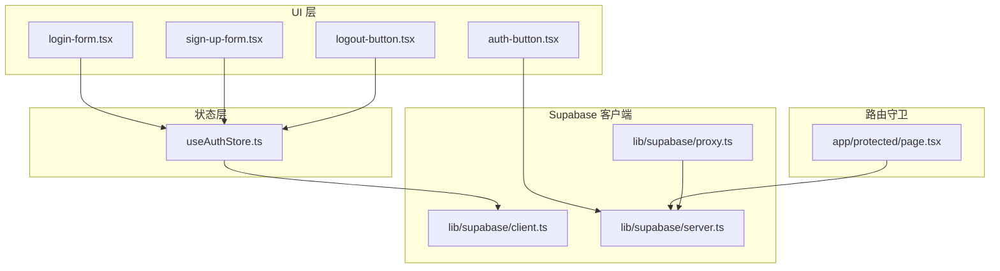
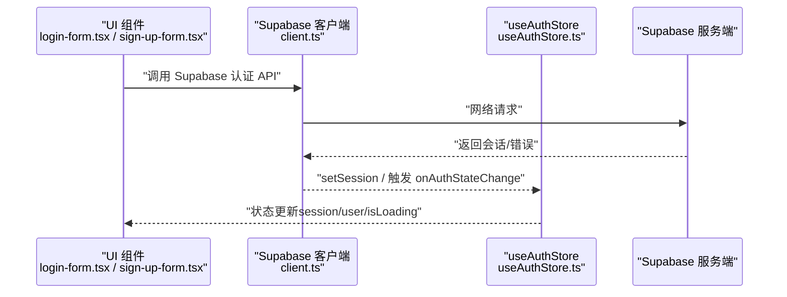
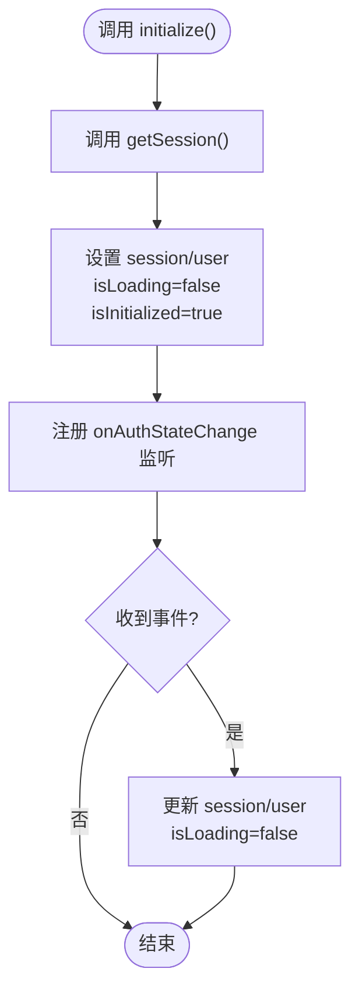
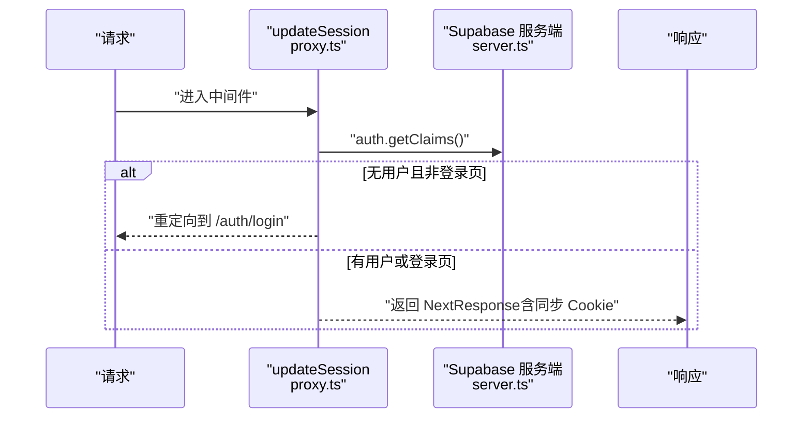
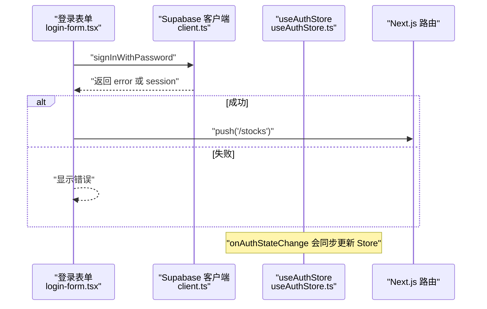
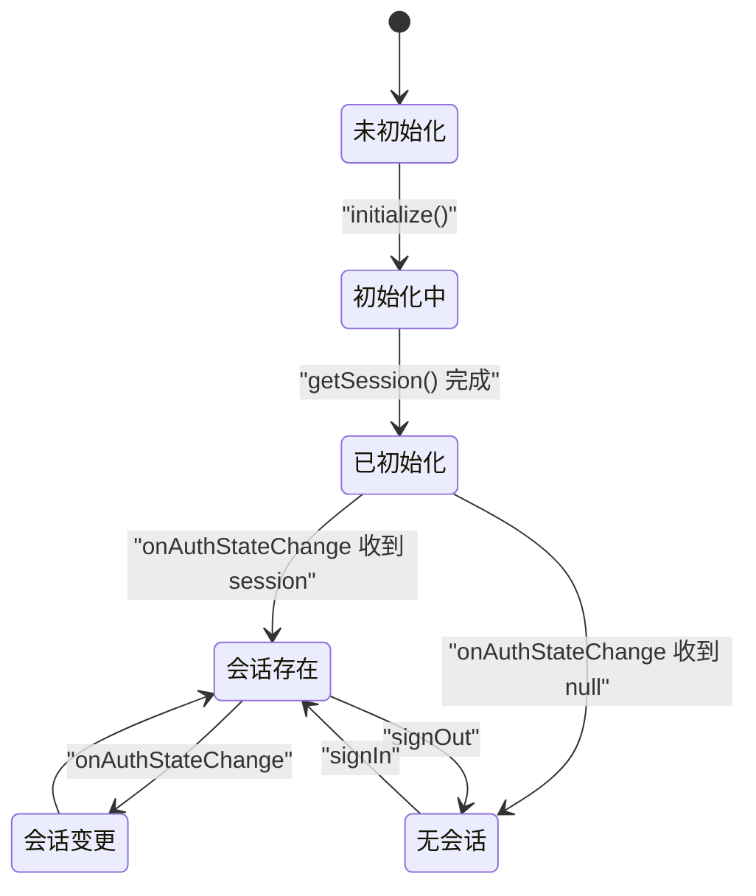
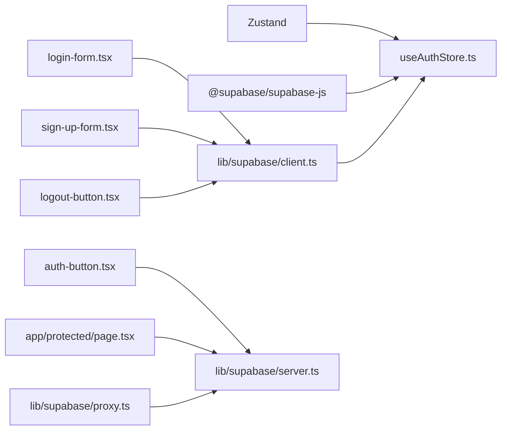

# 认证状态管理

<cite>
**本文引用的文件**
- [useAuthStore.ts](file://stores/useAuthStore.ts)
- [client.ts](file://lib/supabase/client.ts)
- [server.ts](file://lib/supabase/server.ts)
- [proxy.ts](file://lib/supabase/proxy.ts)
- [index.ts](file://stores/index.ts)
- [状态管理结构.md](file://docs/状态管理结构.md)
- [package.json](file://package.json)
- [utils.ts](file://lib/utils.ts)
- [login-form.tsx](file://components/login-form.tsx)
- [sign-up-form.tsx](file://components/sign-up-form.tsx)
- [logout-button.tsx](file://components/logout-button.tsx)
- [auth-button.tsx](file://components/auth-button.tsx)
- [page.tsx](file://app/protected/page.tsx)
</cite>

## 目录
1. [简介](#简介)
2. [项目结构](#项目结构)
3. [核心组件](#核心组件)
4. [架构总览](#架构总览)
5. [详细组件分析](#详细组件分析)
6. [依赖关系分析](#依赖关系分析)
7. [性能考量](#性能考量)
8. [故障排查指南](#故障排查指南)
9. [结论](#结论)
10. [附录](#附录)

## 简介
本文件围绕认证状态管理展开，重点解析 useAuthStore 的设计与实现，阐述其如何基于 Zustand 管理 Supabase 会话状态，覆盖状态结构、动作函数、会话初始化流程、生命周期标志、错误处理、跨组件共享与性能优化策略。同时结合项目中的客户端与服务端 Supabase 客户端、路由守卫与 UI 组件，给出可操作的最佳实践。

## 项目结构
认证相关的关键位置如下：
- 状态层：stores/useAuthStore.ts 提供认证状态与动作
- Supabase 客户端：lib/supabase/client.ts（浏览器端）与 lib/supabase/server.ts（服务端）
- 路由守卫与代理：lib/supabase/proxy.ts 与 app/protected/page.tsx
- UI 层：components/login-form.tsx、components/sign-up-form.tsx、components/logout-button.tsx、components/auth-button.tsx
- 统一导出：stores/index.ts

**图表来源**
- [useAuthStore.ts:1-104](file://stores/useAuthStore.ts#L1-L104)
- [client.ts:1-9](file://lib/supabase/client.ts#L1-L9)
- [server.ts:1-34](file://lib/supabase/server.ts#L1-L34)
- [proxy.ts:1-76](file://lib/supabase/proxy.ts#L1-L76)
- [login-form.tsx:1-129](file://components/login-form.tsx#L1-L129)
- [sign-up-form.tsx:1-121](file://components/sign-up-form.tsx#L1-L121)
- [logout-button.tsx:1-18](file://components/logout-button.tsx#L1-L18)
- [auth-button.tsx:1-30](file://components/auth-button.tsx#L1-L30)
- [page.tsx:1-44](file://app/protected/page.tsx#L1-L44)

**章节来源**
- [useAuthStore.ts:1-104](file://stores/useAuthStore.ts#L1-L104)
- [client.ts:1-9](file://lib/supabase/client.ts#L1-L9)
- [server.ts:1-34](file://lib/supabase/server.ts#L1-L34)
- [proxy.ts:1-76](file://lib/supabase/proxy.ts#L1-L76)
- [login-form.tsx:1-129](file://components/login-form.tsx#L1-L129)
- [sign-up-form.tsx:1-121](file://components/sign-up-form.tsx#L1-L121)
- [logout-button.tsx:1-18](file://components/logout-button.tsx#L1-L18)
- [auth-button.tsx:1-30](file://components/auth-button.tsx#L1-L30)
- [page.tsx:1-44](file://app/protected/page.tsx#L1-L44)

## 核心组件
- useAuthStore：Zustand 认证状态容器，负责 session、user、isLoading、isInitialized 状态与 signIn、signUp、signOut、setSession、initialize 等动作。
- Supabase 客户端：
  - 浏览器端 createClient：用于前端交互（登录、注册、登出、会话获取与事件监听）
  - 服务端 createClient：用于 SSR/SSG 与代理中间件，读写 Cookie 并校验用户身份
- 路由守卫与代理：updateSession 在请求进入时校验用户身份，必要时重定向至登录页
- UI 组件：登录、注册、登出按钮与头部认证入口，均通过 Supabase 客户端与 useAuthStore 协作

**章节来源**
- [useAuthStore.ts:5-15](file://stores/useAuthStore.ts#L5-L15)
- [client.ts:3-8](file://lib/supabase/client.ts#L3-L8)
- [server.ts:9-33](file://lib/supabase/server.ts#L9-L33)
- [proxy.ts:5-75](file://lib/supabase/proxy.ts#L5-L75)

## 架构总览
useAuthStore 以 Zustand 管理认证状态，通过 Supabase 浏览器端客户端进行会话初始化与事件监听；服务端客户端与代理中间件保障 SSR 期间的身份一致性与自动重定向；UI 组件通过浏览器端客户端触发认证动作，状态变更通过 onAuthStateChange 推送回前端 Store。

**图表来源**
- [useAuthStore.ts:31-48](file://stores/useAuthStore.ts#L31-L48)
- [useAuthStore.ts:50-69](file://stores/useAuthStore.ts#L50-L69)
- [useAuthStore.ts:71-79](file://stores/useAuthStore.ts#L71-L79)
- [useAuthStore.ts:81-102](file://stores/useAuthStore.ts#L81-L102)
- [client.ts:3-8](file://lib/supabase/client.ts#L3-L8)

## 详细组件分析

### useAuthStore 设计与实现
- 状态结构
  - session：当前会话对象或空
  - user：当前用户对象或空
  - isLoading：是否处于加载中（初始为 true，首次获取会话后置为 false）
  - isInitialized：是否完成一次会话初始化（用于区分“未初始化”与“无会话”的状态）
- 动作函数
  - setSession(session)：设置会话与用户，关闭加载态
  - signIn(email, password)：调用 Supabase 密码登录，成功后设置 session/user，失败返回错误信息
  - signUp(email, password)：调用 Supabase 注册，根据返回 identities 判断是否已注册，返回友好消息
  - signOut()：调用 Supabase 登出，清空 session/user，关闭加载态
  - initialize()：获取当前会话并标记 isInitialized，同时监听 onAuthStateChange 事件，确保状态与服务端保持同步
- 错误处理
  - 所有异步动作捕获 error 并返回错误信息，避免抛出异常导致 UI 崩溃
  - 注册场景区分“已注册”与“需邮箱验证”的不同提示
- 生命周期标志
  - isLoading：用于 UI 渲染加载态与防抖
  - isInitialized：用于区分“尚未初始化”和“已初始化但无会话”，便于在应用启动阶段正确渲染

**图表来源**
- [useAuthStore.ts:81-102](file://stores/useAuthStore.ts#L81-L102)

**章节来源**
- [useAuthStore.ts:5-15](file://stores/useAuthStore.ts#L5-L15)
- [useAuthStore.ts:23-29](file://stores/useAuthStore.ts#L23-L29)
- [useAuthStore.ts:31-48](file://stores/useAuthStore.ts#L31-L48)
- [useAuthStore.ts:50-69](file://stores/useAuthStore.ts#L50-L69)
- [useAuthStore.ts:71-79](file://stores/useAuthStore.ts#L71-L79)
- [useAuthStore.ts:81-102](file://stores/useAuthStore.ts#L81-L102)

### Supabase 客户端与代理
- 浏览器端 createClient：封装 NEXT_PUBLIC_SUPABASE_URL 与 NEXT_PUBLIC_SUPABASE_PUBLISHABLE_KEY，供前端认证动作使用
- 服务端 createClient：基于 cookies 读写，确保 SSR 期间会话一致
- 代理中间件 updateSession：在请求进入时校验 getClaims，若未登录且访问受保护路径则重定向至登录页，同时维护响应 Cookie 同步

**图表来源**
- [proxy.ts:5-75](file://lib/supabase/proxy.ts#L5-L75)
- [server.ts:9-33](file://lib/supabase/server.ts#L9-L33)

**章节来源**
- [client.ts:3-8](file://lib/supabase/client.ts#L3-L8)
- [server.ts:9-33](file://lib/supabase/server.ts#L9-L33)
- [proxy.ts:5-75](file://lib/supabase/proxy.ts#L5-L75)

### UI 组件与认证流程
- 登录表单 login-form.tsx：收集邮箱/密码，调用 Supabase 密码登录，成功后跳转到行情页，错误时显示提示
- 注册表单 sign-up-form.tsx：校验两次密码一致，调用 Supabase 注册并跳转成功页
- 登出按钮 logout-button.tsx：调用 Supabase 登出并跳转登录页
- 头部认证入口 auth-button.tsx：服务端获取 claims 并根据是否存在用户决定显示登录/登出入口

**图表来源**
- [login-form.tsx:25-44](file://components/login-form.tsx#L25-L44)
- [useAuthStore.ts:94-101](file://stores/useAuthStore.ts#L94-L101)

**章节来源**
- [login-form.tsx:1-129](file://components/login-form.tsx#L1-L129)
- [sign-up-form.tsx:1-121](file://components/sign-up-form.tsx#L1-L121)
- [logout-button.tsx:1-18](file://components/logout-button.tsx#L1-L18)
- [auth-button.tsx:6-29](file://components/auth-button.tsx#L6-L29)

### 会话初始化与生命周期管理
- 初始化 initialize()：先通过 getSession() 设置初始 session/user，并将 isInitialized 置为 true；随后注册 onAuthStateChange 监听，保证后续登录/登出/会话刷新时状态同步
- 生命周期标志：
  - isLoading：初始 true，首次获取会话后置为 false，用于 UI 加载态控制
  - isInitialized：仅在首次 getSession() 完成后置为 true，区分“未初始化”和“已初始化但无会话”
- 典型流程：应用启动 -> initialize() -> 获取 session -> 监听事件 -> UI 根据 session 渲染

**图表来源**
- [useAuthStore.ts:81-102](file://stores/useAuthStore.ts#L81-L102)

**章节来源**
- [useAuthStore.ts:20-21](file://stores/useAuthStore.ts#L20-L21)
- [useAuthStore.ts:81-102](file://stores/useAuthStore.ts#L81-L102)

### 错误处理与用户体验
- signIn/signUp：捕获 error 并返回错误信息，避免异常冒泡
- signUp：根据 identities 长度判断是否已注册，返回友好提示
- 登录/注册表单：集中处理错误显示与加载态，提升可用性
- 服务端路由守卫：未登录访问受保护路径时自动重定向，避免白屏

**章节来源**
- [useAuthStore.ts:38-40](file://stores/useAuthStore.ts#L38-L40)
- [useAuthStore.ts:60-68](file://stores/useAuthStore.ts#L60-L68)
- [login-form.tsx:39-43](file://components/login-form.tsx#L39-L43)
- [sign-up-form.tsx:52-56](file://components/sign-up-form.tsx#L52-L56)
- [proxy.ts:50-60](file://lib/supabase/proxy.ts#L50-L60)

### 跨组件状态共享与持久化策略
- 跨组件共享：useAuthStore 作为全局状态，任何组件可通过其 selector 订阅 session/user/isLoading/isInitialized，无需层层传递 props
- 状态持久化：认证状态不持久化（敏感信息），UI 状态（如主题）通过 persist 中间件持久化到 localStorage；其他业务数据（如资金、持仓）每次会话从服务端拉取
- 与 Supabase Realtime 协作：通过 onAuthStateChange 与服务端事件保持一致，避免本地状态漂移

**章节来源**
- [状态管理结构.md:11-14](file://docs/状态管理结构.md#L11-L14)
- [状态管理结构.md:401-417](file://docs/状态管理结构.md#L401-L417)

## 依赖关系分析
- useAuthStore 依赖：
  - Zustand：create 用于创建 Store
  - @supabase/supabase-js：Session/User 类型
  - lib/supabase/client.ts：createClient 用于浏览器端认证
- UI 组件依赖：
  - 浏览器端 Supabase 客户端：login-form.tsx、sign-up-form.tsx、logout-button.tsx
  - 服务端 Supabase 客户端：auth-button.tsx、app/protected/page.tsx
- 代理与路由守卫：
  - lib/supabase/proxy.ts：请求拦截与身份校验
  - app/protected/page.tsx：服务端获取 claims 并重定向

**图表来源**
- [useAuthStore.ts:1-3](file://stores/useAuthStore.ts#L1-L3)
- [client.ts:3-8](file://lib/supabase/client.ts#L3-L8)
- [server.ts:9-33](file://lib/supabase/server.ts#L9-L33)
- [login-form.tsx:4](file://components/login-form.tsx#L4)
- [sign-up-form.tsx:4](file://components/sign-up-form.tsx#L4)
- [logout-button.tsx:3](file://components/logout-button.tsx#L3)
- [auth-button.tsx:3](file://components/auth-button.tsx#L3)
- [page.tsx:3](file://app/protected/page.tsx#L3)
- [proxy.ts:18-39](file://lib/supabase/proxy.ts#L18-L39)

**章节来源**
- [package.json:16-28](file://package.json#L16-L28)
- [useAuthStore.ts:1-3](file://stores/useAuthStore.ts#L1-L3)
- [client.ts:3-8](file://lib/supabase/client.ts#L3-L8)
- [server.ts:9-33](file://lib/supabase/server.ts#L9-L33)
- [proxy.ts:18-39](file://lib/supabase/proxy.ts#L18-L39)

## 性能考量
- 异步动作批处理：登录/注册/登出均为独立异步调用，避免不必要的重复请求
- 状态最小化：仅存储 session/user/isLoading/isInitialized，减少渲染开销
- 事件驱动更新：onAuthStateChange 仅在会话状态变化时触发，降低无效重渲染
- 服务端一致性：代理中间件在请求阶段校验身份，避免无效的前端请求与二次渲染
- 环境变量检查：utils.ts 中 hasEnvVars 用于跳过代理检查，便于开发调试

**章节来源**
- [useAuthStore.ts:31-79](file://stores/useAuthStore.ts#L31-L79)
- [proxy.ts:12-14](file://lib/supabase/proxy.ts#L12-L14)
- [utils.ts:8-11](file://lib/utils.ts#L8-L11)

## 故障排查指南
- 登录失败
  - 检查 Supabase 凭据是否正确（NEXT_PUBLIC_SUPABASE_URL 与 NEXT_PUBLIC_SUPABASE_PUBLISHABLE_KEY）
  - 查看 signIn 返回的错误信息，确认邮箱/密码格式与服务端策略
- 注册后无法登录
  - 若返回“已注册，请直接登录”，确认用户是否已完成邮箱验证流程
- 页面未重定向到登录页
  - 检查代理中间件 updateSession 是否生效，确认 getClaims 是否返回用户信息
  - 确认受保护页面的路径是否命中重定向逻辑
- 状态未更新
  - 确认 initialize() 是否被调用，以及 onAuthStateChange 是否正常触发
  - 检查 setSession 是否被调用，isLoading 是否被正确置为 false

**章节来源**
- [client.ts:3-8](file://lib/supabase/client.ts#L3-L8)
- [useAuthStore.ts:38-40](file://stores/useAuthStore.ts#L38-L40)
- [useAuthStore.ts:60-68](file://stores/useAuthStore.ts#L60-L68)
- [proxy.ts:47-60](file://lib/supabase/proxy.ts#L47-L60)
- [page.tsx:8-16](file://app/protected/page.tsx#L8-L16)

## 结论
useAuthStore 以简洁的状态结构与明确的动作边界，结合 Supabase 的会话管理与事件监听，实现了稳定可靠的认证状态管理。通过 initialize() 与 onAuthStateChange，系统在应用启动与运行期均能保持状态与服务端的一致性；配合服务端代理与 UI 组件，形成从前端交互到后端校验的完整闭环。建议在生产环境中持续关注环境变量配置、错误处理与性能监控，确保用户体验与安全性。

## 附录
- 最佳实践
  - 在应用入口调用 initialize()，确保会话初始化与事件监听尽早建立
  - 使用 isLoading/isInitialized 控制首屏渲染与加载态，避免闪烁
  - 将敏感状态（如 session）保留在内存中，不持久化到本地存储
  - 在受保护页面使用代理中间件与服务端 claims 校验，确保 SSR 期间的安全性
  - 对登录/注册/登出等关键动作统一错误处理，向用户反馈清晰的提示信息