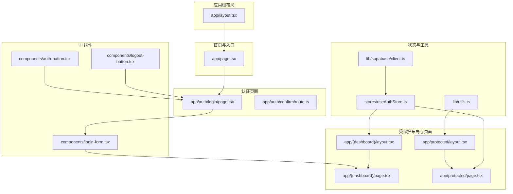
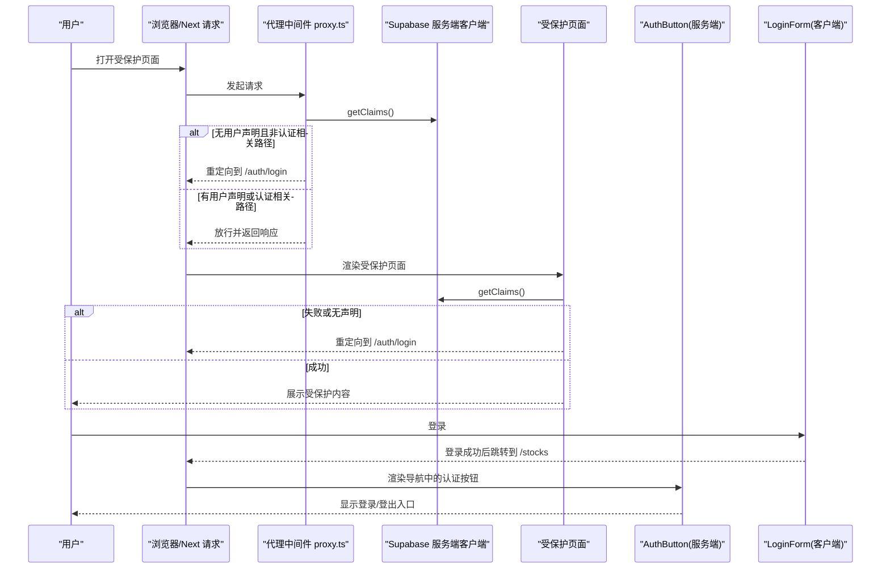
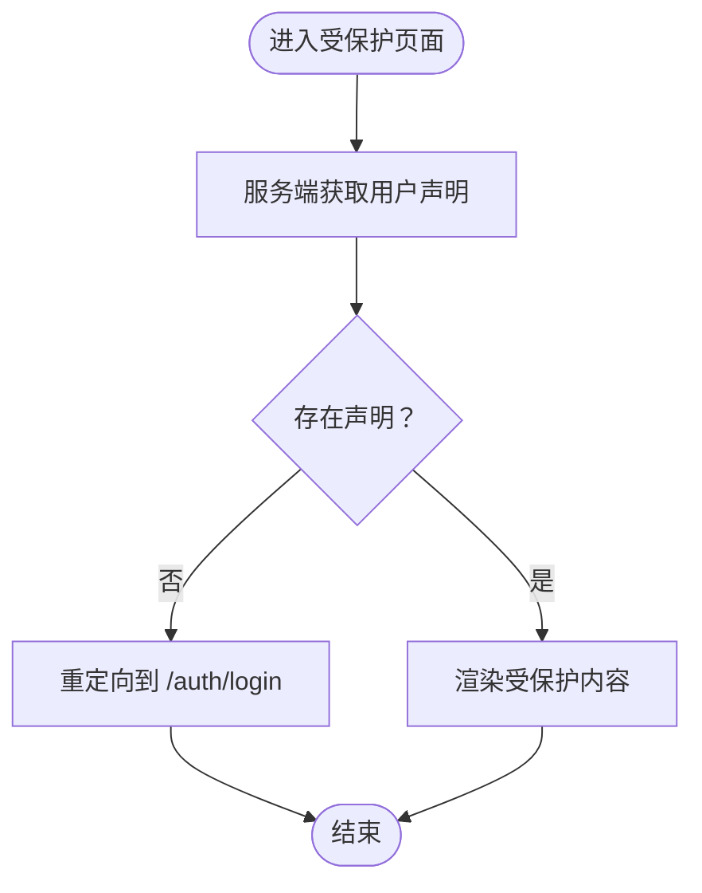
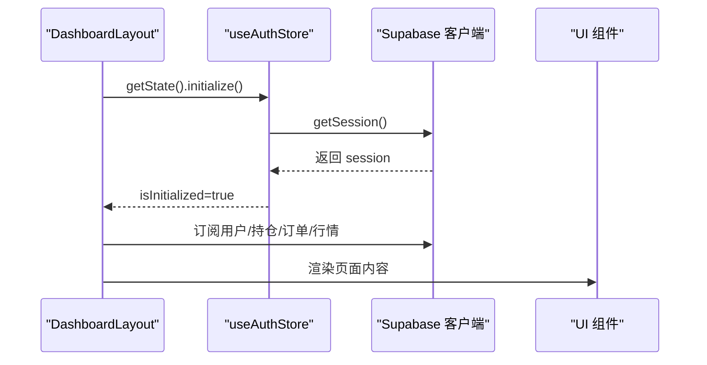
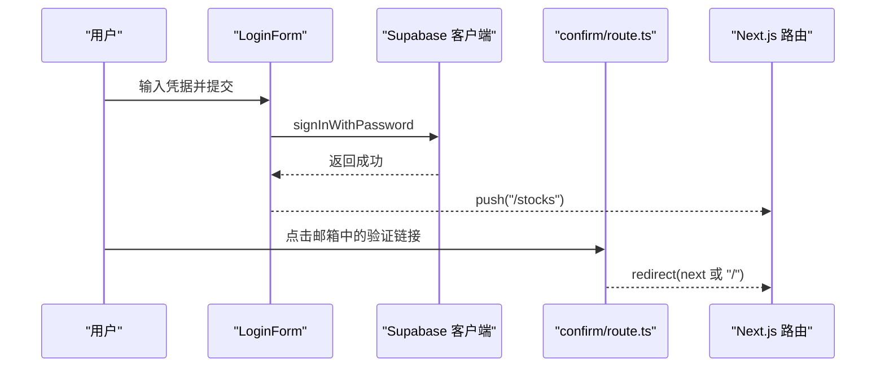
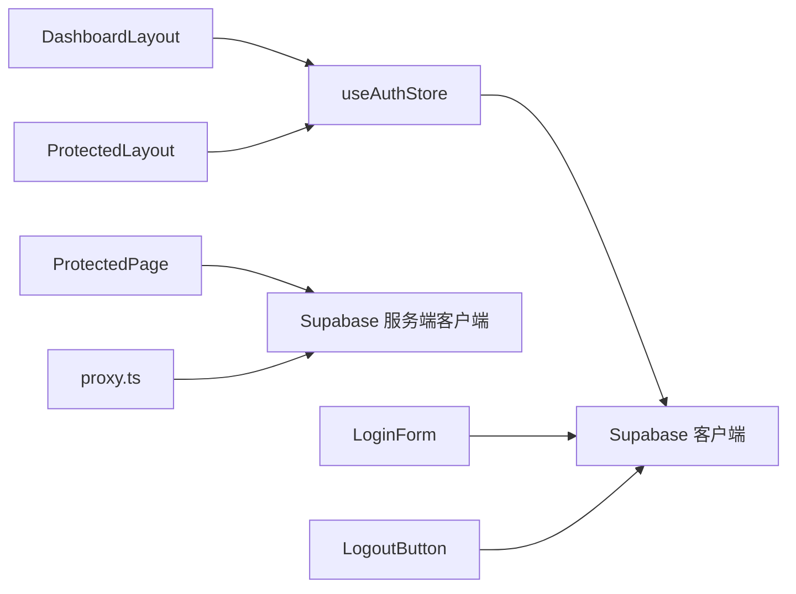

# 认证路由保护

<cite>
**本文引用的文件**
- [app/layout.tsx](file://app/layout.tsx)
- [app/page.tsx](file://app/page.tsx)
- [app/(dashboard)/layout.tsx](file://app/(dashboard)/layout.tsx)
- [app/(dashboard)/page.tsx](file://app/(dashboard)/page.tsx)
- [app/protected/layout.tsx](file://app/protected/layout.tsx)
- [app/protected/page.tsx](file://app/protected/page.tsx)
- [components/auth-button.tsx](file://components/auth-button.tsx)
- [components/logout-button.tsx](file://components/logout-button.tsx)
- [components/login-form.tsx](file://components/login-form.tsx)
- [stores/useAuthStore.ts](file://stores/useAuthStore.ts)
- [stores/index.ts](file://stores/index.ts)
- [lib/utils.ts](file://lib/utils.ts)
- [lib/supabase/client.ts](file://lib/supabase/client.ts)
- [lib/supabase/proxy.ts](file://lib/supabase/proxy.ts)
- [app/auth/confirm/route.ts](file://app/auth/confirm/route.ts)
</cite>

## 目录
1. [简介](#简介)
2. [项目结构](#项目结构)
3. [核心组件](#核心组件)
4. [架构总览](#架构总览)
5. [详细组件分析](#详细组件分析)
6. [依赖关系分析](#依赖关系分析)
7. [性能考量](#性能考量)
8. [故障排查指南](#故障排查指南)
9. [结论](#结论)
10. [附录](#附录)

## 简介
本文件系统性阐述本项目的“认证路由保护”机制，围绕以下目标展开：
- ProtectedLayout 组件的设计与实现：认证状态检查、重定向逻辑、加载态处理
- 受保护路由的定义与配置：路由元数据、访问权限验证、动态路由生成
- 认证状态与路由的集成：useAuthStore 状态监听、路由守卫实现、条件渲染
- 未认证用户的重定向策略：登录跳转、返回 URL 保存、认证完成回调
- 认证状态变化对路由的影响：动态路由更新、权限变更处理、页面刷新策略
- 混合内容保护：公共区域、私有区域与部分受保护页面的划分
- 性能优化、缓存策略与用户体验建议
- 最佳实践与完整示例路径指引

## 项目结构
本项目采用 Next.js App Router 的目录约定组织页面与布局。认证相关的页面集中在 app/auth 下，仪表盘与受保护页面位于 app/(dashboard) 与 app/protected 中；状态管理通过 Zustand 的 useAuthStore 实现；认证按钮与登出按钮分别在客户端与服务端组件中使用 Supabase 客户端进行交互。

图表来源
- [app/layout.tsx:1-42](file://app/layout.tsx#L1-L42)
- [app/page.tsx:1-8](file://app/page.tsx#L1-L8)
- [app/(dashboard)/layout.tsx:1-150](file://app/(dashboard)/layout.tsx#L1-L150)
- [app/(dashboard)/page.tsx:1-99](file://app/(dashboard)/page.tsx#L1-L99)
- [app/protected/layout.tsx:1-56](file://app/protected/layout.tsx#L1-L56)
- [app/protected/page.tsx:1-43](file://app/protected/page.tsx#L1-L43)
- [components/auth-button.tsx:1-30](file://components/auth-button.tsx#L1-L30)
- [components/logout-button.tsx:1-18](file://components/logout-button.tsx#L1-L18)
- [components/login-form.tsx:1-129](file://components/login-form.tsx#L1-L129)
- [stores/useAuthStore.ts:1-104](file://stores/useAuthStore.ts#L1-L104)
- [lib/utils.ts:1-47](file://lib/utils.ts#L1-L47)
- [lib/supabase/client.ts:1-9](file://lib/supabase/client.ts#L1-L9)

章节来源
- [app/layout.tsx:1-42](file://app/layout.tsx#L1-L42)
- [app/page.tsx:1-8](file://app/page.tsx#L1-L8)
- [app/(dashboard)/layout.tsx:1-150](file://app/(dashboard)/layout.tsx#L1-L150)
- [app/(dashboard)/page.tsx:1-99](file://app/(dashboard)/page.tsx#L1-L99)
- [app/protected/layout.tsx:1-56](file://app/protected/layout.tsx#L1-L56)
- [app/protected/page.tsx:1-43](file://app/protected/page.tsx#L1-L43)
- [components/auth-button.tsx:1-30](file://components/auth-button.tsx#L1-L30)
- [components/logout-button.tsx:1-18](file://components/logout-button.tsx#L1-L18)
- [components/login-form.tsx:1-129](file://components/login-form.tsx#L1-L129)
- [stores/useAuthStore.ts:1-104](file://stores/useAuthStore.ts#L1-L104)
- [lib/utils.ts:1-47](file://lib/utils.ts#L1-L47)
- [lib/supabase/client.ts:1-9](file://lib/supabase/client.ts#L1-L9)

## 核心组件
- ProtectedLayout：提供受保护区域的通用布局，包含导航、主题切换与认证按钮挂载点，并在环境变量不完整时显示警告。
- useAuthStore：Zustand 状态存储，封装 Supabase 会话读取、登录/注册/登出、会话变化监听与初始化流程。
- 认证按钮与登出按钮：服务端组件用于展示用户信息与登录入口；客户端组件负责触发登出并重定向至登录页。
- 受保护页面：app/protected/page.tsx 通过服务端调用 Supabase 获取用户声明并进行未认证重定向。
- 登录表单：客户端组件，提交凭据后跳转至仪表盘页面。
- 代理中间件：lib/supabase/proxy.ts 提供基于请求路径与用户声明的路由守卫与重定向。

章节来源
- [app/protected/layout.tsx:1-56](file://app/protected/layout.tsx#L1-L56)
- [stores/useAuthStore.ts:1-104](file://stores/useAuthStore.ts#L1-L104)
- [components/auth-button.tsx:1-30](file://components/auth-button.tsx#L1-L30)
- [components/logout-button.tsx:1-18](file://components/logout-button.tsx#L1-L18)
- [app/protected/page.tsx:1-43](file://app/protected/page.tsx#L1-L43)
- [components/login-form.tsx:1-129](file://components/login-form.tsx#L1-L129)
- [lib/supabase/proxy.ts:45-76](file://lib/supabase/proxy.ts#L45-L76)

## 架构总览
下图展示了从用户访问到认证状态检查、路由守卫与页面渲染的整体流程。

图表来源
- [lib/supabase/proxy.ts:45-76](file://lib/supabase/proxy.ts#L45-L76)
- [app/protected/page.tsx:8-17](file://app/protected/page.tsx#L8-L17)
- [components/auth-button.tsx:6-29](file://components/auth-button.tsx#L6-L29)
- [components/login-form.tsx:25-44](file://components/login-form.tsx#L25-L44)

## 详细组件分析

### ProtectedLayout 组件设计与实现
- 导航与布局：提供统一的头部导航、内容区与页脚，支持主题切换与环境变量检查。
- 条件渲染：当环境变量不完整时显示警告；否则挂载 Suspense 包裹的 AuthButton。
- 与认证状态的衔接：通过 AuthButton 间接反映当前认证状态，配合全局状态与路由守卫实现一致的用户体验。

章节来源
- [app/protected/layout.tsx:1-56](file://app/protected/layout.tsx#L1-L56)
- [lib/utils.ts:8-11](file://lib/utils.ts#L8-L11)
- [components/auth-button.tsx:6-29](file://components/auth-button.tsx#L6-L29)

### 受保护页面与路由守卫
- 服务端守卫：受保护页面在服务端调用 Supabase 获取用户声明，若失败或为空则重定向至登录页。
- 代理中间件守卫：对非认证相关路径进行统一拦截，确保未认证用户被重定向到登录页。
- 动态路由生成：受保护页面与仪表盘页面均属于动态路由，由 Next.js 自动解析。

图表来源
- [app/protected/page.tsx:8-17](file://app/protected/page.tsx#L8-L17)
- [lib/supabase/proxy.ts:50-60](file://lib/supabase/proxy.ts#L50-L60)

章节来源
- [app/protected/page.tsx:1-43](file://app/protected/page.tsx#L1-L43)
- [lib/supabase/proxy.ts:45-76](file://lib/supabase/proxy.ts#L45-L76)

### 认证状态与路由集成
- useAuthStore 初始化：启动时读取当前会话并监听 Supabase 的认证状态变化，自动更新 store。
- 仪表盘布局集成：DashboardLayout 在客户端初始化 useAuthStore，并在用户 ID 存在时订阅实时数据与计算资产概览。
- 条件渲染与加载态：在 isInitialized 为 false 时显示加载指示，避免水合不一致导致的闪烁。

图表来源
- [app/(dashboard)/layout.tsx:26-29](file://app/(dashboard)/layout.tsx#L26-L29)
- [stores/useAuthStore.ts:81-102](file://stores/useAuthStore.ts#L81-L102)

章节来源
- [app/(dashboard)/layout.tsx:1-150](file://app/(dashboard)/layout.tsx#L1-L150)
- [stores/useAuthStore.ts:1-104](file://stores/useAuthStore.ts#L1-L104)

### 未认证用户的重定向策略
- 登录页面跳转：首页直接重定向到登录页；登录成功后跳转到 /stocks。
- 返回 URL 保存：注册流程中通过 Supabase 的 options.emailRedirectTo 指定回调地址，便于后续完成认证流程。
- 认证完成回调：app/auth/confirm/route.ts 接收 token_hash 与类型，校验 OTP 后根据 next 参数重定向。

图表来源
- [components/login-form.tsx:25-44](file://components/login-form.tsx#L25-L44)
- [stores/useAuthStore.ts:50-69](file://stores/useAuthStore.ts#L50-L69)
- [app/auth/confirm/route.ts:6-30](file://app/auth/confirm/route.ts#L6-L30)

章节来源
- [app/page.tsx:1-8](file://app/page.tsx#L1-L8)
- [components/login-form.tsx:1-129](file://components/login-form.tsx#L1-L129)
- [stores/useAuthStore.ts:50-69](file://stores/useAuthStore.ts#L50-L69)
- [app/auth/confirm/route.ts:1-30](file://app/auth/confirm/route.ts#L1-L30)

### 认证状态变化对路由的影响
- 动态路由更新：useAuthStore 监听 onAuthStateChange，自动更新 session 与 user，驱动 UI 与路由行为。
- 权限变更处理：DashboardLayout 在用户 ID 变更时重新初始化数据订阅与资产计算。
- 页面刷新策略：在 isInitialized 为 false 时保持加载态，避免在认证状态稳定前渲染不稳定内容。

章节来源
- [stores/useAuthStore.ts:94-101](file://stores/useAuthStore.ts#L94-L101)
- [app/(dashboard)/layout.tsx:42-96](file://app/(dashboard)/layout.tsx#L42-L96)

### 混合内容保护
- 公共区域：首页与公开的登录/注册/忘记密码等页面无需认证即可访问。
- 私有区域：仪表盘与受保护页面需要有效用户声明。
- 部分受保护页面：ProtectedLayout 作为受保护区域的容器，内部可按需进一步细分权限。

章节来源
- [app/page.tsx:1-8](file://app/page.tsx#L1-L8)
- [app/protected/layout.tsx:1-56](file://app/protected/layout.tsx#L1-L56)
- [app/protected/page.tsx:1-43](file://app/protected/page.tsx#L1-L43)

## 依赖关系分析
- 组件耦合与协作：
  - DashboardLayout 依赖 useAuthStore 以获取认证状态并初始化订阅。
  - ProtectedLayout 依赖 AuthButton 与环境变量检查，间接反映认证状态。
  - 受保护页面通过服务端 Supabase 客户端进行声明校验。
  - 代理中间件提供统一守卫，减少重复逻辑。
- 外部依赖：
  - Supabase SSR 客户端用于服务端与客户端的认证交互。
  - Zustand 用于轻量级状态管理。

图表来源
- [app/(dashboard)/layout.tsx:15-29](file://app/(dashboard)/layout.tsx#L15-L29)
- [app/protected/layout.tsx:28-31](file://app/protected/layout.tsx#L28-L31)
- [app/protected/page.tsx:8-17](file://app/protected/page.tsx#L8-L17)
- [lib/supabase/client.ts:1-9](file://lib/supabase/client.ts#L1-L9)
- [lib/supabase/proxy.ts:45-76](file://lib/supabase/proxy.ts#L45-L76)
- [components/login-form.tsx:25-44](file://components/login-form.tsx#L25-L44)
- [components/logout-button.tsx:10-14](file://components/logout-button.tsx#L10-L14)

章节来源
- [stores/index.ts:1-7](file://stores/index.ts#L1-L7)
- [lib/supabase/client.ts:1-9](file://lib/supabase/client.ts#L1-L9)
- [lib/supabase/proxy.ts:45-76](file://lib/supabase/proxy.ts#L45-L76)

## 性能考量
- 避免重复水合：在 isInitialized 为 false 时显示加载态，防止认证状态稳定前的闪烁与重复渲染。
- 减少不必要的订阅：仅在用户 ID 存在时建立实时订阅，离开页面时及时清理。
- 本地化与格式化：使用 lib/utils.ts 的格式化函数，减少重复计算与字符串拼接。
- 缓存策略：利用 Supabase 的会话缓存与客户端 SDK 的本地存储，降低频繁请求带来的延迟。
- 用户体验：在登录表单中提供错误提示与禁用状态，避免重复提交与误操作。

## 故障排查指南
- 未认证重定向循环：
  - 确认代理中间件与受保护页面的守卫逻辑是否正确匹配路径。
  - 检查 Supabase 服务端客户端的 getClaims 是否返回声明。
- 登录后未跳转：
  - 检查 LoginForm 的跳转逻辑与 Supabase 返回的错误信息。
  - 确认路由守卫是否阻止了 /stocks 的访问。
- 注册回调异常：
  - 检查 confirm/route.ts 的 token_hash 与 next 参数是否正确传递。
- 环境变量缺失：
  - 确保 NEXT_PUBLIC_SUPABASE_URL 与 NEXT_PUBLIC_SUPABASE_PUBLISHABLE_KEY 已配置。
- 登出后仍可访问：
  - 确认 LogoutButton 是否正确调用 Supabase 的 signOut 并重定向到 /auth/login。

章节来源
- [lib/supabase/proxy.ts:50-60](file://lib/supabase/proxy.ts#L50-L60)
- [components/login-form.tsx:25-44](file://components/login-form.tsx#L25-L44)
- [app/auth/confirm/route.ts:6-30](file://app/auth/confirm/route.ts#L6-L30)
- [lib/utils.ts:8-11](file://lib/utils.ts#L8-L11)
- [components/logout-button.tsx:10-14](file://components/logout-button.tsx#L10-L14)

## 结论
本项目通过“服务端守卫 + 客户端状态管理 + 统一布局”的组合，实现了稳定可靠的认证路由保护。代理中间件提供全局守卫，受保护页面与仪表盘页面分别承担不同层级的权限控制与数据加载，结合 useAuthStore 的会话监听与条件渲染，确保了良好的用户体验与可维护性。建议在生产环境中进一步完善权限细化、错误日志与监控告警，以提升系统的健壮性与可观测性。

## 附录
- 最佳实践清单
  - 使用代理中间件统一守卫，避免在每个页面重复实现。
  - 在客户端使用 useAuthStore 管理认证状态，避免直接依赖全局状态。
  - 对受保护页面采用服务端 getClaims 校验，确保 SSR 场景下的安全性。
  - 登录成功后跳转到明确的目标页面，避免默认首页造成循环重定向。
  - 注册流程使用 emailRedirectTo 保存回调地址，提升认证完成率。
  - 在 isInitialized 为 false 时显示加载态，保证水合一致性。
  - 清理实时订阅与定时器，防止内存泄漏与资源浪费。
  - 对环境变量进行前置检查，提前暴露配置问题。
  - 登出后强制重定向到登录页，确保会话完全失效。