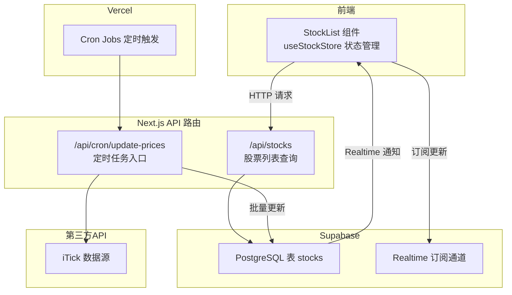
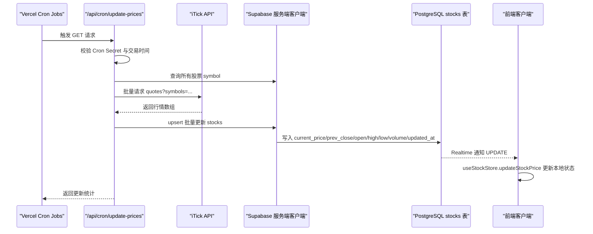
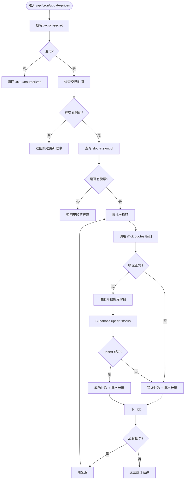
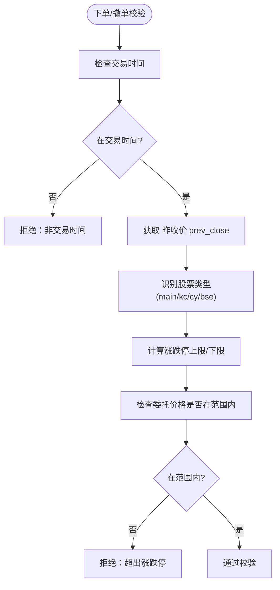
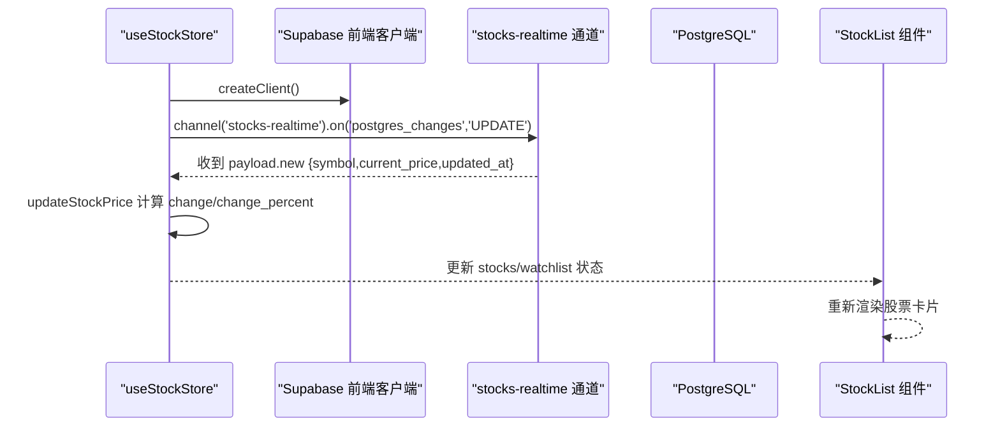
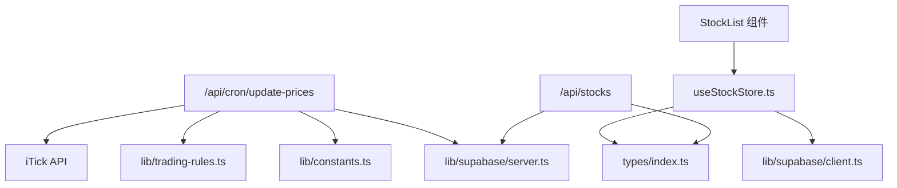

# 实时价格更新机制

<cite>
**本文档引用的文件**
- [app/api/cron/update-prices/route.ts](file://app/api/cron/update-prices/route.ts)
- [lib/constants.ts](file://lib/constants.ts)
- [lib/trading-rules.ts](file://lib/trading-rules.ts)
- [stores/useStockStore.ts](file://stores/useStockStore.ts)
- [lib/supabase/client.ts](file://lib/supabase/client.ts)
- [lib/supabase/server.ts](file://lib/supabase/server.ts)
- [app/api/stocks/route.ts](file://app/api/stocks/route.ts)
- [types/index.ts](file://types/index.ts)
- [components/stocks/StockList.tsx](file://components/stocks/StockList.tsx)
- [docs/环境变量清单.md](file://docs/环境变量清单.md)
- [docs/prd.md](file://docs/prd.md)
- [package.json](file://package.json)
</cite>

## 目录
1. [引言](#引言)
2. [项目结构](#项目结构)
3. [核心组件](#核心组件)
4. [架构总览](#架构总览)
5. [详细组件分析](#详细组件分析)
6. [依赖关系分析](#依赖关系分析)
7. [性能考虑](#性能考虑)
8. [故障排除指南](#故障排除指南)
9. [结论](#结论)

## 引言
本文件面向虚拟股票交易系统的实时价格更新机制，系统通过定时任务从第三方API（iTick）拉取A股实时行情，批量更新数据库，并借助Supabase Realtime实现前端的实时推送。本文将详细说明定时任务配置与执行逻辑、第三方API集成策略、价格更新数据流、价格计算规则、实时推送机制、性能优化与故障恢复方案。

## 项目结构
系统采用Next.js App Router + Supabase + Vercel架构，核心文件分布如下：
- 定时任务：`app/api/cron/update-prices/route.ts`
- 常量与规则：`lib/constants.ts`、`lib/trading-rules.ts`
- 前端状态与订阅：`stores/useStockStore.ts`、`lib/supabase/client.ts`
- 服务端Supabase客户端：`lib/supabase/server.ts`
- 股票列表API：`app/api/stocks/route.ts`
- 类型定义：`types/index.ts`
- 环境变量与PRD文档：`docs/环境变量清单.md`、`docs/prd.md`
- 依赖声明：`package.json`

**图表来源**
- [app/api/cron/update-prices/route.ts:1-150](file://app/api/cron/update-prices/route.ts#L1-L150)
- [stores/useStockStore.ts:125-150](file://stores/useStockStore.ts#L125-L150)
- [app/api/stocks/route.ts:1-69](file://app/api/stocks/route.ts#L1-L69)
- [lib/supabase/server.ts:1-35](file://lib/supabase/server.ts#L1-L35)
- [docs/prd.md:222-228](file://docs/prd.md#L222-L228)

**章节来源**
- [package.json:1-44](file://package.json#L1-L44)
- [docs/prd.md:183-208](file://docs/prd.md#L183-L208)

## 核心组件
- 定时任务路由：负责在交易时间内拉取iTick行情、分批更新数据库、返回统计信息。
- 常量与规则：定义交易时间、涨跌停比例、API批次大小、UI刷新间隔等。
- 前端状态与订阅：通过Supabase Realtime订阅stocks表的UPDATE事件，实时更新UI。
- Supabase客户端：区分服务端与前端客户端，确保正确的鉴权与上下文。
- 股票列表API：提供分页查询与涨跌幅计算，支撑前端展示。

**章节来源**
- [app/api/cron/update-prices/route.ts:10-149](file://app/api/cron/update-prices/route.ts#L10-L149)
- [lib/constants.ts:70-95](file://lib/constants.ts#L70-L95)
- [stores/useStockStore.ts:125-177](file://stores/useStockStore.ts#L125-L177)
- [lib/supabase/server.ts:9-34](file://lib/supabase/server.ts#L9-L34)
- [app/api/stocks/route.ts:6-68](file://app/api/stocks/route.ts#L6-L68)

## 架构总览
系统通过Vercel Cron Jobs定时触发`/api/cron/update-prices`，该路由在交易时间内调用iTick API获取批量行情，然后通过Supabase服务端客户端批量upsert到`stocks`表。由于Supabase开启Realtime，所有前端通过`useStockStore`订阅的客户端会收到UPDATE事件，从而实时刷新UI。

**图表来源**
- [app/api/cron/update-prices/route.ts:10-149](file://app/api/cron/update-prices/route.ts#L10-L149)
- [lib/supabase/server.ts:9-34](file://lib/supabase/server.ts#L9-L34)
- [stores/useStockStore.ts:125-177](file://stores/useStockStore.ts#L125-L177)
- [docs/prd.md:222-228](file://docs/prd.md#L222-L228)

## 详细组件分析

### 定时任务：/api/cron/update-prices
- 安全校验：若配置了`CRON_SECRET`，要求请求头携带`x-cron-secret`匹配环境变量。
- 交易时间检查：仅在交易时段执行，避免非交易时间的无效调用。
- 股票列表获取：查询`stocks`表的symbol并排序，作为待更新目标。
- 批量API调用：按`API_CONSTANTS.ITICK_BATCH_SIZE`分批请求iTick quotes接口，设置10秒超时与小延迟，降低请求压力。
- 数据映射与入库：将API返回的行情映射为数据库字段，使用upsert按symbol冲突更新，包含updated_at时间戳。
- 统计与返回：累计成功/失败数量与总股票数，返回JSON结果。

**图表来源**
- [app/api/cron/update-prices/route.ts:10-149](file://app/api/cron/update-prices/route.ts#L10-L149)
- [lib/constants.ts:77-79](file://lib/constants.ts#L77-L79)

**章节来源**
- [app/api/cron/update-prices/route.ts:10-149](file://app/api/cron/update-prices/route.ts#L10-L149)
- [lib/constants.ts:70-79](file://lib/constants.ts#L70-L79)

### 第三方API集成：iTick
- 认证方式：通过请求头`Authorization: Bearer ${ITICK_API_KEY}`传递API密钥。
- 请求地址：`ITICK_API_ENDPOINT`默认指向官方地址，可通过环境变量覆盖。
- 请求参数：`/v1/quotes?symbols=${batch.join(',')}`，批量查询多个symbol。
- 超时控制：设置10秒超时，避免长时间阻塞。
- 错误处理：对HTTP错误与无效响应进行日志记录与错误计数，保证任务继续执行其他批次。
- 请求频率限制：通过批次大小与短延迟控制请求速率，避免触发第三方限流。

**章节来源**
- [app/api/cron/update-prices/route.ts:62-86](file://app/api/cron/update-prices/route.ts#L62-L86)
- [docs/环境变量清单.md:34-51](file://docs/环境变量清单.md#L34-L51)

### 价格计算与涨跌停板
- 交易时间：A股工作日9:30-11:30、13:00-15:00，非交易时间跳过更新。
- 涨跌停板：主板10%，科创板/创业板20%，根据股票类型动态计算。
- 价格验证：下单与撤单前检查委托价格是否在涨跌停范围内。
- 涨跌幅计算：前端与后端均提供`change`与`change_percent`字段，便于展示。

**图表来源**
- [lib/trading-rules.ts:7-24](file://lib/trading-rules.ts#L7-L24)
- [lib/trading-rules.ts:62-86](file://lib/trading-rules.ts#L62-L86)

**章节来源**
- [lib/trading-rules.ts:7-24](file://lib/trading-rules.ts#L7-L24)
- [lib/trading-rules.ts:62-86](file://lib/trading-rules.ts#L62-L86)
- [lib/constants.ts:18-27](file://lib/constants.ts#L18-L27)

### 实时推送机制：Supabase Realtime
- 前端订阅：`useStockStore.subscribePrices`创建名为`stocks-realtime`的通道，监听`stocks`表的UPDATE事件。
- 过滤条件：可按symbol集合过滤，减少无关更新。
- 数据更新：收到UPDATE后，调用`updateStockPrice`计算`change`与`change_percent`，并更新`current_price`与`updated_at`。
- 连接管理：返回取消订阅函数，便于组件卸载时清理资源。

**图表来源**
- [stores/useStockStore.ts:125-177](file://stores/useStockStore.ts#L125-L177)
- [lib/supabase/client.ts:1-9](file://lib/supabase/client.ts#L1-L9)

**章节来源**
- [stores/useStockStore.ts:125-177](file://stores/useStockStore.ts#L125-L177)
- [lib/supabase/client.ts:1-9](file://lib/supabase/client.ts#L1-L9)

### 数据流：从API到数据库再到前端
- API层：`/api/stocks`提供分页查询，计算涨跌幅，支撑列表展示。
- 数据层：定时任务批量upsert到`stocks`表，包含`current_price`、`prev_close`、`open`、`high`、`low`、`volume`、`updated_at`。
- 前端层：通过Supabase Realtime订阅UPDATE事件，本地状态更新后驱动UI刷新。

**图表来源**
- [app/api/stocks/route.ts:22-53](file://app/api/stocks/route.ts#L22-L53)
- [app/api/cron/update-prices/route.ts:108-121](file://app/api/cron/update-prices/route.ts#L108-L121)
- [stores/useStockStore.ts:125-177](file://stores/useStockStore.ts#L125-L177)

**章节来源**
- [app/api/stocks/route.ts:22-53](file://app/api/stocks/route.ts#L22-L53)
- [app/api/cron/update-prices/route.ts:108-121](file://app/api/cron/update-prices/route.ts#L108-L121)
- [types/index.ts:11-25](file://types/index.ts#L11-L25)

### Vercel Cron Jobs配置与调度策略
- 触发频率：PRD文档明确每30秒触发一次`/api/cron/update-prices`。
- 安全策略：建议在Vercel环境变量中配置`CRON_SECRET`，并在路由中校验请求头`x-cron-secret`。
- 交易时间策略：路由内已内置交易时间检查，非交易时间直接跳过，避免浪费资源。
- 监控与告警：建议结合Vercel日志与Sentry（可选）进行异常监控与告警。

**章节来源**
- [docs/prd.md:222-228](file://docs/prd.md#L222-L228)
- [docs/环境变量清单.md:54-64](file://docs/环境变量清单.md#L54-L64)
- [app/api/cron/update-prices/route.ts:12-27](file://app/api/cron/update-prices/route.ts#L12-L27)

## 依赖关系分析
- 组件耦合：
  - 定时任务依赖Supabase服务端客户端与iTick API。
  - 前端依赖Supabase前端客户端与Realtime通道。
  - 股票列表API依赖Supabase查询与类型定义。
- 外部依赖：
  - Supabase：数据库、Auth、Realtime。
  - iTick：第三方行情数据源。
  - Vercel：定时任务调度平台。

**图表来源**
- [app/api/cron/update-prices/route.ts:1-8](file://app/api/cron/update-prices/route.ts#L1-L8)
- [stores/useStockStore.ts:1-5](file://stores/useStockStore.ts#L1-L5)
- [app/api/stocks/route.ts:1-4](file://app/api/stocks/route.ts#L1-L4)

**章节来源**
- [lib/constants.ts:1-101](file://lib/constants.ts#L1-L101)
- [lib/trading-rules.ts:1-272](file://lib/trading-rules.ts#L1-L272)
- [stores/useStockStore.ts:1-21](file://stores/useStockStore.ts#L1-L21)
- [app/api/stocks/route.ts:1-6](file://app/api/stocks/route.ts#L1-L6)

## 性能考虑
- 批量更新：按批次大小（默认50）分批请求与写入，降低单次负载与超时风险。
- 请求节流：批次间添加短延迟，避免触发第三方API限流。
- 数据库写入：使用upsert按symbol冲突更新，减少重复写入开销。
- 前端渲染：列表组件使用骨架屏与分页，提升大列表渲染体验。
- UI刷新间隔：UI常量定义30秒刷新间隔，平衡实时性与性能。

**章节来源**
- [lib/constants.ts:77-79](file://lib/constants.ts#L77-L79)
- [app/api/cron/update-prices/route.ts:127-131](file://app/api/cron/update-prices/route.ts#L127-L131)
- [components/stocks/StockList.tsx:77-98](file://components/stocks/StockList.tsx#L77-L98)
- [lib/constants.ts:94](file://lib/constants.ts#L94)

## 故障排除指南
- 定时任务未执行：
  - 检查Vercel Cron Jobs配置与`CRON_SECRET`是否正确。
  - 确认路由中`x-cron-secret`请求头与环境变量一致。
- 非交易时间跳过更新：
  - 确认`isTradingHour()`逻辑与系统时区一致。
- API调用失败：
  - 检查`ITICK_API_KEY`与`ITICK_API_ENDPOINT`配置。
  - 查看10秒超时设置是否合理，必要时调整。
- 数据库写入错误：
  - 检查Supabase服务端客户端初始化与权限。
  - 确认`stocks`表字段与upsert映射一致。
- 前端未收到实时更新：
  - 检查Supabase Realtime通道名称与过滤条件。
  - 确认订阅函数返回的取消订阅逻辑在组件卸载时调用。

**章节来源**
- [app/api/cron/update-prices/route.ts:12-27](file://app/api/cron/update-prices/route.ts#L12-L27)
- [lib/trading-rules.ts:7-24](file://lib/trading-rules.ts#L7-L24)
- [docs/环境变量清单.md:34-51](file://docs/环境变量清单.md#L34-L51)
- [lib/supabase/server.ts:9-34](file://lib/supabase/server.ts#L9-L34)
- [stores/useStockStore.ts:125-150](file://stores/useStockStore.ts#L125-L150)

## 结论
本系统通过Vercel Cron Jobs与Supabase Realtime实现了高效的实时价格更新机制：定时任务在交易时间内批量拉取iTick行情并更新数据库，前端通过Realtime订阅实现即时UI刷新。配合交易时间检查、涨跌停限制与合理的批次与延迟策略，系统在保证实时性的同时兼顾了性能与稳定性。建议在生产环境中完善监控告警与容错机制，持续优化第三方API的调用策略与数据库索引设计。