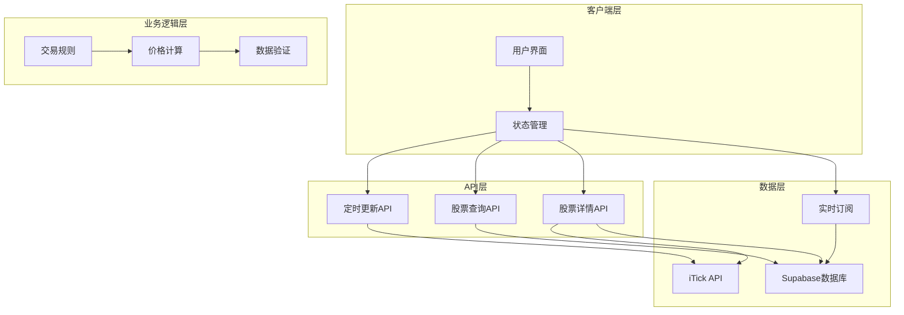
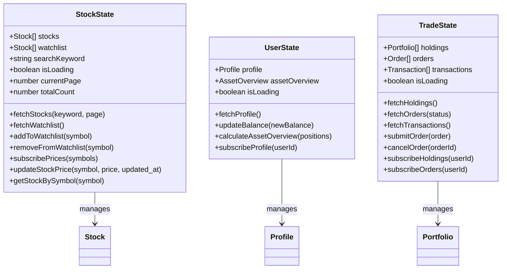
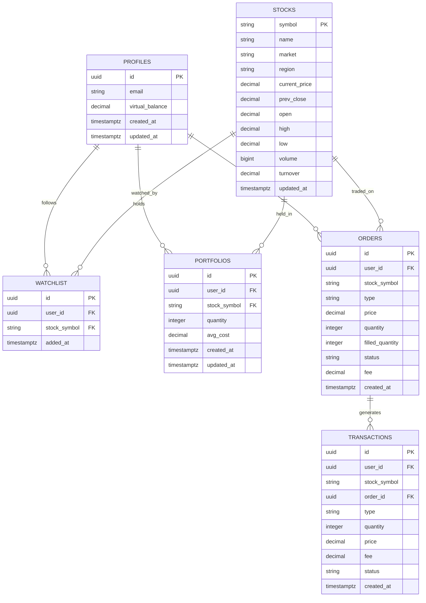
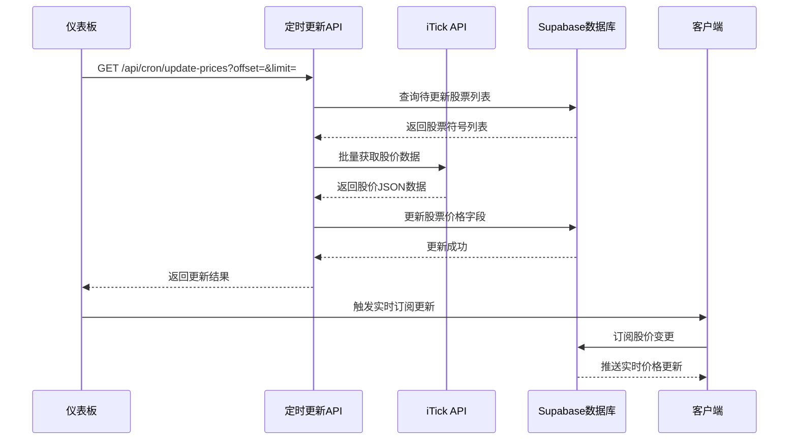
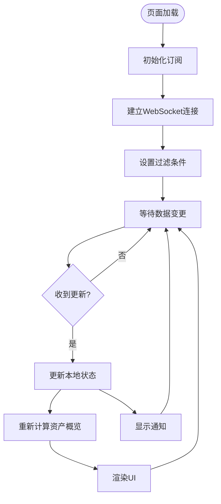
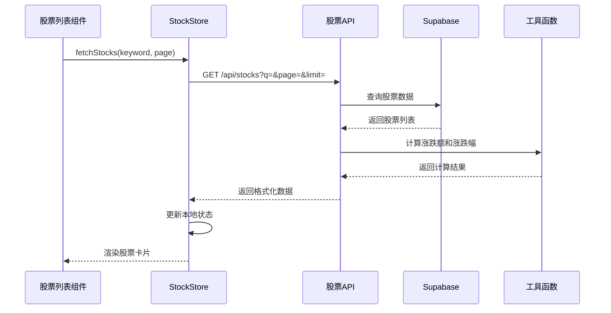
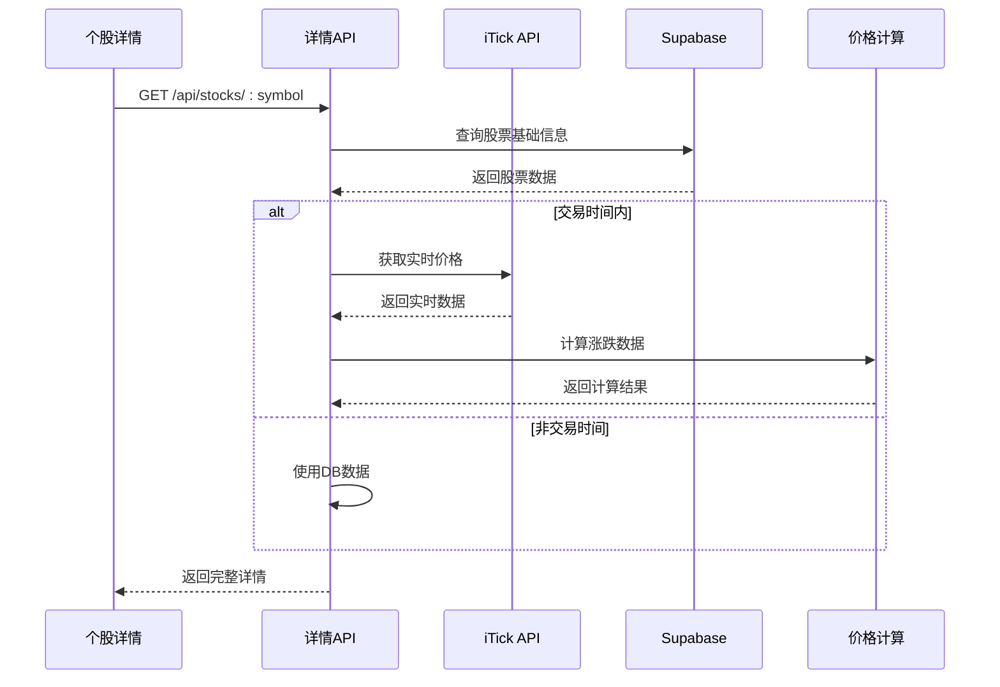
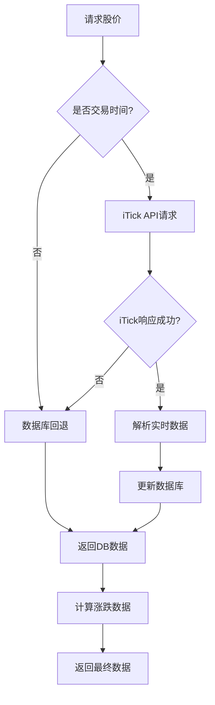
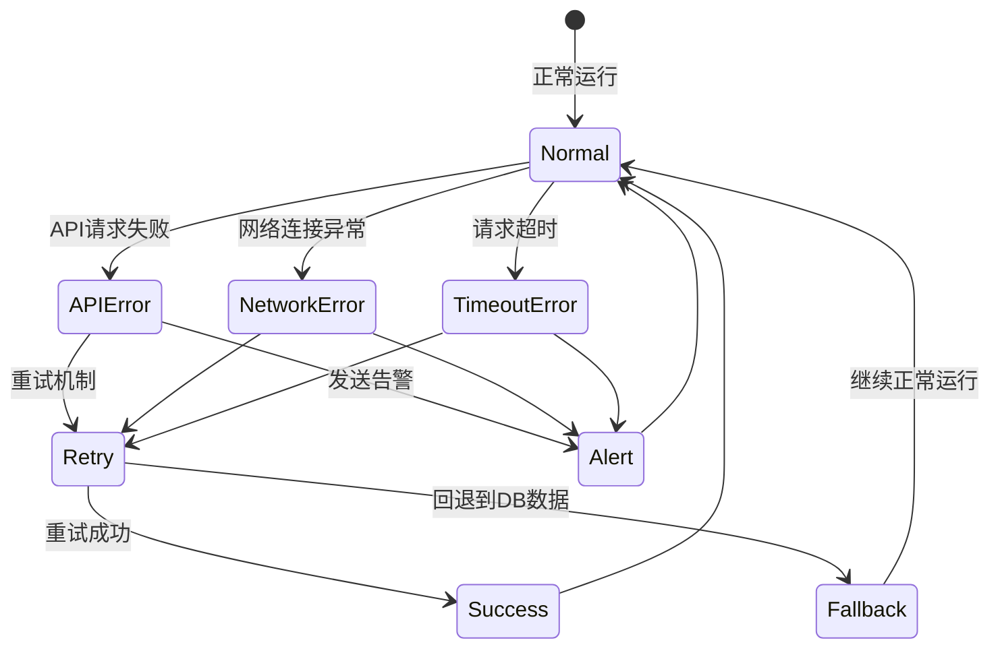
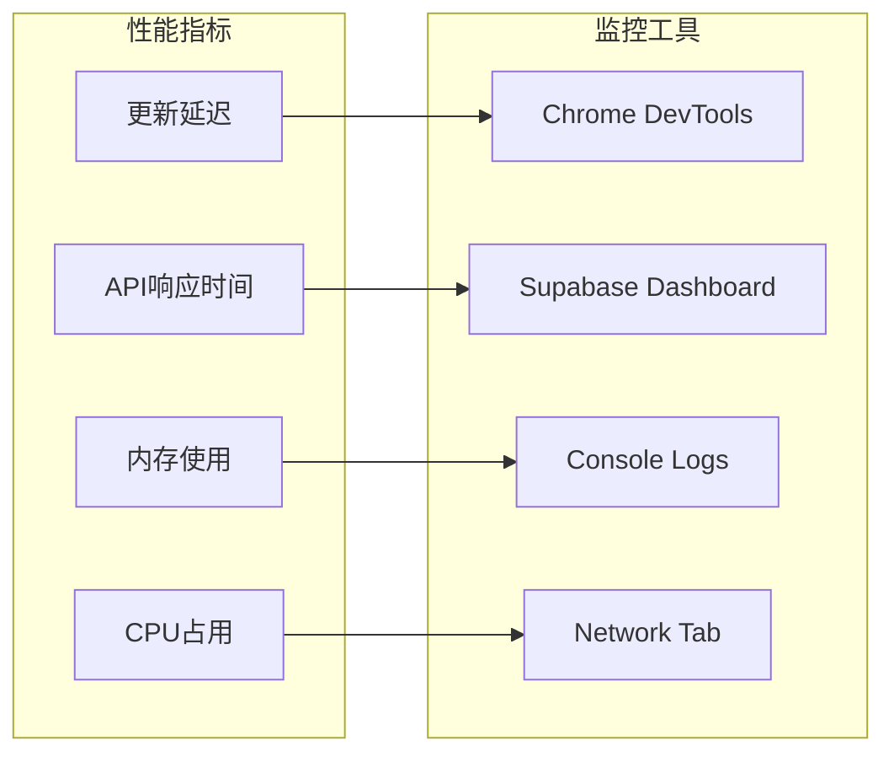

# 增强的实时价格更新机制

<cite>
**本文档引用的文件**
- [app/api/cron/update-prices/route.ts](file://app/api/cron/update-prices/route.ts)
- [stores/useStockStore.ts](file://stores/useStockStore.ts)
- [lib/constants.ts](file://lib/constants.ts)
- [app/api/stocks/route.ts](file://app/api/stocks/route.ts)
- [app/api/stocks/[symbol]/route.ts](file://app/api/stocks/[symbol]/route.ts)
- [lib/trading-rules.ts](file://lib/trading-rules.ts)
- [components/stocks/StockList.tsx](file://components/stocks/StockList.tsx)
- [components/stocks/StockCard.tsx](file://components/stocks/StockCard.tsx)
- [supabase/schema.sql](file://supabase/schema.sql)
- [app/(dashboard)/layout.tsx](file://app/(dashboard)/layout.tsx)
- [types/index.ts](file://types/index.ts)
- [lib/utils.ts](file://lib/utils.ts)
- [components/portfolio/PositionList.tsx](file://components/portfolio/PositionList.tsx)
- [stores/useUserStore.ts](file://stores/useUserStore.ts)
- [stores/useTradeStore.ts](file://stores/useTradeStore.ts)
</cite>

## 目录
1. [项目概述](#项目概述)
2. [系统架构](#系统架构)
3. [核心组件分析](#核心组件分析)
4. [实时价格更新机制](#实时价格更新机制)
5. [数据流分析](#数据流分析)
6. [性能优化策略](#性能优化策略)
7. [故障处理机制](#故障处理机制)
8. [监控与调试](#监控与调试)
9. [总结](#总结)

## 项目概述

这是一个基于Next.js构建的虚拟股票交易系统，采用实时价格更新机制来模拟真实的股票市场行情。系统通过Supabase提供实时数据订阅，结合定时任务实现价格数据的持续更新。

## 系统架构

**图表来源**
- [app/(dashboard)/layout.tsx:76-97](file://app/(dashboard)/layout.tsx#L76-L97)
- [stores/useStockStore.ts:125-150](file://stores/useStockStore.ts#L125-L150)
- [app/api/cron/update-prices/route.ts:52-174](file://app/api/cron/update-prices/route.ts#L52-L174)

## 核心组件分析

### 状态管理系统

系统采用Zustand作为状态管理工具，主要包含以下存储：

**图表来源**
- [stores/useStockStore.ts:6-21](file://stores/useStockStore.ts#L6-L21)
- [stores/useUserStore.ts:5-13](file://stores/useUserStore.ts#L5-L13)
- [stores/useTradeStore.ts:6-25](file://stores/useTradeStore.ts#L6-L25)

### 数据模型设计

**图表来源**
- [supabase/schema.sql:32-107](file://supabase/schema.sql#L32-L107)
- [types/index.ts:11-89](file://types/index.ts#L11-L89)

**章节来源**
- [stores/useStockStore.ts:1-184](file://stores/useStockStore.ts#L1-L184)
- [stores/useUserStore.ts:1-107](file://stores/useUserStore.ts#L1-L107)
- [stores/useTradeStore.ts:1-192](file://stores/useTradeStore.ts#L1-L192)
- [types/index.ts:1-166](file://types/index.ts#L1-L166)

## 实时价格更新机制

### 定时更新流程

系统采用分批轮询的方式实现价格更新，避免一次性请求过多股票导致API限流：

**图表来源**
- [app/(dashboard)/layout.tsx:77-88](file://app/(dashboard)/layout.tsx#L77-L88)
- [app/api/cron/update-prices/route.ts:102-151](file://app/api/cron/update-prices/route.ts#L102-L151)

### 实时订阅机制

系统使用Supabase的Realtime功能实现双向数据同步：

**图表来源**
- [stores/useStockStore.ts:125-150](file://stores/useStockStore.ts#L125-L150)
- [app/(dashboard)/layout.tsx:70-75](file://app/(dashboard)/layout.tsx#L70-L75)

**章节来源**
- [app/api/cron/update-prices/route.ts:1-175](file://app/api/cron/update-prices/route.ts#L1-L175)
- [app/(dashboard)/layout.tsx:76-97](file://app/(dashboard)/layout.tsx#L76-L97)
- [stores/useStockStore.ts:125-177](file://stores/useStockStore.ts#L125-L177)

## 数据流分析

### 股票列表数据流

**图表来源**
- [components/stocks/StockList.tsx:36-57](file://components/stocks/StockList.tsx#L36-L57)
- [stores/useStockStore.ts:33-57](file://stores/useStockStore.ts#L33-L57)
- [app/api/stocks/route.ts:6-68](file://app/api/stocks/route.ts#L6-L68)

### 个股详情数据流

**图表来源**
- [app/api/stocks/[symbol]/route.ts:8-70](file://app/api/stocks/[symbol]/route.ts#L8-L70)

**章节来源**
- [components/stocks/StockList.tsx:1-136](file://components/stocks/StockList.tsx#L1-L136)
- [components/stocks/StockCard.tsx:1-150](file://components/stocks/StockCard.tsx#L1-L150)
- [app/api/stocks/route.ts:1-69](file://app/api/stocks/route.ts#L1-L69)
- [app/api/stocks/[symbol]/route.ts:1-71](file://app/api/stocks/[symbol]/route.ts#L1-L71)

## 性能优化策略

### 分批更新策略

系统采用分批更新机制，每次只更新3只股票，避免API限流：

- **批次大小限制**：每次最多3只股票
- **轮询更新**：通过offset参数实现循环更新
- **市场分组**：按沪市(SH)和深市(SZ)分别请求
- **延迟控制**：不同市场间添加2秒延迟

### 缓存与降级机制

**图表来源**
- [app/api/stocks/[symbol]/route.ts:27-55](file://app/api/stocks/[symbol]/route.ts#L27-L55)

### 内存管理优化

- **状态清理**：组件卸载时自动取消订阅
- **批量更新**：使用Promise.all并行处理多个股票更新
- **防抖处理**：搜索功能使用防抖减少请求频率

**章节来源**
- [lib/constants.ts:70-95](file://lib/constants.ts#L70-L95)
- [lib/trading-rules.ts:7-24](file://lib/trading-rules.ts#L7-L24)
- [app/api/cron/update-prices/route.ts:66-68](file://app/api/cron/update-prices/route.ts#L66-L68)

## 故障处理机制

### 错误恢复策略

系统实现了多层次的错误处理和恢复机制：

### 监控指标

- **更新成功率**：计算批次更新的成功率
- **错误计数**：跟踪API调用错误次数
- **响应时间**：监控各API的响应延迟
- **订阅状态**：检查实时订阅连接状态

**章节来源**
- [app/api/cron/update-prices/route.ts:170-174](file://app/api/cron/update-prices/route.ts#L170-L174)
- [stores/useStockStore.ts:149-150](file://stores/useStockStore.ts#L149-L150)

## 监控与调试

### 开发者工具

系统提供了丰富的开发和调试工具：

- **状态检查**：通过浏览器开发者工具查看Zustand状态
- **网络监控**：监控API请求和响应
- **实时日志**：查看WebSocket连接状态
- **错误追踪**：捕获和报告系统异常

### 性能监控

## 总结

该虚拟股票交易系统通过精心设计的实时价格更新机制，实现了接近真实市场的股票行情展示。系统的核心优势包括：

1. **可靠的实时性**：通过Supabase Realtime和定时任务双重保障
2. **高可用性**：多层降级机制确保服务稳定性
3. **高性能**：分批更新和缓存策略优化用户体验
4. **可观测性**：完善的监控和调试工具支持系统维护

该机制为用户提供了一个流畅、准确的虚拟股票交易体验，同时为后续的功能扩展奠定了坚实的技术基础。