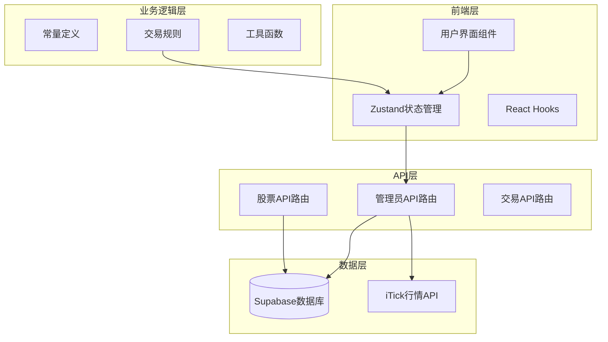
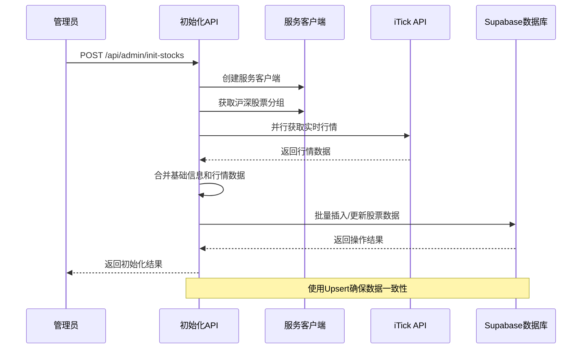
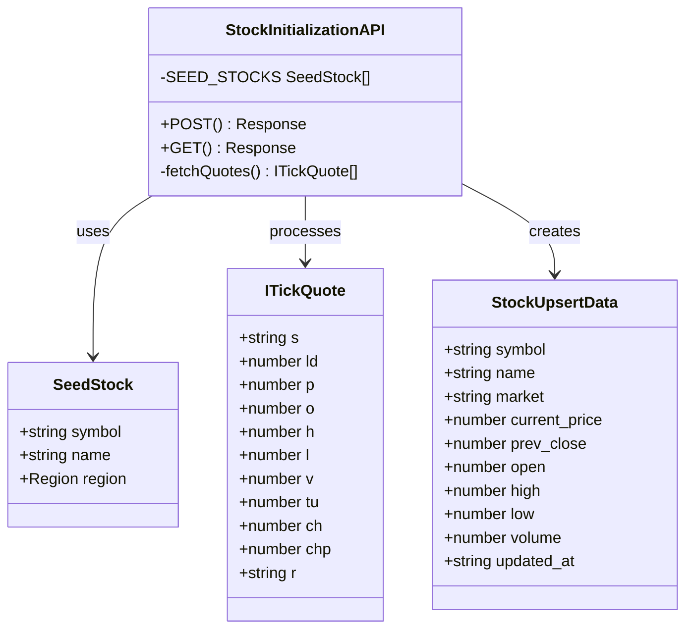
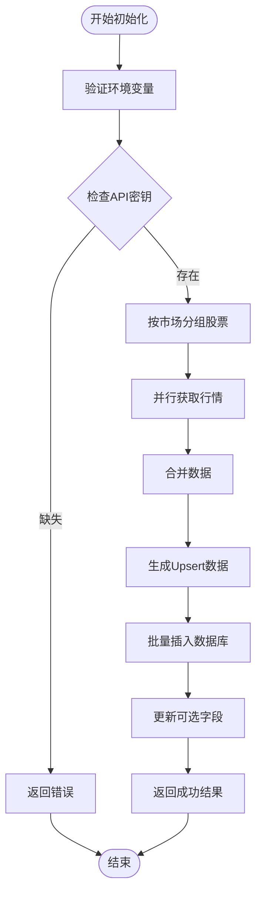
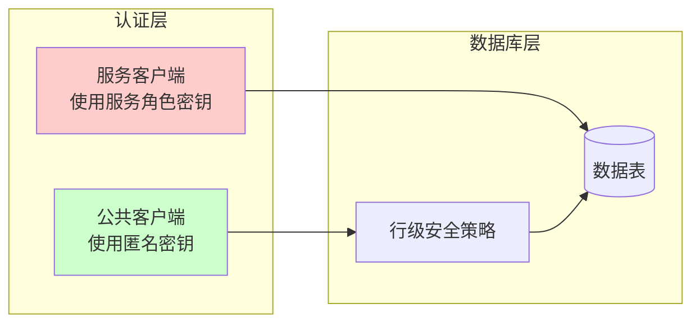
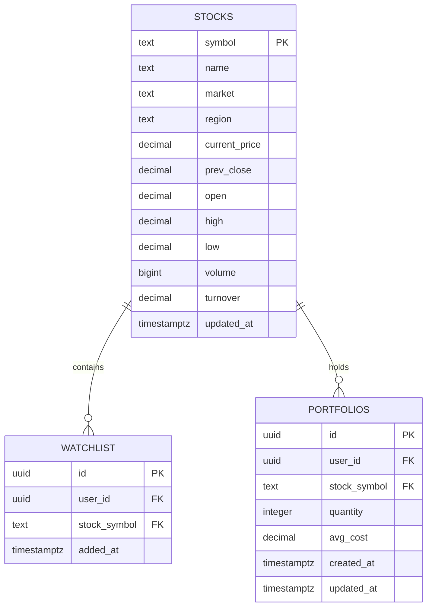
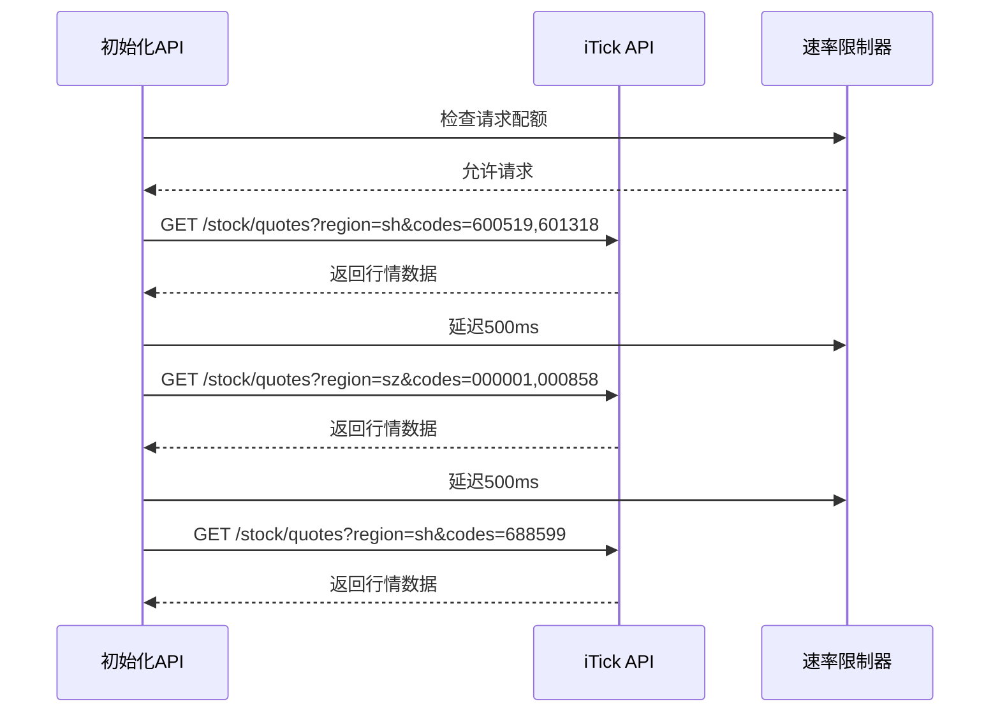
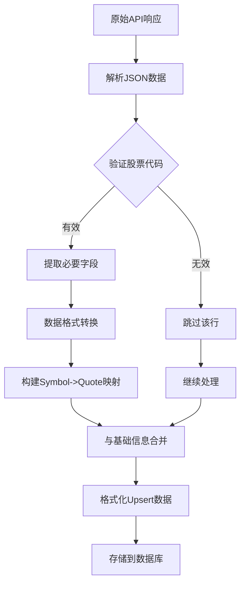
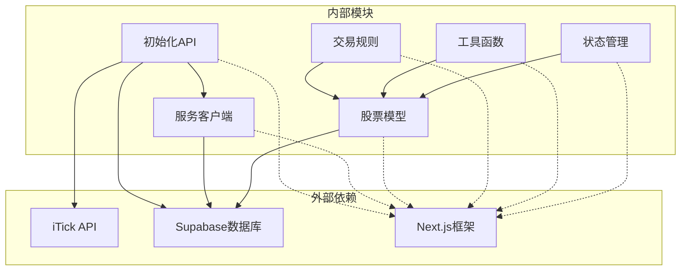

# 管理员股票初始化

<cite>
**本文档引用的文件**
- [app/api/admin/init-stocks/route.ts](file://app/api/admin/init-stocks/route.ts)
- [lib/supabase/service.ts](file://lib/supabase/service.ts)
- [supabase/schema.sql](file://supabase/schema.sql)
- [lib/constants.ts](file://lib/constants.ts)
- [lib/trading-rules.ts](file://lib/trading-rules.ts)
- [stores/useStockStore.ts](file://stores/useStockStore.ts)
- [types/index.ts](file://types/index.ts)
- [app/api/stocks/route.ts](file://app/api/stocks/route.ts)
- [components/stocks/StockList.tsx](file://components/stocks/StockList.tsx)
- [lib/utils.ts](file://lib/utils.ts)
- [package.json](file://package.json)
</cite>

## 目录
1. [简介](#简介)
2. [项目结构](#项目结构)
3. [核心组件](#核心组件)
4. [架构概览](#架构概览)
5. [详细组件分析](#详细组件分析)
6. [依赖关系分析](#依赖关系分析)
7. [性能考虑](#性能考虑)
8. [故障排除指南](#故障排除指南)
9. [结论](#结论)

## 简介

管理员股票初始化功能是虚拟股票交易系统中的关键组件，负责为系统提供初始的股票数据。该功能通过调用第三方行情API获取实时股价数据，并将其存储到Supabase数据库中，为后续的股票交易、监控和分析提供基础数据支持。

该功能具有以下特点：
- 支持沪深两市主要股票的批量初始化
- 集成实时行情数据获取和处理
- 提供完整的错误处理和重试机制
- 支持增量更新和数据一致性保证

## 项目结构

虚拟股票交易系统采用现代化的Next.js架构，主要分为以下几个层次：

**图表来源**
- [app/api/admin/init-stocks/route.ts:1-205](file://app/api/admin/init-stocks/route.ts#L1-L205)
- [stores/useStockStore.ts:1-184](file://stores/useStockStore.ts#L1-L184)
- [supabase/schema.sql:1-152](file://supabase/schema.sql#L1-L152)

**章节来源**
- [app/api/admin/init-stocks/route.ts:1-205](file://app/api/admin/init-stocks/route.ts#L1-L205)
- [stores/useStockStore.ts:1-184](file://stores/useStockStore.ts#L1-L184)
- [supabase/schema.sql:1-152](file://supabase/schema.sql#L1-L152)

## 核心组件

管理员股票初始化功能的核心组件包括：

### 1. 初始化API路由
负责处理股票数据的批量初始化请求，包括数据获取、处理和存储。

### 2. Supabase服务客户端
提供安全的数据库连接，使用服务角色密钥绕过行级安全策略。

### 3. 股票数据模型
定义股票数据的结构和验证规则，确保数据的一致性和完整性。

### 4. 行情API集成
与第三方行情提供商API集成，获取实时股票价格数据。

**章节来源**
- [app/api/admin/init-stocks/route.ts:1-205](file://app/api/admin/init-stocks/route.ts#L1-L205)
- [lib/supabase/service.ts:1-22](file://lib/supabase/service.ts#L1-L22)
- [types/index.ts:10-25](file://types/index.ts#L10-L25)

## 架构概览

管理员股票初始化功能采用分层架构设计，确保了系统的可维护性和扩展性：

**图表来源**
- [app/api/admin/init-stocks/route.ts:112-185](file://app/api/admin/init-stocks/route.ts#L112-L185)
- [lib/supabase/service.ts:7-21](file://lib/supabase/service.ts#L7-L21)

该架构的主要优势：
- **异步处理**：支持并发请求处理
- **错误隔离**：单个股票失败不影响整体流程
- **数据一致性**：使用Upsert操作保证数据完整性
- **可扩展性**：模块化设计便于功能扩展

## 详细组件分析

### 初始化API路由组件

初始化API路由是整个功能的核心，负责协调各个组件完成股票数据的初始化。

#### 数据结构定义

**图表来源**
- [app/api/admin/init-stocks/route.ts:9-69](file://app/api/admin/init-stocks/route.ts#L9-L69)
- [app/api/admin/init-stocks/route.ts:135-149](file://app/api/admin/init-stocks/route.ts#L135-L149)

#### 处理流程分析

**图表来源**
- [app/api/admin/init-stocks/route.ts:112-185](file://app/api/admin/init-stocks/route.ts#L112-L185)

#### 错误处理机制

初始化过程包含多层次的错误处理：

1. **环境变量检查**：确保必要的配置存在
2. **API调用容错**：单个股票请求失败不影响整体
3. **数据库操作保护**：使用事务确保数据一致性
4. **回退机制**：可选字段更新失败时继续执行

**章节来源**
- [app/api/admin/init-stocks/route.ts:112-185](file://app/api/admin/init-stocks/route.ts#L112-L185)

### Supabase服务客户端

服务客户端提供了安全的数据库访问方式，使用服务角色密钥绕过行级安全策略。

#### 安全架构

**图表来源**
- [lib/supabase/service.ts:7-21](file://lib/supabase/service.ts#L7-L21)
- [supabase/schema.sql:120-122](file://supabase/schema.sql#L120-L122)

#### 配置要求

服务客户端需要以下环境变量：
- `NEXT_PUBLIC_SUPABASE_URL`: Supabase项目URL
- `SUPABASE_SERVICE_ROLE_KEY`: 服务角色密钥

**章节来源**
- [lib/supabase/service.ts:1-22](file://lib/supabase/service.ts#L1-L22)

### 股票数据模型

股票数据模型定义了系统中股票信息的结构和约束条件。

#### 数据模型设计

**图表来源**
- [supabase/schema.sql:32-45](file://supabase/schema.sql#L32-L45)
- [types/index.ts:10-25](file://types/index.ts#L10-L25)

#### 字段约束说明

| 字段名 | 类型 | 约束 | 描述 |
|--------|------|------|------|
| symbol | text | 主键 | 股票代码 |
| name | text | 非空 | 股票名称 |
| market | text | 枚举('A','HK','US') | 市场类型 |
| region | text | 枚举('SH','SZ') | 交易所区域 |
| current_price | decimal | 非空 | 当前价格 |
| prev_close | decimal | 非空 | 昨收价 |
| open | decimal | 非空 | 开盘价 |
| high | decimal | 非空 | 最高价 |
| low | decimal | 非空 | 最低价 |
| volume | bigint | 非空 | 成交量 |
| turnover | decimal | 非空 | 成交额 |
| updated_at | timestamptz | 非空 | 更新时间 |

**章节来源**
- [supabase/schema.sql:32-45](file://supabase/schema.sql#L32-L45)
- [types/index.ts:10-25](file://types/index.ts#L10-L25)

### 行情API集成

系统集成了iTick实时行情API，提供高质量的股票数据。

#### API调用策略

**图表来源**
- [app/api/admin/init-stocks/route.ts:85-108](file://app/api/admin/init-stocks/route.ts#L85-L108)

#### 数据处理流程

**图表来源**
- [app/api/admin/init-stocks/route.ts:130-149](file://app/api/admin/init-stocks/route.ts#L130-L149)

**章节来源**
- [app/api/admin/init-stocks/route.ts:85-108](file://app/api/admin/init-stocks/route.ts#L85-L108)
- [app/api/admin/init-stocks/route.ts:130-149](file://app/api/admin/init-stocks/route.ts#L130-L149)

## 依赖关系分析

系统各组件之间的依赖关系如下：

**图表来源**
- [app/api/admin/init-stocks/route.ts:1-2](file://app/api/admin/init-stocks/route.ts#L1-L2)
- [lib/supabase/service.ts](file://lib/supabase/service.ts#L1)
- [stores/useStockStore.ts](file://stores/useStockStore.ts#L1)

### 核心依赖关系

1. **API依赖**：初始化API依赖于服务客户端和iTick API
2. **数据依赖**：服务客户端依赖于Supabase数据库
3. **业务依赖**：交易规则依赖于股票模型
4. **UI依赖**：状态管理依赖于股票模型

**章节来源**
- [package.json:9-28](file://package.json#L9-L28)

## 性能考虑

管理员股票初始化功能在设计时充分考虑了性能优化：

### 1. 并行处理优化
- 使用Promise.all实现并行API调用
- 分批处理股票数据，避免单次请求过大
- 实现请求延迟以遵守API速率限制

### 2. 数据库优化
- 使用Upsert操作减少重复查询
- 批量插入提升写入性能
- 合理的数据类型选择优化存储空间

### 3. 内存管理
- 流式处理大量数据
- 及时释放临时对象
- 控制并发数量避免内存溢出

### 4. 缓存策略
- 利用Supabase实时订阅功能
- 减少不必要的数据库查询
- 优化网络请求频率

## 故障排除指南

### 常见问题及解决方案

#### 1. API密钥配置错误
**问题症状**：初始化失败，返回API密钥相关的错误
**解决方法**：
- 检查`ITICK_API_KEY`环境变量设置
- 验证API密钥的有效性和权限
- 确认API服务正常运行

#### 2. 数据库连接失败
**问题症状**：无法连接到Supabase数据库
**解决方法**：
- 检查`NEXT_PUBLIC_SUPABASE_URL`和`SUPABASE_SERVICE_ROLE_KEY`
- 验证数据库服务状态
- 确认网络连接正常

#### 3. 股票数据获取超时
**问题症状**：部分股票数据获取超时
**解决方法**：
- 检查网络连接稳定性
- 调整超时时间设置
- 重新执行初始化操作

#### 4. 数据库约束冲突
**问题症状**：插入数据时出现约束冲突错误
**解决方法**：
- 检查股票代码的唯一性
- 验证数据格式的正确性
- 清理历史数据后重试

**章节来源**
- [app/api/admin/init-stocks/route.ts:155-158](file://app/api/admin/init-stocks/route.ts#L155-L158)
- [app/api/admin/init-stocks/route.ts:169-171](file://app/api/admin/init-stocks/route.ts#L169-L171)

### 调试技巧

1. **启用详细日志**：在开发环境中启用详细的错误日志
2. **分步调试**：将初始化过程分解为多个步骤分别测试
3. **数据验证**：检查每个环节的数据格式和内容
4. **性能监控**：监控API调用时间和数据库操作耗时

## 结论

管理员股票初始化功能是虚拟股票交易系统的重要基础设施，它通过以下方式为整个系统奠定基础：

### 主要成就
- **完整的数据初始化**：为系统提供初始的股票数据基础
- **高可靠性的数据处理**：通过多层错误处理确保数据质量
- **高效的性能表现**：采用并行处理和批量操作优化性能
- **良好的扩展性**：模块化设计便于功能扩展和维护

### 技术亮点
- **异步架构设计**：充分利用现代JavaScript的异步特性
- **错误容错机制**：单点故障不影响整体系统运行
- **数据一致性保证**：使用Upsert操作确保数据完整性
- **安全的数据库访问**：通过服务角色密钥实现安全的数据操作

### 未来改进方向
- **监控和告警**：增加更完善的监控和告警机制
- **数据验证增强**：增加更严格的数据验证规则
- **缓存策略优化**：实现更智能的数据缓存策略
- **性能基准测试**：建立性能基准测试体系

该功能的成功实施为虚拟股票交易系统的稳定运行提供了坚实的基础，也为后续的功能扩展和优化奠定了良好的技术基础。