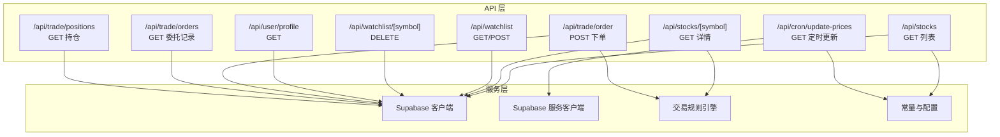
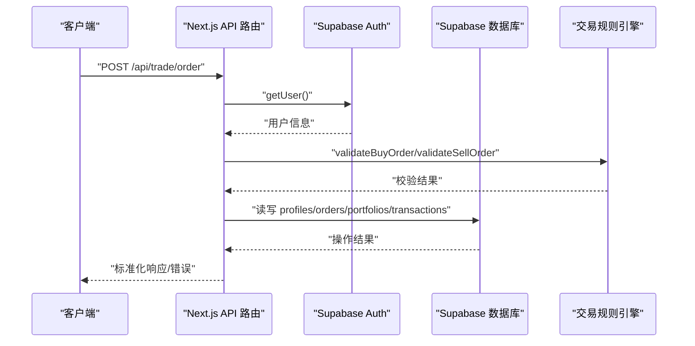
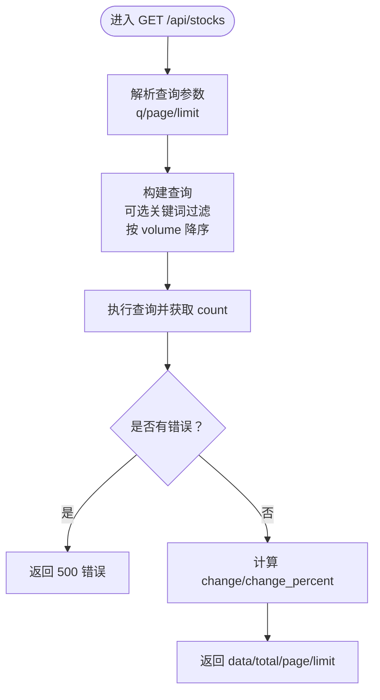
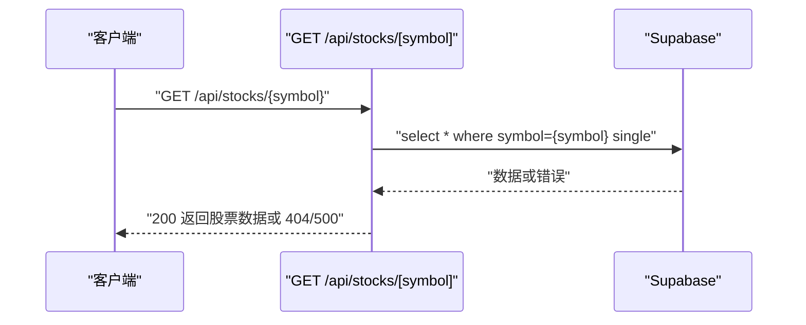
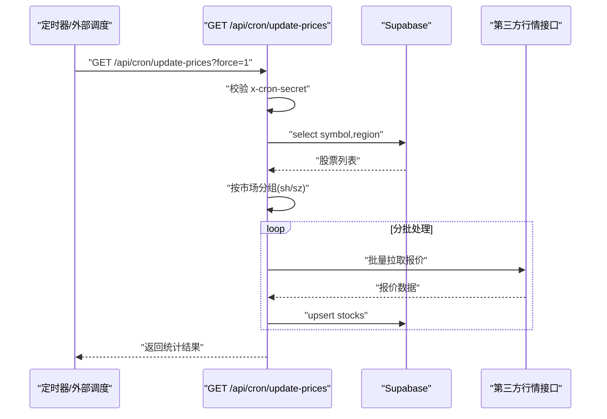
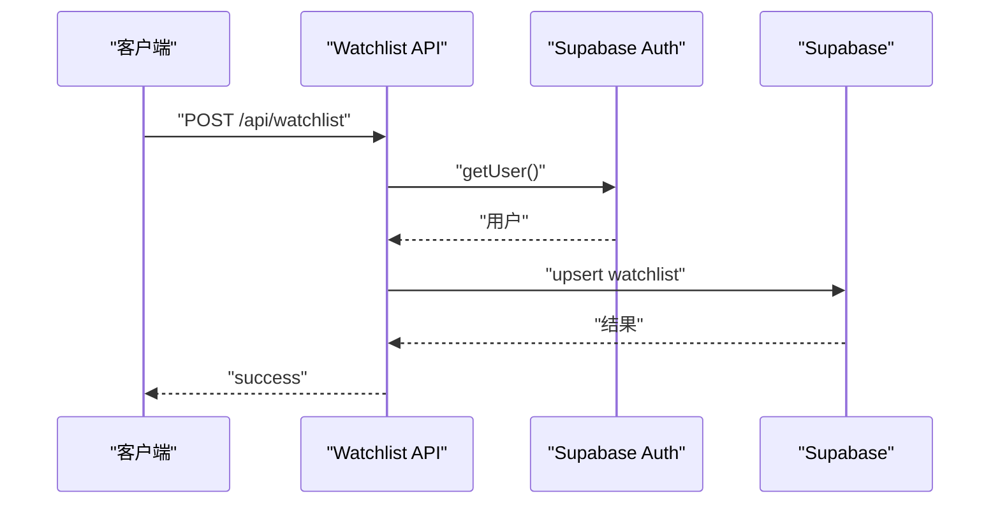
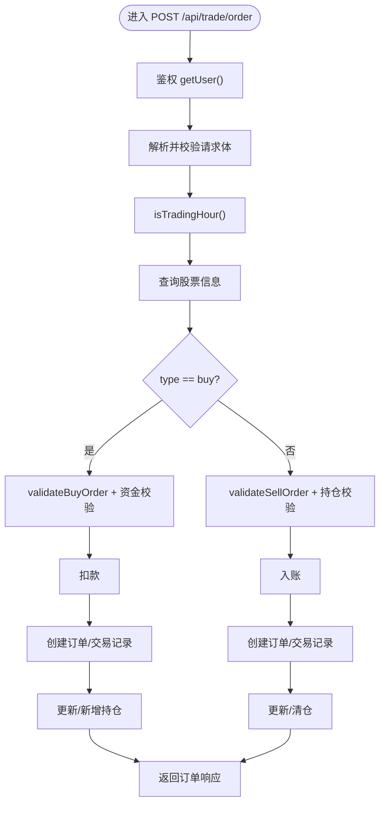
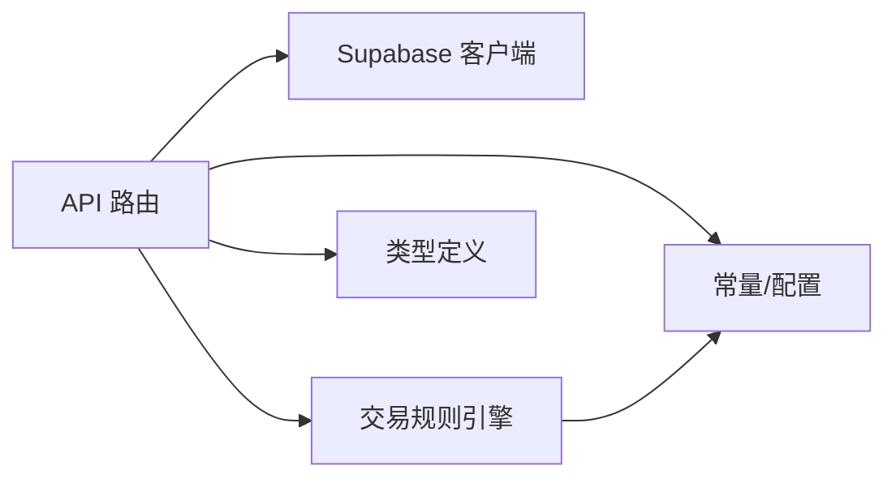

# 股票API集成

<cite>
**本文引用的文件**
- [app/api/stocks/route.ts](file://app/api/stocks/route.ts)
- [app/api/stocks/[symbol]/route.ts](file://app/api/stocks/[symbol]/route.ts)
- [app/api/cron/update-prices/route.ts](file://app/api/cron/update-prices/route.ts)
- [app/api/watchlist/route.ts](file://app/api/watchlist/route.ts)
- [app/api/watchlist/[symbol]/route.ts](file://app/api/watchlist/[symbol]/route.ts)
- [app/api/user/profile/route.ts](file://app/api/user/profile/route.ts)
- [app/api/trade/order/route.ts](file://app/api/trade/order/route.ts)
- [app/api/trade/orders/route.ts](file://app/api/trade/orders/route.ts)
- [app/api/trade/positions/route.ts](file://app/api/trade/positions/route.ts)
- [lib/constants.ts](file://lib/constants.ts)
- [lib/trading-rules.ts](file://lib/trading-rules.ts)
- [types/index.ts](file://types/index.ts)
- [docs/API接口规范.md](file://docs/API接口规范.md)
- [package.json](file://package.json)
</cite>

## 目录
1. [简介](#简介)
2. [项目结构](#项目结构)
3. [核心组件](#核心组件)
4. [架构总览](#架构总览)
5. [详细组件分析](#详细组件分析)
6. [依赖关系分析](#依赖关系分析)
7. [性能考虑](#性能考虑)
8. [故障排查指南](#故障排查指南)
9. [结论](#结论)
10. [附录](#附录)

## 简介
本文件面向虚拟股票交易系统的RESTful API集成，围绕外部数据源对接与内部业务流程，系统性阐述以下主题：
- RESTful API 设计原则与端点规范
- 关键端点实现：GET /api/stocks、POST /api/cron/update-prices
- 请求参数解析、校验与数据类型转换
- 响应格式化、错误封装与元数据
- 安全机制（鉴权、权限、速率限制）
- 错误处理策略与版本管理
- 测试指南（单元、集成、性能）
- 监控与日志记录方案

## 项目结构
Next.js App Router 路由组织清晰，API 路由位于 app/api 下，采用文件系统路由命名与导出函数方式实现 HTTP 方法处理。核心模块包括：
- 股票行情模块：/api/stocks、/api/stocks/[symbol]
- 定时更新模块：/api/cron/update-prices
- 自选股模块：/api/watchlist、/api/watchlist/[symbol]
- 用户资料模块：/api/user/profile
- 交易模块：/api/trade/order、/api/trade/orders、/api/trade/positions
- 工具与常量：lib/constants.ts、lib/trading-rules.ts
- 类型定义：types/index.ts
- 接口规范文档：docs/API接口规范.md

图表来源
- [app/api/stocks/route.ts:1-69](file://app/api/stocks/route.ts#L1-L69)
- [app/api/stocks/[symbol]/route.ts:1-51](file://app/api/stocks/[symbol]/route.ts#L1-L51)
- [app/api/cron/update-prices/route.ts:1-140](file://app/api/cron/update-prices/route.ts#L1-L140)
- [app/api/watchlist/route.ts:1-129](file://app/api/watchlist/route.ts#L1-L129)
- [app/api/watchlist/[symbol]/route.ts:1-50](file://app/api/watchlist/[symbol]/route.ts#L1-L50)
- [app/api/user/profile/route.ts:1-42](file://app/api/user/profile/route.ts#L1-L42)
- [app/api/trade/order/route.ts:1-331](file://app/api/trade/order/route.ts#L1-L331)
- [app/api/trade/orders/route.ts:1-66](file://app/api/trade/orders/route.ts#L1-L66)
- [app/api/trade/positions/route.ts:1-46](file://app/api/trade/positions/route.ts#L1-L46)
- [lib/trading-rules.ts:1-272](file://lib/trading-rules.ts#L1-L272)
- [lib/constants.ts:1-101](file://lib/constants.ts#L1-L101)

章节来源
- [package.json:1-44](file://package.json#L1-L44)

## 核心组件
- 股票列表查询：支持关键词搜索、分页排序，返回标准化数据结构与元数据
- 单只股票详情：返回基础行情与计算后的涨跌幅字段
- 定时价格更新：对接第三方行情源，按市场分批拉取并 upsert 更新
- 自选股管理：基于 Supabase Auth 的用户维度增删查
- 用户资料：基于 Supabase Auth 获取当前用户资料
- 交易下单：统一校验交易时间、数量、价格、资金/持仓约束，原子化写入订单/交易/持仓
- 委托与持仓：用户维度查询，支持分页与过滤

章节来源
- [app/api/stocks/route.ts:5-68](file://app/api/stocks/route.ts#L5-L68)
- [app/api/stocks/[symbol]/route.ts:4-50](file://app/api/stocks/[symbol]/route.ts#L4-L50)
- [app/api/cron/update-prices/route.ts:48-139](file://app/api/cron/update-prices/route.ts#L48-L139)
- [app/api/watchlist/route.ts:4-56](file://app/api/watchlist/route.ts#L4-L56)
- [app/api/watchlist/[symbol]/route.ts:4-49](file://app/api/watchlist/[symbol]/route.ts#L4-L49)
- [app/api/user/profile/route.ts:4-41](file://app/api/user/profile/route.ts#L4-L41)
- [app/api/trade/order/route.ts:10-330](file://app/api/trade/order/route.ts#L10-L330)
- [app/api/trade/orders/route.ts:4-65](file://app/api/trade/orders/route.ts#L4-L65)
- [app/api/trade/positions/route.ts:4-45](file://app/api/trade/positions/route.ts#L4-L45)

## 架构总览
系统采用 Next.js App Router + Supabase 的前后端一体化架构。API 路由通过 createClient/createServiceClient 访问数据库；交易模块引入交易规则引擎进行合法性校验；定时任务通过独立路由触发并校验 Cron Secret。

图表来源
- [app/api/trade/order/route.ts:15-330](file://app/api/trade/order/route.ts#L15-L330)
- [lib/trading-rules.ts:170-247](file://lib/trading-rules.ts#L170-L247)

## 详细组件分析

### 组件A：股票列表查询 GET /api/stocks
- 查询参数
  - q：关键词（模糊匹配 symbol 或 name）
  - page：页码，默认 1
  - limit：每页数量，默认 20，最大 100
- 处理逻辑
  - 解析查询字符串，构造分页偏移
  - 可选关键词过滤
  - 按交易量降序排序
  - 计算 change 与 change_percent 字段
- 响应结构
  - data：股票数组（含计算字段）
  - total/page/limit：分页元数据
- 错误处理
  - 数据库错误返回 500
  - 异常兜底返回 500

图表来源
- [app/api/stocks/route.ts:6-68](file://app/api/stocks/route.ts#L6-L68)
- [lib/constants.ts:70-79](file://lib/constants.ts#L70-L79)

章节来源
- [app/api/stocks/route.ts:5-68](file://app/api/stocks/route.ts#L5-L68)
- [lib/constants.ts:70-79](file://lib/constants.ts#L70-L79)

### 组件B：单只股票详情 GET /api/stocks/:symbol
- 路径参数
  - symbol：股票代码
- 处理逻辑
  - 查询 stocks 表并单条返回
  - 计算 change 与 change_percent
  - 未找到返回 404
- 响应结构
  - 标准化股票对象（含计算字段）

图表来源
- [app/api/stocks/[symbol]/route.ts:5-50](file://app/api/stocks/[symbol]/route.ts#L5-L50)

章节来源
- [app/api/stocks/[symbol]/route.ts:4-50](file://app/api/stocks/[symbol]/route.ts#L4-L50)

### 组件C：定时更新 GET /api/cron/update-prices
- 触发条件
  - 通过请求头 x-cron-secret 校验（可选）
  - 非交易时段默认跳过，可通过 force=1 强制执行
- 处理逻辑
  - 拉取所有股票（含 region）并按市场分组
  - 分批（默认 50 只/批）调用第三方行情接口
  - 映射字段并 upsert stocks 表
  - 统计成功/失败数量与时间戳
- 响应结构
  - success/updated/errors/total/isTradingHour/timestamp

图表来源
- [app/api/cron/update-prices/route.ts:48-139](file://app/api/cron/update-prices/route.ts#L48-L139)

章节来源
- [app/api/cron/update-prices/route.ts:48-139](file://app/api/cron/update-prices/route.ts#L48-L139)

### 组件D：自选股管理
- GET /api/watchlist：返回当前用户自选股列表，内含股票行情与涨跌幅
- POST /api/watchlist：添加自选股（去重冲突 onConflict:user_id,stock_symbol）
- DELETE /api/watchlist/:symbol：移除自选股

图表来源
- [app/api/watchlist/route.ts:58-128](file://app/api/watchlist/route.ts#L58-L128)
- [app/api/watchlist/[symbol]/route.ts:5-49](file://app/api/watchlist/[symbol]/route.ts#L5-L49)

章节来源
- [app/api/watchlist/route.ts:4-128](file://app/api/watchlist/route.ts#L4-L128)
- [app/api/watchlist/[symbol]/route.ts:4-49](file://app/api/watchlist/[symbol]/route.ts#L4-L49)

### 组件E：用户资料 GET /api/user/profile
- 通过 Supabase Auth 获取当前用户并查询 profiles 表
- 未登录返回 401

章节来源
- [app/api/user/profile/route.ts:4-41](file://app/api/user/profile/route.ts#L4-L41)

### 组件F：交易下单 POST /api/trade/order
- 请求体字段：symbol、type（buy/sell）、price、quantity、orderType（limit/market）
- 校验流程
  - 交易时间检查
  - 数量合法性（100 的整数倍）
  - 价格范围（涨跌停）
  - 资金/持仓充足性
- 写入流程（买入/卖出）
  - 扣款/入账
  - 创建订单与交易记录
  - 更新/新增持仓

图表来源
- [app/api/trade/order/route.ts:10-330](file://app/api/trade/order/route.ts#L10-L330)
- [lib/trading-rules.ts:170-247](file://lib/trading-rules.ts#L170-L247)

章节来源
- [app/api/trade/order/route.ts:10-330](file://app/api/trade/order/route.ts#L10-L330)
- [lib/trading-rules.ts:170-247](file://lib/trading-rules.ts#L170-L247)

### 组件G：委托记录与持仓
- GET /api/trade/orders：支持 status、page、limit 查询，返回分页数据
- GET /api/trade/positions：返回用户有效持仓并关联股票信息

章节来源
- [app/api/trade/orders/route.ts:4-65](file://app/api/trade/orders/route.ts#L4-L65)
- [app/api/trade/positions/route.ts:4-45](file://app/api/trade/positions/route.ts#L4-L45)

## 依赖关系分析
- API 路由依赖 Supabase 客户端（服务端/SSR）进行数据库访问
- 交易模块依赖交易规则引擎（时间、涨跌停、手续费、数量等）
- 定时更新模块依赖第三方行情接口与分页常量
- 类型系统通过统一的 ApiResponse 泛型与 Stock/K线等实体定义

图表来源
- [lib/trading-rules.ts:1-272](file://lib/trading-rules.ts#L1-L272)
- [lib/constants.ts:1-101](file://lib/constants.ts#L1-L101)
- [types/index.ts:148-156](file://types/index.ts#L148-L156)

章节来源
- [lib/trading-rules.ts:1-272](file://lib/trading-rules.ts#L1-L272)
- [lib/constants.ts:1-101](file://lib/constants.ts#L1-L101)
- [types/index.ts:148-156](file://types/index.ts#L148-L156)

## 性能考虑
- 分页与排序
  - 列表查询按 volume 降序并 range 分页，建议在 volume 上建立索引以优化排序
- 批量更新
  - 定时更新按市场分批 upsert，批次大小与延迟有助于规避第三方接口限流
- 查询关联
  - watchlist/positions 使用内联 select 并按用户维度过滤，建议在 user_id、stock_symbol、symbol 上建立索引
- 缓存与实时
  - 接口规范文档指出行情与持仓变更通过 Supabase Realtime 订阅，减少轮询压力

## 故障排查指南
- 常见错误与状态码
  - 400：参数缺失/非法
  - 401：未登录/鉴权失败
  - 403：交易时间外/权限不足
  - 404：资源不存在
  - 500：服务器内部错误
- 日志与错误处理
  - API 路由普遍包含 try/catch 与数据库错误分支的日志输出
  - 定时更新路由对第三方接口错误进行显式抛错与计数统计
- 排查步骤
  - 检查 Supabase Auth 请求头 Authorization 是否正确
  - 核对查询参数类型与边界值（page/limit）
  - 验证第三方行情接口返回结构与字段映射
  - 查看数据库连接与索引情况

章节来源
- [docs/API接口规范.md:567-577](file://docs/API接口规范.md#L567-L577)
- [app/api/stocks/route.ts:38-44](file://app/api/stocks/route.ts#L38-L44)
- [app/api/cron/update-prices/route.ts:110-113](file://app/api/cron/update-prices/route.ts#L110-L113)

## 结论
该系统遵循 RESTful 设计，端点职责清晰，结合 Supabase 实现了从行情数据到交易闭环的完整链路。通过交易规则引擎与严格的参数校验，保障了交易合规性；定时更新模块对接第三方数据源，确保数据时效性。建议后续完善速率限制、统一错误码与版本化接口，以提升生产稳定性与可维护性。

## 附录

### API 设计原则与规范
- HTTP 方法选择
  - GET：查询列表/详情/记录
  - POST：提交订单/添加自选股
  - DELETE：移除自选股
- URL 路径规范
  - 复数名词表示集合，单数表示具体资源
  - 使用层级表达关联关系（如 /api/stocks/:symbol）
- 状态码使用
  - 200：成功
  - 400：参数错误
  - 401：未认证
  - 403：权限/时间限制
  - 404：资源不存在
  - 429：请求频率超限
  - 500：服务器内部错误

章节来源
- [docs/API接口规范.md:9-16](file://docs/API接口规范.md#L9-L16)
- [docs/API接口规范.md:567-577](file://docs/API接口规范.md#L567-L577)

### 请求参数验证与处理
- 查询字符串解析
  - 使用 NextRequest.nextUrl.searchParams 获取参数并转换为数字
- JSON 请求体验证
  - 在交易下单等端点中进行必填字段与枚举值校验
- 数据类型转换
  - 数字类型转换与边界控制（如 limit 最大值）

章节来源
- [app/api/stocks/route.ts:11-17](file://app/api/stocks/route.ts#L11-L17)
- [app/api/trade/order/route.ts:25-41](file://app/api/trade/order/route.ts#L25-L41)

### 响应格式化与错误封装
- 标准化 JSON 结构
  - 列表接口包含 data/total/page/limit
  - 详情接口返回单个对象
- 错误信息封装
  - 统一返回 { error: string }，并在必要时包含 message
- 元数据包含
  - 列表接口返回分页元数据
  - 定时更新返回执行统计与时间戳

章节来源
- [types/index.ts:148-156](file://types/index.ts#L148-L156)
- [app/api/stocks/route.ts:55-60](file://app/api/stocks/route.ts#L55-L60)
- [app/api/cron/update-prices/route.ts:126-133](file://app/api/cron/update-prices/route.ts#L126-L133)

### 安全机制
- 身份验证
  - 所有需要用户态的接口通过 Supabase Auth 鉴权，请求头携带 Authorization: Bearer <token>
- 权限控制
  - 通过 getUser() 获取当前用户并按 user_id 过滤数据
- 速率限制
  - 当前未见显式速率限制实现，建议在网关或中间件层引入

章节来源
- [docs/API接口规范.md:11-14](file://docs/API接口规范.md#L11-L14)
- [app/api/watchlist/route.ts:9-17](file://app/api/watchlist/route.ts#L9-L17)
- [app/api/trade/order/route.ts:15-23](file://app/api/trade/order/route.ts#L15-L23)

### 版本管理
- 当前接口规范文档版本为 V1.0
- 建议引入 API 版本号（如 /api/v1/...），并制定向后兼容策略与弃用计划

章节来源
- [docs/API接口规范.md:3-6](file://docs/API接口规范.md#L3-L6)

### 测试指南
- 单元测试
  - 针对交易规则函数（如 validateBuyOrder、calculateTotalCost）编写测试用例
- 集成测试
  - 模拟 Supabase Auth 与数据库行为，覆盖下单/撤单/查询流程
- 性能测试
  - 对批量更新接口进行并发与限流压测，评估第三方接口吞吐

### 监控与日志记录
- 建议在 API 路由中增加统一的错误日志与指标埋点
- 对定时更新任务记录批次成功/失败计数与耗时
- 结合 Supabase Realtime 订阅，减少轮询与重复日志