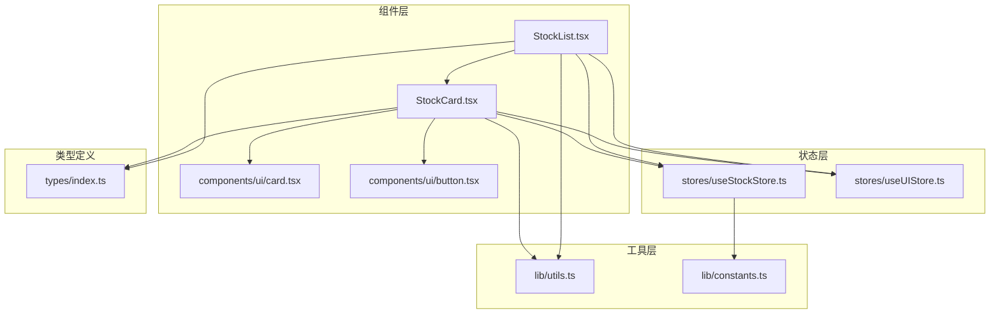
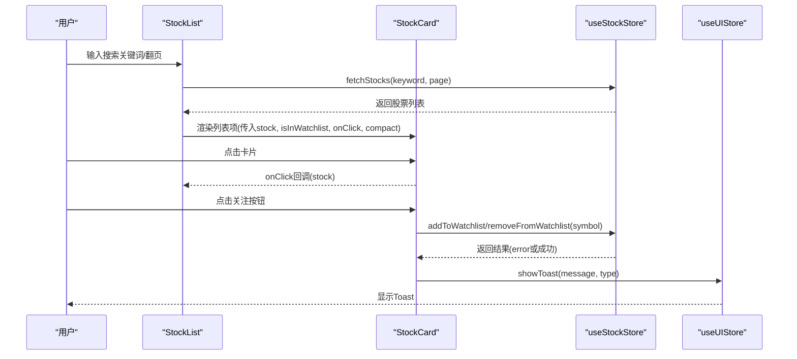
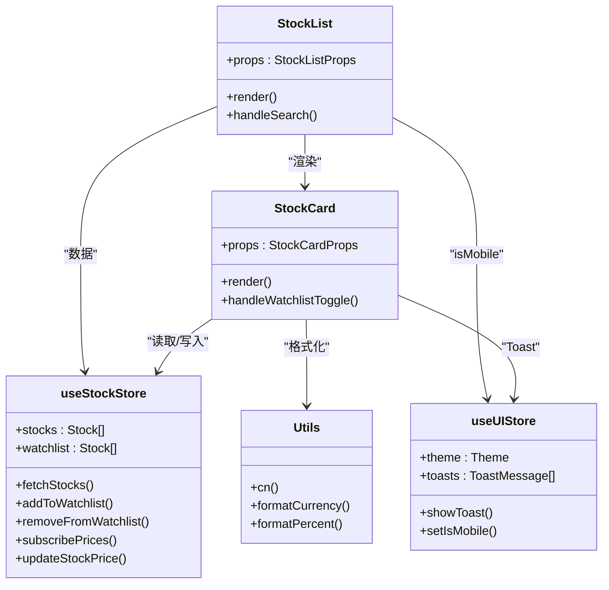

# 股票卡片组件

<cite>
**本文引用的文件**
- [StockCard.tsx](file://components/stocks/StockCard.tsx)
- [StockList.tsx](file://components/stocks/StockList.tsx)
- [index.ts](file://types/index.ts)
- [useStockStore.ts](file://stores/useStockStore.ts)
- [useUIStore.ts](file://stores/useUIStore.ts)
- [utils.ts](file://lib/utils.ts)
- [card.tsx](file://components/ui/card.tsx)
- [button.tsx](file://components/ui/button.tsx)
- [constants.ts](file://lib/constants.ts)
- [page.tsx](file://app/(dashboard)/page.tsx)
</cite>

## 目录
1. [简介](#简介)
2. [项目结构](#项目结构)
3. [核心组件](#核心组件)
4. [架构总览](#架构总览)
5. [详细组件分析](#详细组件分析)
6. [依赖关系分析](#依赖关系分析)
7. [性能考虑](#性能考虑)
8. [故障排查指南](#故障排查指南)
9. [结论](#结论)
10. [附录](#附录)

## 简介
本文件系统性地解析股票卡片组件的设计与实现，重点围绕 StockCard 组件展开，涵盖 props 接口、视觉设计、响应式布局、交互行为、状态管理、可访问性、定制化选项以及性能优化等方面，并结合实际代码路径给出完整使用示例与最佳实践建议。

## 项目结构
StockCard 组件位于组件层的 stocks 子目录中，配合 StockList 展示列表、useStockStore 管理实时股价与自选股、useUIStore 提供 Toast 通知与移动端判断、utils 提供格式化工具、以及 UI 基础组件 Card/Button 提供基础样式。

图表来源
- [StockCard.tsx:1-150](file://components/stocks/StockCard.tsx#L1-L150)
- [StockList.tsx:1-136](file://components/stocks/StockList.tsx#L1-L136)
- [useStockStore.ts:1-184](file://stores/useStockStore.ts#L1-L184)
- [useUIStore.ts:1-78](file://stores/useUIStore.ts#L1-L78)
- [utils.ts:1-47](file://lib/utils.ts#L1-L47)
- [card.tsx:1-84](file://components/ui/card.tsx#L1-L84)
- [button.tsx:1-58](file://components/ui/button.tsx#L1-L58)
- [constants.ts:1-101](file://lib/constants.ts#L1-L101)
- [index.ts:1-166](file://types/index.ts#L1-L166)

章节来源
- [StockCard.tsx:1-150](file://components/stocks/StockCard.tsx#L1-L150)
- [StockList.tsx:1-136](file://components/stocks/StockList.tsx#L1-L136)

## 核心组件
- StockCard：单只股票的信息卡片，支持紧凑与完整两种布局，内置自选股关注按钮与点击事件。
- StockList：股票列表容器，负责搜索、分页、加载骨架屏、移动端紧凑模式切换等。
- useStockStore：管理股票数据、自选股、订阅实时行情、更新价格等。
- useUIStore：管理主题、Toast、移动端状态等 UI 状态。
- utils：提供 cn、formatCurrency、formatPercent 等通用工具。
- 类型定义：Stock 接口定义了股票数据结构及可选计算字段。

章节来源
- [StockCard.tsx:11-25](file://components/stocks/StockCard.tsx#L11-L25)
- [StockList.tsx:13-23](file://components/stocks/StockList.tsx#L13-L23)
- [useStockStore.ts:6-21](file://stores/useStockStore.ts#L6-L21)
- [useUIStore.ts:5-18](file://stores/useUIStore.ts#L5-L18)
- [utils.ts:4-35](file://lib/utils.ts#L4-L35)
- [index.ts:11-25](file://types/index.ts#L11-L25)

## 架构总览
StockCard 的渲染与交互由多个模块协同完成：
- 数据来源：StockCard 通过 useStockStore 获取实时股价与自选股状态；StockList 负责分页与搜索。
- 视觉呈现：基于 Card/Button 组件与 Tailwind 类名组合；紧凑/完整布局通过 compact 控制。
- 交互逻辑：点击卡片触发父级回调；关注按钮异步增删自选股并显示 Toast。
- 工具函数：格式化货币、百分比、类名合并等。

图表来源
- [StockList.tsx:36-96](file://components/stocks/StockList.tsx#L36-L96)
- [StockCard.tsx:34-52](file://components/stocks/StockCard.tsx#L34-L52)
- [useStockStore.ts:80-123](file://stores/useStockStore.ts#L80-L123)
- [useUIStore.ts:47-65](file://stores/useUIStore.ts#L47-L65)

## 详细组件分析

### Props 接口与数据模型
- StockCardProps
  - stock: Stock 必填，包含股票基本信息与可选计算字段。
  - showAddButton?: boolean，是否显示关注按钮。
  - isInWatchlist?: boolean，是否已在自选股中。
  - onClick?: () => void，卡片点击回调。
  - compact?: boolean，紧凑布局模式。
- Stock 数据模型
  - symbol、name、market、current_price、prev_close、open、high、low、volume、updated_at。
  - 可选计算字段：change、change_percent。

章节来源
- [StockCard.tsx:11-17](file://components/stocks/StockCard.tsx#L11-L17)
- [index.ts:11-25](file://types/index.ts#L11-L25)

### 视觉设计与排版
- 布局模式
  - 完整布局：左侧为股票名称与基本信息，右侧为当前价与涨跌幅，支持关注按钮。
  - 紧凑布局：仅显示名称、代码与当前价与涨跌幅，适合移动端列表。
- 颜色与图标
  - 涨跌颜色：上涨用红色，下跌用绿色；通过 isUp 判断。
  - 图标：使用 TrendingUp/TrendingDown 表示涨跌方向。
- 文本格式
  - 价格：formatCurrency 格式化为人民币。
  - 百分比：formatPercent 格式化为百分比，自动加正号。
  - 数字：formatNumber 千分位格式（在其他组件中使用）。

章节来源
- [StockCard.tsx:54-81](file://components/stocks/StockCard.tsx#L54-L81)
- [StockCard.tsx:83-148](file://components/stocks/StockCard.tsx#L83-L148)
- [utils.ts:13-35](file://lib/utils.ts#L13-L35)

### 响应式设计
- 断点与模式
  - 使用 useUIStore 的 isMobile 判断是否为移动端。
  - 在 StockList 中根据 isMobile 设置 compact={isMobile}，从而在移动端使用紧凑布局。
- 设计策略
  - 移动端优先：紧凑卡片减少空间占用，提升滚动体验。
  - 桌面端：完整卡片展示更多信息，便于对比与决策。

章节来源
- [StockList.tsx:33](file://components/stocks/StockList.tsx#L33)
- [StockList.tsx:94](file://components/stocks/StockList.tsx#L94)
- [useUIStore.ts:10](file://stores/useUIStore.ts#L10)

### 交互功能
- 点击事件
  - 整体卡片点击：onClick 回调，用于打开交易弹窗或跳转详情。
  - 关注按钮点击：阻止事件冒泡，调用 addToWatchlist 或 removeFromWatchlist。
- 悬停与触摸反馈
  - Card 组件提供 hover:shadow-md 与 transition-shadow，提供悬停阴影过渡。
  - Button 组件具备默认交互态（hover、focus、active），增强触摸反馈。
- 异步操作与反馈
  - 关注/取消关注通过 useStockStore 异步执行，成功或失败均通过 useUIStore.showToast 通知用户。

章节来源
- [StockCard.tsx:54-81](file://components/stocks/StockCard.tsx#L54-L81)
- [StockCard.tsx:83-148](file://components/stocks/StockCard.tsx#L83-L148)
- [StockCard.tsx:34-52](file://components/stocks/StockCard.tsx#L34-L52)
- [card.tsx:8-16](file://components/ui/card.tsx#L8-L16)
- [button.tsx:43-54](file://components/ui/button.tsx#L43-L54)
- [useUIStore.ts:47-65](file://stores/useUIStore.ts#L47-L65)

### 状态管理
- 本地状态
  - StockCard 内部维护 change、change_percent、isUp 等计算值，避免重复计算。
- 全局状态
  - useStockStore：管理 stocks、watchlist、搜索关键字、分页、订阅实时行情、更新价格。
  - useUIStore：管理主题、Toast、移动端状态。
- 数据同步
  - 实时订阅：subscribePrices 基于 Supabase 实时变更，updateStockPrice 同步更新 stocks 与 watchlist。
  - 自选股同步：addToWatchlist/removeFromWatchlist 成功后刷新 watchlist 并更新本地状态。

章节来源
- [StockCard.tsx:29-32](file://components/stocks/StockCard.tsx#L29-L32)
- [useStockStore.ts:23-21](file://stores/useStockStore.ts#L23-L21)
- [useStockStore.ts:125-177](file://stores/useStockStore.ts#L125-L177)
- [useUIStore.ts:20-68](file://stores/useUIStore.ts#L20-L68)

### 可访问性支持
- 键盘导航
  - Button 与 Card 均为原生可聚焦元素，支持 Tab 导航与 Enter/Space 触发。
- 屏幕阅读器
  - 使用语义化标签（h3、span、div）与清晰文本，配合 aria-label 可进一步增强。
- ARIA 标签
  - 可在需要时为按钮添加 aria-label（例如“添加到自选股”、“从自选股移除”）。
- 焦点可见性
  - Button 组件提供 focus-visible:ring，确保键盘用户可感知焦点。

章节来源
- [button.tsx:43-54](file://components/ui/button.tsx#L43-L54)
- [card.tsx:8-16](file://components/ui/card.tsx#L8-L16)

### 定制化选项
- 主题切换
  - useUIStore.setTheme 支持 light/dark 切换，自动同步到 documentElement。
- 样式覆盖
  - 通过 cn 合并 Tailwind 类名，可在父组件传入 className 进行局部覆盖。
- 插槽扩展
  - 可在父组件通过 onClick 扩展更多交互（如右键菜单、分享等）。
- 自定义图标与颜色
  - 可替换 TrendingUp/TrendingDown 图标，或通过 CSS 变量调整涨跌颜色。

章节来源
- [useUIStore.ts:29-37](file://stores/useUIStore.ts#L29-L37)
- [utils.ts:4](file://lib/utils.ts#L4)
- [StockCard.tsx:84-88](file://components/stocks/StockCard.tsx#L84-L88)

### 性能优化
- React.memo 使用
  - 建议对 StockCard 外层包裹 React.memo，避免不必要的重渲染。
- 懒加载与虚拟滚动
  - 对于超长列表，建议引入 react-window 或 @tanstack/react-virtual 实现虚拟滚动。
- 计算字段缓存
  - StockCard 内部已缓存 change/change_percent/isUp，避免重复计算。
- 网络请求去抖
  - StockList 已使用 useCallback 与搜索防抖，减少无效请求。
- 实时订阅
  - useStockStore.subscribePrices 仅订阅必要股票，避免全量推送造成压力。

章节来源
- [StockCard.tsx:29-32](file://components/stocks/StockCard.tsx#L29-L32)
- [StockList.tsx:42-44](file://components/stocks/StockList.tsx#L42-L44)
- [useStockStore.ts:125-150](file://stores/useStockStore.ts#L125-L150)

### 使用示例与最佳实践
- 基本用法
  - 在 StockList 中渲染 StockCard，传入 stock、onClick、showAddButton、isInWatchlist。
- 与仪表盘集成
  - DashboardPage 中通过 onStockClick 打开交易弹窗，设置默认交易类型。
- 最佳实践
  - 为每个 StockCard 提供唯一 key（stock.symbol）。
  - 在移动端统一使用 compact 模式。
  - 对关注按钮的异步操作进行错误处理与 Toast 提示。
  - 对于大量数据，采用虚拟滚动与分页。

章节来源
- [StockList.tsx:87-96](file://components/stocks/StockList.tsx#L87-L96)
- [page.tsx:23-33](file://app/(dashboard)/page.tsx#L23-L33)

## 依赖关系分析
- 组件依赖
  - StockCard 依赖 Card、Button、Lucide 图标、utils 工具、useStockStore、useUIStore。
  - StockList 依赖 StockCard、Input/Button、Skeleton、useStockStore、useUIStore。
- 状态依赖
  - useStockStore 依赖 Supabase 实时订阅与 API 接口。
  - useUIStore 依赖持久化存储与主题同步。
- 工具依赖
  - utils 提供 cn、formatCurrency、formatPercent 等跨组件复用工具。

图表来源
- [StockCard.tsx:11-25](file://components/stocks/StockCard.tsx#L11-L25)
- [StockList.tsx:13-23](file://components/stocks/StockList.tsx#L13-L23)
- [useStockStore.ts:6-21](file://stores/useStockStore.ts#L6-L21)
- [useUIStore.ts:5-18](file://stores/useUIStore.ts#L5-L18)
- [utils.ts:4-35](file://lib/utils.ts#L4-L35)

## 性能考虑
- 渲染优化
  - 使用 React.memo 包裹 StockCard，避免因父组件重渲染导致的重复渲染。
  - 对于长列表，采用虚拟滚动减少 DOM 节点数量。
- 网络与订阅
  - 仅订阅必要的股票符号，避免全量推送。
  - 合理设置刷新间隔，平衡实时性与性能。
- 样式与资源
  - 使用 cn 合并类名，避免重复样式计算。
  - 图标按需引入，避免打包冗余。

## 故障排查指南
- 关注按钮无反应
  - 检查 isInWatchlist 与 showAddButton 是否正确传递。
  - 确认 useStockStore 的 addToWatchlist/removeFromWatchlist 返回值。
- Toast 不显示
  - 检查 useUIStore.showToast 的调用与自动隐藏逻辑。
- 实时价格不更新
  - 确认 subscribePrices 已正确订阅并 updateStockPrice 正常执行。
- 移动端布局异常
  - 检查 useUIStore.isMobile 状态与 StockList 的 compact 传递。

章节来源
- [StockCard.tsx:34-52](file://components/stocks/StockCard.tsx#L34-L52)
- [useStockStore.ts:125-177](file://stores/useStockStore.ts#L125-L177)
- [useUIStore.ts:47-65](file://stores/useUIStore.ts#L47-L65)

## 结论
StockCard 组件通过清晰的 props 接口、简洁的视觉设计与完善的交互流程，实现了高效、易用的股票信息展示。配合 StockList 的分页与搜索、useStockStore 的实时订阅与状态管理、useUIStore 的 UI 状态与 Toast 通知，形成了一套完整的股票卡片生态。建议在生产环境中引入 React.memo、虚拟滚动与更细粒度的错误处理，以进一步提升性能与稳定性。

## 附录
- 常用格式化函数
  - formatCurrency：货币格式化（人民币，保留两位小数）。
  - formatPercent：百分比格式化（自动加正号，保留两位小数）。
- 响应式断点
  - UI_CONSTANTS.BREAKPOINTS.MOBILE、TABLET、DESKTOP 用于判断设备类型。
- 交易与市场规则
  - TRADE_CONSTANTS 与 STOCK_RULES 提供交易费用、涨跌停与股票类型判断的基础配置。

章节来源
- [utils.ts:13-35](file://lib/utils.ts#L13-L35)
- [constants.ts:82-95](file://lib/constants.ts#L82-L95)
- [constants.ts:2-27](file://lib/constants.ts#L2-L27)
- [constants.ts:30-68](file://lib/constants.ts#L30-L68)