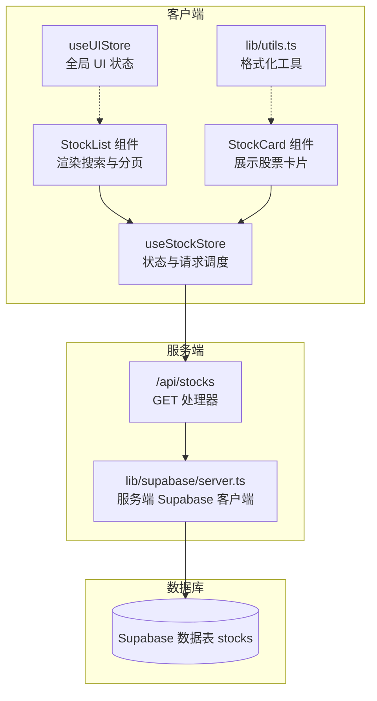
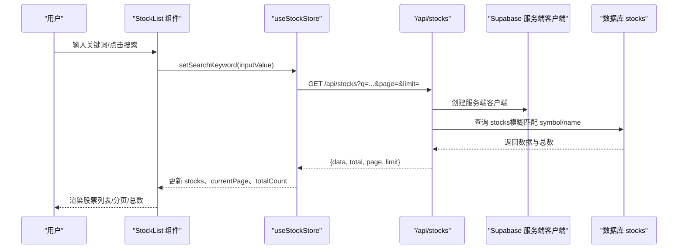
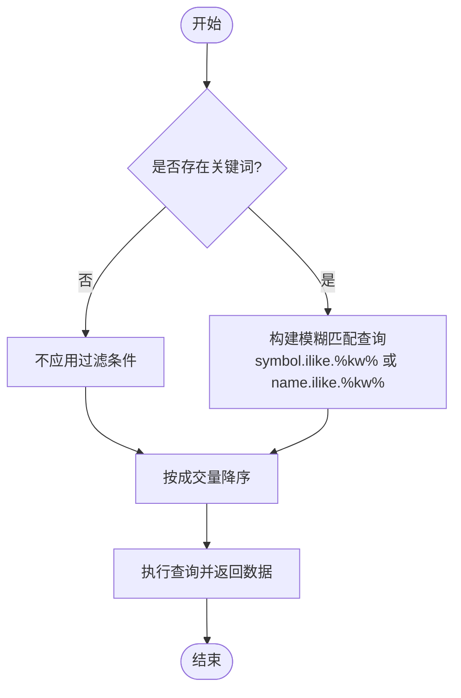
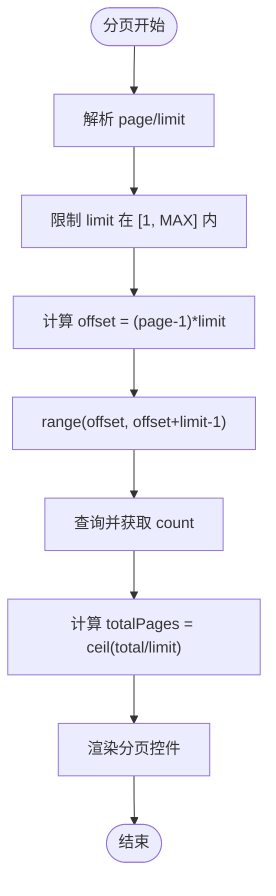
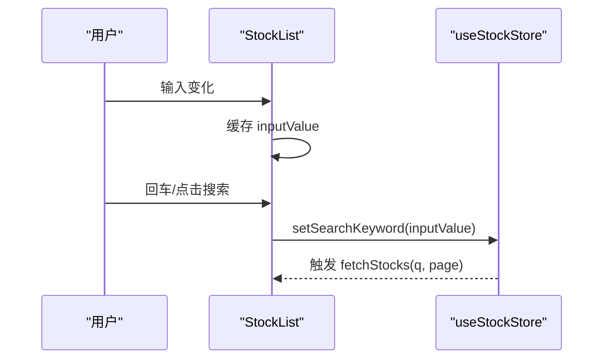
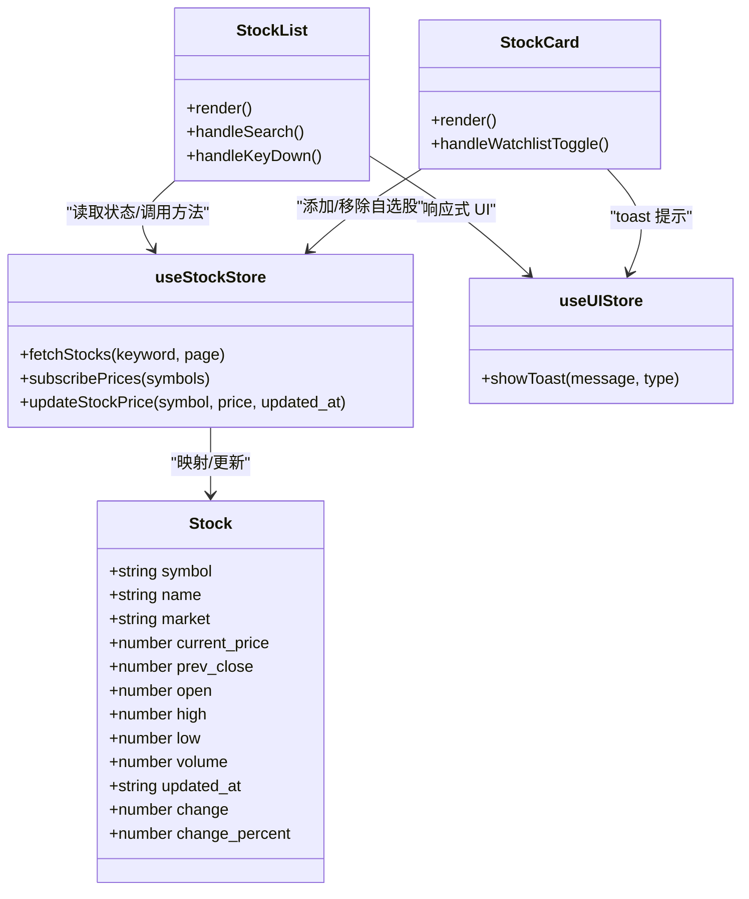

# 股票搜索与筛选

<cite>
**本文档引用的文件**
- [app/api/stocks/route.ts](file://app/api/stocks/route.ts)
- [stores/useStockStore.ts](file://stores/useStockStore.ts)
- [components/stocks/StockList.tsx](file://components/stocks/StockList.tsx)
- [components/stocks/StockCard.tsx](file://components/stocks/StockCard.tsx)
- [stores/useUIStore.ts](file://stores/useUIStore.ts)
- [lib/constants.ts](file://lib/constants.ts)
- [lib/utils.ts](file://lib/utils.ts)
- [types/index.ts](file://types/index.ts)
- [lib/supabase/server.ts](file://lib/supabase/server.ts)
- [lib/supabase/client.ts](file://lib/supabase/client.ts)
- [app/(dashboard)/page.tsx](file://app/(dashboard)/page.tsx)
</cite>

## 目录
1. [简介](#简介)
2. [项目结构](#项目结构)
3. [核心组件](#核心组件)
4. [架构总览](#架构总览)
5. [详细组件分析](#详细组件分析)
6. [依赖关系分析](#依赖关系分析)
7. [性能考虑](#性能考虑)
8. [故障排除指南](#故障排除指南)
9. [结论](#结论)

## 简介
本文件面向虚拟股票交易系统的“股票搜索与筛选”功能，系统性阐述搜索算法实现（模糊匹配、前缀匹配与精确匹配的组合策略）、关键词处理逻辑（大小写不敏感、特殊字符过滤与空格处理）、筛选设计（按股票代码、名称、行业分类的多维筛选）、分页机制（页面大小控制、总记录数统计与导航逻辑）、搜索防抖机制（输入延迟处理与请求去重）、排序规则（默认排序、自定义排序与动态排序选项），以及性能优化策略（数据库索引优化与查询缓存）与用户体验设计（加载状态、错误提示与空结果处理）。文档以仓库现有实现为基础，结合代码级可视化图表进行说明。

## 项目结构
围绕“搜索与筛选”的关键文件分布如下：
- API 层：负责接收查询参数、构建查询、执行数据库操作并返回分页与计算后的结果
- 客户端状态层：负责维护搜索关键字、分页状态、加载状态，并发起请求
- UI 组件层：负责渲染搜索框、列表、分页控件与加载/空结果提示
- 工具与常量：提供格式化工具、分页常量与 Supabase 客户端封装

**图表来源**
- [components/stocks/StockList.tsx:1-136](file://components/stocks/StockList.tsx#L1-L136)
- [components/stocks/StockCard.tsx:1-150](file://components/stocks/StockCard.tsx#L1-L150)
- [stores/useStockStore.ts:1-184](file://stores/useStockStore.ts#L1-L184)
- [stores/useUIStore.ts:1-78](file://stores/useUIStore.ts#L1-L78)
- [lib/utils.ts:1-47](file://lib/utils.ts#L1-L47)
- [app/api/stocks/route.ts:1-69](file://app/api/stocks/route.ts#L1-L69)
- [lib/supabase/server.ts:1-35](file://lib/supabase/server.ts#L1-L35)

**章节来源**
- [components/stocks/StockList.tsx:1-136](file://components/stocks/StockList.tsx#L1-L136)
- [stores/useStockStore.ts:1-184](file://stores/useStockStore.ts#L1-L184)
- [app/api/stocks/route.ts:1-69](file://app/api/stocks/route.ts#L1-L69)

## 核心组件
- 搜索与分页 API：接收 q、page、limit 参数，执行模糊匹配（符号与名称），按成交量降序，返回带总数的分页数据
- 客户端状态与请求：维护搜索关键字、当前页、总数；根据分页常量构造查询参数并发起请求
- UI 渲染：搜索框支持回车触发与按钮触发；加载时显示骨架屏；无结果时提示；分页控件支持上一页/下一页与页码显示
- 实时订阅：通过 Supabase Realtime 订阅股票价格更新，实时刷新涨跌幅与价格

**章节来源**
- [app/api/stocks/route.ts:6-69](file://app/api/stocks/route.ts#L6-L69)
- [stores/useStockStore.ts:33-57](file://stores/useStockStore.ts#L33-L57)
- [components/stocks/StockList.tsx:36-133](file://components/stocks/StockList.tsx#L36-L133)
- [stores/useStockStore.ts:125-177](file://stores/useStockStore.ts#L125-L177)

## 架构总览
搜索与筛选的端到端流程如下：

**图表来源**
- [components/stocks/StockList.tsx:42-49](file://components/stocks/StockList.tsx#L42-L49)
- [stores/useStockStore.ts:33-57](file://stores/useStockStore.ts#L33-L57)
- [app/api/stocks/route.ts:6-69](file://app/api/stocks/route.ts#L6-L69)
- [lib/supabase/server.ts:9-34](file://lib/supabase/server.ts#L9-L34)

## 详细组件分析

### 搜索算法与关键词处理
- 模糊匹配策略：当存在关键词时，使用 OR 组合条件对 symbol 与 name 进行 ilike 模糊匹配，实现大小写不敏感的包含匹配
- 关键词预处理：前端未做额外清洗，服务端直接使用查询参数；建议在前端统一转小写并去除多余空格，减少无效请求
- 排序规则：默认按成交量降序，便于展示活跃度高的股票

**图表来源**
- [app/api/stocks/route.ts:26-34](file://app/api/stocks/route.ts#L26-L34)

**章节来源**
- [app/api/stocks/route.ts:26-34](file://app/api/stocks/route.ts#L26-L34)

### 分页机制
- 页面大小控制：默认值与最大值由常量提供，服务端取值上限保护
- 偏移量计算：offset = (page - 1) × limit
- 导航逻辑：前端根据 totalCount 计算 totalPages 并渲染分页控件；上一页/下一页按钮禁用状态基于 currentPage 边界
- 总记录数统计：查询使用 count: 'exact'，确保 total 字段准确

**图表来源**
- [app/api/stocks/route.ts:13-19](file://app/api/stocks/route.ts#L13-L19)
- [lib/constants.ts:71-79](file://lib/constants.ts#L71-L79)
- [components/stocks/StockList.tsx:52-125](file://components/stocks/StockList.tsx#L52-L125)

**章节来源**
- [lib/constants.ts:71-79](file://lib/constants.ts#L71-L79)
- [app/api/stocks/route.ts:13-19](file://app/api/stocks/route.ts#L13-L19)
- [components/stocks/StockList.tsx:52-125](file://components/stocks/StockList.tsx#L52-L125)

### 搜索防抖机制
- 防抖实现：通过 useCallback 缓存 handleSearch，避免每次渲染产生新的函数引用；实际防抖可结合外部库（如 lodash.debounce）在输入监听处使用，当前实现为回车或点击触发 setSearchKeyword
- 请求去重：当前未实现请求去重；建议在 store 中增加 pending 请求队列与取消逻辑，避免重复请求

**图表来源**
- [components/stocks/StockList.tsx:42-49](file://components/stocks/StockList.tsx#L42-L49)
- [stores/useStockStore.ts:33-57](file://stores/useStockStore.ts#L33-L57)

**章节来源**
- [components/stocks/StockList.tsx:42-49](file://components/stocks/StockList.tsx#L42-L49)
- [stores/useStockStore.ts:33-57](file://stores/useStockStore.ts#L33-L57)

### 筛选功能设计
- 当前实现：仅支持关键词模糊匹配（代码与名称），未见按行业分类等维度的筛选逻辑
- 扩展建议：可在 API 层增加行业、市场、涨跌幅等筛选参数，并在前端提供筛选面板；服务端相应扩展查询条件

**章节来源**
- [app/api/stocks/route.ts:26-29](file://app/api/stocks/route.ts#L26-L29)

### 排序规则
- 默认排序：按成交量降序
- 自定义/动态排序：当前未暴露排序参数；可在 API 增加 sort_by 与 direction 参数，前端提供排序选项

**章节来源**
- [app/api/stocks/route.ts:32-34](file://app/api/stocks/route.ts#L32-L34)

### 用户体验设计
- 加载状态：列表为空时显示骨架屏，提升感知速度
- 错误提示：store 捕获异常并记录日志；UI 层可结合 useUIStore 的 toast 提示
- 空结果处理：无匹配时显示“没有找到相关股票”
- 总数提示：显示 total 记录数，帮助用户了解结果规模

**章节来源**
- [components/stocks/StockList.tsx:77-86](file://components/stocks/StockList.tsx#L77-L86)
- [stores/useUIStore.ts:47-65](file://stores/useUIStore.ts#L47-L65)

### 实时价格与涨跌幅
- 实时订阅：通过 Supabase Realtime 订阅 stocks 表的 UPDATE 事件，按 symbol 过滤，更新本地状态中的 current_price、change、change_percent
- 价格格式化：使用工具函数格式化货币、百分比与成交量

**章节来源**
- [stores/useStockStore.ts:125-177](file://stores/useStockStore.ts#L125-L177)
- [lib/utils.ts:14-46](file://lib/utils.ts#L14-L46)

## 依赖关系分析
- 组件依赖：StockList 依赖 useStockStore 与 useUIStore；StockCard 依赖格式化工具与 useStockStore
- 状态依赖：useStockStore 负责与 API 交互、维护分页与加载状态
- 数据模型：Stock 类型定义了股票字段与计算字段（change、change_percent）

**图表来源**
- [types/index.ts:11-25](file://types/index.ts#L11-L25)
- [components/stocks/StockList.tsx:19-34](file://components/stocks/StockList.tsx#L19-L34)
- [components/stocks/StockCard.tsx:19-27](file://components/stocks/StockCard.tsx#L19-L27)
- [stores/useStockStore.ts:23-21](file://stores/useStockStore.ts#L23-L21)
- [stores/useUIStore.ts:20-18](file://stores/useUIStore.ts#L20-L18)

**章节来源**
- [types/index.ts:11-25](file://types/index.ts#L11-L25)
- [stores/useStockStore.ts:23-21](file://stores/useStockStore.ts#L23-L21)

## 性能考虑
- 数据库索引优化
  - 对 symbol 与 name 建立索引，加速 ilike 模糊匹配
  - 对 volume 建立索引，优化默认排序性能
- 查询缓存
  - 对热门关键词与高频分页结果进行缓存，降低数据库压力
- 请求去重
  - 在 store 中维护最近一次请求的标识，避免重复请求相同参数
- 分页参数校验
  - 服务端限制 limit 上限，防止过大分页导致资源消耗

**章节来源**
- [app/api/stocks/route.ts:14-17](file://app/api/stocks/route.ts#L14-L17)
- [lib/constants.ts:71-79](file://lib/constants.ts#L71-L79)

## 故障排除指南
- 服务器错误
  - API 层捕获数据库错误并返回 500；客户端 store 记录错误日志
- 网络错误
  - store 在请求失败时记录错误并保持加载状态；建议增加重试与错误提示
- 实时订阅异常
  - 订阅函数返回解绑方法，确保组件卸载时正确取消订阅

**章节来源**
- [app/api/stocks/route.ts:38-44](file://app/api/stocks/route.ts#L38-L44)
- [stores/useStockStore.ts:52-56](file://stores/useStockStore.ts#L52-L56)
- [stores/useStockStore.ts:125-149](file://stores/useStockStore.ts#L125-L149)

## 结论
该搜索与筛选功能以简洁的模糊匹配为核心，结合默认按成交量排序与标准分页机制，实现了基本的股票检索需求。前端通过状态管理与 UI 组件提供了良好的交互体验，服务端通过 Supabase 提供了稳定的查询能力。后续可扩展行业筛选、动态排序、请求去重与缓存策略，进一步提升性能与可用性。