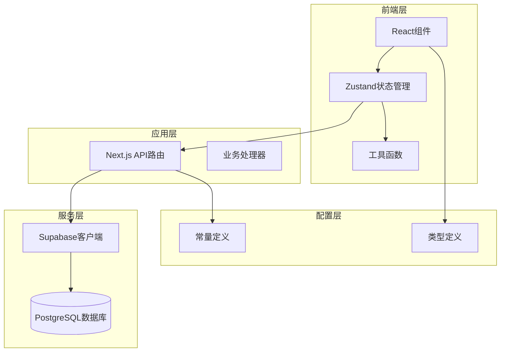
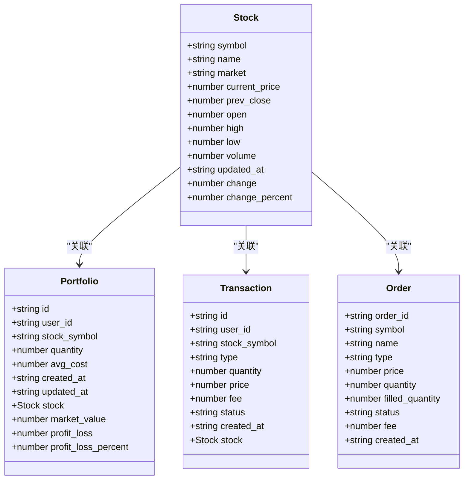
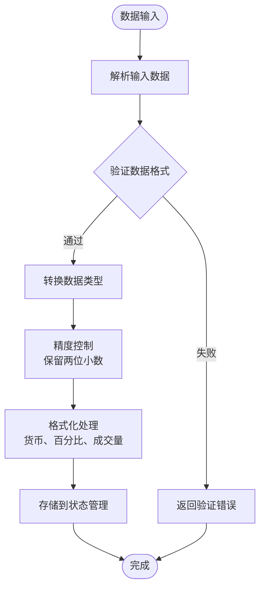
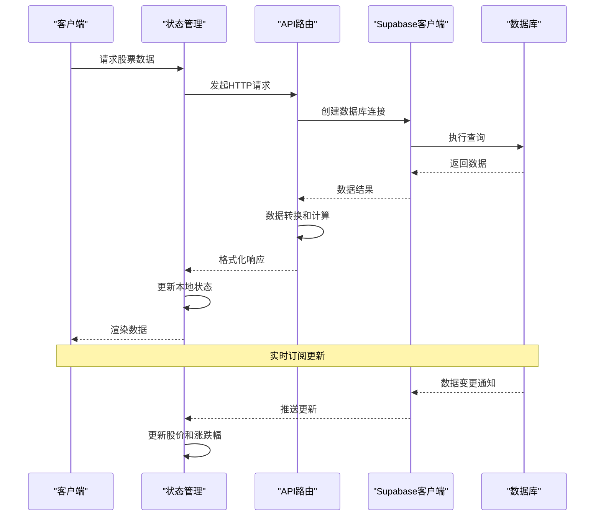
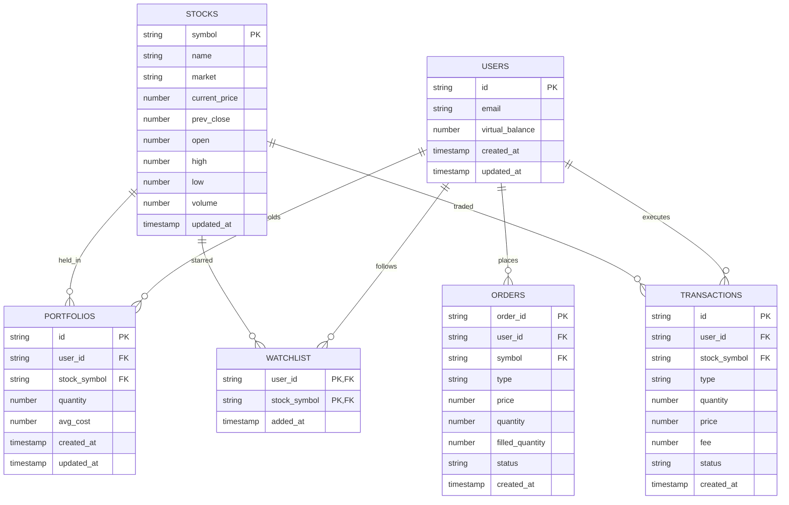
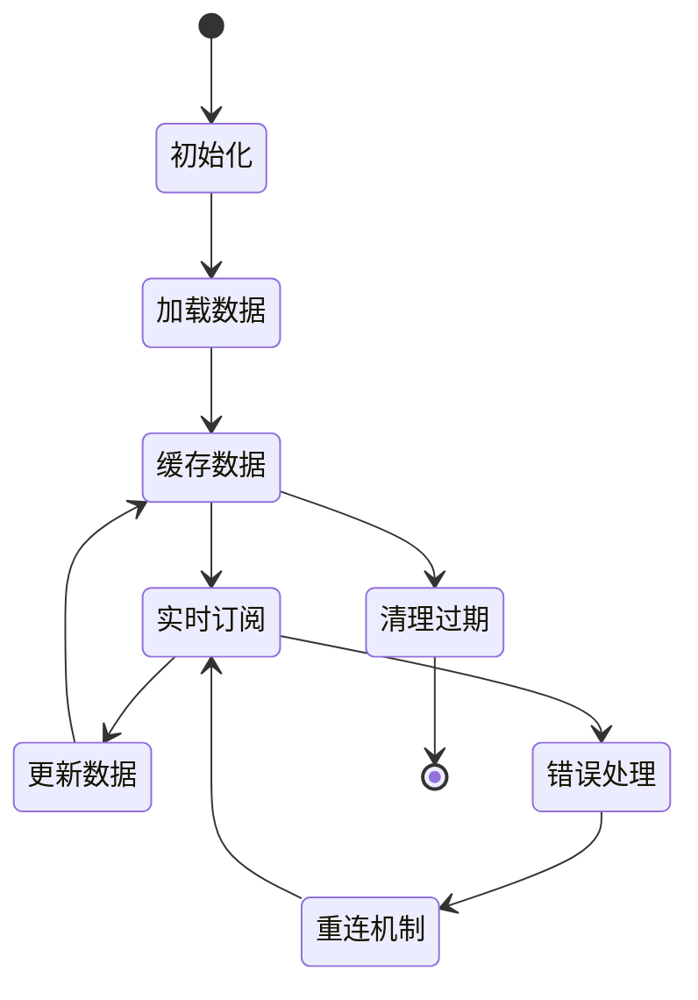
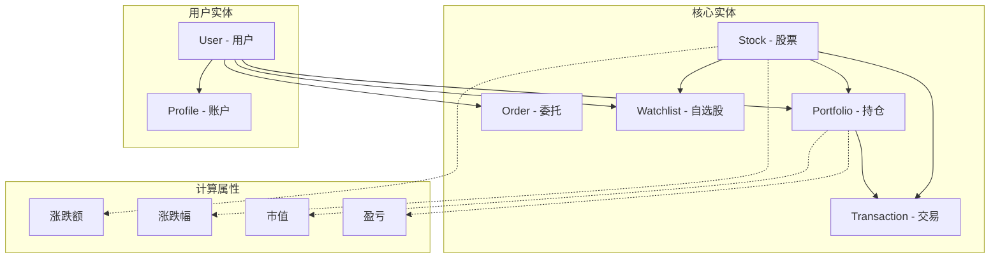
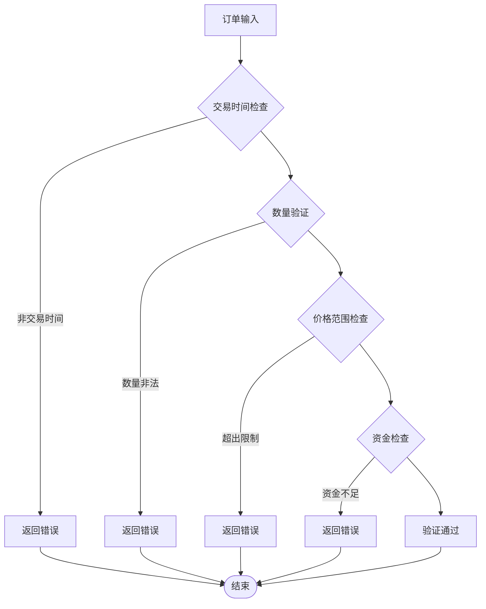

# 股票数据模型

<cite>
**本文档引用的文件**
- [types/index.ts](file://types/index.ts)
- [lib/constants.ts](file://lib/constants.ts)
- [lib/trading-rules.ts](file://lib/trading-rules.ts)
- [lib/utils.ts](file://lib/utils.ts)
- [stores/useStockStore.ts](file://stores/useStockStore.ts)
- [stores/useTradeStore.ts](file://stores/useTradeStore.ts)
- [app/api/stocks/route.ts](file://app/api/stocks/route.ts)
- [app/api/trade/positions/route.ts](file://app/api/trade/positions/route.ts)
- [app/api/trade/orders/route.ts](file://app/api/trade/orders/route.ts)
- [app/api/watchlist/route.ts](file://app/api/watchlist/route.ts)
- [components/portfolio/PositionList.tsx](file://components/portfolio/PositionList.tsx)
- [components/stocks/StockList.tsx](file://components/stocks/StockList.tsx)
- [lib/supabase/client.ts](file://lib/supabase/client.ts)
- [package.json](file://package.json)
</cite>

## 目录
1. [简介](#简介)
2. [项目结构](#项目结构)
3. [核心组件](#核心组件)
4. [架构概览](#架构概览)
5. [详细组件分析](#详细组件分析)
6. [依赖关系分析](#依赖关系分析)
7. [性能考虑](#性能考虑)
8. [故障排除指南](#故障排除指南)
9. [结论](#结论)

## 简介

这是一个基于Next.js和Supabase构建的虚拟股票交易系统。本文档深入解析了系统中的股票数据模型设计，包括Stock类型定义、数据类型转换和验证规则、数据模型关系、存储策略以及生命周期管理。

该系统实现了完整的股票交易功能，包括实时股价更新、自选股管理、持仓管理和交易执行等核心业务逻辑。

## 项目结构

项目采用模块化架构设计，主要分为以下几个层次：



**图表来源**
- [package.json:1-44](file://package.json#L1-L44)
- [lib/supabase/client.ts:1-9](file://lib/supabase/client.ts#L1-L9)

**章节来源**
- [package.json:1-44](file://package.json#L1-L44)
- [lib/supabase/client.ts:1-9](file://lib/supabase/client.ts#L1-L9)

## 核心组件

### Stock类型定义详解

Stock类型是整个系统的核心数据模型，定义了股票的基本信息和实时行情数据：



**图表来源**
- [types/index.ts:11-80](file://types/index.ts#L11-L80)

Stock类型包含了以下核心字段：

1. **基本信息字段**：
   - `symbol`: 股票代码（唯一标识符）
   - `name`: 股票名称
   - `market`: 市场类型（'A' | 'HK' | 'US'）

2. **价格数据字段**：
   - `current_price`: 当前价格
   - `prev_close`: 昨收价
   - `open`: 开盘价
   - `high`: 最高价
   - `low`: 最低价
   - `volume`: 成交量

3. **时间戳字段**：
   - `updated_at`: 数据更新时间

4. **计算字段**：
   - `change`: 涨跌额（当前价 - 昨收价）
   - `change_percent`: 涨跌幅百分比

**章节来源**
- [types/index.ts:11-25](file://types/index.ts#L11-L25)

### 数据类型转换和验证规则

系统实现了完整的数据类型转换和验证机制：



**图表来源**
- [lib/trading-rules.ts:88-125](file://lib/trading-rules.ts#L88-L125)
- [lib/utils.ts:14-46](file://lib/utils.ts#L14-L46)

**章节来源**
- [lib/trading-rules.ts:88-125](file://lib/trading-rules.ts#L88-L125)
- [lib/utils.ts:14-46](file://lib/utils.ts#L14-L46)

## 架构概览

系统采用前后端分离架构，通过API路由与数据库交互：



**图表来源**
- [stores/useStockStore.ts:125-150](file://stores/useStockStore.ts#L125-L150)
- [app/api/stocks/route.ts:5-68](file://app/api/stocks/route.ts#L5-L68)

**章节来源**
- [stores/useStockStore.ts:125-150](file://stores/useStockStore.ts#L125-L150)
- [app/api/stocks/route.ts:5-68](file://app/api/stocks/route.ts#L5-L68)

## 详细组件分析

### 股票数据存储策略

系统使用Supabase作为数据存储解决方案，实现了以下存储策略：

#### 数据库表结构设计



**图表来源**
- [app/api/stocks/route.ts:22-34](file://app/api/stocks/route.ts#L22-L34)
- [app/api/trade/positions/route.ts:19-27](file://app/api/trade/positions/route.ts#L19-L27)

#### 索引设计策略

系统采用了合理的索引设计来优化查询性能：

1. **主键索引**：所有表的主键自动创建索引
2. **查询优化索引**：
   - `stocks.symbol`: 股票代码查询
   - `stocks.volume`: 成交量排序
   - `portfolios.user_id`: 用户持仓查询
   - `orders.user_id`: 用户订单查询
   - `watchlist.user_id`: 用户自选股查询

**章节来源**
- [app/api/stocks/route.ts:22-34](file://app/api/stocks/route.ts#L22-L34)
- [app/api/trade/positions/route.ts:19-27](file://app/api/trade/positions/route.ts#L19-L27)

### 数据生命周期管理

系统实现了完整的数据生命周期管理，包括缓存策略和过期机制：



**图表来源**
- [stores/useStockStore.ts:125-150](file://stores/useStockStore.ts#L125-L150)
- [stores/useTradeStore.ts:144-164](file://stores/useTradeStore.ts#L144-L164)

#### 缓存策略

1. **内存缓存**：使用Zustand状态管理器缓存股票数据
2. **实时缓存**：通过Supabase实时订阅机制保持数据同步
3. **本地存储**：支持浏览器本地存储以提高加载速度

#### 过期机制

1. **时间戳验证**：检查`updated_at`字段确保数据新鲜度
2. **主动刷新**：定期重新获取最新数据
3. **事件驱动刷新**：通过数据库变更事件触发数据更新

**章节来源**
- [stores/useStockStore.ts:125-150](file://stores/useStockStore.ts#L125-L150)
- [stores/useTradeStore.ts:144-164](file://stores/useTradeStore.ts#L144-L164)

### 数据模型关系详解

系统中的数据模型之间存在复杂的关联关系：



**图表来源**
- [types/index.ts:37-66](file://types/index.ts#L37-L66)

#### 关系特性

1. **一对一关系**：User → Profile（一个用户对应一个账户信息）
2. **一对多关系**：User → Portfolio/Sell（一个用户可以有多个持仓）
3. **一对多关系**：Stock → Portfolio/Transaction（一只股票可以有多个持仓和交易记录）
4. **多对多关系**：通过中间表实现（User ↔ Stock 的Watchlist关系）

**章节来源**
- [types/index.ts:37-66](file://types/index.ts#L37-L66)

### 数据验证和格式化

系统实现了多层次的数据验证和格式化机制：

#### 交易验证规则



**图表来源**
- [lib/trading-rules.ts:170-201](file://lib/trading-rules.ts#L170-L201)
- [lib/trading-rules.ts:211-247](file://lib/trading-rules.ts#L211-L247)

#### 数值精度控制

系统采用统一的精度控制策略：

1. **价格精度**：保留两位小数（人民币最小单位分）
2. **数量精度**：整数股（100股为1手）
3. **百分比精度**：保留两位小数
4. **金额精度**：保留两位小数

**章节来源**
- [lib/trading-rules.ts:170-201](file://lib/trading-rules.ts#L170-L201)
- [lib/trading-rules.ts:211-247](file://lib/trading-rules.ts#L211-L247)

## 依赖关系分析

系统各组件之间的依赖关系如下：

```mermaid
graph TB
subgraph "类型定义层"
Types[types/index.ts]
Constants[lib/constants.ts]
end
subgraph "业务逻辑层"
TradingRules[lib/trading-rules.ts]
Utils[lib/utils.ts]
end
subgraph "状态管理层"
StockStore[stores/useStockStore.ts]
TradeStore[stores/useTradeStore.ts]
end
subgraph "API层"
StocksAPI[app/api/stocks/route.ts]
PositionsAPI[app/api/trade/positions/route.ts]
OrdersAPI[app/api/trade/orders/route.ts]
WatchlistAPI[app/api/watchlist/route.ts]
end
subgraph "UI层"
StockList[components/stocks/StockList.tsx]
PositionList[components/portfolio/PositionList.tsx]
end
subgraph "基础设施层"
SupabaseClient[lib/supabase/client.ts]
SupabaseJS[@supabase/supabase-js]
Zustand[zustand]
end
Types --> StockStore
Types --> TradeStore
Types --> TradingRules
Types --> Utils
Constants --> TradingRules
Constants --> StockStore
TradingRules --> StockStore
TradingRules --> TradeStore
StockStore --> StocksAPI
TradeStore --> PositionsAPI
TradeStore --> OrdersAPI
StocksAPI --> SupabaseClient
PositionsAPI --> SupabaseClient
OrdersAPI --> SupabaseClient
WatchlistAPI --> SupabaseClient
SupabaseClient --> SupabaseJS
StockStore --> Zustand
TradeStore --> Zustand
StockList --> StockStore
PositionList --> TradeStore
```

**图表来源**
- [package.json:9-28](file://package.json#L9-L28)
- [stores/useStockStore.ts:1-5](file://stores/useStockStore.ts#L1-L5)
- [stores/useTradeStore.ts:1-4](file://stores/useTradeStore.ts#L1-L4)

**章节来源**
- [package.json:9-28](file://package.json#L9-L28)
- [stores/useStockStore.ts:1-5](file://stores/useStockStore.ts#L1-L5)
- [stores/useTradeStore.ts:1-4](file://stores/useTradeStore.ts#L1-L4)

## 性能考虑

### 查询优化策略

1. **分页查询**：默认每页20条记录，最大100条
2. **索引优化**：对常用查询字段建立索引
3. **选择性字段**：API响应中只返回必要字段
4. **批量操作**：支持批量获取股票数据

### 缓存优化

1. **本地缓存**：Zustand状态管理器提供快速访问
2. **CDN缓存**：静态资源通过CDN加速
3. **浏览器缓存**：合理设置HTTP缓存头
4. **智能刷新**：根据数据更新频率调整刷新策略

### 实时性优化

1. **WebSocket连接池**：复用Supabase连接
2. **增量更新**：只更新变化的数据
3. **去抖动处理**：避免频繁的API调用
4. **背压处理**：防止数据风暴影响系统稳定性

## 故障排除指南

### 常见问题及解决方案

#### 数据不同步问题

**症状**：股价显示异常或更新延迟

**排查步骤**：
1. 检查Supabase连接状态
2. 验证实时订阅是否正常工作
3. 确认网络连接稳定
4. 检查浏览器控制台错误

**解决方案**：
- 重启实时订阅连接
- 清除本地缓存数据
- 检查Supabase服务状态

#### API调用失败

**症状**：无法获取股票数据或用户信息

**排查步骤**：
1. 检查环境变量配置
2. 验证Supabase项目设置
3. 确认API路由权限
4. 检查数据库连接

**解决方案**：
- 更新正确的环境变量
- 检查防火墙设置
- 验证数据库权限配置

#### 性能问题

**症状**：页面加载缓慢或响应迟缓

**排查步骤**：
1. 分析网络请求时间
2. 检查数据库查询性能
3. 监控内存使用情况
4. 评估前端渲染性能

**解决方案**：
- 实施数据分页加载
- 优化数据库查询
- 减少不必要的重渲染
- 启用代码分割

**章节来源**
- [stores/useStockStore.ts:52-56](file://stores/useStockStore.ts#L52-L56)
- [stores/useTradeStore.ts:61-65](file://stores/useTradeStore.ts#L61-L65)

## 结论

该虚拟股票交易系统通过精心设计的数据模型和架构，实现了功能完整、性能优良的股票交易体验。系统的主要优势包括：

1. **清晰的数据模型**：Stock、Portfolio、Transaction等核心类型的定义明确，关系清晰
2. **完善的验证机制**：从输入验证到业务规则验证的多层次保障
3. **高效的存储策略**：基于Supabase的现代化数据库解决方案
4. **优秀的用户体验**：实时数据更新、流畅的交互体验
5. **可扩展的架构**：模块化设计便于功能扩展和维护

系统在保证功能完整性的同时，也充分考虑了性能优化和用户体验，是一个值得参考的现代Web应用架构案例。