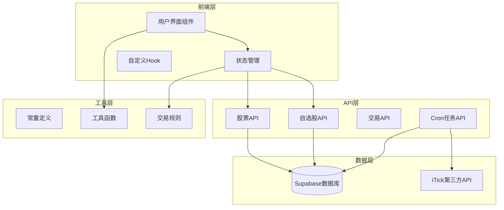
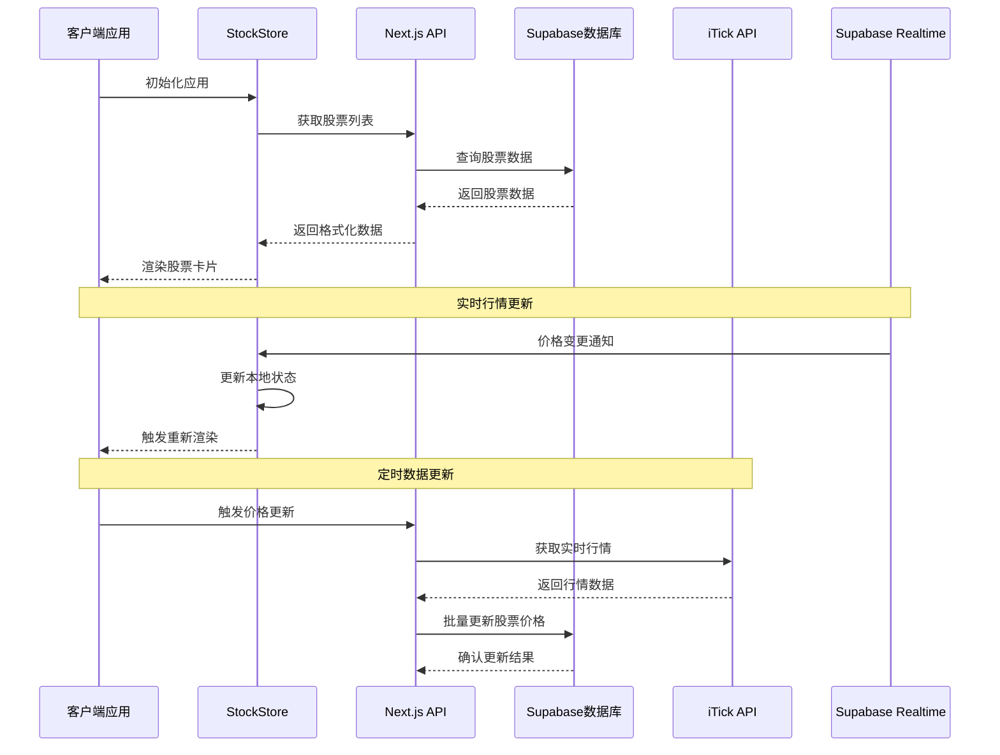
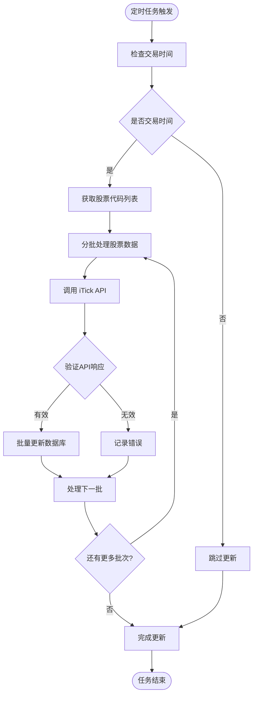
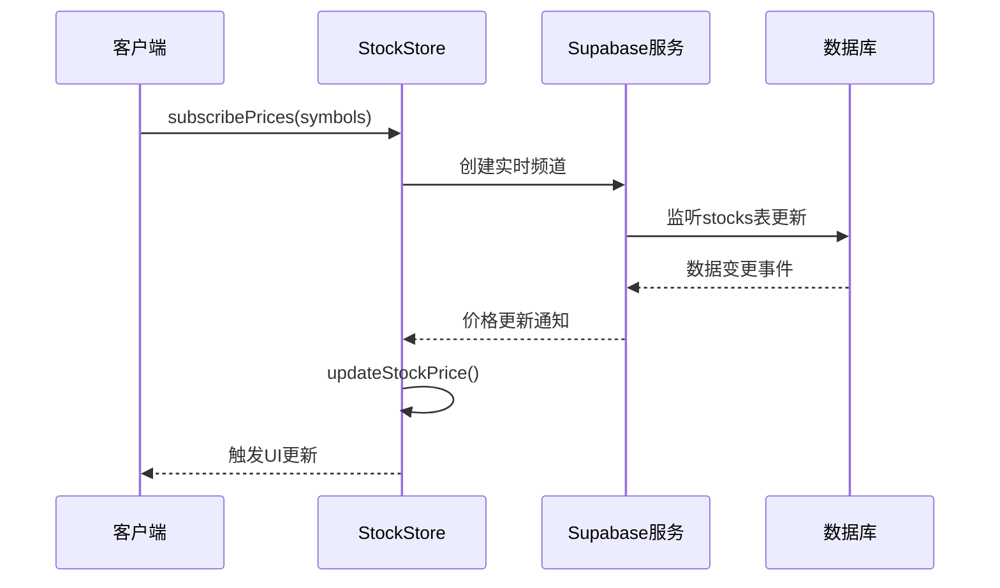
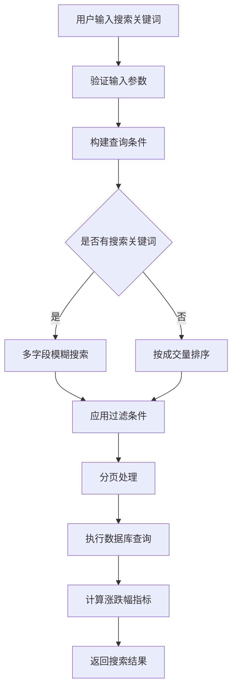
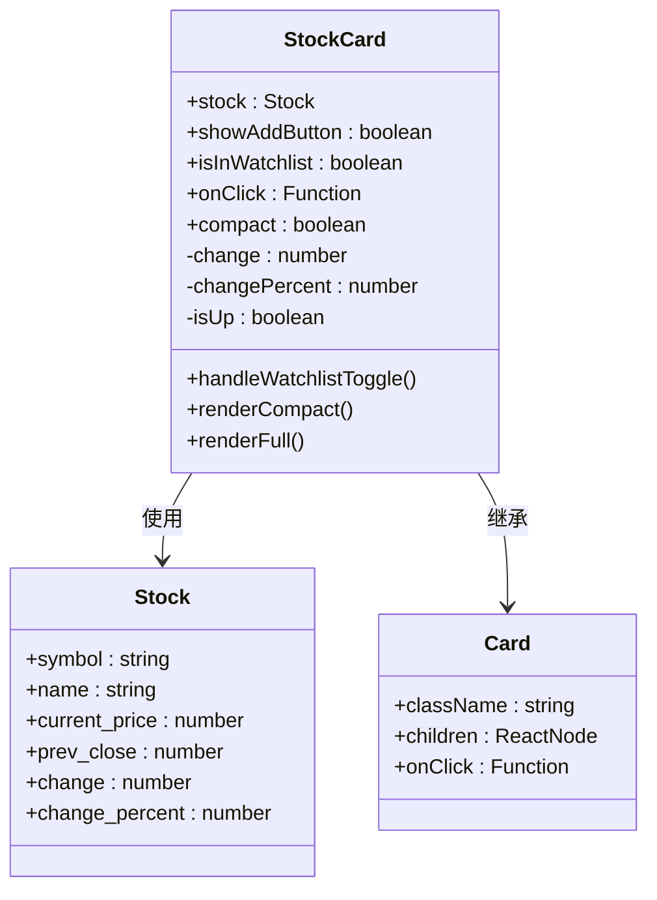
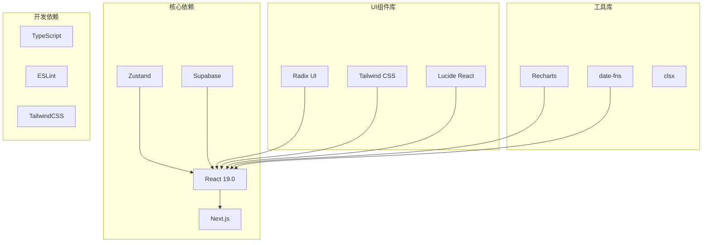

# 股票行情系统

<cite>
**本文档引用的文件**
- [README.md](file://README.md)
- [types/index.ts](file://types/index.ts)
- [stores/useStockStore.ts](file://stores/useStockStore.ts)
- [lib/constants.ts](file://lib/constants.ts)
- [lib/utils.ts](file://lib/utils.ts)
- [lib/trading-rules.ts](file://lib/trading-rules.ts)
- [app/api/cron/update-prices/route.ts](file://app/api/cron/update-prices/route.ts)
- [app/api/stocks/route.ts](file://app/api/stocks/route.ts)
- [app/api/stocks/[symbol]/route.ts](file://app/api/stocks/[symbol]/route.ts)
- [app/api/watchlist/route.ts](file://app/api/watchlist/route.ts)
- [app/api/watchlist/[symbol]/route.ts](file://app/api/watchlist/[symbol]/route.ts)
- [components/stocks/StockCard.tsx](file://components/stocks/StockCard.tsx)
- [components/stocks/StockList.tsx](file://components/stocks/StockList.tsx)
- [docs/API接口规范.md](file://docs/API接口规范.md)
- [package.json](file://package.json)
</cite>

## 目录
1. [简介](#简介)
2. [项目结构](#项目结构)
3. [核心组件](#核心组件)
4. [架构概览](#架构概览)
5. [详细组件分析](#详细组件分析)
6. [依赖关系分析](#依赖关系分析)
7. [性能考虑](#性能考虑)
8. [故障排除指南](#故障排除指南)
9. [结论](#结论)
10. [附录](#附录)

## 简介

这是一个基于 Next.js 和 Supabase 构建的虚拟股票交易平台，专注于股票行情数据管理和实时更新机制。系统实现了完整的股票数据模型设计，包括股票基本信息、价格数据和市场指标，提供了实时行情更新、股票搜索筛选、股票卡片组件展示等功能。

该平台采用现代化的技术栈，使用 TypeScript 进行类型安全开发，Zustand 进行状态管理，Supabase 实现实时数据同步，支持 A 股市场的交易规则和涨跌停限制。

## 项目结构

项目采用基于功能的模块化组织方式，主要分为以下几个核心区域：

**图表来源**
- [stores/useStockStore.ts:1-184](file://stores/useStockStore.ts#L1-L184)
- [app/api/stocks/route.ts:1-69](file://app/api/stocks/route.ts#L1-L69)
- [lib/constants.ts:1-101](file://lib/constants.ts#L1-L101)

**章节来源**
- [README.md:1-110](file://README.md#L1-L110)
- [package.json:1-44](file://package.json#L1-L44)

## 核心组件

### 数据模型设计

系统的核心数据模型围绕股票行情数据构建，主要包括以下关键实体：

#### 股票基础模型
- **Stock**: 股票基本信息，包含代码、名称、市场类型、价格序列等
- **KlineData**: K线数据，支持日线、周线、月线等不同周期
- **WatchlistItem**: 自选股关联模型，支持用户自定义关注列表

#### 交易相关模型
- **Portfolio**: 持仓信息，包含持有数量、平均成本等计算字段
- **Transaction**: 交易记录，支持买入卖出操作
- **Order**: 委托订单，支持限价单、市价单等不同类型

#### 计算字段设计
系统在数据模型中集成了多种计算字段，包括：
- 涨跌额 (change) 和涨跌幅 (change_percent)
- 市值 (market_value) 和盈亏计算
- 技术分析相关的指标字段

**章节来源**
- [types/index.ts:10-166](file://types/index.ts#L10-L166)

### 状态管理架构

系统采用 Zustand 进行状态管理，核心状态存储包括：

#### StockStore 状态结构
- **stocks**: 当前显示的股票列表
- **watchlist**: 用户自选股列表  
- **searchKeyword**: 搜索关键词
- **isLoading**: 加载状态
- **currentPage**: 当前页码
- **totalCount**: 总记录数

#### 实时订阅机制
- **subscribePrices**: 基于 Supabase Realtime 的实时价格订阅
- **updateStockPrice**: 实时价格更新处理器
- **getStockBySymbol**: 股票查询辅助方法

**章节来源**
- [stores/useStockStore.ts:6-21](file://stores/useStockStore.ts#L6-L21)
- [stores/useStockStore.ts:23-184](file://stores/useStockStore.ts#L23-L184)

## 架构概览

系统采用分层架构设计，实现了前后端分离的数据流：

**图表来源**
- [stores/useStockStore.ts:125-150](file://stores/useStockStore.ts#L125-L150)
- [app/api/cron/update-prices/route.ts:10-150](file://app/api/cron/update-prices/route.ts#L10-L150)
- [app/api/stocks/route.ts:5-69](file://app/api/stocks/route.ts#L5-L69)

## 详细组件分析

### 实时行情更新机制

#### Cron 任务调度

系统通过定时任务实现股票价格的定期更新：

**图表来源**
- [app/api/cron/update-prices/route.ts:10-150](file://app/api/cron/update-prices/route.ts#L10-L150)

#### 实时订阅机制

系统使用 Supabase Realtime 实现实时数据推送：

**图表来源**
- [stores/useStockStore.ts:125-150](file://stores/useStockStore.ts#L125-L150)

**章节来源**
- [app/api/cron/update-prices/route.ts:1-150](file://app/api/cron/update-prices/route.ts#L1-L150)
- [stores/useStockStore.ts:125-150](file://stores/useStockStore.ts#L125-L150)

### 股票搜索和筛选功能

#### 搜索算法实现

系统实现了多维度的股票搜索和筛选功能：

**图表来源**
- [app/api/stocks/route.ts:22-54](file://app/api/stocks/route.ts#L22-L54)

#### 排序规则和过滤条件

- **默认排序**: 按成交量降序排列
- **搜索过滤**: 支持股票代码和名称的模糊匹配
- **分页控制**: 默认每页20条记录，最大100条
- **实时计算**: 在查询时动态计算涨跌额和涨跌幅

**章节来源**
- [app/api/stocks/route.ts:26-54](file://app/api/stocks/route.ts#L26-L54)
- [lib/constants.ts:71-79](file://lib/constants.ts#L71-L79)

### 股票卡片组件设计

#### 组件架构

股票卡片组件采用响应式设计，支持桌面和移动端的不同展示效果：

**图表来源**
- [components/stocks/StockCard.tsx:11-17](file://components/stocks/StockCard.tsx#L11-L17)
- [types/index.ts:11-25](file://types/index.ts#L11-L25)

#### 价格显示和涨跌标识

- **价格格式化**: 使用 `formatCurrency` 函数统一货币格式
- **涨跌标识**: 红色表示上涨，绿色表示下跌
- **百分比显示**: 使用 `formatPercent` 函数格式化涨跌幅
- **响应式布局**: 移动端使用紧凑模式，桌面端使用完整模式

**章节来源**
- [components/stocks/StockCard.tsx:19-150](file://components/stocks/StockCard.tsx#L19-L150)
- [lib/utils.ts:13-35](file://lib/utils.ts#L13-L35)

### 数据缓存策略和性能优化

#### 缓存策略

系统采用了多层次的缓存策略：

1. **客户端缓存**: 使用 Zustand 存储股票数据和自选股
2. **实时缓存**: Supabase Realtime 实时推送最新数据
3. **分页缓存**: 支持分页数据的局部缓存
4. **计算缓存**: 动态计算的涨跌幅指标缓存

#### 性能优化措施

- **批量API请求**: iTick API 支持批量查询，减少请求次数
- **防抖搜索**: 搜索输入采用防抖机制，减少不必要的请求
- **虚拟滚动**: 大数据量时使用虚拟滚动优化渲染性能
- **懒加载**: 图片和组件采用懒加载策略
- **代码分割**: 按需加载路由组件

**章节来源**
- [stores/useStockStore.ts:33-57](file://stores/useStockStore.ts#L33-L57)
- [lib/constants.ts:77-78](file://lib/constants.ts#L77-L78)

## 依赖关系分析

系统的关键依赖关系如下：

**图表来源**
- [package.json:9-28](file://package.json#L9-L28)

**章节来源**
- [package.json:1-44](file://package.json#L1-L44)

## 性能考虑

### 实时性能优化

1. **连接池管理**: Supabase Realtime 连接的合理管理
2. **消息去重**: 防止重复的消息处理
3. **批量更新**: 合并多个价格更新为一次渲染
4. **内存管理**: 及时清理不再使用的订阅

### API 性能优化

1. **查询优化**: 使用适当的索引和查询条件
2. **数据压缩**: API 响应的数据压缩
3. **缓存策略**: 合理的缓存策略减少数据库压力
4. **并发控制**: 控制同时进行的 API 请求数量

### 前端性能优化

1. **组件优化**: 使用 React.memo 优化组件渲染
2. **状态分割**: 将大对象分割为小的状态片段
3. **异步加载**: 使用 Suspense 和 React.lazy
4. **资源优化**: 图片和字体的优化加载

## 故障排除指南

### 常见问题和解决方案

#### 实时数据不更新

**问题症状**: 股票价格长时间不变化
**可能原因**:
- Supabase Realtime 连接异常
- 第三方 API 服务不可用
- 网络连接问题

**解决步骤**:
1. 检查 Supabase Realtime 连接状态
2. 验证第三方 API 密钥配置
3. 查看浏览器开发者工具的网络请求
4. 检查服务器日志中的错误信息

#### 搜索功能异常

**问题症状**: 股票搜索无结果或结果不准确
**可能原因**:
- 数据库索引缺失
- 搜索关键词格式问题
- 查询参数验证失败

**解决步骤**:
1. 检查数据库中股票数据的完整性
2. 验证搜索关键词的字符编码
3. 查看 API 日志中的查询语句
4. 确认数据库查询权限设置

#### 性能问题

**问题症状**: 页面加载缓慢或卡顿
**可能原因**:
- 数据量过大导致渲染性能问题
- API 请求过于频繁
- 客户端状态管理不当

**解决步骤**:
1. 使用浏览器性能分析工具定位瓶颈
2. 实施数据分页和虚拟滚动
3. 优化 API 请求频率
4. 检查和优化组件渲染逻辑

**章节来源**
- [stores/useStockStore.ts:52-56](file://stores/useStockStore.ts#L52-L56)
- [app/api/stocks/route.ts:38-44](file://app/api/stocks/route.ts#L38-L44)

## 结论

该虚拟股票交易平台展现了现代全栈应用的最佳实践，成功实现了：

1. **完整的股票数据管理**: 从数据模型设计到实时更新机制的完整闭环
2. **高效的实时性能**: 基于 Supabase Realtime 的低延迟数据同步
3. **优秀的用户体验**: 响应式设计和流畅的交互体验
4. **可扩展的架构**: 模块化的组件设计和清晰的依赖关系

系统在技术选型上体现了前瞻性，使用了最新的 React 19、Next.js App Router 等技术栈，为未来的功能扩展和技术升级奠定了坚实基础。

## 附录

### API 接口规范摘要

#### 股票数据接口
- **GET /api/stocks**: 获取股票列表，支持搜索、分页和排序
- **GET /api/stocks/:symbol**: 获取单只股票详情
- **GET /api/stocks/:symbol/kline**: 获取 K 线数据

#### 自选股接口
- **GET /api/watchlist**: 获取自选股列表
- **POST /api/watchlist**: 添加自选股
- **DELETE /api/watchlist/:symbol**: 移除自选股

#### 实时更新接口
- **GET /api/cron/update-prices**: 定时更新股票价格

**章节来源**
- [docs/API接口规范.md:67-137](file://docs/API接口规范.md#L67-L137)
- [docs/API接口规范.md:181-255](file://docs/API接口规范.md#L181-L255)

### 环境配置

系统支持多种环境配置，包括：
- Supabase 数据库连接配置
- 第三方 API 密钥配置
- 交易规则和费率配置
- UI 主题和响应式断点配置

**章节来源**
- [lib/constants.ts:1-101](file://lib/constants.ts#L1-L101)