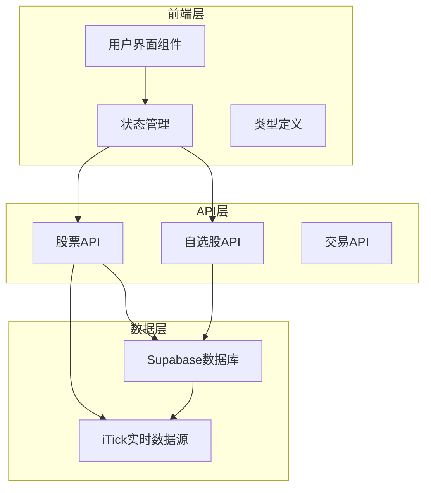
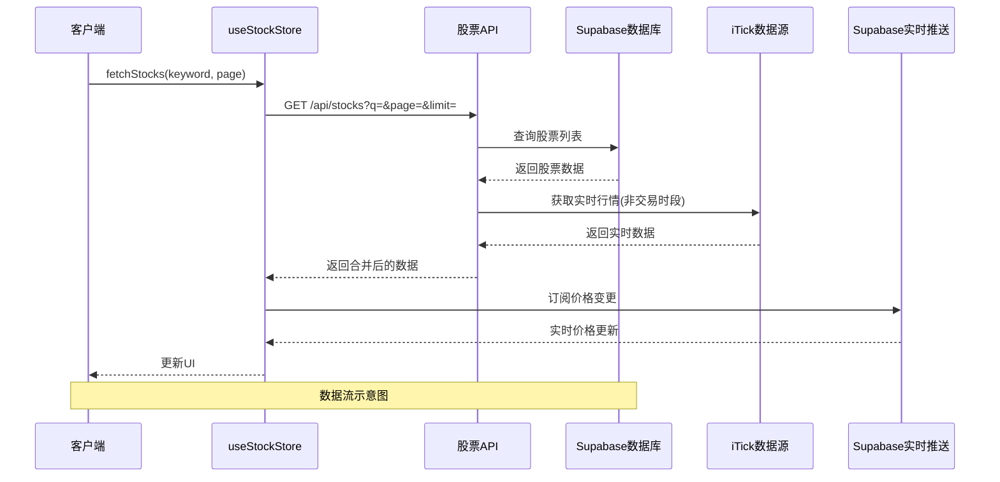
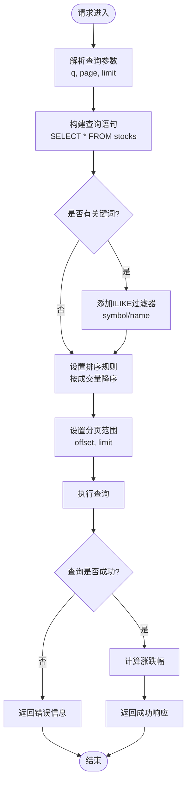
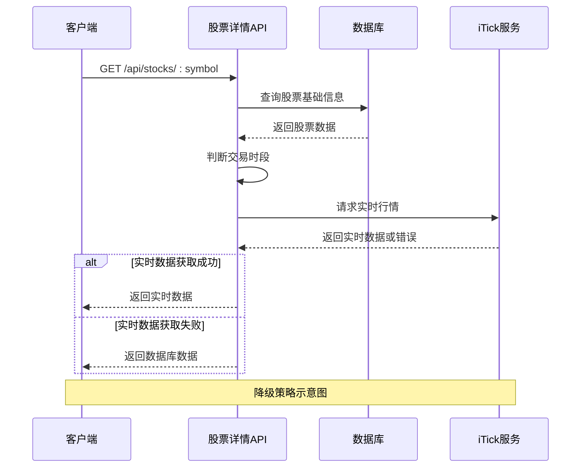
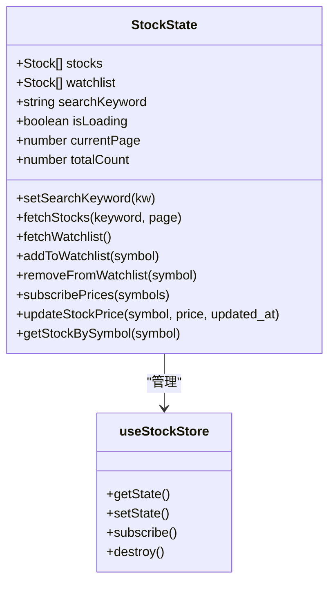
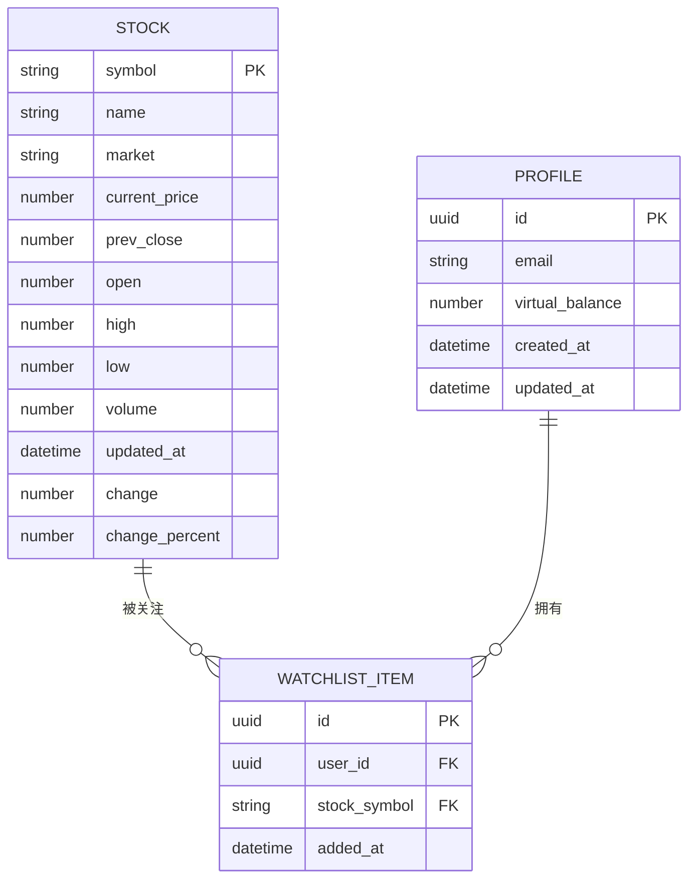
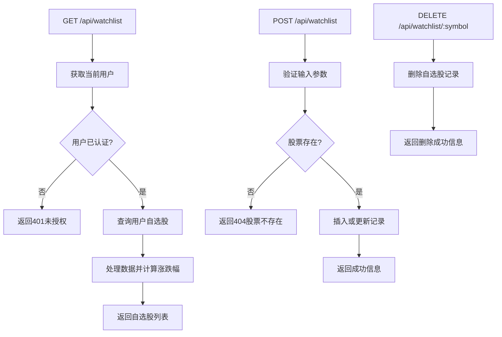
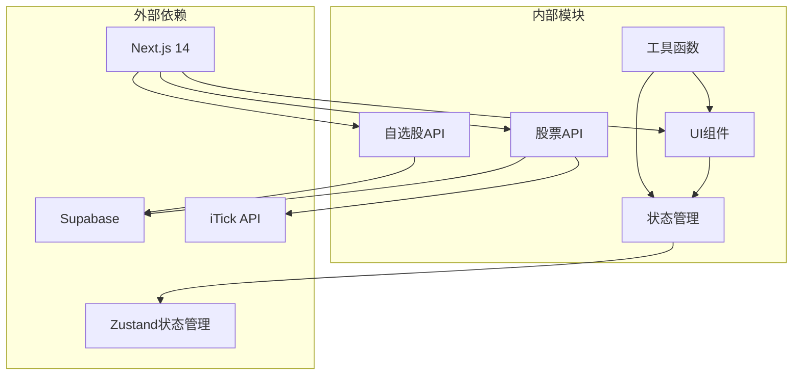

# 股票详情检索系统

<cite>
**本文档引用的文件**
- [README.md](file://README.md)
- [app/api/stocks/route.ts](file://app/api/stocks/route.ts)
- [app/api/stocks/[symbol]/route.ts](file://app/api/stocks/[symbol]/route.ts)
- [stores/useStockStore.ts](file://stores/useStockStore.ts)
- [lib/constants.ts](file://lib/constants.ts)
- [types/index.ts](file://types/index.ts)
- [components/stocks/StockList.tsx](file://components/stocks/StockList.tsx)
- [components/stocks/StockCard.tsx](file://components/stocks/StockCard.tsx)
- [app/api/watchlist/route.ts](file://app/api/watchlist/route.ts)
- [app/api/watchlist/[symbol]/route.ts](file://app/api/watchlist/[symbol]/route.ts)
- [lib/utils.ts](file://lib/utils.ts)
- [supabase/schema.sql](file://supabase/schema.sql)
- [app/(dashboard)/stocks/page.tsx](file://app/(dashboard)/stocks/page.tsx)
- [stores/index.ts](file://stores/index.ts)
- [lib/supabase/server.ts](file://lib/supabase/server.ts)
- [lib/supabase/client.ts](file://lib/supabase/client.ts)
</cite>

## 目录
1. [简介](#简介)
2. [项目结构](#项目结构)
3. [核心组件](#核心组件)
4. [架构总览](#架构总览)
5. [详细组件分析](#详细组件分析)
6. [依赖关系分析](#依赖关系分析)
7. [性能考虑](#性能考虑)
8. [故障排除指南](#故障排除指南)
9. [结论](#结论)

## 简介
本项目是一个基于 Next.js 14 App Router 的虚拟股票交易系统，提供股票详情检索、实时行情订阅、自选股管理、交易功能等核心能力。系统采用 Supabase 作为后端服务，结合实时推送机制实现股票价格的准实时更新。

## 项目结构
项目采用模块化的组织方式，主要分为以下层次：

**图表来源**
- [app/api/stocks/route.ts:1-69](file://app/api/stocks/route.ts#L1-L69)
- [stores/useStockStore.ts:1-184](file://stores/useStockStore.ts#L1-L184)
- [supabase/schema.sql:1-152](file://supabase/schema.sql#L1-L152)

**章节来源**
- [README.md:1-110](file://README.md#L1-L110)
- [stores/index.ts:1-7](file://stores/index.ts#L1-L7)

## 核心组件
系统的核心组件包括：

### 股票数据管理
- **useStockStore**: 管理股票列表、自选股、搜索状态和实时价格订阅
- **Stock 接口**: 定义股票数据结构，包含基础价格信息和计算字段
- **API 常量**: 配置分页大小、API 端点和刷新间隔

### 实时数据处理
- **Supabase Realtime**: 通过 PostgreSQL changes 实现实时价格更新
- **iTick 集成**: 提供准实时股票行情数据源
- **降级机制**: 当实时数据不可用时回退到数据库数据

### 用户界面组件
- **StockList**: 股票列表展示，支持搜索和分页
- **StockCard**: 单个股票卡片，显示详细信息和涨跌幅
- **响应式设计**: 支持移动端和桌面端的不同展示模式

**章节来源**
- [stores/useStockStore.ts:1-184](file://stores/useStockStore.ts#L1-L184)
- [types/index.ts:1-166](file://types/index.ts#L1-L166)
- [lib/constants.ts:70-95](file://lib/constants.ts#L70-L95)

## 架构总览

**图表来源**
- [stores/useStockStore.ts:33-57](file://stores/useStockStore.ts#L33-L57)
- [app/api/stocks/route.ts:6-68](file://app/api/stocks/route.ts#L6-L68)
- [app/api/stocks/[symbol]/route.ts](file://app/api/stocks/[symbol]/route.ts#L8-L70)

系统采用分层架构设计，确保了良好的可维护性和扩展性。

## 详细组件分析

### 股票API组件分析

#### 股票列表API
股票列表API实现了完整的搜索、分页和排序功能：

**图表来源**
- [app/api/stocks/route.ts:6-68](file://app/api/stocks/route.ts#L6-L68)

#### 股票详情API
股票详情API实现了智能的实时数据获取策略：

**图表来源**
- [app/api/stocks/[symbol]/route.ts](file://app/api/stocks/[symbol]/route.ts#L8-L70)

**章节来源**
- [app/api/stocks/route.ts:1-69](file://app/api/stocks/route.ts#L1-L69)
- [app/api/stocks/[symbol]/route.ts](file://app/api/stocks/[symbol]/route.ts#L1-L71)

### 状态管理组件分析

#### useStockStore 状态管理
使用 Zustand 实现的状态管理，包含以下核心功能：

**图表来源**
- [stores/useStockStore.ts:6-21](file://stores/useStockStore.ts#L6-L21)

**章节来源**
- [stores/useStockStore.ts:1-184](file://stores/useStockStore.ts#L1-L184)

### 数据模型组件分析

#### 股票数据模型
系统定义了完整的股票数据结构：

**图表来源**
- [types/index.ts:11-89](file://types/index.ts#L11-L89)
- [supabase/schema.sql:32-57](file://supabase/schema.sql#L32-L57)

**章节来源**
- [types/index.ts:1-166](file://types/index.ts#L1-L166)
- [supabase/schema.sql:1-152](file://supabase/schema.sql#L1-L152)

### 自选股管理组件分析

#### 自选股API流程
自选股管理实现了完整的 CRUD 操作：

**图表来源**
- [app/api/watchlist/route.ts:4-128](file://app/api/watchlist/route.ts#L4-L128)
- [app/api/watchlist/[symbol]/route.ts](file://app/api/watchlist/[symbol]/route.ts#L4-L49)

**章节来源**
- [app/api/watchlist/route.ts:1-129](file://app/api/watchlist/route.ts#L1-L129)
- [app/api/watchlist/[symbol]/route.ts](file://app/api/watchlist/[symbol]/route.ts#L1-L50)

## 依赖关系分析

**图表来源**
- [lib/supabase/server.ts:1-35](file://lib/supabase/server.ts#L1-L35)
- [lib/supabase/client.ts:1-9](file://lib/supabase/client.ts#L1-L9)

系统的关键依赖关系：
- **Next.js 14 App Router**: 提供路由和服务器组件支持
- **Supabase**: 提供数据库、认证和实时推送服务
- **iTick**: 提供准实时股票行情数据
- **Zustand**: 轻量级状态管理解决方案

**章节来源**
- [lib/supabase/server.ts:1-35](file://lib/supabase/server.ts#L1-L35)
- [lib/supabase/client.ts:1-9](file://lib/supabase/client.ts#L1-L9)

## 性能考虑

### 缓存策略
- **数据库索引优化**: 在 `stocks` 表上建立符号和更新时间索引
- **分页查询**: 限制最大分页大小，避免大数据集查询
- **实时订阅**: 使用 Supabase Realtime 减少轮询频率

### 数据一致性
- **降级机制**: 实时数据获取失败时自动回退到数据库数据
- **并发控制**: 使用 UPSERT 操作避免重复添加自选股
- **事务处理**: 关键操作在数据库层面保证原子性

### 前端优化
- **状态缓存**: 使用 Zustand 缓存股票数据，减少重复请求
- **防抖搜索**: 搜索输入采用防抖机制，降低 API 调用频率
- **懒加载**: 股票卡片组件支持懒加载，提升首屏性能

## 故障排除指南

### 常见问题及解决方案

#### 数据库连接问题
- **症状**: API 调用返回数据库错误
- **原因**: Supabase 连接配置不正确
- **解决**: 检查环境变量配置，确认数据库 URL 和密钥

#### 实时数据获取失败
- **症状**: 股票价格长时间不更新
- **原因**: iTick API 服务不可用或配额不足
- **解决**: 检查 iTick API 密钥配置，查看服务状态

#### 自选股操作失败
- **症状**: 添加或删除自选股返回错误
- **原因**: 用户未登录或股票代码无效
- **解决**: 确认用户认证状态，验证股票代码格式

#### 性能问题
- **症状**: 页面加载缓慢或响应延迟
- **原因**: 查询未使用索引或分页参数过大
- **解决**: 优化查询条件，调整分页大小

**章节来源**
- [app/api/stocks/route.ts:38-44](file://app/api/stocks/route.ts#L38-L44)
- [app/api/stocks/[symbol]/route.ts](file://app/api/stocks/[symbol]/route.ts#L53-L55)
- [app/api/watchlist/route.ts:12-17](file://app/api/watchlist/route.ts#L12-L17)

## 结论
本股票详情检索系统采用现代化的技术栈，实现了完整的股票数据检索、实时行情订阅和自选股管理功能。系统具有以下特点：

**技术优势**:
- 基于 Next.js 14 App Router 的现代架构
- Supabase 提供的全栈解决方案
- 实时数据推送机制确保数据及时性
- 响应式设计支持多设备访问

**功能完整性**:
- 股票搜索和筛选
- 实时价格更新
- 自选股管理
- 交易功能集成

**可扩展性**:
- 模块化设计便于功能扩展
- 清晰的组件边界
- 可配置的常量和策略

系统为虚拟股票交易提供了坚实的技术基础，具备良好的用户体验和开发维护性。