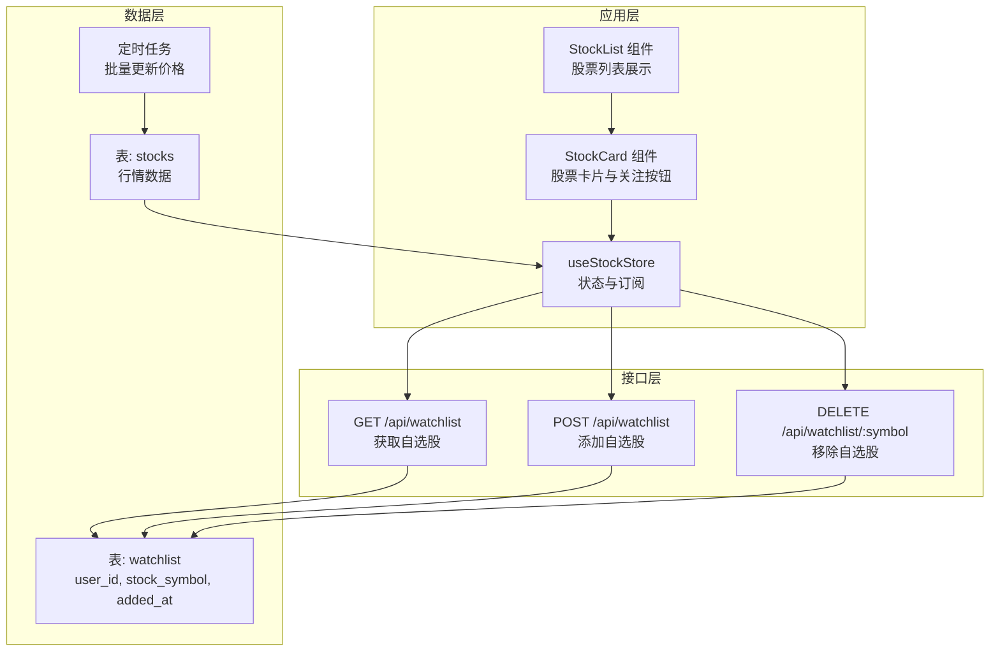
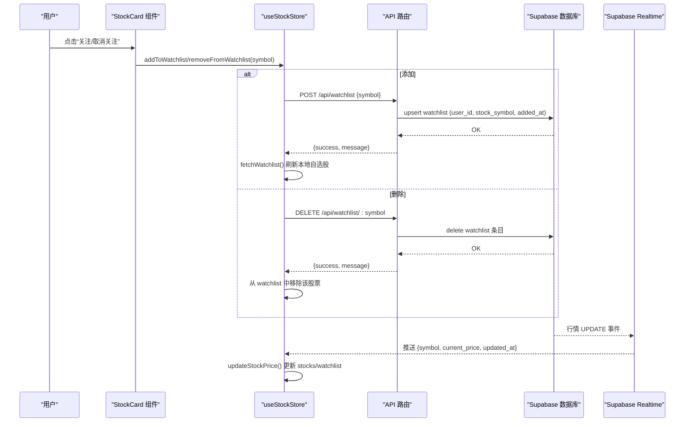
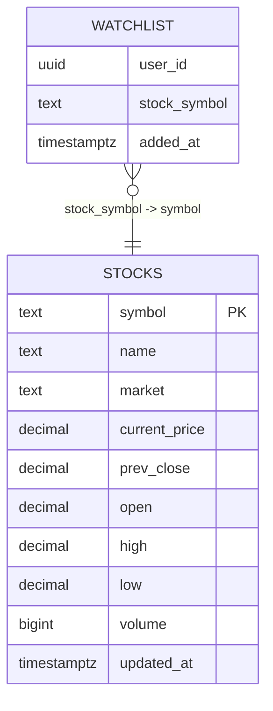
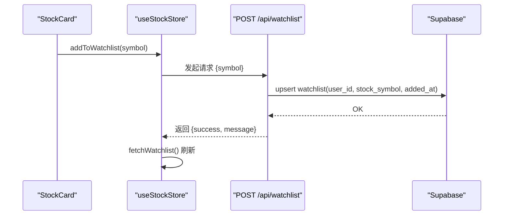
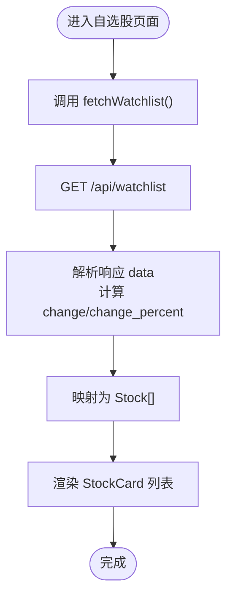
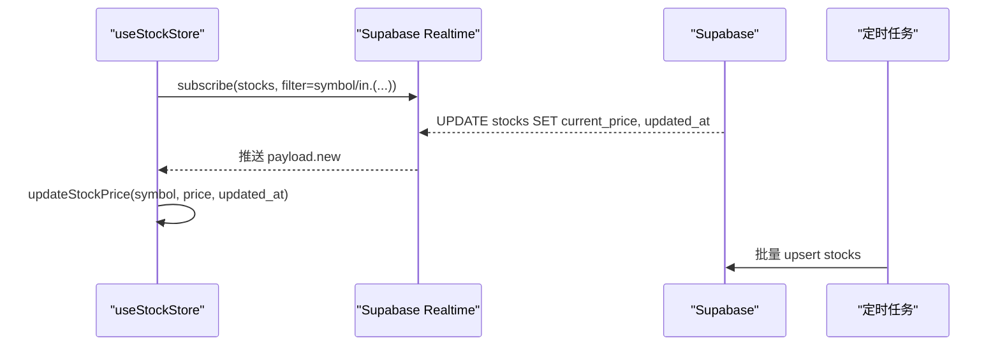
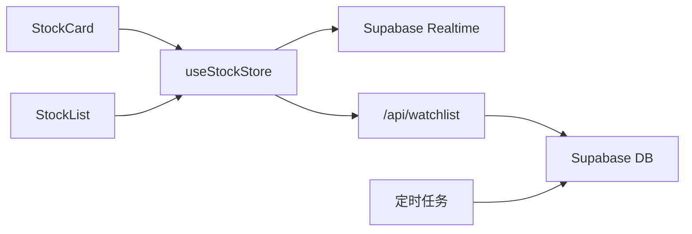

# 自选股系统

<cite>
**本文档引用的文件**
- [app/api/watchlist/route.ts](file://app/api/watchlist/route.ts)
- [app/api/watchlist/[symbol]/route.ts](file://app/api/watchlist/[symbol]/route.ts)
- [stores/useStockStore.ts](file://stores/useStockStore.ts)
- [components/stocks/StockList.tsx](file://components/stocks/StockList.tsx)
- [components/stocks/StockCard.tsx](file://components/stocks/StockCard.tsx)
- [types/index.ts](file://types/index.ts)
- [lib/supabase/client.ts](file://lib/supabase/client.ts)
- [lib/supabase/server.ts](file://lib/supabase/server.ts)
- [app/api/cron/update-prices/route.ts](file://app/api/cron/update-prices/route.ts)
- [lib/constants.ts](file://lib/constants.ts)
- [stores/useAuthStore.ts](file://stores/useAuthStore.ts)
- [docs/prd.md](file://docs/prd.md)
</cite>

## 目录
1. [简介](#简介)
2. [项目结构](#项目结构)
3. [核心组件](#核心组件)
4. [架构总览](#架构总览)
5. [详细组件分析](#详细组件分析)
6. [依赖关系分析](#依赖关系分析)
7. [性能考虑](#性能考虑)
8. [故障排除指南](#故障排除指南)
9. [结论](#结论)
10. [附录](#附录)

## 简介
本文件面向虚拟股票交易平台的“自选股”功能，系统性阐述自选股数据模型、添加/删除流程、列表展示逻辑、实时价格更新机制、与行情系统的集成方式，并提供API接口规范与前端组件实现指南。目标是帮助开发者与产品人员快速理解并扩展自选股能力。

## 项目结构
自选股系统由三层组成：
- 数据层：Supabase 表结构（用户、股票、自选股）与定时任务驱动的价格更新
- 接口层：Next.js App Router API 路由（获取、添加、删除自选股）
- 应用层：Zustand 状态管理 + React 组件（列表展示、交互、订阅）

图表来源
- [stores/useStockStore.ts:1-184](file://stores/useStockStore.ts#L1-L184)
- [app/api/watchlist/route.ts:1-129](file://app/api/watchlist/route.ts#L1-L129)
- [app/api/watchlist/[symbol]/route.ts:1-50](file://app/api/watchlist/[symbol]/route.ts#L1-L50)
- [app/api/cron/update-prices/route.ts:1-150](file://app/api/cron/update-prices/route.ts#L1-L150)
- [docs/prd.md:158-166](file://docs/prd.md#L158-L166)

章节来源
- [stores/useStockStore.ts:1-184](file://stores/useStockStore.ts#L1-L184)
- [app/api/watchlist/route.ts:1-129](file://app/api/watchlist/route.ts#L1-L129)
- [app/api/watchlist/[symbol]/route.ts:1-50](file://app/api/watchlist/[symbol]/route.ts#L1-L50)
- [app/api/cron/update-prices/route.ts:1-150](file://app/api/cron/update-prices/route.ts#L1-L150)
- [docs/prd.md:158-166](file://docs/prd.md#L158-L166)

## 核心组件
- 数据模型
  - WatchlistItem：包含 user_id、stock_symbol、added_at，以及可选关联的 Stock 对象
  - Stock：包含 symbol、name、market、current_price、prev_close、open、high、low、volume、updated_at 等字段；支持计算字段 change 和 change_percent
- 状态管理
  - useStockStore：维护 stocks、watchlist、搜索关键词、分页、加载状态；提供 fetchWatchlist、addToWatchlist、removeFromWatchlist、subscribePrices、updateStockPrice 等方法
- 前端组件
  - StockList：负责搜索、分页、加载骨架屏、渲染 StockCard
  - StockCard：展示股票详情、涨跌图标与百分比、关注/取消关注按钮
- Supabase 客户端
  - 浏览器端与服务端客户端封装，用于 API 层与前端状态管理

章节来源
- [types/index.ts:82-89](file://types/index.ts#L82-L89)
- [types/index.ts:10-25](file://types/index.ts#L10-L25)
- [stores/useStockStore.ts:6-21](file://stores/useStockStore.ts#L6-L21)
- [components/stocks/StockList.tsx:13-33](file://components/stocks/StockList.tsx#L13-L33)
- [components/stocks/StockCard.tsx:11-27](file://components/stocks/StockCard.tsx#L11-L27)
- [lib/supabase/client.ts:1-9](file://lib/supabase/client.ts#L1-L9)
- [lib/supabase/server.ts:1-35](file://lib/supabase/server.ts#L1-L35)

## 架构总览
自选股系统采用“API 路由 + 状态管理 + 实时订阅”的架构模式：
- API 路由负责鉴权、数据查询与写入
- 状态管理负责本地缓存、列表渲染与实时更新
- Supabase Realtime 订阅负责推送行情变更
- 定时任务负责批量拉取外部行情并写入数据库

图表来源
- [components/stocks/StockCard.tsx:34-52](file://components/stocks/StockCard.tsx#L34-L52)
- [stores/useStockStore.ts:80-123](file://stores/useStockStore.ts#L80-L123)
- [app/api/watchlist/route.ts:58-128](file://app/api/watchlist/route.ts#L58-L128)
- [app/api/watchlist/[symbol]/route.ts:4-49](file://app/api/watchlist/[symbol]/route.ts#L4-L49)
- [stores/useStockStore.ts:125-177](file://stores/useStockStore.ts#L125-L177)

## 详细组件分析

### 数据模型设计
- watchlist 表
  - 主键：(user_id, stock_symbol)，确保同一用户对同一股票仅能存在一条记录
  - 外键：user_id 引用 profiles(id)，stock_symbol 引用 stocks(symbol)
  - 字段：added_at 记录添加时间
- stocks 表
  - 主键：symbol
  - 字段：name、market、current_price、prev_close、open、high、low、volume、updated_at
- 类型定义
  - WatchlistItem：包含 user_id、stock_symbol、added_at、可选关联 Stock
  - Stock：包含基础字段与计算字段 change、change_percent

图表来源
- [docs/prd.md:158-166](file://docs/prd.md#L158-L166)
- [types/index.ts:82-89](file://types/index.ts#L82-L89)
- [types/index.ts:10-25](file://types/index.ts#L10-L25)

章节来源
- [docs/prd.md:158-166](file://docs/prd.md#L158-L166)
- [types/index.ts:82-89](file://types/index.ts#L82-L89)
- [types/index.ts:10-25](file://types/index.ts#L10-L25)

### 添加与删除自选股
- 添加流程
  - 前端调用 useStockStore.addToWatchlist(symbol)
  - 触发 POST /api/watchlist，校验登录与股票存在性后 upsert watchlist
  - 成功后刷新本地 watchlist
- 删除流程
  - 前端调用 useStockStore.removeFromWatchlist(symbol)
  - 触发 DELETE /api/watchlist/:symbol，按 user_id 与 stock_symbol 删除
  - 成功后从本地 watchlist 过滤掉该股票

图表来源
- [components/stocks/StockCard.tsx:44-51](file://components/stocks/StockCard.tsx#L44-L51)
- [stores/useStockStore.ts:80-100](file://stores/useStockStore.ts#L80-L100)
- [app/api/watchlist/route.ts:58-128](file://app/api/watchlist/route.ts#L58-L128)

章节来源
- [stores/useStockStore.ts:80-123](file://stores/useStockStore.ts#L80-L123)
- [app/api/watchlist/route.ts:58-128](file://app/api/watchlist/route.ts#L58-L128)
- [app/api/watchlist/[symbol]/route.ts:4-49](file://app/api/watchlist/[symbol]/route.ts#L4-L49)

### 自选股列表展示逻辑
- 数据加载
  - useStockStore.fetchWatchlist 通过 GET /api/watchlist 获取自选股列表
  - 后端返回数据包含 watchlist 条目及关联的 stock 详情，并计算 change 与 change_percent
  - 前端将返回的 stock 字段映射为 Stock 数组，填充 watchlist
- 排序规则
  - 后端按 added_at 降序排列，最近添加的排在前面
- 批量操作
  - 当前实现支持逐条添加/删除；如需批量操作，可在前端聚合 symbol 列表后调用后端批量接口（如有）

图表来源
- [stores/useStockStore.ts:59-78](file://stores/useStockStore.ts#L59-L78)
- [app/api/watchlist/route.ts:4-56](file://app/api/watchlist/route.ts#L4-L56)

章节来源
- [stores/useStockStore.ts:59-78](file://stores/useStockStore.ts#L59-L78)
- [app/api/watchlist/route.ts:4-56](file://app/api/watchlist/route.ts#L4-L56)

### 实时价格更新机制
- 订阅机制
  - useStockStore.subscribePrices 基于 Supabase Realtime 订阅 stocks 表的 UPDATE 事件
  - 可按传入的 symbol 列表过滤，或订阅全部股票
- 数据推送与更新
  - 收到 UPDATE 事件后，调用 updateStockPrice 同步更新 stocks 与 watchlist 中对应股票的 current_price、updated_at、change、change_percent
- 定时任务
  - 定时任务每轮遍历所有股票，分批调用外部行情接口，批量 upsert 到 stocks 表
  - 交易时段检查与批量大小控制，避免超时与限流

图表来源
- [stores/useStockStore.ts:125-177](file://stores/useStockStore.ts#L125-L177)
- [app/api/cron/update-prices/route.ts:57-131](file://app/api/cron/update-prices/route.ts#L57-L131)

章节来源
- [stores/useStockStore.ts:125-177](file://stores/useStockStore.ts#L125-L177)
- [app/api/cron/update-prices/route.ts:1-150](file://app/api/cron/update-prices/route.ts#L1-L150)

### 与股票行情系统的集成
- 外部行情源
  - 定时任务通过外部 API 拉取报价，批量写入 stocks 表
- 内部订阅
  - 前端通过 Supabase Realtime 订阅 stocks 表，实现近实时更新
- 数据一致性
  - 定时任务保证离线/异常场景下的价格补全；实时订阅提供即时体验

章节来源
- [app/api/cron/update-prices/route.ts:62-120](file://app/api/cron/update-prices/route.ts#L62-L120)
- [stores/useStockStore.ts:125-149](file://stores/useStockStore.ts#L125-L149)

### 用户个性化推荐与重要性排序
- 当前实现
  - 自选股列表按 added_at 降序排列，体现“最近关注”优先
- 可扩展方案
  - 基于用户行为（查看次数、交易频率）、市场热度（涨跌幅、成交量）、风险偏好（止盈止损设置）构建推荐分数
  - 在前端对 watchlist 进行二次排序：推荐分数高的置顶，随后按 added_at 倒序
  - 建议在后端新增排序参数或提供独立推荐接口，前端根据策略动态调整显示顺序

[本节为概念性建议，不直接分析具体文件]

## 依赖关系分析
- 组件耦合
  - StockCard 依赖 useStockStore 的 addToWatchlist/removeFromWatchlist 与 useUIStore 的 toast 提示
  - StockList 依赖 useStockStore 的 fetchStocks、分页与总数
- 状态管理
  - useStockStore 统一管理 stocks 与 watchlist，避免重复请求与状态分散
- 外部依赖
  - Supabase Realtime 作为实时订阅通道
  - 定时任务作为离线数据补充

图表来源
- [components/stocks/StockCard.tsx:26-27](file://components/stocks/StockCard.tsx#L26-L27)
- [components/stocks/StockList.tsx:24-32](file://components/stocks/StockList.tsx#L24-L32)
- [stores/useStockStore.ts:125-177](file://stores/useStockStore.ts#L125-L177)
- [app/api/watchlist/route.ts:19-26](file://app/api/watchlist/route.ts#L19-L26)
- [app/api/cron/update-prices/route.ts:29-50](file://app/api/cron/update-prices/route.ts#L29-L50)

章节来源
- [components/stocks/StockCard.tsx:26-27](file://components/stocks/StockCard.tsx#L26-L27)
- [components/stocks/StockList.tsx:24-32](file://components/stocks/StockList.tsx#L24-L32)
- [stores/useStockStore.ts:125-177](file://stores/useStockStore.ts#L125-L177)
- [app/api/watchlist/route.ts:19-26](file://app/api/watchlist/route.ts#L19-L26)
- [app/api/cron/update-prices/route.ts:29-50](file://app/api/cron/update-prices/route.ts#L29-L50)

## 性能考虑
- 请求合并与去抖
  - StockList 对搜索输入使用防抖，减少不必要的请求
- 分页与批量
  - 定时任务按批次拉取行情，避免单次请求过大导致超时
- 实时订阅粒度
  - subscribePrices 支持按 symbol 列表过滤，降低订阅负载
- 状态更新
  - updateStockPrice 使用映射更新，避免全量重渲染

章节来源
- [components/stocks/StockList.tsx:42-49](file://components/stocks/StockList.tsx#L42-L49)
- [app/api/cron/update-prices/route.ts:57-131](file://app/api/cron/update-prices/route.ts#L57-L131)
- [stores/useStockStore.ts:125-177](file://stores/useStockStore.ts#L125-L177)

## 故障排除指南
- 未登录访问
  - API 路由在 getUser 失败时返回 401，前端应引导登录
- 股票不存在
  - 添加自选股前校验 stock_symbol 存在性，否则返回 404
- 网络错误
  - useStockStore 对 fetch 失败统一返回 { error: '网络错误' }，前端应提示并重试
- 实时订阅未生效
  - 确认 Supabase Realtime 通道已正确订阅并返回 payload.new
- 定时任务异常
  - 检查 CRON_SECRET、交易时段判断、外部 API 超时与返回格式

章节来源
- [app/api/watchlist/route.ts:10-17](file://app/api/watchlist/route.ts#L10-L17)
- [app/api/watchlist/route.ts:83-95](file://app/api/watchlist/route.ts#L83-L95)
- [stores/useStockStore.ts:80-123](file://stores/useStockStore.ts#L80-L123)
- [stores/useStockStore.ts:125-177](file://stores/useStockStore.ts#L125-L177)
- [app/api/cron/update-prices/route.ts:12-27](file://app/api/cron/update-prices/route.ts#L12-L27)

## 结论
自选股系统以清晰的数据模型与稳定的 API 路由为基础，结合前端状态管理与 Supabase 实时订阅，实现了可靠的添加/删除、列表展示与实时价格更新。通过定时任务保障离线场景下的数据完整性。未来可在推荐与排序方面进一步增强个性化体验。

## 附录

### API 接口规范
- 获取自选股列表
  - 方法：GET
  - 路径：/api/watchlist
  - 认证：必需
  - 查询：无
  - 响应：data 为 WatchlistItem[]，其中每个条目包含关联的 Stock 详情，并计算 change 与 change_percent
  - 排序：added_at 降序
- 添加自选股
  - 方法：POST
  - 路径：/api/watchlist
  - 认证：必需
  - 请求体：{ symbol: string }
  - 响应：{ success: true, symbol, message }
  - 错误：400（缺少 symbol）、404（股票不存在）、500（服务器错误）
- 移除自选股
  - 方法：DELETE
  - 路径：/api/watchlist/:symbol
  - 认证：必需
  - 参数：symbol
  - 响应：{ success: true, symbol, message }
  - 错误：401（未登录）、500（服务器错误）

章节来源
- [app/api/watchlist/route.ts:4-56](file://app/api/watchlist/route.ts#L4-L56)
- [app/api/watchlist/route.ts:58-128](file://app/api/watchlist/route.ts#L58-L128)
- [app/api/watchlist/[symbol]/route.ts:4-49](file://app/api/watchlist/[symbol]/route.ts#L4-L49)

### 前端组件实现指南
- StockList
  - 负责搜索、分页、加载骨架屏与渲染 StockCard
  - 通过 useStockStore.fetchStocks 与 useStockStore.searchKeyword 控制数据加载
- StockCard
  - 展示股票名称、代码、当前价、涨跌与涨跌幅
  - 提供“关注/取消关注”按钮，调用 useStockStore.addToWatchlist 或 removeFromWatchlist
  - 支持 compact 模式用于移动端
- useStockStore
  - 提供 fetchWatchlist、addToWatchlist、removeFromWatchlist、subscribePrices、updateStockPrice 等方法
  - 维护 stocks 与 watchlist 两套状态，便于区分“全部股票”与“自选股”

章节来源
- [components/stocks/StockList.tsx:19-135](file://components/stocks/StockList.tsx#L19-L135)
- [components/stocks/StockCard.tsx:19-149](file://components/stocks/StockCard.tsx#L19-L149)
- [stores/useStockStore.ts:23-183](file://stores/useStockStore.ts#L23-L183)