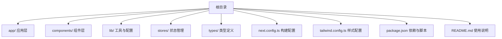
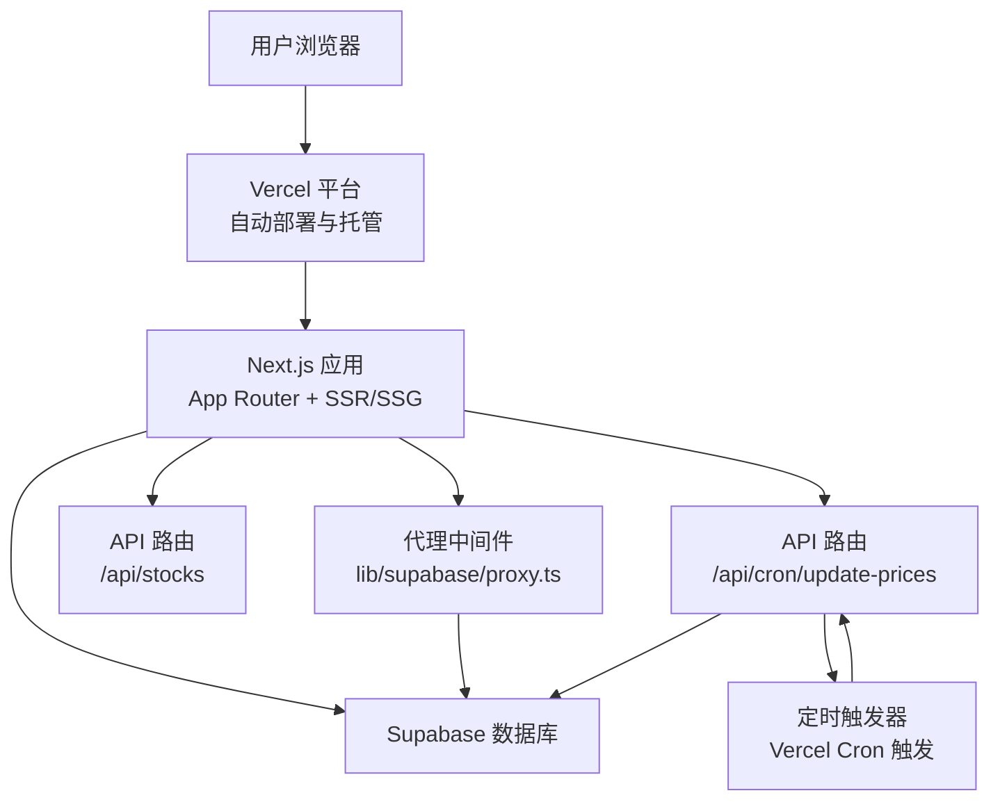
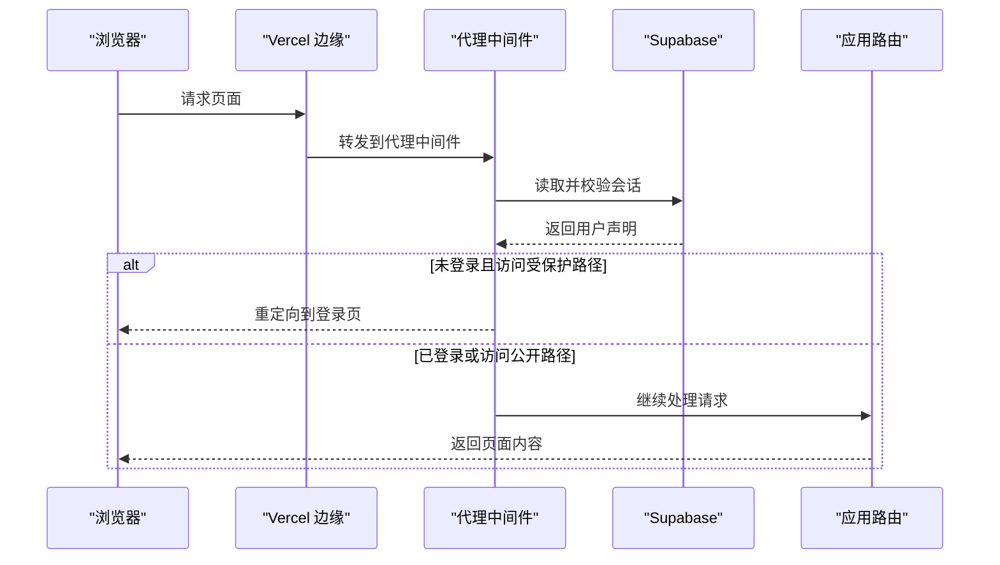
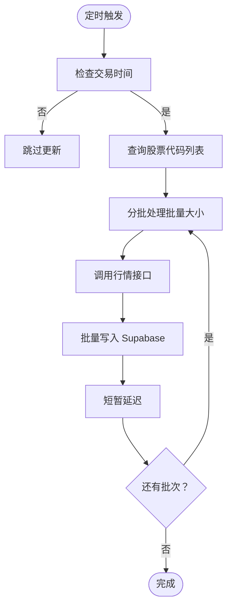
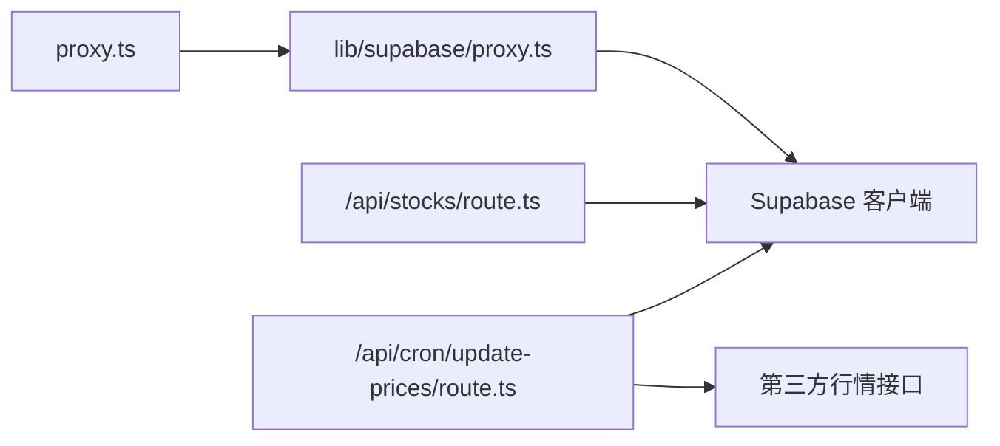

# 云平台部署

<cite>
**本文引用的文件**
- [package.json](file://package.json)
- [next.config.ts](file://next.config.ts)
- [README.md](file://README.md)
- [lib/constants.ts](file://lib/constants.ts)
- [lib/utils.ts](file://lib/utils.ts)
- [lib/supabase/proxy.ts](file://lib/supabase/proxy.ts)
- [proxy.ts](file://proxy.ts)
- [app/api/cron/update-prices/route.ts](file://app/api/cron/update-prices/route.ts)
- [app/api/stocks/route.ts](file://app/api/stocks/route.ts)
- [stores/index.ts](file://stores/index.ts)
- [types/index.ts](file://types/index.ts)
- [tailwind.config.ts](file://tailwind.config.ts)
</cite>

## 目录
1. [简介](#简介)
2. [项目结构](#项目结构)
3. [核心组件](#核心组件)
4. [架构总览](#架构总览)
5. [详细组件分析](#详细组件分析)
6. [依赖关系分析](#依赖关系分析)
7. [性能考量](#性能考量)
8. [故障排查指南](#故障排查指南)
9. [结论](#结论)
10. [附录](#附录)

## 简介
本文件面向云平台部署场景，聚焦于使用 Vercel 托管 Next.js 应用的完整流程与配置要点。内容涵盖构建配置、环境变量管理、静态资源优化与缓存策略、Git 仓库集成与自动部署、域名绑定与 SSL、生产与开发环境差异、部署前准备清单、常见问题与回滚策略等。文档同时结合项目现有代码，给出可操作的步骤与注意事项。

## 项目结构
该项目为基于 Next.js 的 App Router 项目，采用 TypeScript、Tailwind CSS 与 Zustand 状态管理，集成了 Supabase 用于认证与数据库访问。核心目录与文件如下：
- 应用入口与页面：app/
- 组件与 UI：components/
- 工具与常量：lib/
- 类型定义：types/
- 状态管理：stores/
- 构建与样式配置：next.config.ts、tailwind.config.ts、postcss.config.mjs、tsconfig.json
- 包管理与脚本：package.json、pnpm-lock.yaml
- 文档与示例：docs/、README.md

章节来源
- [package.json:1-44](file://package.json#L1-L44)
- [next.config.ts:1-8](file://next.config.ts#L1-L8)
- [tailwind.config.ts:1-64](file://tailwind.config.ts#L1-L64)

## 核心组件
- 构建与运行脚本：通过 package.json 中的 scripts 管理开发、构建与启动流程。
- Next.js 配置：next.config.ts 启用组件缓存以提升渲染性能。
- Supabase 代理与会话：lib/supabase/proxy.ts 提供服务端会话同步与登录保护；proxy.ts 定义中间件匹配路径。
- API 路由：app/api 下提供定时任务与数据查询接口，支撑股价更新与列表查询。
- 环境变量与常量：lib/constants.ts 定义交易与 API 常量，读取自进程环境；lib/utils.ts 提供环境变量检查工具。
- 类型与状态：types/index.ts 定义交易、持仓、订单等核心类型；stores/index.ts 统一导出各 store。

章节来源
- [package.json:3-8](file://package.json#L3-L8)
- [next.config.ts:3-5](file://next.config.ts#L3-L5)
- [lib/supabase/proxy.ts:5-76](file://lib/supabase/proxy.ts#L5-L76)
- [proxy.ts:4-20](file://proxy.ts#L4-L20)
- [app/api/cron/update-prices/route.ts:1-150](file://app/api/cron/update-prices/route.ts#L1-L150)
- [app/api/stocks/route.ts:1-69](file://app/api/stocks/route.ts#L1-L69)
- [lib/constants.ts:1-101](file://lib/constants.ts#L1-L101)
- [lib/utils.ts:8-11](file://lib/utils.ts#L8-L11)
- [types/index.ts:1-166](file://types/index.ts#L1-L166)
- [stores/index.ts:1-7](file://stores/index.ts#L1-L7)

## 架构总览
下图展示从浏览器到 Vercel 平台、Next.js 服务端与 Supabase 数据库的整体交互路径，以及定时任务的触发机制。

图表来源
- [lib/supabase/proxy.ts:5-76](file://lib/supabase/proxy.ts#L5-L76)
- [proxy.ts:4-20](file://proxy.ts#L4-L20)
- [app/api/stocks/route.ts:1-69](file://app/api/stocks/route.ts#L1-L69)
- [app/api/cron/update-prices/route.ts:1-150](file://app/api/cron/update-prices/route.ts#L1-L150)

## 详细组件分析

### Vercel 部署流程与配置
- 创建与连接
  - 在 Vercel 控制台新建项目，选择 Git 仓库（如 GitHub），授权后选择对应仓库。
  - Vercel 将自动检测项目根目录的构建命令与输出目录（Next.js 默认使用 next build 与 .next 输出）。
  - 若使用 Supabase 集成，部署过程中会自动注入必要的环境变量，确保应用可直接访问 Supabase。
- 自动部署
  - 推送代码至默认分支后，Vercel 触发构建与部署流水线。
  - 可在项目设置中开启“生产分支”与“预览分支”，实现不同环境的差异化部署。
- 构建与运行
  - 构建命令：next build
  - 运行命令：next start
  - 开发模式：next dev（本地开发）

章节来源
- [README.md:40-51](file://README.md#L40-L51)
- [package.json:3-7](file://package.json#L3-L7)

### Next.js 构建配置与缓存策略
- 组件缓存
  - 启用 cacheComponents 以复用组件渲染结果，降低重复计算开销。
- 静态资源优化
  - 使用 App Router 的静态资源处理能力，配合 Vercel 的边缘网络进行全球加速。
  - Tailwind CSS 与 PostCSS 配置支持按需生成样式，减少包体积。
- 缓存策略
  - 通过 Vercel 的 ISR/SSR/SSG 策略控制页面缓存与更新频率，结合 API 路由的动态响应实现灵活的缓存控制。

章节来源
- [next.config.ts:3-5](file://next.config.ts#L3-L5)
- [tailwind.config.ts:1-64](file://tailwind.config.ts#L1-L64)

### 环境变量管理（生产与开发）
- 必需变量
  - NEXT_PUBLIC_SUPABASE_URL：Supabase 项目地址
  - NEXT_PUBLIC_SUPABASE_PUBLISHABLE_KEY：Supabase 可发布密钥
- 业务相关变量
  - NEXT_PUBLIC_INITIAL_BALANCE、NEXT_PUBLIC_TRADE_FEE_RATE、NEXT_PUBLIC_MIN_TRADE_FEE、NEXT_PUBLIC_STAMP_TAX_RATE：交易初始资金与费率
  - NEXT_PUBLIC_ENABLE_ANALYSIS：功能开关
  - ITICK_API_ENDPOINT、ITICK_API_KEY：第三方行情接口
  - CRON_SECRET：定时任务访问密钥
- 生产与开发差异
  - 开发环境建议使用 .env.local 存放本地变量；生产环境通过 Vercel 项目设置注入。
  - 对于公开变量（NEXT_PUBLIC_*），可在客户端安全使用；私有变量（不含 NEXT_PUBLIC_）仅在服务端可用。

章节来源
- [lib/utils.ts:8-11](file://lib/utils.ts#L8-L11)
- [lib/constants.ts:4-79](file://lib/constants.ts#L4-L79)
- [app/api/cron/update-prices/route.ts:6-7](file://app/api/cron/update-prices/route.ts#L6-L7)

### 会话代理与登录保护
- 代理逻辑
  - 通过 lib/supabase/proxy.ts 创建服务端 Supabase 客户端，同步 Cookie 与会话状态。
  - 在请求进入时读取用户声明（claims），未登录且访问受保护路径时重定向至登录页。
- 匹配规则
  - proxy.ts 定义 matcher，排除静态资源与图片等文件，对动态路由生效。

图表来源
- [lib/supabase/proxy.ts:5-76](file://lib/supabase/proxy.ts#L5-L76)
- [proxy.ts:4-20](file://proxy.ts#L4-L20)

### API 路由与定时任务
- 股价更新（定时任务）
  - 路径：/api/cron/update-prices
  - 功能：在交易时间内批量拉取行情并写入 Supabase；支持 x-cron-secret 访问控制。
  - 触发方式：Vercel Cron 触发器按计划调用该路由。
- 股票列表查询
  - 路径：/api/stocks
  - 功能：支持关键词搜索、分页与排序，返回带涨跌幅计算的数据。

图表来源
- [app/api/cron/update-prices/route.ts:10-150](file://app/api/cron/update-prices/route.ts#L10-L150)

章节来源
- [app/api/cron/update-prices/route.ts:1-150](file://app/api/cron/update-prices/route.ts#L1-L150)
- [app/api/stocks/route.ts:1-69](file://app/api/stocks/route.ts#L1-L69)

### 域名绑定与 SSL
- 域名绑定
  - 在 Vercel 项目设置中添加自定义域名，指向平台提供的 CNAME 或 TXT 记录。
- SSL 证书
  - Vercel 自动生成并管理免费的 Let’s Encrypt 证书，无需额外配置。
- HTTPS 强制
  - 建议启用强制 HTTPS，确保所有流量走加密通道。

（本节为通用实践说明，不直接分析具体源码文件）

### 部署前准备清单
- 代码与仓库
  - 确保仓库包含完整的构建产物与配置文件（next.config.ts、tailwind.config.ts、package.json）。
- Supabase 配置
  - 在 Supabase 控制台创建项目，复制 NEXT_PUBLIC_SUPABASE_URL 与 NEXT_PUBLIC_SUPABASE_PUBLISHABLE_KEY。
- Vercel 项目
  - 新建项目并连接 Git 仓库；确认自动部署已启用。
  - 在项目设置中添加环境变量（NEXT_PUBLIC_* 与私有变量）。
- 定时任务
  - 在 Vercel 控制台为 /api/cron/update-prices 配置 Cron 触发器，设置合适的周期与密钥。
- 域名与 SSL
  - 在 Vercel 添加自定义域名并完成 DNS 校验；确认 SSL 证书生效。

（本节为通用实践说明，不直接分析具体源码文件）

### 部署验证与回滚策略
- 部署验证
  - 访问首页与受保护页面，确认登录状态正常。
  - 调用 /api/stocks 验证数据查询接口；调用 /api/cron/update-prices 并携带 x-cron-secret 验证定时任务。
- 回滚策略
  - Vercel 支持“回滚到上次成功部署”的快速回滚操作。
  - 如需更细粒度控制，可保留历史版本并在项目设置中选择特定提交进行回滚。

（本节为通用实践说明，不直接分析具体源码文件）

## 依赖关系分析
- 组件耦合
  - 代理中间件与 Supabase 客户端紧密耦合，确保会话一致性。
  - API 路由依赖 Supabase 客户端与第三方行情接口，需严格管理环境变量。
- 外部依赖
  - Next.js、React、Tailwind CSS、Zustand、Supabase SS/JS。
- 潜在风险
  - 环境变量缺失可能导致代理跳过校验，影响登录保护；需在 Vercel 设置中补齐。

图表来源
- [lib/supabase/proxy.ts:5-76](file://lib/supabase/proxy.ts#L5-L76)
- [proxy.ts:4-20](file://proxy.ts#L4-L20)
- [app/api/stocks/route.ts:1-69](file://app/api/stocks/route.ts#L1-L69)
- [app/api/cron/update-prices/route.ts:1-150](file://app/api/cron/update-prices/route.ts#L1-L150)

章节来源
- [lib/supabase/proxy.ts:5-76](file://lib/supabase/proxy.ts#L5-L76)
- [proxy.ts:4-20](file://proxy.ts#L4-L20)
- [app/api/stocks/route.ts:1-69](file://app/api/stocks/route.ts#L1-L69)
- [app/api/cron/update-prices/route.ts:1-150](file://app/api/cron/update-prices/route.ts#L1-L150)

## 性能考量
- 组件缓存：next.config.ts 中启用 cacheComponents，减少重复渲染成本。
- 样式与资源：Tailwind 按需生成，结合 Vercel 边缘网络加速静态资源。
- API 限流与批处理：定时任务按批量大小拉取行情，避免瞬时压力过大。
- 会话同步：代理中间件在每次请求创建独立客户端，避免全局状态导致的会话错配。

章节来源
- [next.config.ts:3-5](file://next.config.ts#L3-L5)
- [tailwind.config.ts:1-64](file://tailwind.config.ts#L1-L64)
- [app/api/cron/update-prices/route.ts:53-131](file://app/api/cron/update-prices/route.ts#L53-L131)
- [lib/supabase/proxy.ts:16-39](file://lib/supabase/proxy.ts#L16-L39)

## 故障排查指南
- 登录后被重定向到登录页
  - 检查环境变量是否正确注入（NEXT_PUBLIC_SUPABASE_URL、NEXT_PUBLIC_SUPABASE_PUBLISHABLE_KEY）。
  - 确认代理中间件未因环境变量缺失而跳过校验。
- 定时任务 401
  - 确认 x-cron-secret 与 CRON_SECRET 一致；检查 Vercel Cron 触发器配置。
- 股价更新失败
  - 检查 ITICK_API_KEY 与 ITICK_API_ENDPOINT 是否正确；关注交易时间判断逻辑。
- 数据查询异常
  - 检查 Supabase 表结构与权限；确认查询参数（分页、关键字）合法。

章节来源
- [lib/utils.ts:8-11](file://lib/utils.ts#L8-L11)
- [lib/supabase/proxy.ts:10-14](file://lib/supabase/proxy.ts#L10-L14)
- [app/api/cron/update-prices/route.ts:13-19](file://app/api/cron/update-prices/route.ts#L13-L19)
- [app/api/stocks/route.ts:10-17](file://app/api/stocks/route.ts#L10-L17)

## 结论
本项目具备良好的 Next.js 与 Vercel 集成基础：明确的构建配置、完善的代理与会话保护、清晰的 API 路由与定时任务设计。按照本文提供的部署流程、配置要点与排障建议，可顺利完成 Vercel 上的上线与运维工作。建议在生产环境中严格管理环境变量、完善监控与日志，并定期评估缓存与性能策略。

## 附录
- 关键类型与状态
  - 类型定义集中于 types/index.ts，覆盖用户、股票、订单、交易统计等核心领域模型。
  - 状态统一导出于 stores/index.ts，便于在组件中按需引入。
- 常用工具函数
  - lib/utils.ts 提供格式化与环境变量检查等通用方法。

章节来源
- [types/index.ts:1-166](file://types/index.ts#L1-L166)
- [stores/index.ts:1-7](file://stores/index.ts#L1-L7)
- [lib/utils.ts:14-46](file://lib/utils.ts#L14-L46)