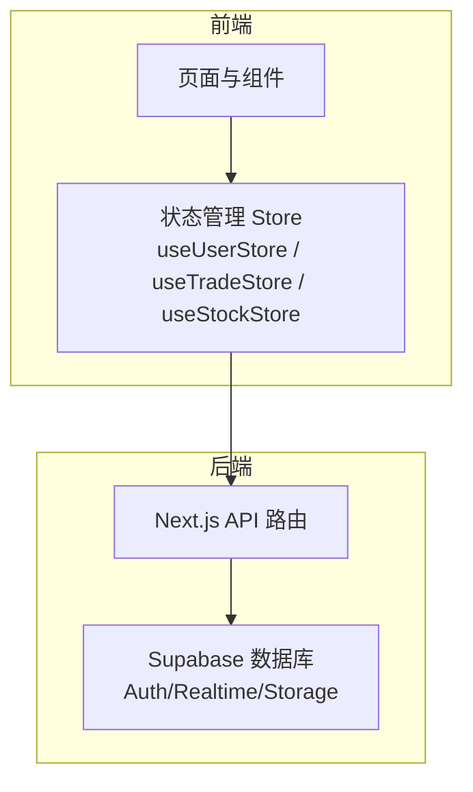
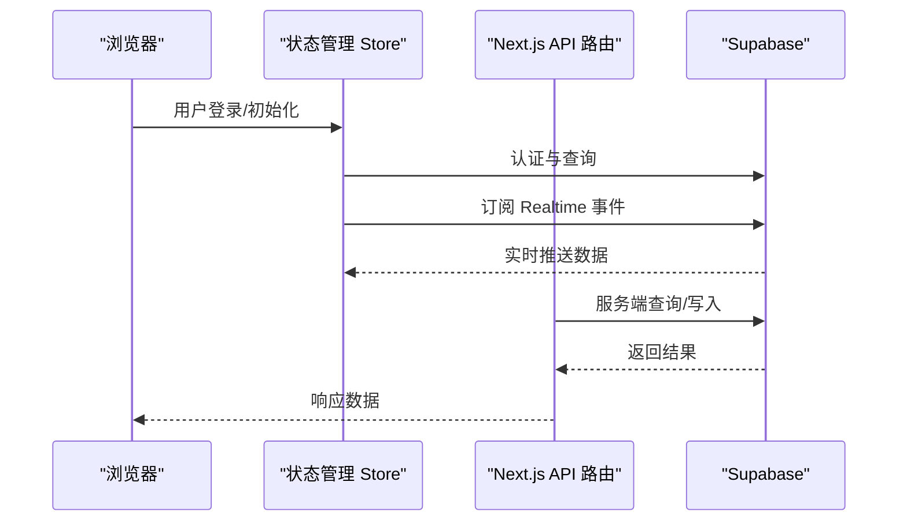
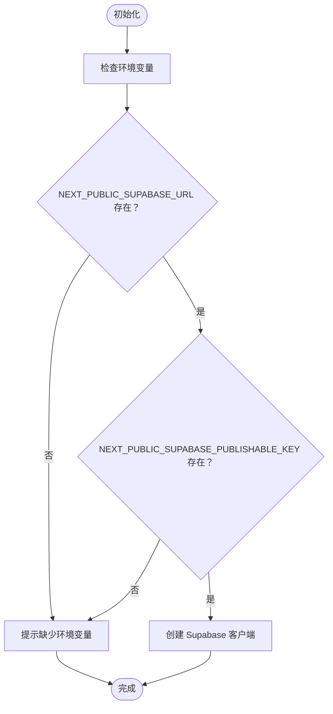
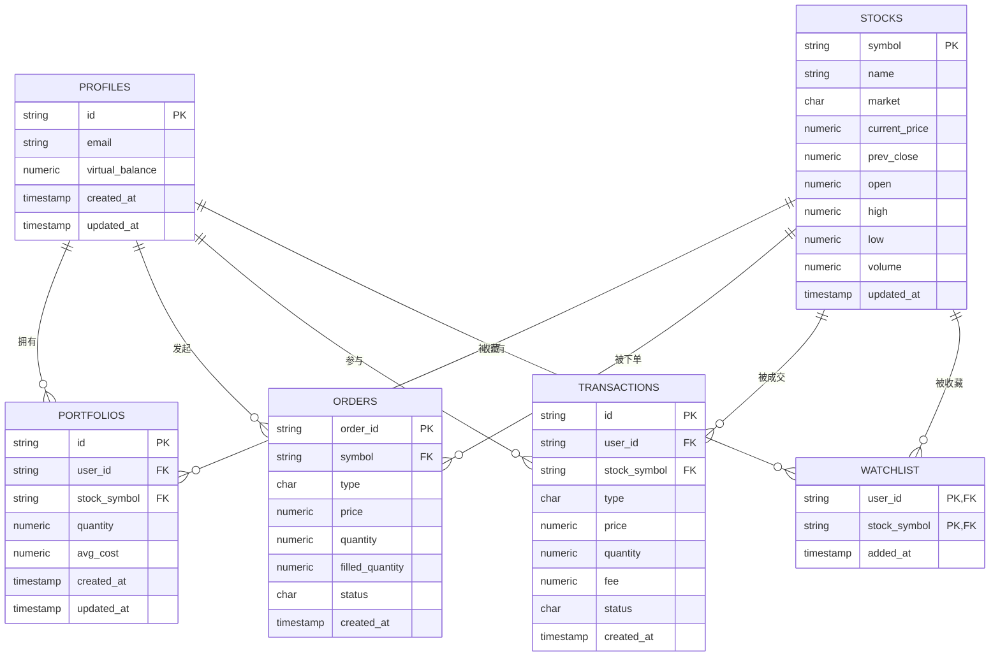
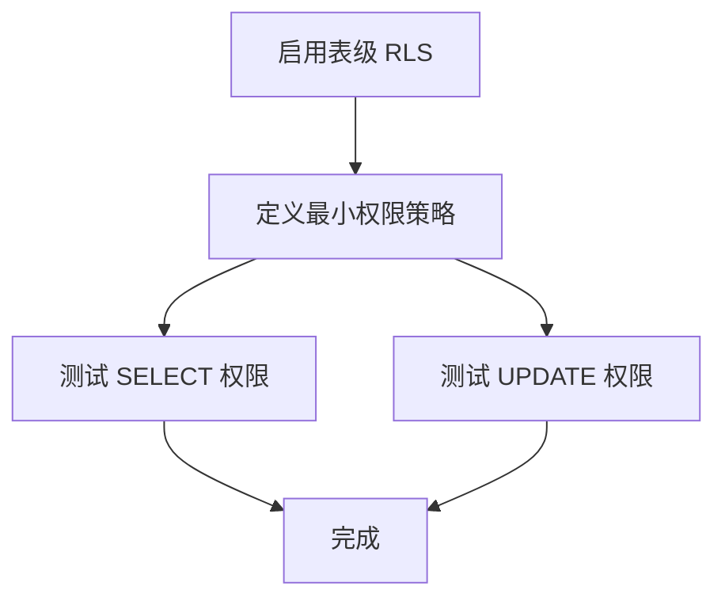
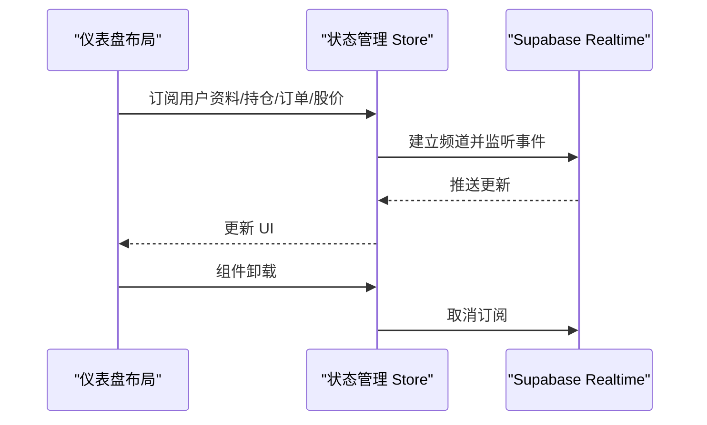
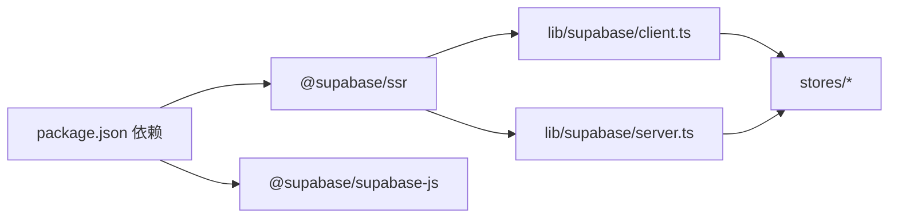

# 数据库配置

<cite>
**本文引用的文件**
- [lib/supabase/client.ts](file://lib/supabase/client.ts)
- [lib/supabase/server.ts](file://lib/supabase/server.ts)
- [types/index.ts](file://types/index.ts)
- [stores/useUserStore.ts](file://stores/useUserStore.ts)
- [stores/useTradeStore.ts](file://stores/useTradeStore.ts)
- [stores/useStockStore.ts](file://stores/useStockStore.ts)
- [stores/useAuthStore.ts](file://stores/useAuthStore.ts)
- [docs/环境变量清单.md](file://docs/环境变量清单.md)
- [docs/prd.md](file://docs/prd.md)
- [docs/状态管理结构.md](file://docs/状态管理结构.md)
- [components/tutorial/connect-supabase-steps.tsx](file://components/tutorial/connect-supabase-steps.tsx)
- [components/tutorial/fetch-data-steps.tsx](file://components/tutorial/fetch-data-steps.tsx)
- [components/env-var-warning.tsx](file://components/env-var-warning.tsx)
- [README.md](file://README.md)
- [package.json](file://package.json)
</cite>

## 目录
1. [简介](#简介)
2. [项目结构](#项目结构)
3. [核心组件](#核心组件)
4. [架构总览](#架构总览)
5. [详细组件分析](#详细组件分析)
6. [依赖关系分析](#依赖关系分析)
7. [性能考虑](#性能考虑)
8. [故障排查指南](#故障排查指南)
9. [结论](#结论)
10. [附录](#附录)

## 简介
本文件面向 Supabase 数据库的部署与初始化，系统化说明项目创建、数据库连接配置（含 API 密钥与连接串）、表结构设计与初始化脚本、Row Level Security（RLS）策略与权限管理、实时订阅与 WebSocket 连接、数据库迁移与版本管理策略、数据备份与恢复流程，以及性能优化与索引策略。文档同时结合仓库中的实际实现，给出可操作的步骤与最佳实践。

## 项目结构
围绕数据库与实时功能的关键文件分布如下：
- 客户端与服务端 Supabase 客户端封装：lib/supabase/client.ts、lib/supabase/server.ts
- 类型定义：types/index.ts
- 状态管理与实时订阅：stores/useUserStore.ts、stores/useTradeStore.ts、stores/useStockStore.ts、stores/useAuthStore.ts
- 环境变量与配置：docs/环境变量清单.md、components/env-var-warning.tsx、README.md
- 教程与 RLS 示例：components/tutorial/connect-supabase-steps.tsx、components/tutorial/fetch-data-steps.tsx
- PRD 与实时集成说明：docs/prd.md、docs/状态管理结构.md
- 依赖声明：package.json

**章节来源**
- [lib/supabase/client.ts:1-9](file://lib/supabase/client.ts#L1-L9)
- [lib/supabase/server.ts:1-35](file://lib/supabase/server.ts#L1-L35)
- [types/index.ts:1-166](file://types/index.ts#L1-L166)
- [stores/useUserStore.ts:1-110](file://stores/useUserStore.ts#L1-L110)
- [stores/useTradeStore.ts:1-192](file://stores/useTradeStore.ts#L1-L192)
- [stores/useStockStore.ts:1-184](file://stores/useStockStore.ts#L1-L184)
- [docs/环境变量清单.md:1-153](file://docs/环境变量清单.md#L1-L153)
- [components/tutorial/connect-supabase-steps.tsx:1-42](file://components/tutorial/connect-supabase-steps.tsx#L1-L42)
- [components/tutorial/fetch-data-steps.tsx:1-123](file://components/tutorial/fetch-data-steps.tsx#L1-L123)
- [README.md:1-110](file://README.md#L1-L110)
- [package.json:1-44](file://package.json#L1-L44)

## 核心组件
- 客户端与服务端 Supabase 客户端
  - 浏览器端：从环境变量读取项目 URL 与公开密钥，创建客户端实例，供前端组件与 Store 使用。
  - 服务端：基于 Next.js cookies 创建服务端客户端，支持会话持久化与 SSR。
- 类型系统
  - 定义用户资料、股票、持仓、订单、交易等核心实体类型，支撑 Store 与 API 的数据契约。
- 状态管理与实时订阅
  - 用户资产与资料订阅、持仓与订单订阅、股票价格实时更新订阅。
- 环境变量与安全
  - 明确前端公开变量与服务端私密变量的边界，指导本地与生产环境变量配置。

**章节来源**
- [lib/supabase/client.ts:1-9](file://lib/supabase/client.ts#L1-L9)
- [lib/supabase/server.ts:1-35](file://lib/supabase/server.ts#L1-L35)
- [types/index.ts:1-166](file://types/index.ts#L1-L166)
- [docs/环境变量清单.md:19-32](file://docs/环境变量清单.md#L19-L32)

## 架构总览
下图展示从浏览器到 Supabase 的整体交互路径，包括认证、数据查询与实时订阅。

**图表来源**
- [stores/useAuthStore.ts:1-53](file://stores/useAuthStore.ts#L1-L53)
- [stores/useUserStore.ts:88-109](file://stores/useUserStore.ts#L88-L109)
- [stores/useTradeStore.ts:144-191](file://stores/useTradeStore.ts#L144-L191)
- [stores/useStockStore.ts:125-150](file://stores/useStockStore.ts#L125-L150)
- [lib/supabase/client.ts:1-9](file://lib/supabase/client.ts#L1-L9)
- [lib/supabase/server.ts:1-35](file://lib/supabase/server.ts#L1-L35)

**章节来源**
- [stores/useAuthStore.ts:1-53](file://stores/useAuthStore.ts#L1-L53)
- [stores/useUserStore.ts:88-109](file://stores/useUserStore.ts#L88-L109)
- [stores/useTradeStore.ts:144-191](file://stores/useTradeStore.ts#L144-L191)
- [stores/useStockStore.ts:125-150](file://stores/useStockStore.ts#L125-L150)
- [lib/supabase/client.ts:1-9](file://lib/supabase/client.ts#L1-L9)
- [lib/supabase/server.ts:1-35](file://lib/supabase/server.ts#L1-L35)

## 详细组件分析

### Supabase 客户端与连接配置
- 浏览器端客户端
  - 通过环境变量初始化，用于前端查询与订阅。
- 服务端客户端
  - 通过 cookies 管理会话，适用于 API 路由与服务端逻辑。
- 环境变量要求
  - 前端公开变量：项目 URL、匿名/发布密钥
  - 服务端私密变量：服务角色密钥（仅服务端使用）

**图表来源**
- [lib/supabase/client.ts:1-9](file://lib/supabase/client.ts#L1-L9)
- [lib/supabase/server.ts:1-35](file://lib/supabase/server.ts#L1-L35)
- [docs/环境变量清单.md:21-32](file://docs/环境变量清单.md#L21-L32)
- [components/env-var-warning.tsx:1-20](file://components/env-var-warning.tsx#L1-L20)

**章节来源**
- [lib/supabase/client.ts:1-9](file://lib/supabase/client.ts#L1-L9)
- [lib/supabase/server.ts:1-35](file://lib/supabase/server.ts#L1-L35)
- [docs/环境变量清单.md:21-32](file://docs/环境变量清单.md#L21-L32)
- [components/env-var-warning.tsx:1-20](file://components/env-var-warning.tsx#L1-L20)

### 表结构设计与初始化脚本
- 类型与实体映射
  - 用户资料：profiles（包含虚拟余额等）
  - 股票：stocks（包含当前价、昨收、开盘、最高、最低、成交量、更新时间等）
  - 持仓：portfolios（用户 ID、股票代码、数量、平均成本等）
  - 订单：orders（买卖方向、价格、数量、已成交、状态等）
  - 交易：transactions（与订单关联的成交明细）
  - 自选股：watchlist（用户 ID、股票代码、添加时间）
- 初始化建议
  - 在 Supabase 控制台的 SQL 编辑器中执行建表与基础数据插入。
  - 启用 RLS 并为每张表创建最小权限策略（例如“用户仅能查看/修改自己的资料”）。
  - 为高频查询列建立索引（如用户 ID、股票代码、状态等）。

**图表来源**
- [types/index.ts:2-89](file://types/index.ts#L2-L89)
- [docs/prd.md:168-177](file://docs/prd.md#L168-L177)

**章节来源**
- [types/index.ts:2-89](file://types/index.ts#L2-L89)
- [docs/prd.md:168-177](file://docs/prd.md#L168-L177)

### Row Level Security（RLS）策略与权限管理
- 启用 RLS
  - 在控制台启用表级 RLS。
- 策略示例
  - 用户仅能读取/更新自己的资料。
  - 订单与持仓按用户 ID 过滤。
- 服务端密钥使用
  - 服务端使用服务角色密钥执行不受 RLS 限制的操作（如批量导入、后台任务）。

**图表来源**
- [components/tutorial/fetch-data-steps.tsx:16-19](file://components/tutorial/fetch-data-steps.tsx#L16-L19)
- [docs/prd.md:168-177](file://docs/prd.md#L168-L177)
- [docs/环境变量清单.md:21-32](file://docs/环境变量清单.md#L21-L32)

**章节来源**
- [components/tutorial/fetch-data-steps.tsx:16-19](file://components/tutorial/fetch-data-steps.tsx#L16-L19)
- [docs/prd.md:168-177](file://docs/prd.md#L168-L177)
- [docs/环境变量清单.md:21-32](file://docs/环境变量清单.md#L21-L32)

### 实时订阅与 WebSocket 连接
- 订阅模式
  - 用户资料变更：按用户 ID 过滤。
  - 持仓与订单变更：按用户 ID 过滤。
  - 股价更新：按股票代码过滤或全局更新。
- 生命周期管理
  - 页面挂载时建立订阅，卸载时取消订阅，避免内存泄漏。
- 集成位置
  - 在仪表盘布局中统一管理订阅生命周期。

**图表来源**
- [docs/状态管理结构.md:434-457](file://docs/状态管理结构.md#L434-L457)
- [stores/useUserStore.ts:88-109](file://stores/useUserStore.ts#L88-L109)
- [stores/useTradeStore.ts:144-191](file://stores/useTradeStore.ts#L144-L191)
- [stores/useStockStore.ts:125-150](file://stores/useStockStore.ts#L125-L150)

**章节来源**
- [docs/状态管理结构.md:434-457](file://docs/状态管理结构.md#L434-L457)
- [stores/useUserStore.ts:88-109](file://stores/useUserStore.ts#L88-L109)
- [stores/useTradeStore.ts:144-191](file://stores/useTradeStore.ts#L144-L191)
- [stores/useStockStore.ts:125-150](file://stores/useStockStore.ts#L125-L150)

### 数据库迁移与版本管理策略
- 版本控制
  - 将建表语句、索引与策略以 SQL 文件形式纳入版本控制，确保团队一致。
- 发布流程
  - 开发分支合并前在测试环境执行迁移；生产环境通过控制台或 CI 执行。
- 回滚策略
  - 保留回滚脚本，对破坏性变更采用“反向迁移”。

[本节为通用实践说明，无需特定文件引用]

### 数据备份与恢复流程
- 备份
  - 使用 Supabase 控制台导出 SQL 或使用数据库导出功能。
- 恢复
  - 在目标环境中导入 SQL，验证数据完整性与索引。
- 注意事项
  - RLS 策略与角色需同步恢复；对敏感数据进行脱敏处理。

[本节为通用实践说明，无需特定文件引用]

### 性能优化与索引策略
- 索引建议
  - 用户相关：用户 ID、邮箱唯一索引
  - 股票相关：股票代码、市场、更新时间
  - 订单与交易：用户 ID、状态、股票代码、创建时间
- 查询优化
  - 使用分页与条件过滤；避免 SELECT *
  - 对高频过滤字段建立复合索引
- 实时订阅
  - 使用精确过滤减少推送量；按需订阅频道

[本节为通用实践说明，无需特定文件引用]

## 依赖关系分析
- 前端依赖
  - @supabase/ssr、@supabase/supabase-js 提供客户端与服务端封装能力
- 状态管理
  - Store 通过 createClient() 获取 Supabase 客户端，执行查询与订阅
- 环境变量
  - 严格区分前端公开变量与服务端私密变量，避免泄露

**图表来源**
- [package.json:9-28](file://package.json#L9-L28)
- [lib/supabase/client.ts:1-9](file://lib/supabase/client.ts#L1-L9)
- [lib/supabase/server.ts:1-35](file://lib/supabase/server.ts#L1-L35)

**章节来源**
- [package.json:9-28](file://package.json#L9-L28)
- [lib/supabase/client.ts:1-9](file://lib/supabase/client.ts#L1-L9)
- [lib/supabase/server.ts:1-35](file://lib/supabase/server.ts#L1-L35)

## 性能考虑
- 查询层面
  - 使用精确过滤与分页；避免全表扫描
  - 对热点字段建立索引，定期分析统计信息
- 实时层面
  - 减少订阅频道数量与推送字段；按需订阅
  - 合理设置刷新间隔，平衡实时性与带宽
- 存储与缓存
  - 对静态数据进行缓存；对频繁更新的数据采用增量更新策略

[本节为通用实践说明，无需特定文件引用]

## 故障排查指南
- 环境变量缺失
  - 现象：登录按钮禁用、无法连接数据库
  - 排查：确认 .env.local 与 Vercel 环境变量配置正确
- RLS 策略问题
  - 现象：查询无数据或报权限错误
  - 排查：检查策略是否启用、过滤条件是否正确
- 实时订阅异常
  - 现象：数据不更新或重复推送
  - 排查：确认订阅频道名称、过滤条件与取消订阅逻辑

**章节来源**
- [components/env-var-warning.tsx:1-20](file://components/env-var-warning.tsx#L1-L20)
- [docs/环境变量清单.md:128-134](file://docs/环境变量清单.md#L128-L134)
- [docs/状态管理结构.md:434-457](file://docs/状态管理结构.md#L434-L457)

## 结论
本文件基于仓库现有实现，梳理了 Supabase 数据库的部署与初始化要点，明确了客户端/服务端连接配置、表结构与类型映射、RLS 策略、实时订阅与 WebSocket 集成、环境变量管理与安全注意事项，并提供了迁移、备份恢复与性能优化的通用策略。建议在开发与生产环境中严格执行变量隔离与最小权限原则，持续完善索引与查询优化，保障系统的稳定性与可维护性。

## 附录
- 项目创建与连接步骤
  - 在 Supabase 控制台创建项目，复制项目 URL 与密钥至环境变量
  - 在本地重命名 .env.example 为 .env.local 并填入对应值
- 教程参考
  - Supabase 新手教程与 RLS 示例可参考组件中的步骤说明

**章节来源**
- [components/tutorial/connect-supabase-steps.tsx:1-42](file://components/tutorial/connect-supabase-steps.tsx#L1-L42)
- [components/tutorial/fetch-data-steps.tsx:52-123](file://components/tutorial/fetch-data-steps.tsx#L52-L123)
- [README.md:52-98](file://README.md#L52-L98)