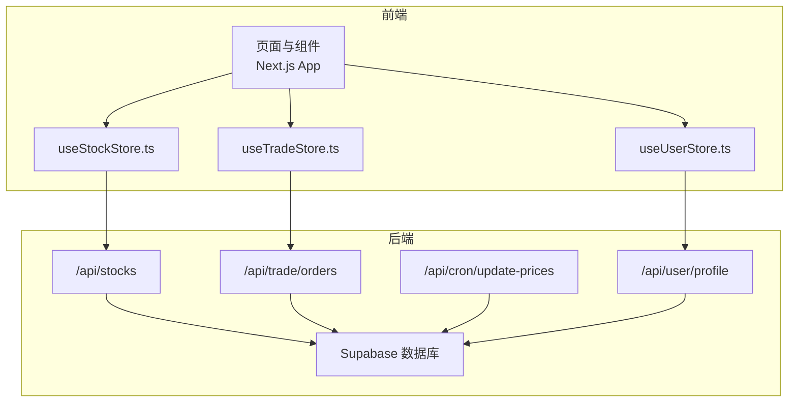
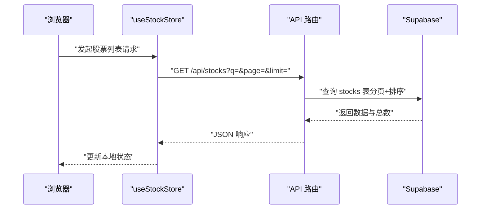
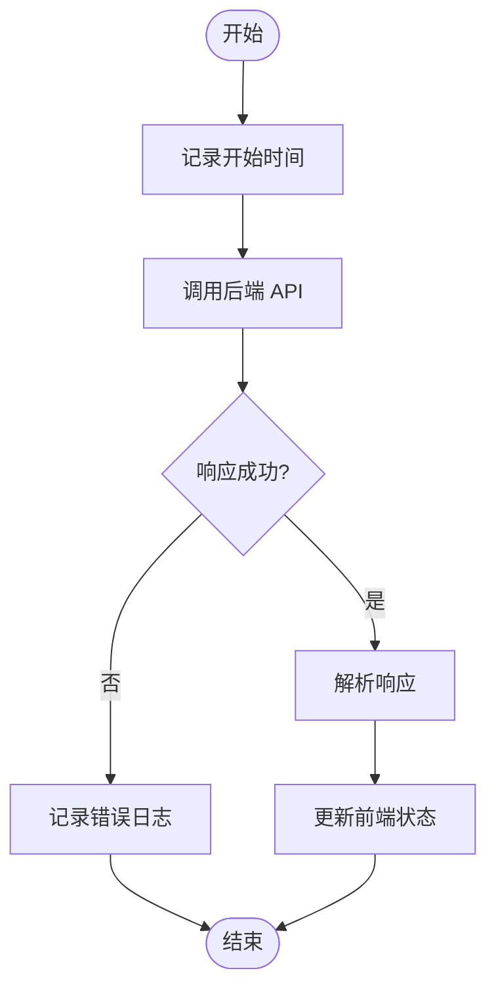
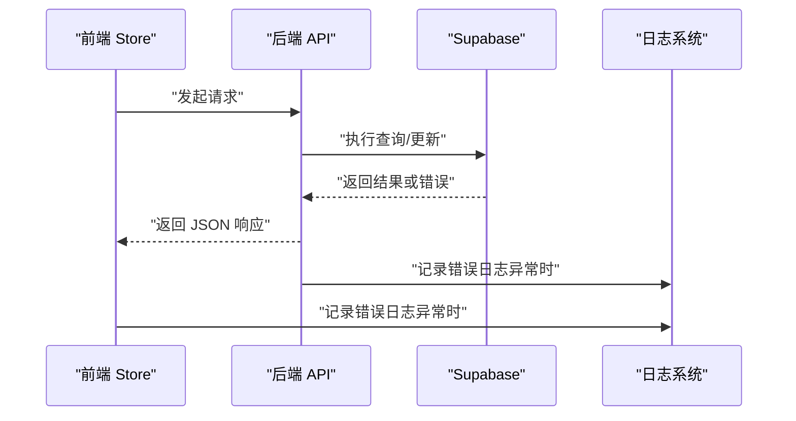
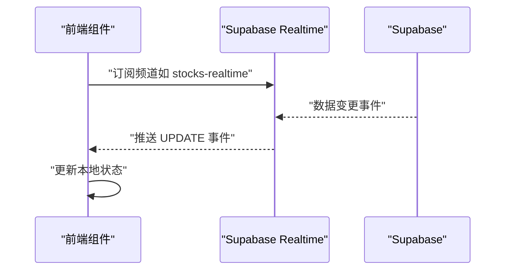
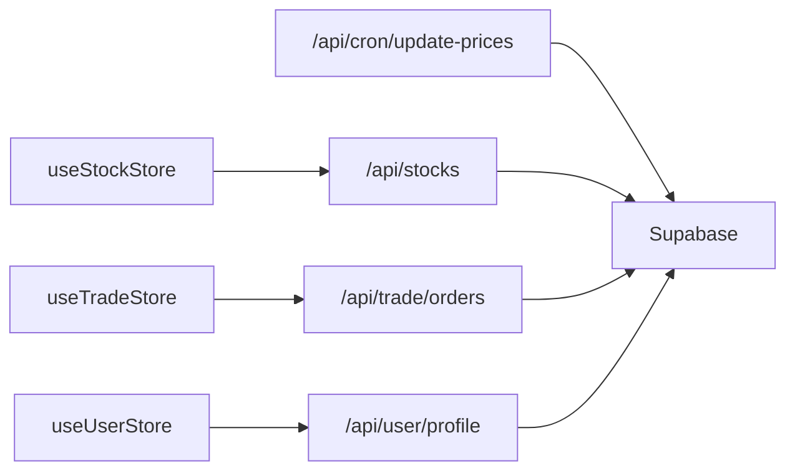

# 监控与日志

<cite>
**本文引用的文件**
- [app/layout.tsx](file://app/layout.tsx)
- [next.config.ts](file://next.config.ts)
- [package.json](file://package.json)
- [lib/constants.ts](file://lib/constants.ts)
- [lib/utils.ts](file://lib/utils.ts)
- [stores/useStockStore.ts](file://stores/useStockStore.ts)
- [stores/useTradeStore.ts](file://stores/useTradeStore.ts)
- [stores/useUserStore.ts](file://stores/useUserStore.ts)
- [lib/supabase/client.ts](file://lib/supabase/client.ts)
- [lib/supabase/server.ts](file://lib/supabase/server.ts)
- [app/api/stocks/route.ts](file://app/api/stocks/route.ts)
- [app/api/trade/orders/route.ts](file://app/api/trade/orders/route.ts)
- [app/api/cron/update-prices/route.ts](file://app/api/cron/update-prices/route.ts)
- [app/api/user/profile/route.ts](file://app/api/user/profile/route.ts)
- [proxy.ts](file://proxy.ts)
</cite>

## 目录
1. [简介](#简介)
2. [项目结构](#项目结构)
3. [核心组件](#核心组件)
4. [架构总览](#架构总览)
5. [详细组件分析](#详细组件分析)
6. [依赖关系分析](#依赖关系分析)
7. [性能考量](#性能考量)
8. [故障排查指南](#故障排查指南)
9. [结论](#结论)
10. [附录](#附录)

## 简介
本文件面向虚拟股票交易系统的运维与开发团队，系统性梳理监控与日志管理策略。内容覆盖性能监控指标（页面加载时间、API 响应时间、数据库查询性能）、错误追踪与日志收集（客户端错误捕获、服务器端日志管理）、实时监控仪表板设置与关键指标可视化、告警配置与通知机制、日志分析与调试技巧、性能瓶颈识别与优化建议、成本监控与资源使用分析，以及故障排查与问题定位方法论。

## 项目结构
该系统采用 Next.js 应用，前端通过 Zustand 状态管理调用 API；后端 API 路由基于 Next.js Server Routes，并通过 Supabase 进行数据库访问与认证。定时任务通过独立的 API 路由触发，使用 Supabase Realtime 进行数据变更订阅。

图表来源
- [app/api/stocks/route.ts:1-69](file://app/api/stocks/route.ts#L1-L69)
- [app/api/trade/orders/route.ts:1-66](file://app/api/trade/orders/route.ts#L1-L66)
- [app/api/cron/update-prices/route.ts:1-150](file://app/api/cron/update-prices/route.ts#L1-L150)
- [app/api/user/profile/route.ts:1-42](file://app/api/user/profile/route.ts#L1-L42)
- [stores/useStockStore.ts:1-184](file://stores/useStockStore.ts#L1-L184)
- [stores/useTradeStore.ts:1-192](file://stores/useTradeStore.ts#L1-L192)
- [stores/useUserStore.ts:1-110](file://stores/useUserStore.ts#L1-L110)

章节来源
- [app/layout.tsx:1-42](file://app/layout.tsx#L1-L42)
- [next.config.ts:1-8](file://next.config.ts#L1-L8)
- [package.json:1-44](file://package.json#L1-L44)

## 核心组件
- 状态管理与实时订阅
  - useStockStore：负责股票列表、自选股、价格订阅与更新。
  - useTradeStore：负责持仓、委托、成交记录与订阅。
  - useUserStore：负责用户资料与资产概览计算与订阅。
- Supabase 客户端
  - 浏览器端客户端封装与服务端客户端封装，确保会话与 Cookie 的正确传递。
- API 路由
  - 股票列表、委托记录、用户资料、定时更新价格等后端接口。
- 定时任务
  - 通过独立 API 路由按交易时段批量拉取行情并写入数据库。

章节来源
- [stores/useStockStore.ts:1-184](file://stores/useStockStore.ts#L1-L184)
- [stores/useTradeStore.ts:1-192](file://stores/useTradeStore.ts#L1-L192)
- [stores/useUserStore.ts:1-110](file://stores/useUserStore.ts#L1-L110)
- [lib/supabase/client.ts:1-9](file://lib/supabase/client.ts#L1-L9)
- [lib/supabase/server.ts:1-35](file://lib/supabase/server.ts#L1-L35)
- [app/api/stocks/route.ts:1-69](file://app/api/stocks/route.ts#L1-L69)
- [app/api/trade/orders/route.ts:1-66](file://app/api/trade/orders/route.ts#L1-L66)
- [app/api/cron/update-prices/route.ts:1-150](file://app/api/cron/update-prices/route.ts#L1-L150)
- [app/api/user/profile/route.ts:1-42](file://app/api/user/profile/route.ts#L1-L42)

## 架构总览
系统采用“前端状态管理 + 后端 API 路由 + Supabase 数据库”的三层架构。前端通过 fetch 调用 API，API 路由通过 Supabase 客户端访问数据库；Supabase Realtime 支持前端订阅数据库变更事件，实现数据的近实时更新。

图表来源
- [stores/useStockStore.ts:33-57](file://stores/useStockStore.ts#L33-L57)
- [app/api/stocks/route.ts:5-68](file://app/api/stocks/route.ts#L5-L68)

## 详细组件分析

### 性能监控指标与采集
- 页面加载时间
  - 关键路径：根布局渲染、主题切换、字体加载。可结合浏览器性能面板与 Web Vitals 指标进行观测。
  - 参考路径：[app/layout.tsx:22-41](file://app/layout.tsx#L22-L41)
- API 响应时间
  - 各 API 路由均包含错误处理与统一响应格式，便于在网关或代理层统计响应时间与错误率。
  - 参考路径：[app/api/stocks/route.ts:6-68](file://app/api/stocks/route.ts#L6-L68)、[app/api/trade/orders/route.ts:5-65](file://app/api/trade/orders/route.ts#L5-L65)、[app/api/user/profile/route.ts:5-41](file://app/api/user/profile/route.ts#L5-L41)、[app/api/cron/update-prices/route.ts:10-149](file://app/api/cron/update-prices/route.ts#L10-L149)
- 数据库查询性能
  - API 路由中对表执行 select、order、range 等操作，需关注索引与过滤条件，避免全表扫描。
  - 参考路径：[app/api/stocks/route.ts:22-34](file://app/api/stocks/route.ts#L22-L34)、[app/api/trade/orders/route.ts:28-40](file://app/api/trade/orders/route.ts#L28-L40)

图表来源
- [stores/useStockStore.ts:33-57](file://stores/useStockStore.ts#L33-L57)
- [stores/useTradeStore.ts:33-84](file://stores/useTradeStore.ts#L33-L84)

章节来源
- [app/layout.tsx:10-14](file://app/layout.tsx#L10-L14)
- [next.config.ts:3-5](file://next.config.ts#L3-L5)
- [app/api/stocks/route.ts:22-34](file://app/api/stocks/route.ts#L22-L34)
- [app/api/trade/orders/route.ts:28-40](file://app/api/trade/orders/route.ts#L28-L40)

### 错误追踪与日志收集
- 客户端错误捕获
  - 前端 Store 在请求失败时打印错误日志，便于快速定位问题。
  - 参考路径：[stores/useStockStore.ts:52-56](file://stores/useStockStore.ts#L52-L56)、[stores/useTradeStore.ts:61-66](file://stores/useTradeStore.ts#L61-L66)、[stores/useUserStore.ts:33-37](file://stores/useUserStore.ts#L33-L37)
- 服务器端日志管理
  - 后端路由在异常时输出错误日志并返回统一错误响应，便于集中收集与分析。
  - 参考路径：[app/api/stocks/route.ts:38-44](file://app/api/stocks/route.ts#L38-L44)、[app/api/trade/orders/route.ts:44-50](file://app/api/trade/orders/route.ts#L44-L50)、[app/api/user/profile/route.ts:25-31](file://app/api/user/profile/route.ts#L25-L31)、[app/api/cron/update-prices/route.ts:37-43](file://app/api/cron/update-prices/route.ts#L37-L43)

图表来源
- [stores/useStockStore.ts:42-56](file://stores/useStockStore.ts#L42-L56)
- [app/api/stocks/route.ts:38-44](file://app/api/stocks/route.ts#L38-L44)

章节来源
- [stores/useStockStore.ts:33-57](file://stores/useStockStore.ts#L33-L57)
- [stores/useTradeStore.ts:33-84](file://stores/useTradeStore.ts#L33-L84)
- [stores/useUserStore.ts:20-37](file://stores/useUserStore.ts#L20-L37)
- [app/api/stocks/route.ts:38-44](file://app/api/stocks/route.ts#L38-L44)
- [app/api/trade/orders/route.ts:44-50](file://app/api/trade/orders/route.ts#L44-L50)
- [app/api/user/profile/route.ts:25-31](file://app/api/user/profile/route.ts#L25-L31)
- [app/api/cron/update-prices/route.ts:37-43](file://app/api/cron/update-prices/route.ts#L37-L43)

### 实时监控仪表板与关键指标可视化
- 实时数据订阅
  - 使用 Supabase Realtime 订阅数据库变更，自动刷新股价、持仓与委托状态。
  - 参考路径：[stores/useStockStore.ts:125-150](file://stores/useStockStore.ts#L125-L150)、[stores/useTradeStore.ts:144-186](file://stores/useTradeStore.ts#L144-L186)、[stores/useUserStore.ts:88-108](file://stores/useUserStore.ts#L88-L108)
- 指标建议
  - 页面加载时间、API 响应时间、数据库查询耗时、实时订阅连接数、错误率、吞吐量。
  - 可使用 Recharts 组件进行前端可视化展示（项目已引入）。
  - 参考路径：[package.json:26](file://package.json#L26)

图表来源
- [stores/useStockStore.ts:125-150](file://stores/useStockStore.ts#L125-L150)
- [stores/useTradeStore.ts:144-186](file://stores/useTradeStore.ts#L144-L186)
- [stores/useUserStore.ts:88-108](file://stores/useUserStore.ts#L88-L108)

章节来源
- [stores/useStockStore.ts:125-150](file://stores/useStockStore.ts#L125-L150)
- [stores/useTradeStore.ts:144-186](file://stores/useTradeStore.ts#L144-L186)
- [stores/useUserStore.ts:88-108](file://stores/useUserStore.ts#L88-L108)
- [package.json:26](file://package.json#L26)

### 告警配置与通知机制
- 告警维度建议
  - API 错误率阈值、响应时间 P95/P99、数据库慢查询、定时任务失败次数、实时订阅断连。
- 通知渠道
  - 邮件、IM 机器人（如企业微信/钉钉）、Webhook。
- 配置要点
  - 在网关或反向代理层聚合日志并设置阈值告警；对关键业务（下单、撤单、价格更新）单独设置告警。

（本节为通用实践说明，不直接分析具体文件）

### 日志分析与调试技巧
- 客户端调试
  - 使用浏览器开发者工具 Network 面板观察请求与响应；结合 Store 中的日志输出定位问题。
  - 参考路径：[stores/useStockStore.ts:52-56](file://stores/useStockStore.ts#L52-L56)、[stores/useTradeStore.ts:61-66](file://stores/useTradeStore.ts#L61-L66)
- 服务器端调试
  - 查看后端路由日志，确认查询参数、过滤条件与错误堆栈。
  - 参考路径：[app/api/stocks/route.ts:38-44](file://app/api/stocks/route.ts#L38-L44)、[app/api/trade/orders/route.ts:44-50](file://app/api/trade/orders/route.ts#L44-L50)
- Supabase 调试
  - 检查 Realtime 订阅通道名称与过滤条件，确保事件能正确到达前端。
  - 参考路径：[stores/useStockStore.ts:125-150](file://stores/useStockStore.ts#L125-L150)、[stores/useTradeStore.ts:144-186](file://stores/useTradeStore.ts#L144-L186)

章节来源
- [stores/useStockStore.ts:52-56](file://stores/useStockStore.ts#L52-L56)
- [stores/useTradeStore.ts:61-66](file://stores/useTradeStore.ts#L61-L66)
- [app/api/stocks/route.ts:38-44](file://app/api/stocks/route.ts#L38-L44)
- [app/api/trade/orders/route.ts:44-50](file://app/api/trade/orders/route.ts#L44-L50)

### 性能瓶颈识别与优化建议
- 前端
  - 使用 Next.js 缓存组件配置，减少重复渲染。
  - 参考路径：[next.config.ts:3-5](file://next.config.ts#L3-L5)
  - 控制分页大小与刷新频率，避免频繁请求。
  - 参考路径：[lib/constants.ts:71-95](file://lib/constants.ts#L71-L95)
- 后端
  - 对高频查询建立合适索引，避免全表扫描。
  - 参考路径：[app/api/stocks/route.ts:22-34](file://app/api/stocks/route.ts#L22-L34)、[app/api/trade/orders/route.ts:28-40](file://app/api/trade/orders/route.ts#L28-L40)
- 数据库
  - 使用 upsert 批量更新，减少往返次数。
  - 参考路径：[app/api/cron/update-prices/route.ts:108-114](file://app/api/cron/update-prices/route.ts#L108-L114)

章节来源
- [next.config.ts:3-5](file://next.config.ts#L3-L5)
- [lib/constants.ts:71-95](file://lib/constants.ts#L71-L95)
- [app/api/stocks/route.ts:22-34](file://app/api/stocks/route.ts#L22-L34)
- [app/api/trade/orders/route.ts:28-40](file://app/api/trade/orders/route.ts#L28-L40)
- [app/api/cron/update-prices/route.ts:108-114](file://app/api/cron/update-prices/route.ts#L108-L114)

### 成本监控与资源使用分析
- 请求与带宽
  - 统计各 API 的 QPS、错误率与平均响应时间，识别高成本接口。
- 数据库成本
  - 监控查询次数、扫描行数与索引使用情况，优化慢查询。
- 实时订阅
  - 监控订阅连接数与消息吞吐，避免过度订阅导致资源浪费。
- 外部依赖
  - 对第三方行情接口的调用次数与失败率进行统计，评估外部成本。

（本节为通用实践说明，不直接分析具体文件）

## 依赖关系分析
- 组件耦合
  - Store 与 API 路由之间通过 fetch 接口耦合；Supabase Realtime 提供解耦的数据更新能力。
- 外部依赖
  - Supabase（数据库与认证）、Recharts（可视化）、Next.js（框架）。

图表来源
- [stores/useStockStore.ts:1-21](file://stores/useStockStore.ts#L1-L21)
- [stores/useTradeStore.ts:1-25](file://stores/useTradeStore.ts#L1-L25)
- [stores/useUserStore.ts:1-13](file://stores/useUserStore.ts#L1-L13)
- [app/api/stocks/route.ts:1-6](file://app/api/stocks/route.ts#L1-L6)
- [app/api/trade/orders/route.ts:1-5](file://app/api/trade/orders/route.ts#L1-L5)
- [app/api/user/profile/route.ts:1-5](file://app/api/user/profile/route.ts#L1-L5)
- [app/api/cron/update-prices/route.ts:1-9](file://app/api/cron/update-prices/route.ts#L1-L9)

章节来源
- [stores/useStockStore.ts:1-21](file://stores/useStockStore.ts#L1-L21)
- [stores/useTradeStore.ts:1-25](file://stores/useTradeStore.ts#L1-L25)
- [stores/useUserStore.ts:1-13](file://stores/useUserStore.ts#L1-L13)
- [app/api/stocks/route.ts:1-6](file://app/api/stocks/route.ts#L1-L6)
- [app/api/trade/orders/route.ts:1-5](file://app/api/trade/orders/route.ts#L1-L5)
- [app/api/user/profile/route.ts:1-5](file://app/api/user/profile/route.ts#L1-L5)
- [app/api/cron/update-prices/route.ts:1-9](file://app/api/cron/update-prices/route.ts#L1-L9)

## 性能考量
- 前端性能
  - 合理使用缓存与分页，降低请求频率。
  - 参考路径：[lib/constants.ts:71-95](file://lib/constants.ts#L71-L95)
- 后端性能
  - 对高频查询建立索引，控制查询范围与排序字段。
  - 参考路径：[app/api/stocks/route.ts:22-34](file://app/api/stocks/route.ts#L22-L34)、[app/api/trade/orders/route.ts:28-40](file://app/api/trade/orders/route.ts#L28-L40)
- 数据库性能
  - 批量 upsert 与合理的时间戳更新策略，减少写放大。
  - 参考路径：[app/api/cron/update-prices/route.ts:108-114](file://app/api/cron/update-prices/route.ts#L108-L114)

（本节为通用指导，不直接分析具体文件）

## 故障排查指南
- 页面无法加载或白屏
  - 检查根布局与主题 Provider 是否正常渲染。
  - 参考路径：[app/layout.tsx:22-41](file://app/layout.tsx#L22-L41)
- API 请求失败
  - 查看后端路由日志与错误响应，确认认证状态与查询参数。
  - 参考路径：[app/api/stocks/route.ts:38-44](file://app/api/stocks/route.ts#L38-L44)、[app/api/trade/orders/route.ts:44-50](file://app/api/trade/orders/route.ts#L44-L50)
- 实时数据不同步
  - 检查 Supabase Realtime 订阅通道与过滤条件，确认事件推送。
  - 参考路径：[stores/useStockStore.ts:125-150](file://stores/useStockStore.ts#L125-L150)、[stores/useTradeStore.ts:144-186](file://stores/useTradeStore.ts#L144-L186)
- 定时任务未执行
  - 校验 Cron Secret、交易时段判断与第三方接口可用性。
  - 参考路径：[app/api/cron/update-prices/route.ts:12-27](file://app/api/cron/update-prices/route.ts#L12-L27)、[app/api/cron/update-prices/route.ts:62-72](file://app/api/cron/update-prices/route.ts#L62-L72)

章节来源
- [app/layout.tsx:22-41](file://app/layout.tsx#L22-L41)
- [app/api/stocks/route.ts:38-44](file://app/api/stocks/route.ts#L38-L44)
- [app/api/trade/orders/route.ts:44-50](file://app/api/trade/orders/route.ts#L44-L50)
- [stores/useStockStore.ts:125-150](file://stores/useStockStore.ts#L125-L150)
- [stores/useTradeStore.ts:144-186](file://stores/useTradeStore.ts#L144-L186)
- [app/api/cron/update-prices/route.ts:12-27](file://app/api/cron/update-prices/route.ts#L12-L27)
- [app/api/cron/update-prices/route.ts:62-72](file://app/api/cron/update-prices/route.ts#L62-L72)

## 结论
本项目具备清晰的前端状态管理与后端 API 路由结构，并通过 Supabase 实现实时数据订阅。建议在现有基础上完善日志采集与统一告警体系，结合前端性能指标与后端数据库性能指标，形成闭环的监控与排障流程，持续提升系统稳定性与用户体验。

## 附录
- Supabase 客户端初始化
  - 浏览器端与服务端客户端封装，确保运行时环境变量正确传入。
  - 参考路径：[lib/supabase/client.ts:1-9](file://lib/supabase/client.ts#L1-L9)、[lib/supabase/server.ts:1-35](file://lib/supabase/server.ts#L1-L35)
- 代理与会话更新
  - 通过代理中间件更新 Supabase 会话，确保认证状态一致。
  - 参考路径：[proxy.ts:1-21](file://proxy.ts#L1-L21)
- 环境变量与常量
  - 交易常量、API 常量、UI 常量与功能开关集中管理。
  - 参考路径：[lib/constants.ts:1-101](file://lib/constants.ts#L1-L101)
- 工具函数
  - 货币、数字、百分比与成交量格式化工具。
  - 参考路径：[lib/utils.ts:1-47](file://lib/utils.ts#L1-L47)

章节来源
- [lib/supabase/client.ts:1-9](file://lib/supabase/client.ts#L1-L9)
- [lib/supabase/server.ts:1-35](file://lib/supabase/server.ts#L1-L35)
- [proxy.ts:1-21](file://proxy.ts#L1-L21)
- [lib/constants.ts:1-101](file://lib/constants.ts#L1-L101)
- [lib/utils.ts:1-47](file://lib/utils.ts#L1-L47)