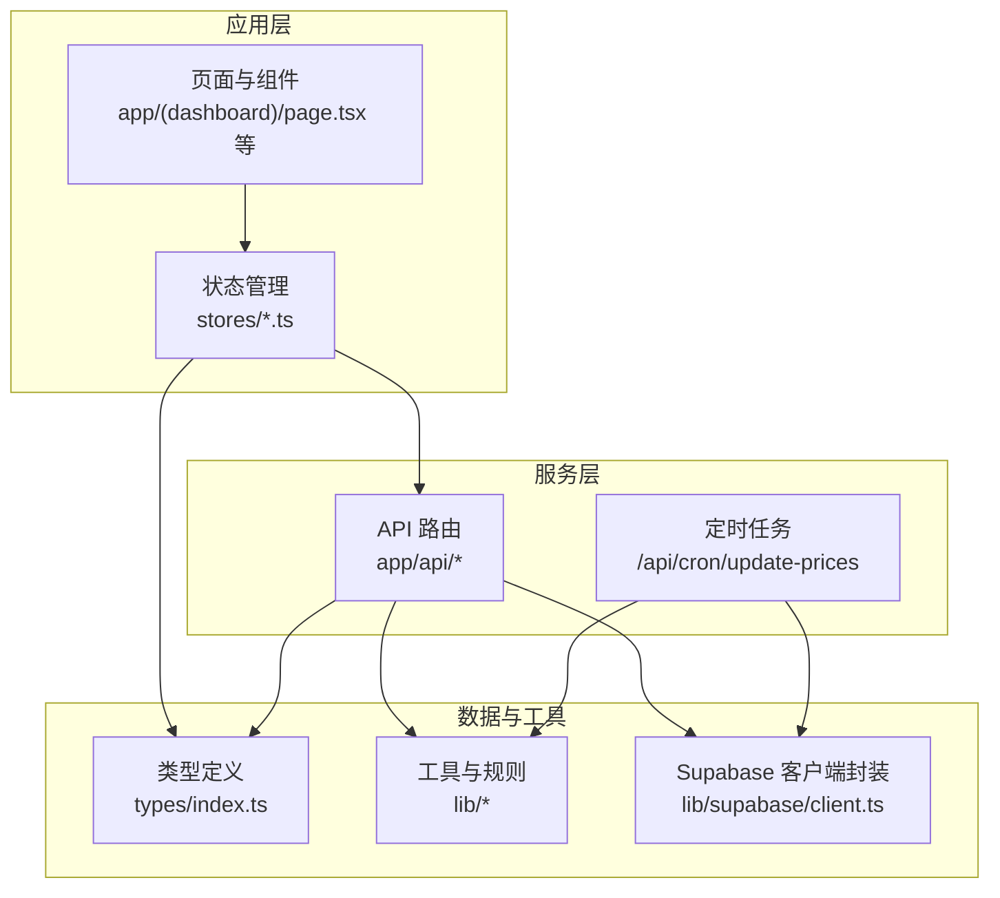
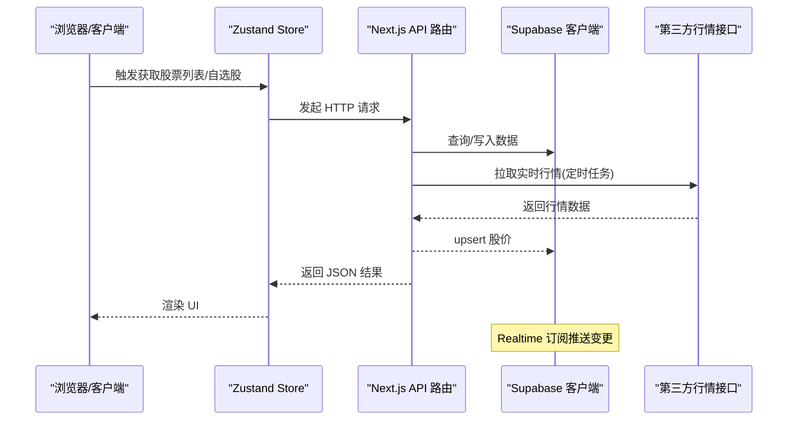
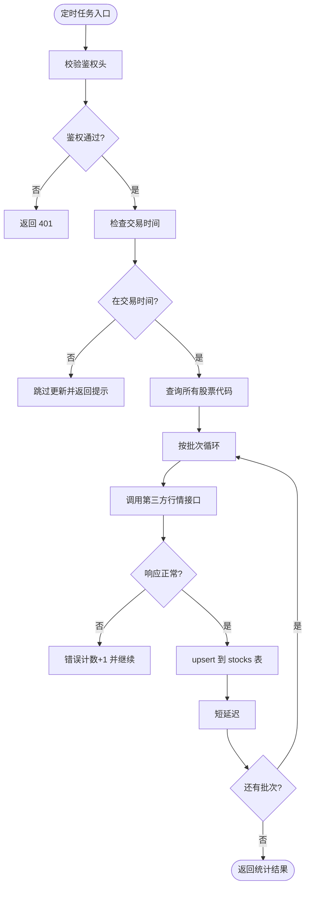
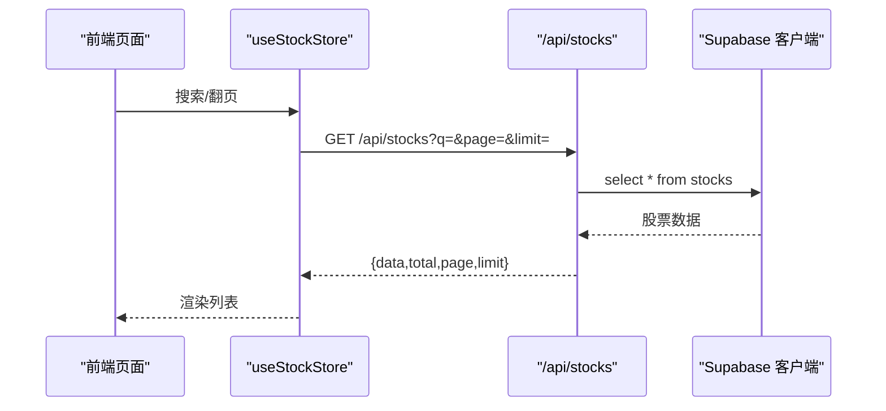
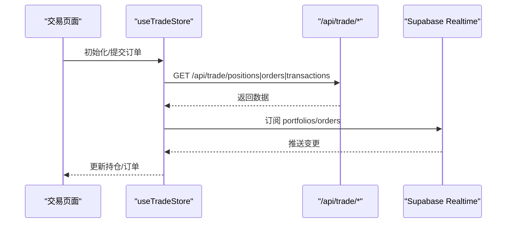
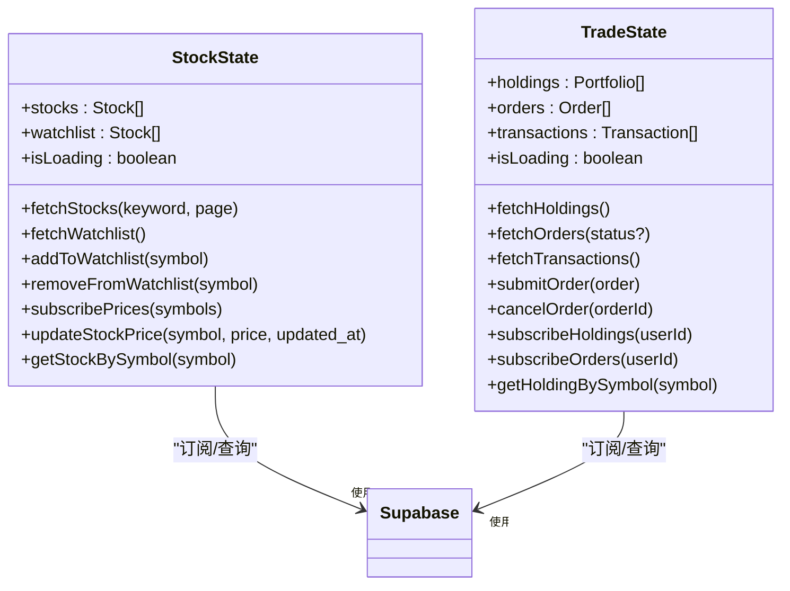
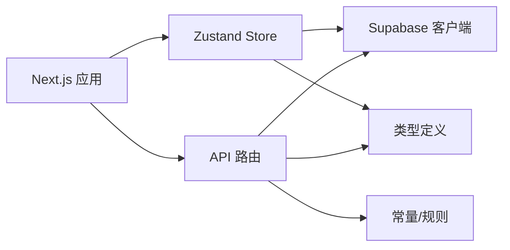

# 维护与优化

<cite>
**本文引用的文件**
- [README.md](file://README.md)
- [package.json](file://package.json)
- [next.config.ts](file://next.config.ts)
- [lib/constants.ts](file://lib/constants.ts)
- [lib/utils.ts](file://lib/utils.ts)
- [lib/trading-rules.ts](file://lib/trading-rules.ts)
- [lib/supabase/client.ts](file://lib/supabase/client.ts)
- [app/api/cron/update-prices/route.ts](file://app/api/cron/update-prices/route.ts)
- [app/api/stocks/route.ts](file://app/api/stocks/route.ts)
- [app/api/watchlist/route.ts](file://app/api/watchlist/route.ts)
- [app/api/trade/orders/route.ts](file://app/api/trade/orders/route.ts)
- [stores/index.ts](file://stores/index.ts)
- [stores/useStockStore.ts](file://stores/useStockStore.ts)
- [stores/useTradeStore.ts](file://stores/useTradeStore.ts)
- [types/index.ts](file://types/index.ts)
</cite>

## 目录
1. [简介](#简介)
2. [项目结构](#项目结构)
3. [核心组件](#核心组件)
4. [架构总览](#架构总览)
5. [详细组件分析](#详细组件分析)
6. [依赖关系分析](#依赖关系分析)
7. [性能考量](#性能考量)
8. [故障排查指南](#故障排查指南)
9. [结论](#结论)
10. [附录](#附录)

## 简介
本文件面向虚拟股票交易系统的运维与优化，围绕日常维护、性能优化、扩展与安全、备份与恢复、成本控制、版本升级与兼容性测试、以及故障预防与应急响应等方面，结合代码库现状给出可落地的策略与流程。系统基于 Next.js 应用，采用 Supabase 作为认证与实时订阅能力的基础，通过 Server-Side Routes 提供数据访问与定时任务。

## 项目结构
系统采用 Next.js App Router 的目录组织方式，前端页面与 API 路由清晰分离；状态管理采用 Zustand；交易规则与常量集中于 lib；类型定义集中在 types；构建配置位于 next.config.ts。

图表来源
- [stores/index.ts:1-7](file://stores/index.ts#L1-L7)
- [stores/useStockStore.ts:1-184](file://stores/useStockStore.ts#L1-L184)
- [stores/useTradeStore.ts:1-192](file://stores/useTradeStore.ts#L1-L192)
- [app/api/stocks/route.ts:1-69](file://app/api/stocks/route.ts#L1-L69)
- [app/api/watchlist/route.ts:1-129](file://app/api/watchlist/route.ts#L1-L129)
- [app/api/trade/orders/route.ts:1-66](file://app/api/trade/orders/route.ts#L1-L66)
- [app/api/cron/update-prices/route.ts:1-150](file://app/api/cron/update-prices/route.ts#L1-L150)
- [lib/supabase/client.ts:1-9](file://lib/supabase/client.ts#L1-L9)
- [lib/constants.ts:1-101](file://lib/constants.ts#L1-L101)
- [types/index.ts:1-166](file://types/index.ts#L1-L166)

章节来源
- [README.md:1-110](file://README.md#L1-L110)
- [package.json:1-44](file://package.json#L1-L44)
- [next.config.ts:1-8](file://next.config.ts#L1-L8)

## 核心组件
- API 路由与定时任务
  - 股价更新定时任务：按交易时段从第三方行情接口批量拉取并 upsert 至 Supabase。
  - 股票列表、自选股、委托记录等 API 路由，均通过 Supabase 客户端读写数据。
- 状态管理
  - 使用 Zustand 管理股票列表、自选股、交易订单与持仓等状态，并通过 Supabase Realtime 订阅增量更新。
- 工具与规则
  - 交易常量、格式化工具、交易规则（涨跌停、手续费、交易时间）集中管理。
- 类型定义
  - 明确用户、股票、持仓、订单、交易等核心实体与 API 响应结构。

章节来源
- [app/api/cron/update-prices/route.ts:1-150](file://app/api/cron/update-prices/route.ts#L1-L150)
- [app/api/stocks/route.ts:1-69](file://app/api/stocks/route.ts#L1-L69)
- [app/api/watchlist/route.ts:1-129](file://app/api/watchlist/route.ts#L1-L129)
- [app/api/trade/orders/route.ts:1-66](file://app/api/trade/orders/route.ts#L1-L66)
- [stores/useStockStore.ts:1-184](file://stores/useStockStore.ts#L1-L184)
- [stores/useTradeStore.ts:1-192](file://stores/useTradeStore.ts#L1-L192)
- [lib/constants.ts:1-101](file://lib/constants.ts#L1-L101)
- [lib/utils.ts:1-47](file://lib/utils.ts#L1-L47)
- [lib/trading-rules.ts:1-272](file://lib/trading-rules.ts#L1-L272)
- [types/index.ts:1-166](file://types/index.ts#L1-L166)

## 架构总览
系统采用“前端状态 + 后端 API + Supabase 数据与实时”的三层架构。前端通过 Store 发起 API 请求或订阅实时事件；API 路由负责鉴权、参数校验、调用 Supabase 并返回结果；Supabase 提供数据持久化与 Realtime 变更事件。

图表来源
- [stores/useStockStore.ts:33-78](file://stores/useStockStore.ts#L33-L78)
- [stores/useTradeStore.ts:33-97](file://stores/useTradeStore.ts#L33-L97)
- [app/api/stocks/route.ts:6-68](file://app/api/stocks/route.ts#L6-L68)
- [app/api/watchlist/route.ts:58-128](file://app/api/watchlist/route.ts#L58-L128)
- [app/api/cron/update-prices/route.ts:57-131](file://app/api/cron/update-prices/route.ts#L57-L131)
- [lib/supabase/client.ts:1-9](file://lib/supabase/client.ts#L1-L9)

## 详细组件分析

### 定时任务：股价更新
- 触发条件与鉴权
  - 通过请求头携带密钥进行鉴权；若未配置密钥则跳过鉴权。
  - 仅在交易时段执行，非交易时段直接返回提示。
- 批处理与限流
  - 从 stocks 表读取全部 symbol，按批次并发拉取行情，每批间加入短延迟以避免触发第三方限流。
  - 对单批请求设置超时，异常时累计错误计数并继续下一批。
- 写入策略
  - 使用 upsert 按 symbol 冲突更新，确保幂等。

图表来源
- [app/api/cron/update-prices/route.ts:9-150](file://app/api/cron/update-prices/route.ts#L9-L150)
- [lib/trading-rules.ts:7-24](file://lib/trading-rules.ts#L7-L24)
- [lib/constants.ts:70-79](file://lib/constants.ts#L70-L79)

章节来源
- [app/api/cron/update-prices/route.ts:1-150](file://app/api/cron/update-prices/route.ts#L1-L150)
- [lib/trading-rules.ts:1-272](file://lib/trading-rules.ts#L1-L272)
- [lib/constants.ts:70-79](file://lib/constants.ts#L70-L79)

### 股票列表与自选股
- 股票列表
  - 支持关键词搜索、分页排序，计算涨跌额与涨跌幅，返回总数用于前端分页。
- 自选股
  - 登录态校验，支持添加/删除，按添加时间倒序返回；返回时附带涨跌幅。

图表来源
- [stores/useStockStore.ts:33-57](file://stores/useStockStore.ts#L33-L57)
- [app/api/stocks/route.ts:6-68](file://app/api/stocks/route.ts#L6-L68)

章节来源
- [app/api/stocks/route.ts:1-69](file://app/api/stocks/route.ts#L1-L69)
- [app/api/watchlist/route.ts:1-129](file://app/api/watchlist/route.ts#L1-L129)
- [stores/useStockStore.ts:1-184](file://stores/useStockStore.ts#L1-L184)

### 交易与订单
- 持仓/订单/成交记录
  - 通过 API 获取并刷新；支持按状态筛选；订单订阅使用 Supabase Realtime。
- 实时订阅
  - 订阅 portfolios 与 orders 表，收到变更后自动刷新对应列表，保证 UI 与数据一致。

图表来源
- [stores/useTradeStore.ts:33-97](file://stores/useTradeStore.ts#L33-L97)
- [stores/useTradeStore.ts:144-186](file://stores/useTradeStore.ts#L144-L186)
- [app/api/trade/orders/route.ts:1-66](file://app/api/trade/orders/route.ts#L1-L66)

章节来源
- [stores/useTradeStore.ts:1-192](file://stores/useTradeStore.ts#L1-L192)
- [app/api/trade/orders/route.ts:1-66](file://app/api/trade/orders/route.ts#L1-L66)

### 状态管理与实时订阅
- 股票状态
  - 提供搜索、分页、自选股增删、订阅价格变更、按符号查询等功能。
- 交易状态
  - 提供持仓、订单、成交记录获取与订阅，下单/撤单后自动刷新。

图表来源
- [stores/useStockStore.ts:6-21](file://stores/useStockStore.ts#L6-L21)
- [stores/useTradeStore.ts:6-25](file://stores/useTradeStore.ts#L6-L25)
- [lib/supabase/client.ts:1-9](file://lib/supabase/client.ts#L1-L9)

章节来源
- [stores/index.ts:1-7](file://stores/index.ts#L1-L7)
- [stores/useStockStore.ts:1-184](file://stores/useStockStore.ts#L1-L184)
- [stores/useTradeStore.ts:1-192](file://stores/useTradeStore.ts#L1-L192)

## 依赖关系分析
- 构建与运行
  - Next.js 提供 App Router 与构建优化；Zustand 管理前端状态；Supabase 提供认证与实时订阅；Recharts 用于可视化。
- 运行时依赖
  - API 路由依赖 Supabase 客户端；定时任务依赖第三方行情接口；交易规则与常量集中于 lib。

图表来源
- [package.json:9-29](file://package.json#L9-L29)
- [stores/useStockStore.ts:1-5](file://stores/useStockStore.ts#L1-L5)
- [stores/useTradeStore.ts:1-5](file://stores/useTradeStore.ts#L1-L5)
- [app/api/stocks/route.ts:1-4](file://app/api/stocks/route.ts#L1-L4)
- [lib/constants.ts:1-101](file://lib/constants.ts#L1-L101)
- [types/index.ts:1-166](file://types/index.ts#L1-L166)

章节来源
- [package.json:1-44](file://package.json#L1-L44)
- [next.config.ts:1-8](file://next.config.ts#L1-L8)

## 性能考量
- 代码分割与懒加载
  - 利用 Next.js App Router 的路由分组与并行加载特性，将页面级组件按需加载；对图表与大列表组件可结合动态导入进一步优化。
- 资源压缩与构建优化
  - 使用 Next.js 默认的构建与压缩能力；Tailwind CSS 已启用，建议配合 Purge 配置减少无效样式体积。
- 网络与缓存
  - API 层已具备分页与排序；前端 Store 可引入本地缓存策略（如按符号缓存最近一次行情）降低重复请求。
- 实时订阅
  - 通过 Supabase Realtime 订阅增量更新，避免轮询；注意在组件卸载时及时取消订阅，防止内存泄漏。
- 第三方接口
  - 定时任务已设置超时与批处理；建议增加重试与熔断策略，避免单点故障影响全量更新。

章节来源
- [next.config.ts:1-8](file://next.config.ts#L1-L8)
- [stores/useStockStore.ts:125-150](file://stores/useStockStore.ts#L125-L150)
- [stores/useTradeStore.ts:144-186](file://stores/useTradeStore.ts#L144-L186)
- [app/api/cron/update-prices/route.ts:62-72](file://app/api/cron/update-prices/route.ts#L62-L72)

## 故障排查指南
- 常见问题定位
  - API 500：检查 Supabase 查询错误与第三方接口响应；查看路由日志输出。
  - 未登录：自选股与订单类 API 需要鉴权，确认用户会话有效。
  - 非交易时间：定时任务在非交易时段会跳过更新，属预期行为。
- 错误处理与可观测性
  - 路由内统一捕获异常并返回结构化错误；建议接入日志平台收集错误堆栈。
- 实时订阅
  - 订阅函数返回取消方法，确保在组件卸载时调用；否则可能导致内存泄漏与重复订阅。

章节来源
- [app/api/stocks/route.ts:38-44](file://app/api/stocks/route.ts#L38-L44)
- [app/api/watchlist/route.ts:12-17](file://app/api/watchlist/route.ts#L12-L17)
- [app/api/cron/update-prices/route.ts:142-148](file://app/api/cron/update-prices/route.ts#L142-L148)
- [stores/useStockStore.ts:149](file://stores/useStockStore.ts#L149)
- [stores/useTradeStore.ts:185](file://stores/useTradeStore.ts#L185)

## 结论
本系统在前端状态管理、后端 API 与 Supabase 实时订阅方面具备清晰的职责划分。维护与优化重点在于：强化定时任务的健壮性与可观测性、完善前端缓存与懒加载策略、加强鉴权与错误处理、建立完善的备份与恢复流程、制定版本升级与兼容性测试流程，以及明确故障预防与应急响应机制。

## 附录

### 日常维护任务
- 数据库清理
  - 定期清理历史订单与交易记录（保留合理周期），避免表膨胀；对高频查询列建立合适索引。
- 缓存清理
  - 前端 Store 可按符号缓存最近行情；定时任务完成后清理过期缓存键。
- 日志轮转
  - 在部署平台开启日志轮转与归档；对定时任务与 API 错误日志单独采集。

### 性能优化措施
- 代码分割与懒加载
  - 页面组件与大组件使用动态导入；路由级并行加载。
- 资源压缩
  - Tailwind CSS 已启用，建议结合生产构建与 CDN 加速。
- 批处理与限流
  - 定时任务保持现有批处理与延迟策略；对外部接口增加指数退避与熔断。

### 扩展性与负载均衡
- 扩展性
  - 前端可水平扩展静态资源；API 与数据库通过 Supabase 托管，具备弹性扩容能力。
- 负载均衡
  - 建议在网关层启用健康检查与会话亲和；对定时任务使用独立调度器或平台 Cron。

### 安全更新与漏洞修复
- 依赖审计
  - 定期运行依赖扫描，优先修复高危漏洞；锁定关键依赖版本。
- 配置安全
  - 严格管理环境变量与密钥；定时任务鉴权头仅在必要时启用。
- 认证与授权
  - 所有敏感 API 均需鉴权；对用户输入进行参数校验与长度限制。

### 备份策略与数据恢复测试
- 备份
  - Supabase 提供自动备份；建议额外导出关键表结构与数据，定期离线归档。
- 恢复测试
  - 定期进行恢复演练，验证备份完整性与恢复时间目标。

### 成本优化与资源监控
- 成本优化
  - 合理设置定时任务频率与批大小；关闭不必要的实时订阅通道；利用缓存减少重复请求。
- 监控
  - 监控 API 响应时间、错误率、第三方接口可用性；对定时任务执行耗时与成功率进行告警。

### 版本升级与兼容性测试
- 升级流程
  - 开发环境先行升级依赖与配置；灰度环境验证；生产环境滚动发布并回滚预案。
- 兼容性测试
  - 浏览器与移动端兼容性测试；API 向后兼容性验证；定时任务与第三方接口适配。

### 故障预防与应急响应
- 预防
  - 健康检查与容量规划；对关键路径增加降级策略（如缓存兜底）。
- 应急
  - 快速隔离问题模块；回滚至上一稳定版本；启动值班流程并发布状态公告。