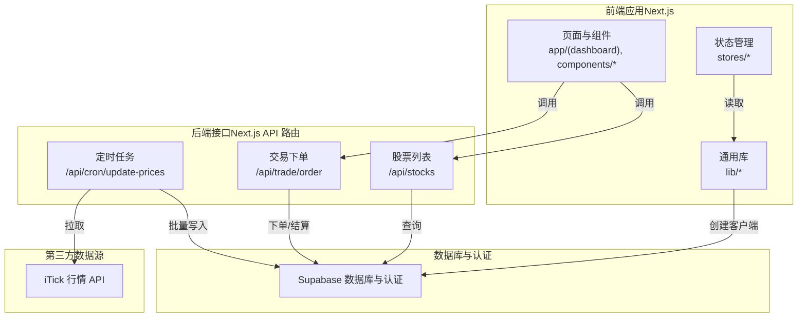
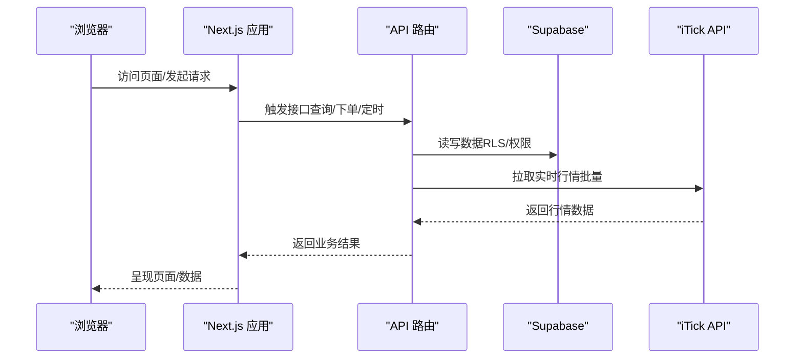
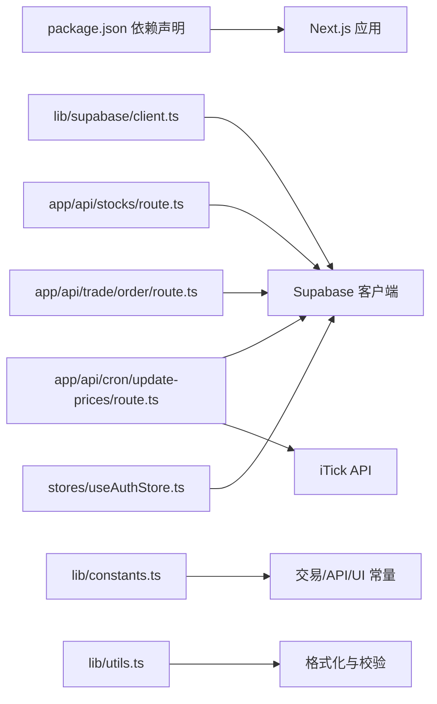

# 部署与运维

<cite>
**本文引用的文件**
- [README.md](file://README.md)
- [package.json](file://package.json)
- [next.config.ts](file://next.config.ts)
- [docs/环境变量清单.md](file://docs/环境变量清单.md)
- [lib/supabase/client.ts](file://lib/supabase/client.ts)
- [lib/constants.ts](file://lib/constants.ts)
- [lib/utils.ts](file://lib/utils.ts)
- [proxy.ts](file://proxy.ts)
- [app/api/cron/update-prices/route.ts](file://app/api/cron/update-prices/route.ts)
- [app/api/stocks/route.ts](file://app/api/stocks/route.ts)
- [app/api/trade/order/route.ts](file://app/api/trade/order/route.ts)
- [stores/useAuthStore.ts](file://stores/useAuthStore.ts)
- [components/deploy-button.tsx](file://components/deploy-button.tsx)
- [components/tutorial/connect-supabase-steps.tsx](file://components/tutorial/connect-supabase-steps.tsx)
- [components/tutorial/sign-up-user-steps.tsx](file://components/tutorial/sign-up-user-steps.tsx)
</cite>

## 目录
1. [简介](#简介)
2. [项目结构](#项目结构)
3. [核心组件](#核心组件)
4. [架构总览](#架构总览)
5. [详细组件分析](#详细组件分析)
6. [依赖关系分析](#依赖关系分析)
7. [性能考量](#性能考量)
8. [故障排除指南](#故障排除指南)
9. [结论](#结论)
10. [附录](#附录)

## 简介
本文件面向虚拟股票交易平台的部署与运维团队，系统化阐述从开发到生产的全流程：包括 Vercel 部署流程（环境变量、构建与域名）、Supabase 数据库部署与配置（项目创建、表结构初始化、RLS 安全策略）、CI/CD 与自动化部署策略、性能监控与日志管理、扩展性与负载均衡、备份与灾备、成本优化与资源管理，以及运维最佳实践与故障排除。

## 项目结构
项目采用 Next.js App Router 结构，API 路由集中于 app/api 下，业务逻辑围绕 Supabase 数据库与第三方行情数据源（iTick）展开；同时提供本地开发与 Vercel 一键部署支持。

图表来源
- [next.config.ts:1-8](file://next.config.ts#L1-L8)
- [lib/supabase/client.ts:1-9](file://lib/supabase/client.ts#L1-L9)
- [app/api/cron/update-prices/route.ts:1-150](file://app/api/cron/update-prices/route.ts#L1-L150)
- [app/api/stocks/route.ts:1-69](file://app/api/stocks/route.ts#L1-L69)
- [app/api/trade/order/route.ts:1-331](file://app/api/trade/order/route.ts#L1-L331)

章节来源
- [package.json:1-44](file://package.json#L1-L44)
- [next.config.ts:1-8](file://next.config.ts#L1-L8)

## 核心组件
- 环境变量与密钥管理：统一通过 .env.local（本地）与 Vercel 环境变量（生产）管理，区分前端可暴露变量与服务端密钥。
- Supabase 客户端：前后端均通过 lib/supabase/client.ts 初始化，确保运行时读取环境变量。
- 定时任务：/api/cron/update-prices 负责在交易时段批量抓取行情并写入数据库。
- 股票查询：/api/stocks 提供分页、搜索与排序能力。
- 交易下单：/api/trade/order 实现下单校验、资金与持仓变更、费用计算与事务式落库。
- 用户态：stores/useAuthStore 与 Supabase Auth 集成，支撑登录/注册/会话。
- 部署入口：components/deploy-button.tsx 提供一键部署到 Vercel 的入口。

章节来源
- [docs/环境变量清单.md:1-153](file://docs/环境变量清单.md#L1-L153)
- [lib/supabase/client.ts:1-9](file://lib/supabase/client.ts#L1-L9)
- [app/api/cron/update-prices/route.ts:1-150](file://app/api/cron/update-prices/route.ts#L1-L150)
- [app/api/stocks/route.ts:1-69](file://app/api/stocks/route.ts#L1-L69)
- [app/api/trade/order/route.ts:1-331](file://app/api/trade/order/route.ts#L1-L331)
- [stores/useAuthStore.ts:1-53](file://stores/useAuthStore.ts#L1-L53)
- [components/deploy-button.tsx:1-25](file://components/deploy-button.tsx#L1-L25)

## 架构总览
下图展示从浏览器到 API、数据库与第三方数据源的整体链路，以及 Vercel 部署与 Supabase 集成的关键交互。

图表来源
- [app/api/stocks/route.ts:1-69](file://app/api/stocks/route.ts#L1-L69)
- [app/api/trade/order/route.ts:1-331](file://app/api/trade/order/route.ts#L1-L331)
- [app/api/cron/update-prices/route.ts:1-150](file://app/api/cron/update-prices/route.ts#L1-L150)
- [lib/supabase/client.ts:1-9](file://lib/supabase/client.ts#L1-L9)

## 详细组件分析

### Vercel 部署流程
- 一键部署：通过 components/deploy-button.tsx 提供的链接，引导至 Vercel 新建项目并自动关联 Supabase 集成，自动注入环境变量。
- 本地开发：README.md 提供本地开发步骤，强调 .env.local 与 Supabase 项目 API 设置的对应关系。
- 构建与运行：package.json 定义 dev/build/start/lint 脚本；next.config.ts 启用组件缓存以提升构建性能。
- 域名绑定：README.md 指出部署后可绑定自定义域名；Vercel 项目设置中可配置域名与 SSL。

章节来源
- [components/deploy-button.tsx:1-25](file://components/deploy-button.tsx#L1-L25)
- [README.md:40-98](file://README.md#L40-L98)
- [package.json:1-44](file://package.json#L1-L44)
- [next.config.ts:1-8](file://next.config.ts#L1-L8)

### Supabase 数据库部署与配置
- 项目创建：README.md 与 components/tutorial/connect-supabase-steps.tsx 指导在 Supabase 仪表盘创建项目并获取 API 设置。
- 环境变量：docs/环境变量清单.md 明确列出 NEXT_PUBLIC_SUPABASE_URL、NEXT_PUBLIC_SUPABASE_ANON_KEY、SUPABASE_SERVICE_ROLE_KEY 等必需项。
- 表结构初始化：components/tutorial/fetch-data-steps.tsx 引导在 Table Editor 或 SQL Editor 创建表与示例数据。
- 安全策略：README.md 强调 Supabase Auth 使用 Cookie 的会话机制；结合 RLS（行级安全）保障数据访问安全；服务端密钥仅在服务端使用，避免泄露。

章节来源
- [README.md:40-98](file://README.md#L40-L98)
- [components/tutorial/connect-supabase-steps.tsx:1-42](file://components/tutorial/connect-supabase-steps.tsx#L1-L42)
- [components/tutorial/fetch-data-steps.tsx:52-80](file://components/tutorial/fetch-data-steps.tsx#L52-L80)
- [docs/环境变量清单.md:21-31](file://docs/环境变量清单.md#L21-L31)

### CI/CD 与自动化部署策略
- 自动化：Vercel 与 Supabase 集成可实现一键部署与环境变量自动注入，减少手工配置。
- 分支策略：建议主分支保护、PR 审查、预览部署（Preview）与生产发布分离，预览部署继承生产环境变量但可单独覆盖。
- 构建缓存：next.config.ts 启用组件缓存，降低重复构建时间。
- 版本与回滚：Vercel 支持快速回滚至上一稳定版本，配合日志与监控定位问题。

章节来源
- [README.md:40-48](file://README.md#L40-L48)
- [next.config.ts:1-8](file://next.config.ts#L1-L8)
- [docs/环境变量清单.md:111-125](file://docs/环境变量清单.md#L111-L125)

### 性能监控与日志管理
- 错误追踪：docs/环境变量清单.md 提及 NEXT_PUBLIC_SENTRY_DSN，建议在 Vercel 环境变量中配置并接入前端/服务端错误上报。
- 日志管理：API 路由中对关键错误进行 console 输出，便于 Vercel 日志查看；建议结合 Sentry 进行结构化错误收集与告警。
- 性能分析：Next.js 内置性能指标可通过 Vercel 仪表盘查看；对高频 API（如 /api/stocks、/api/cron/update-prices）建议埋点与慢查询分析。

章节来源
- [docs/环境变量清单.md:54-62](file://docs/环境变量清单.md#L54-L62)
- [app/api/stocks/route.ts:6-69](file://app/api/stocks/route.ts#L6-L69)
- [app/api/cron/update-prices/route.ts:10-150](file://app/api/cron/update-prices/route.ts#L10-L150)

### 扩展性与负载均衡
- 无状态设计：应用为无状态 Next.js，天然适配 Vercel 边缘网络与自动扩缩容。
- 数据库扩展：Supabase 作为托管数据库，具备自动扩展能力；建议对高频查询字段建立索引，优化 /api/stocks 查询性能。
- 负载均衡：Vercel 已内置全球负载均衡与缓存，无需额外配置。
- 第三方限流：iTick API 存在速率限制，已通过分批与超时控制降低风险。

章节来源
- [app/api/cron/update-prices/route.ts:57-131](file://app/api/cron/update-prices/route.ts#L57-L131)
- [app/api/stocks/route.ts:22-36](file://app/api/stocks/route.ts#L22-L36)

### 备份策略与灾难恢复
- 数据备份：Supabase 提供自动备份与 PITR（Point-in-Time Recovery），建议定期验证恢复流程。
- 配置备份：Vercel 环境变量与 Supabase 项目设置应纳入配置管理（如 GitOps），并定期导出与核对。
- 灾难恢复：制定“快速回滚 + 备用数据源”的预案；对 iTick 降级方案（如备用 API Key 或其他数据源）进行演练。

章节来源
- [docs/环境变量清单.md:128-134](file://docs/环境变量清单.md#L128-L134)

### 运维最佳实践
- 环境变量安全：严格区分前端可暴露变量与服务端密钥；定期轮换密钥并在 Vercel 更新。
- 健康检查：参考 docs/环境变量清单.md 中的 /api/health 模板，新增健康检查路由以监控关键依赖。
- 交易时段控制：/api/cron/update-prices 与下单接口均在交易时间外拒绝操作，确保业务一致性。
- 会话与认证：stores/useAuthStore 与 Supabase Auth 集成，建议开启邮箱验证与密码强度策略。

章节来源
- [docs/环境变量清单.md:128-153](file://docs/环境变量清单.md#L128-L153)
- [app/api/cron/update-prices/route.ts:21-27](file://app/api/cron/update-prices/route.ts#L21-L27)
- [app/api/trade/order/route.ts:43-49](file://app/api/trade/order/route.ts#L43-L49)
- [stores/useAuthStore.ts:1-53](file://stores/useAuthStore.ts#L1-L53)

### 故障排除指南
- 环境变量缺失：使用 docs/环境变量清单.md 中的 /api/health 模板进行验证；确认 Vercel 环境变量与 .env.local 一致。
- 认证失败：检查 NEXT_PUBLIC_SUPABASE_URL 与 NEXT_PUBLIC_SUPABASE_ANON_KEY 是否正确；确认 Supabase 项目 API 设置。
- 定时任务异常：检查 CRON_SECRET 是否配置；确认交易时段判断逻辑；关注 iTick API 响应与超时。
- 下单失败：核对用户资金、持仓数量与下单参数；检查费用计算与事务落库是否成功。
- 代理与会话：proxy.ts 用于更新会话，确保匹配规则覆盖所需路径。

章节来源
- [docs/环境变量清单.md:137-153](file://docs/环境变量清单.md#L137-L153)
- [lib/supabase/client.ts:1-9](file://lib/supabase/client.ts#L1-L9)
- [app/api/cron/update-prices/route.ts:10-19](file://app/api/cron/update-prices/route.ts#L10-L19)
- [app/api/trade/order/route.ts:11-26](file://app/api/trade/order/route.ts#L11-L26)
- [proxy.ts:1-21](file://proxy.ts#L1-L21)

## 依赖关系分析

图表来源
- [package.json:9-29](file://package.json#L9-L29)
- [lib/supabase/client.ts:1-9](file://lib/supabase/client.ts#L1-L9)
- [lib/constants.ts:1-101](file://lib/constants.ts#L1-L101)
- [lib/utils.ts:1-47](file://lib/utils.ts#L1-L47)
- [app/api/cron/update-prices/route.ts:1-150](file://app/api/cron/update-prices/route.ts#L1-L150)
- [app/api/stocks/route.ts:1-69](file://app/api/stocks/route.ts#L1-L69)
- [app/api/trade/order/route.ts:1-331](file://app/api/trade/order/route.ts#L1-L331)
- [stores/useAuthStore.ts:1-53](file://stores/useAuthStore.ts#L1-L53)

章节来源
- [package.json:1-44](file://package.json#L1-L44)

## 性能考量
- 构建性能：next.config.ts 启用组件缓存，减少重复编译时间。
- 请求性能：/api/stocks 使用分页与排序，避免一次性加载过多数据；/api/cron/update-prices 采用分批与超时控制，降低第三方 API 压力。
- 格式化与国际化：lib/utils.ts 的格式化函数统一货币、数字与百分比显示，减少前端重复逻辑。
- 交易规则：lib/constants.ts 将交易常量集中管理，便于优化与审计。

章节来源
- [next.config.ts:1-8](file://next.config.ts#L1-L8)
- [app/api/stocks/route.ts:10-36](file://app/api/stocks/route.ts#L10-L36)
- [app/api/cron/update-prices/route.ts:53-72](file://app/api/cron/update-prices/route.ts#L53-L72)
- [lib/utils.ts:13-47](file://lib/utils.ts#L13-L47)
- [lib/constants.ts:1-101](file://lib/constants.ts#L1-L101)

## 故障排除指南
- 环境变量验证：参考 docs/环境变量清单.md 的 /api/health 模板，快速定位缺失或错误的变量。
- Supabase 连接：确认 NEXT_PUBLIC_SUPABASE_URL 与 NEXT_PUBLIC_SUPABASE_PUBLISHABLE_KEY 正确；lib/utils.ts 的 hasEnvVars 可辅助检测。
- 定时任务：检查 CRON_SECRET、交易时段判断与 iTick API 响应；必要时临时禁用保护头进行调试。
- 下单流程：核对用户资金、持仓数量与下单参数；观察事务落库日志与错误码。
- 会话与代理：proxy.ts 的匹配规则需覆盖目标路径，避免会话未更新导致认证失效。

章节来源
- [docs/环境变量清单.md:137-153](file://docs/环境变量清单.md#L137-L153)
- [lib/utils.ts:8-12](file://lib/utils.ts#L8-L12)
- [app/api/cron/update-prices/route.ts:10-19](file://app/api/cron/update-prices/route.ts#L10-L19)
- [app/api/trade/order/route.ts:11-26](file://app/api/trade/order/route.ts#L11-L26)
- [proxy.ts:4-21](file://proxy.ts#L4-L21)

## 结论
本项目基于 Next.js + Supabase + Vercel 的现代化栈，具备一键部署、自动环境变量注入与全球边缘加速的优势。通过明确的环境变量治理、交易时段控制、定时任务与第三方 API 限流策略，以及可扩展的 Supabase 数据层，能够满足虚拟股票交易场景的部署与运维需求。建议持续完善监控告警、灾备演练与成本优化策略，确保系统稳定与高效运行。

## 附录
- 一键部署入口：components/deploy-button.tsx
- Supabase 项目创建与环境变量声明：components/tutorial/connect-supabase-steps.tsx
- 表结构初始化指引：components/tutorial/fetch-data-steps.tsx
- Vercel 与 Supabase 集成说明：README.md

章节来源
- [components/deploy-button.tsx:1-25](file://components/deploy-button.tsx#L1-L25)
- [components/tutorial/connect-supabase-steps.tsx:1-42](file://components/tutorial/connect-supabase-steps.tsx#L1-L42)
- [components/tutorial/fetch-data-steps.tsx:52-80](file://components/tutorial/fetch-data-steps.tsx#L52-L80)
- [README.md:40-48](file://README.md#L40-L48)