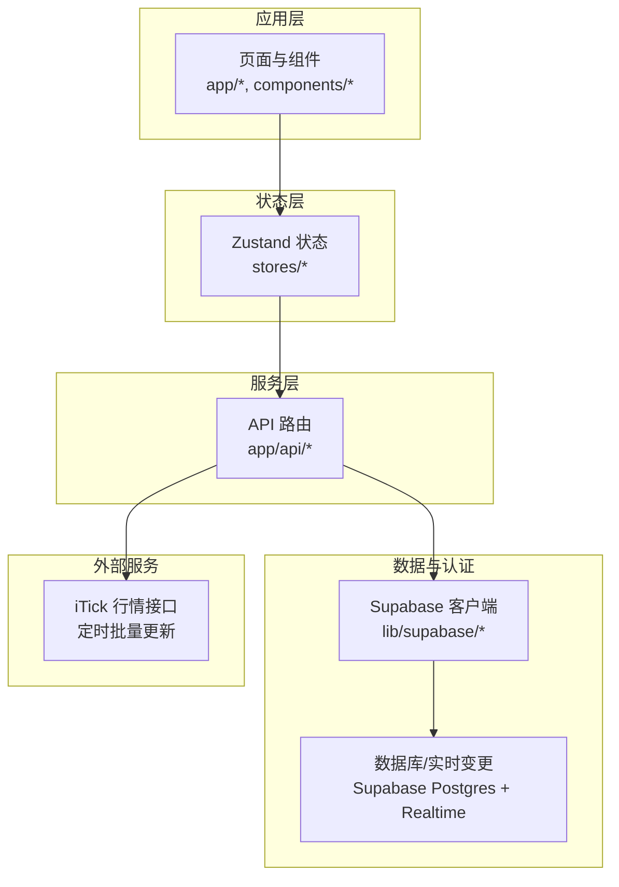
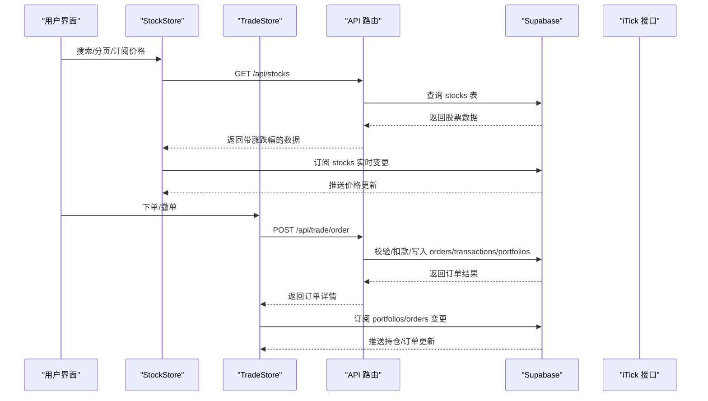
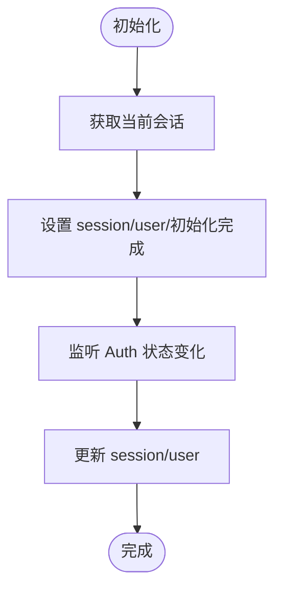
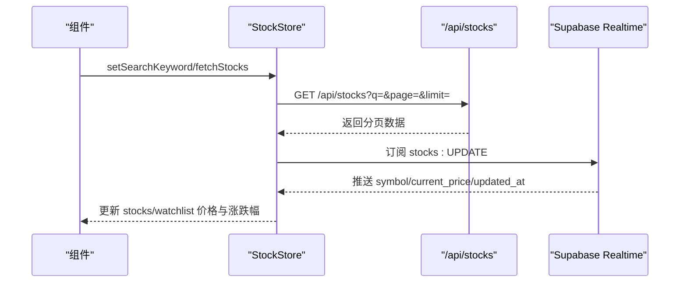
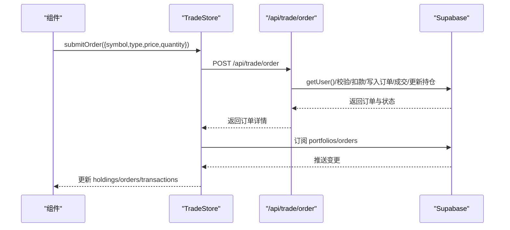
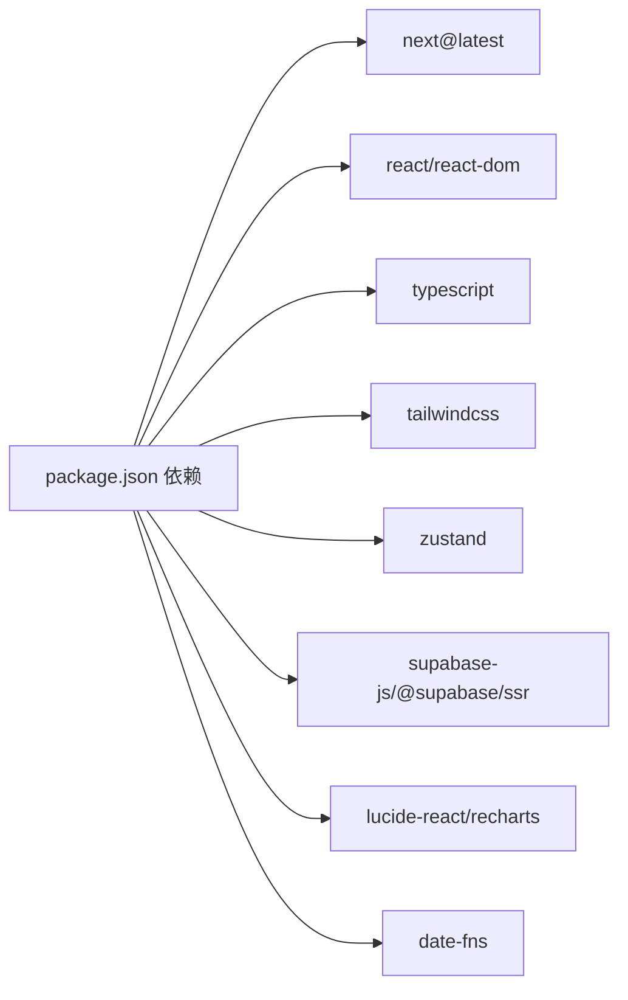

# 项目概述

<cite>
**本文引用的文件**
- [README.md](file://README.md)
- [package.json](file://package.json)
- [next.config.ts](file://next.config.ts)
- [lib/constants.ts](file://lib/constants.ts)
- [lib/trading-rules.ts](file://lib/trading-rules.ts)
- [lib/utils.ts](file://lib/utils.ts)
- [lib/supabase/client.ts](file://lib/supabase/client.ts)
- [types/index.ts](file://types/index.ts)
- [stores/useAuthStore.ts](file://stores/useAuthStore.ts)
- [stores/useStockStore.ts](file://stores/useStockStore.ts)
- [stores/useTradeStore.ts](file://stores/useTradeStore.ts)
- [stores/useUserStore.ts](file://stores/useUserStore.ts)
- [app/api/stocks/route.ts](file://app/api/stocks/route.ts)
- [app/api/trade/order/route.ts](file://app/api/trade/order/route.ts)
- [app/api/cron/update-prices/route.ts](file://app/api/cron/update-prices/route.ts)
</cite>

## 目录
1. [引言](#引言)
2. [项目结构](#项目结构)
3. [核心组件](#核心组件)
4. [架构总览](#架构总览)
5. [详细组件分析](#详细组件分析)
6. [依赖关系分析](#依赖关系分析)
7. [性能考量](#性能考量)
8. [故障排查指南](#故障排查指南)
9. [结论](#结论)
10. [附录](#附录)

## 引言
本项目是一个基于 Next.js 15 的虚拟股票交易系统，旨在为用户提供零风险的实盘交易体验。通过模拟真实的股票市场行为与交易规则，帮助用户在无真实资金风险的前提下，学习和演练交易策略、理解市场波动与资产配置。系统采用前端组件化与后端 API 路由相结合的架构，结合 Supabase 实现认证、实时订阅与数据持久化，并通过 iTick 提供的行情接口定时批量更新股价，形成从“行情展示—交易执行—资产统计”的完整闭环。

## 项目结构
项目遵循 Next.js App Router 的目录组织方式，将页面、API 路由、组件、状态管理与类型定义清晰分离：
- app：应用入口与路由层，包含页面、API 路由与全局样式
- components：可复用 UI 组件与布局组件
- stores：基于 Zustand 的轻量状态管理
- lib：通用工具、常量与 Supabase 客户端封装
- types：TypeScript 类型定义
- docs：项目文档与规范说明

图表来源
- [app/api/stocks/route.ts:1-69](file://app/api/stocks/route.ts#L1-L69)
- [app/api/trade/order/route.ts:1-331](file://app/api/trade/order/route.ts#L1-L331)
- [app/api/cron/update-prices/route.ts:1-150](file://app/api/cron/update-prices/route.ts#L1-L150)
- [stores/useStockStore.ts:1-184](file://stores/useStockStore.ts#L1-L184)
- [stores/useTradeStore.ts:1-192](file://stores/useTradeStore.ts#L1-L192)
- [lib/supabase/client.ts:1-9](file://lib/supabase/client.ts#L1-L9)

章节来源
- [package.json:1-44](file://package.json#L1-L44)
- [next.config.ts:1-8](file://next.config.ts#L1-L8)

## 核心组件
- 认证与会话管理：使用 Supabase Auth，Zustand 管理会话状态与初始化监听
- 股票与自选股：支持搜索、分页、实时价格订阅与自选股增删
- 交易执行：限价/市价下单、T+1 规则、涨跌停校验、手续费与印花税计算
- 资产与订单：持仓、历史委托与成交记录的获取与订阅
- 工具与常量：交易规则、UI 常量、格式化工具与 Supabase 客户端封装

章节来源
- [stores/useAuthStore.ts:1-104](file://stores/useAuthStore.ts#L1-L104)
- [stores/useStockStore.ts:1-184](file://stores/useStockStore.ts#L1-L184)
- [stores/useTradeStore.ts:1-192](file://stores/useTradeStore.ts#L1-L192)
- [stores/useUserStore.ts:1-110](file://stores/useUserStore.ts#L1-L110)
- [lib/trading-rules.ts:1-272](file://lib/trading-rules.ts#L1-L272)
- [lib/constants.ts:1-101](file://lib/constants.ts#L1-L101)
- [lib/utils.ts:1-47](file://lib/utils.ts#L1-L47)
- [lib/supabase/client.ts:1-9](file://lib/supabase/client.ts#L1-L9)
- [types/index.ts:1-166](file://types/index.ts#L1-L166)

## 架构总览
系统采用前后端分离但统一在 Next.js 生态内的设计：
- 前端：页面组件负责交互与渲染；Zustand 管理跨组件状态；通过 fetch 调用 API 路由
- 后端：App Router 的 API 路由处理业务逻辑；Supabase 提供认证、数据库与实时订阅；外部 iTick 接口提供行情数据
- 数据流：前端订阅 Supabase Realtime 实时更新；后台定时任务拉取行情并 upsert 到数据库

图表来源
- [stores/useStockStore.ts:125-150](file://stores/useStockStore.ts#L125-L150)
- [stores/useTradeStore.ts:144-186](file://stores/useTradeStore.ts#L144-L186)
- [app/api/stocks/route.ts:1-69](file://app/api/stocks/route.ts#L1-L69)
- [app/api/trade/order/route.ts:1-331](file://app/api/trade/order/route.ts#L1-L331)

## 详细组件分析

### 认证与会话（Auth）
- 初始化：读取当前会话并监听 Auth 状态变化，自动同步 session 与 user
- 登录/注册/登出：调用 Supabase Auth 客户端，返回标准化错误或消息
- 状态存储：使用 Zustand 管理 session、user、加载状态与初始化标志

图表来源
- [stores/useAuthStore.ts:81-102](file://stores/useAuthStore.ts#L81-L102)
- [lib/supabase/client.ts:1-9](file://lib/supabase/client.ts#L1-L9)

章节来源
- [stores/useAuthStore.ts:1-104](file://stores/useAuthStore.ts#L1-L104)
- [lib/supabase/client.ts:1-9](file://lib/supabase/client.ts#L1-L9)

### 股票与自选股（Stock Store）
- 股票列表：支持关键词搜索、分页、排序与涨跌幅计算
- 自选股：增删操作与列表获取，内部转换为 Stock 结构
- 实时订阅：基于 Supabase Realtime 订阅 stocks 表的 UPDATE 事件，动态刷新价格与涨跌幅

图表来源
- [stores/useStockStore.ts:33-78](file://stores/useStockStore.ts#L33-L78)
- [stores/useStockStore.ts:125-150](file://stores/useStockStore.ts#L125-L150)
- [app/api/stocks/route.ts:1-69](file://app/api/stocks/route.ts#L1-L69)

章节来源
- [stores/useStockStore.ts:1-184](file://stores/useStockStore.ts#L1-L184)
- [app/api/stocks/route.ts:1-69](file://app/api/stocks/route.ts#L1-L69)

### 交易执行（Trade Store）
- 持仓/订单/成交：获取与订阅 portfolios、orders、transactions
- 下单流程：校验交易时间、数量、价格范围、可用资金；计算费用；事务式写入 orders/transactions/portfolios
- 撤单流程：调用后端删除订单并刷新列表

图表来源
- [stores/useTradeStore.ts:99-142](file://stores/useTradeStore.ts#L99-L142)
- [app/api/trade/order/route.ts:1-331](file://app/api/trade/order/route.ts#L1-L331)

章节来源
- [stores/useTradeStore.ts:1-192](file://stores/useTradeStore.ts#L1-L192)
- [app/api/trade/order/route.ts:1-331](file://app/api/trade/order/route.ts#L1-L331)

### 用户资产与概览（User Store）
- 个人资料：从 profiles 表读取与订阅
- 资产概览：根据可用余额与持仓市值计算总资产、浮动盈亏与日收益
- 余额更新：联动更新资产概览中的可用余额与总资产

章节来源
- [stores/useUserStore.ts:1-110](file://stores/useUserStore.ts#L1-L110)
- [types/index.ts:92-100](file://types/index.ts#L92-L100)

### 技术规则与常量（Trading Rules & Constants）
- 交易时间：A 股工作日交易时段判断与提示
- 涨跌停限制：根据股票类型（主板/科创板/创业板/北交所）计算涨跌停价
- 手续费与印花税：按金额与方向计算，含最低收费
- 数量校验：必须为 100 的整数倍（1 手）
- 资产计算：市值、浮动盈亏与百分比

章节来源
- [lib/trading-rules.ts:1-272](file://lib/trading-rules.ts#L1-L272)
- [lib/constants.ts:1-101](file://lib/constants.ts#L1-L101)

### 外部行情与定时任务
- 定时更新：在交易时间内批量拉取 iTick 行情，upsert 到 stocks 表
- 安全校验：支持 x-cron-secret 请求头校验
- 批处理与超时：分批请求、设置超时，避免单次失败影响整体

章节来源
- [app/api/cron/update-prices/route.ts:1-150](file://app/api/cron/update-prices/route.ts#L1-L150)
- [lib/constants.ts:70-79](file://lib/constants.ts#L70-L79)

## 依赖关系分析
- 前端依赖：Next.js 15、React 19、TypeScript、Tailwind CSS、shadcn/ui、Zustand、Supabase SSR 客户端
- 工具库：date-fns、lucide-react、recharts、next-themes
- 开发依赖：ESLint 9、PostCSS、TailwindCSS、TypeScript

图表来源
- [package.json:9-28](file://package.json#L9-L28)
- [package.json:30-41](file://package.json#L30-L41)

章节来源
- [package.json:1-44](file://package.json#L1-L44)

## 性能考量
- 组件缓存：Next.js 配置启用组件缓存，减少重复渲染开销
- 分页与批量：API 层对分页与批量请求进行上限控制，避免过大响应
- 实时订阅：仅订阅必要表与字段，减少不必要的推送
- 定时任务节流：批量请求与延迟，避免触发第三方接口限流
- 格式化优化：统一的格式化函数，减少重复计算

章节来源
- [next.config.ts:1-8](file://next.config.ts#L1-L8)
- [lib/constants.ts:70-79](file://lib/constants.ts#L70-L79)
- [app/api/cron/update-prices/route.ts:57-131](file://app/api/cron/update-prices/route.ts#L57-L131)

## 故障排查指南
- 认证问题：检查 Supabase URL 与密钥环境变量是否正确；确认回调地址与 Supabase 项目配置一致
- API 错误：查看 API 路由返回的错误码与消息，常见如未登录、参数缺失、非交易时间、资金不足、股票不存在等
- 实时订阅：确认 Supabase Realtime 是否启用；检查频道名称与过滤条件
- 行情更新：确认 Cron Secret、iTick API Key 与 Endpoint；检查网络超时与批量请求限制

章节来源
- [lib/utils.ts:8-11](file://lib/utils.ts#L8-L11)
- [app/api/trade/order/route.ts:18-49](file://app/api/trade/order/route.ts#L18-L49)
- [app/api/cron/update-prices/route.ts:12-19](file://app/api/cron/update-prices/route.ts#L12-L19)

## 结论
本项目以“零风险实盘体验”为核心目标，结合 Next.js 15 的现代开发体验、TypeScript 的强类型保障、Supabase 的认证与实时能力，以及外部行情接口的定时更新机制，构建了一个功能完备、易于扩展的虚拟股票交易系统。对于初学者，系统提供了清晰的组件与状态管理示例；对于有经验的开发者，系统展示了从路由层到状态层再到实时订阅的完整工程实践路径。

## 附录
- 价值定位：模拟真实交易流程，降低学习成本，适合教学与个人练习
- 技术优势：前后端一体化、实时性强、可扩展性强、部署友好
- 适用场景：在线教育、金融课程演示、个人量化训练、原型快速迭代
- 学习价值：涵盖认证、状态管理、实时订阅、API 设计、交易规则与数据格式化等关键主题